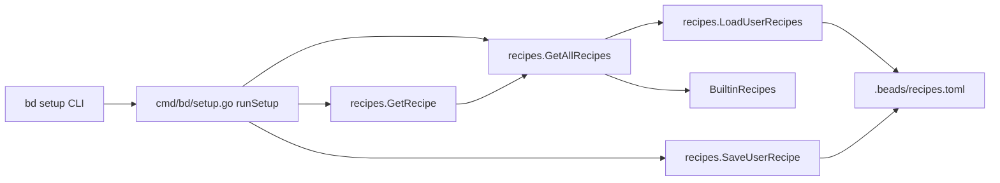

# Recipes 模块深度解析

`Recipes` 模块是 `bd setup` 的“配方目录”。它解决的不是“怎么写一个文件”这么简单，而是“如何把同一套 Beads 工作流说明，稳定地安装到不同 AI 工具各自不同的配置入口里”。如果没有这个模块，`setup` 命令只能写死大量 `if/else` 分支：每加一个工具都要改命令层逻辑、改路径、改默认值、改覆盖策略，最终会变成一个难维护的分支森林。`Recipes` 的核心洞见是：把“工具集成定义”数据化（`Recipe`），再把“内置 + 用户扩展 + 查询归一化”集中在一个薄层里，令上层只关心“我要哪个 recipe”，而不是“这个工具到底要改哪几个文件”。

## 架构角色与数据流



从架构定位上看，`Recipes` 不是执行器（它不负责真正安装 claude/gemini hooks，也不负责 section 注入），而是一个**配置注册表 + 合并器**。`cmd/bd/setup.go` 负责命令分派、用户交互与安装动作；`Recipes` 负责回答“有哪些 recipe、某个名字对应什么定义、用户有没有覆盖内置定义”。

关键链路有三条。第一条是列表链路：`runSetup` 在 `--list` 下调用 `listRecipes`，后者调用 `recipes.GetAllRecipes`，再基于 `recipes.IsBuiltin` 标注来源。第二条是查找链路：`runRecipe` 先做特殊 recipe 的 legacy 分派，普通路径调用 `recipes.GetRecipe`，拿到 `Recipe` 后按 `TypeFile` 执行通用写文件逻辑。第三条是扩展链路：`--add` 走 `addRecipe`，调用 `recipes.SaveUserRecipe` 把用户条目落盘到 `.beads/recipes.toml`，之后它会在 `GetAllRecipes` 的合并阶段覆盖同名内置 recipe。

## 心智模型：把它看成“配方注册中心”

一个直观类比是“包管理器的源优先级”。`BuiltinRecipes` 像官方仓库，开箱即用；`recipes.toml` 像本地 overlay 仓库，可以覆盖同名包；`GetAllRecipes` 就是解析后的最终索引；`GetRecipe` 是按名称检索并做输入标准化的查询入口。你在脑中只要记住：

- **定义层**：`Recipe` 只是声明，不执行副作用。
- **来源层**：内置定义 + 用户定义。
- **合并层**：用户同名覆盖内置。
- **查询层**：`GetRecipe` 做名称归一化并返回最终定义。

这套模型把“新增工具支持”从“改代码路径”尽量转为“加数据 + 少量执行器逻辑”。

## 组件深挖

### `RecipeType` 与四种安装语义

`RecipeType` 是字符串枚举，定义了安装策略语义：`file`、`hooks`、`section`、`multifile`。它存在的价值不是类型美观，而是把“同一个 recipe 数据结构如何被执行”显式化。换句话说，`Type` 是 recipe 与安装器之间的契约字段。

当前 `cmd/bd/setup.go` 的通用路径只接受 `TypeFile`；`claude/gemini/factory/codex/mux/aider/junie/cursor` 通过专用分支处理。这说明系统正处于“声明式配方 + 部分历史执行器并存”的过渡阶段：模型已经统一，执行器仍有历史包袱。

### `Recipe` 结构体

`Recipe` 是模块核心抽象。字段分成两层：

- 通用字段：`Name`、`Path`、`Type`、`Description`
- 复杂安装可选字段：`GlobalPath`、`ProjectPath`、`Paths`

这是一种典型“单结构承载多变体”的设计：简单、易序列化（TOML 直映射），但代价是字段组合的合法性主要靠调用方约定，而不是类型系统强约束。例如 `TypeMultiFile` 理论上应依赖 `Paths`，但这里没有内建校验器。

### `UserRecipes`

`UserRecipes` 仅包装 `map[string]Recipe`，对应 `recipes.toml` 的 `[recipes]` 节点。它的意义是给 TOML 反序列化一个稳定顶层容器，避免直接解析到裸 map 时扩展性受限。

### `BuiltinRecipes`

`BuiltinRecipes` 是编译期内置目录，覆盖常见工具（如 `cursor`、`claude`、`gemini`、`factory`、`aider`、`junie` 等）。这是“可用性优先”的设计：用户零配置即可 `bd setup <name>`。同时它也承担“规范化命名”的作用，保证命令层与文档层围绕同一 canonical key（例如 `cursor`）工作。

### `LoadUserRecipes(beadsDir string)`

这个函数实现了三个关键策略。首先，路径固定为 `filepath.Join(beadsDir, "recipes.toml")`，把用户扩展范围限制在 beads 工作目录下；其次，`os.IsNotExist` 返回 `(nil, nil)`，把“没有用户配置”当成正常状态而非错误；最后，它会为用户 recipe 填默认值：缺省 `Type` 补为 `TypeFile`，缺省 `Name` 补为 map key。这让用户 TOML 可以尽量简写。

返回值是 `map[string]Recipe` 或错误。副作用只有读取文件。

### `GetAllRecipes(beadsDir string)`

`GetAllRecipes` 的策略很直白：先复制 `BuiltinRecipes` 到新 map，再加载用户 recipes 并直接覆盖同名 key。这里选择了“最后写入胜出（last-write-wins）”的合并语义，优点是可预测、零冲突交互；代价是没有冲突告警，用户可能无意中覆盖内置定义而不自知。

### `GetRecipe(name, beadsDir)`

`GetRecipe` 做了输入归一化：`strings.ToLower(strings.Trim(name, "-"))`。它处理了 CLI 输入的轻微噪声（大小写、首尾 `-`），降低了调用端心智负担。随后它调用 `GetAllRecipes` 查找，未命中时报 `unknown recipe`。

这个函数是上层最应依赖的入口，因为它把“归一化 + 合并视图 + 查找”封在一次调用里。

### `SaveUserRecipe(beadsDir, name, path)`

`SaveUserRecipe` 是唯一写路径。它会尝试读取并反序列化现有 `recipes.toml`，保留原有条目；然后 upsert 指定名称，写入 `Recipe{Name, Path, TypeFile}`；最后 `MkdirAll(beadsDir)` 并重写整个 TOML 文件。

这里的设计重点是“幂等更新 + 全量重写”。优点是实现简单、文件始终保持完整结构；代价是并发写冲突风险（没有文件锁，也没有 compare-and-swap）。在 CLI 单进程场景下这通常可接受。

### `ListRecipeNames(beadsDir)`

函数先取 `GetAllRecipes`，再提取 key 并排序返回。值得注意的是它用的是双层循环交换排序（等价朴素 O(n²)），而不是 `sort.Strings`。在当前 recipe 数量很小（十几项）的前提下，这个选择对性能几乎无影响，但可读性略逊。

### `IsBuiltin(name string)`

`IsBuiltin` 只检查 `BuiltinRecipes`，不看用户配置。其语义是“这个名字是否属于内置目录”，不是“最终有效 recipe 来源”。在 `listRecipes` 里，它用于显示 `(built-in)` 或 `(user)` 标签。

### `Template`（`internal/recipes/template.go`）

虽然不在你给出的 core component 列表中，但它与 `Recipes` 模块同目录且被 `bd setup --print` 与通用写入路径直接使用。它是统一的 Beads 工作流文案模板，`Recipes` 决定“写到哪里”，`Template` 决定“写什么”。这是一种典型的“目标位置与内容解耦”。

## 依赖分析

从模块依赖上，`Recipes` 下游依赖非常轻：标准库 `os/path/filepath/strings/fmt` 与 `github.com/BurntSushi/toml`。这使它成为一个低耦合、低风险模块。

上游主要是 `cmd/bd/setup.go` 的这几条调用：

- `listRecipes -> recipes.GetAllRecipes / recipes.IsBuiltin`
- `addRecipe -> recipes.SaveUserRecipe`
- `runRecipe -> recipes.GetRecipe`
- `runSetup(--print) / writeToPath -> recipes.Template`

因此，`Recipes` 的真实架构位置是 CLI setup 子系统的数据底座。只要这些函数签名保持稳定，setup 层可以演进执行器而不改 recipe 读写协议。

## 设计取舍与非显然决策

该模块在多个维度上选择了“简单、可运维、可扩展到中等复杂度”的平衡点。它没有引入接口层、没有引入 schema validator，也没有持久化到数据库，而是把用户扩展存在文本 TOML 中。这牺牲了一部分严格性（例如类型字段与路径字段的一致性校验），换来极高可调试性：用户可以直接打开 `.beads/recipes.toml` 修复。

另一个明显取舍是覆盖策略。`GetAllRecipes` 允许用户同名覆盖内置，代表系统把“用户自治”放在“平台一致性”之前。对于团队环境这是有价值的：可以保留 `cursor` 这个 canonical 名称，但换成组织自己的路径策略。

再一个取舍是执行器未完全统一。虽然 `RecipeType` 已抽象出 `hooks/section/multifile`，但 `cmd/bd/setup.go` 仍对若干 recipe 走专用函数（`runClaudeRecipe` 等）。这降低了重构风险，保留历史实现与更细控制；代价是新增复杂类型 recipe 仍需改命令层，而不是纯配置驱动。

## 使用方式与示例

常见流程是先查看配方，再安装：

```bash
bd setup --list
bd setup cursor
```

添加一个自定义工具（本质是写入 `.beads/recipes.toml`）：

```bash
bd setup --add myeditor .myeditor/rules.md
bd setup myeditor
```

在 Go 代码里，如果你想只拿“最终合并视图”：

```go
all, err := recipes.GetAllRecipes(beadsDir)
if err != nil {
    return err
}
_ = all
```

如果你只关心单个 recipe（推荐入口）：

```go
r, err := recipes.GetRecipe("cursor", beadsDir)
if err != nil {
    return err
}
fmt.Println(r.Type, r.Path)
```

## 新贡献者最容易踩的坑

第一，`GetRecipe` 会自动把名字转小写并去掉首尾 `-`，但 `SaveUserRecipe` 不做同样归一化。这意味着你若保存了混合大小写 key，后续检索可能出现“看得见但拿不到”的命名不一致风险。实践上应在调用 `SaveUserRecipe` 前自行规范名称。

第二，`ListRecipeNames` 和 `GetAllRecipes` 都会触发用户文件加载；如果 `recipes.toml` 语法错误，连 `--list` 都会失败。这是正确行为（配置即代码），但会影响命令可用性。

第三，`SaveUserRecipe` 是全量重写文件且无锁。并发执行多个 `bd setup --add` 可能相互覆盖。CLI 常规交互问题不大，但自动化脚本并发调用时要避免。

第四，`IsBuiltin` 只看内置字典，不考虑最终是否被用户覆盖。UI 上标为 `built-in` 的名字，实际内容可能已经是用户版本。

第五，`Recipe` 的字段约束是隐式的。比如你可以写一个 `type = "multifile"` 却不提供 `paths`，当前模块不会报错；错误通常在执行器阶段暴露。

## 参考阅读

- [runtime_config_resolution](runtime_config_resolution.md)：运行时配置解析（理解 `beadsDir`、配置覆盖等上游环境）
- [route_resolution_and_storage_routing](route_resolution_and_storage_routing.md)：路径解析与路由思路（对比 `Recipes` 的路径定位职责边界）
- [storage_contracts](storage_contracts.md)：核心存储契约（帮助理解为什么 `Recipes` 选择文件化配置而不是走存储层）

> 注：以上链接按模块关系给出，用于延展阅读；本文件只覆盖 `internal/recipes` 及其在 `bd setup` 中的调用面。
