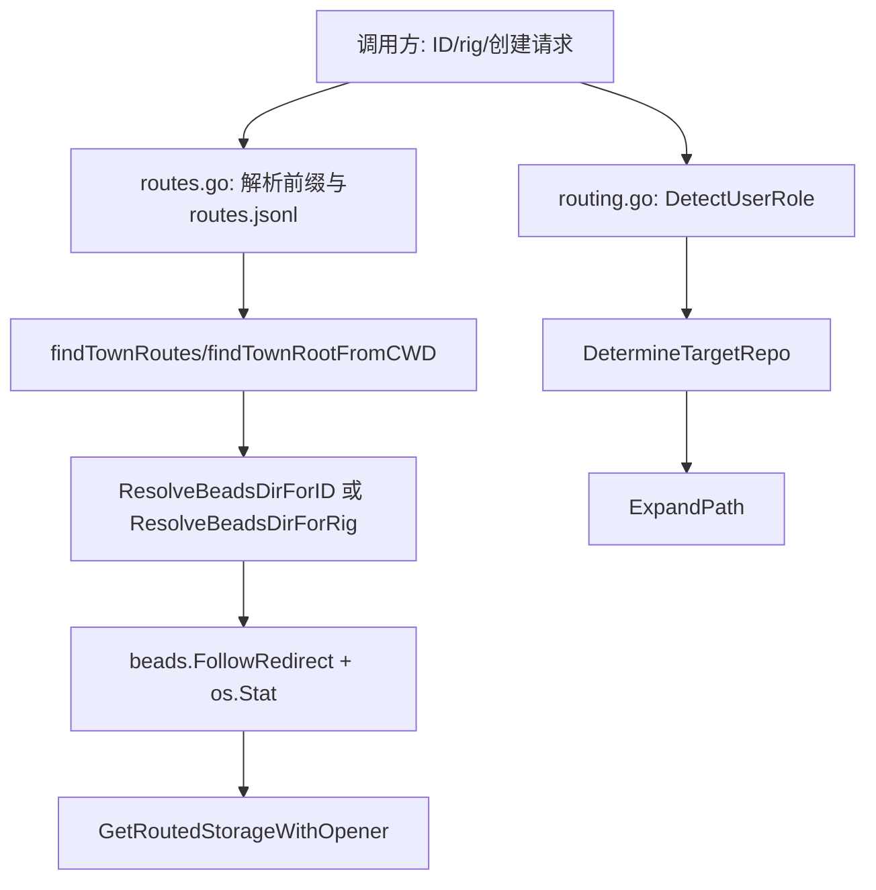

# Routing 模块深度解析

`Routing` 模块是系统里的“交通指挥层”：它不负责真正读写 issue，也不实现存储引擎，而是回答一个更基础的问题——**这次操作到底该落到哪一个 repo / 哪一个 `.beads` 数据库**。在单仓库时代，这个问题几乎不存在；但在 multi-rig、town 级编排、跨仓协作（maintainer vs contributor）场景里，如果没有 Routing，命令会把数据写错库、查错库，最终出现“看起来成功、实际污染”的隐蔽故障。

---

## 1) 这个模块解决什么问题（先讲问题空间）

想象一个现实场景：你在当前仓库执行命令，输入了一个 ID `gt-abc123`。这个 ID 前缀可能对应另一个 rig 的数据库，而不是你当前 `.beads`。如果系统始终“只查当前库”，就会出现两类问题：

1. **读取错位**：查不到本该存在的 issue，误判为不存在。
2. **写入错位**：把更新写入本地库，导致跨 rig 数据漂移。

Routing 模块正是为此存在：

- 用 `routes.jsonl` 做前缀到路径的映射（如 `gt- -> gastown/...`）；
- 在 town 层级与本地层级之间做路由发现与回退；
- 在需要时把逻辑“路由决策”升级为“打开目标存储连接”；
- 在创建新 issue 时，根据用户角色与配置选择目标 repo。

换句话说，它是“**请求去哪儿**”的统一决策层。

---

## 2) 心智模型：两段式路由器（地址分拣 + 目标仓选择）

可以把 Routing 当成一个城市物流系统：

- **地址分拣器**：`id`/`prefix`/`rig` 输入先经过路由表，决定目标 `.beads` 目录。
- **柜台分流器**：新建 issue 时，再根据用户角色（`maintainer` / `contributor`）和策略配置选择目标 repo。

这两个子问题由两组子模块承接，分别从不同角度解析：

### 路由解析与存储路由

1. [route_resolution_and_storage_routing](route_resolution_and_storage_routing.md) - 从实现角度详解路由解析与存储连接管理
2. [routing_core](routing_core.md) - 从技术设计角度解析路由核心组件和机制

### 仓库角色与目标选择

1. [repo_role_and_target_selection](repo_role_and_target_selection.md) - 从实现角度详解用户角色检测与目标仓库选择
2. [routing_config](routing_config.md) - 从技术设计角度解析路由配置和决策逻辑

前者偏“数据平面”（具体目录与存储连接），后者偏“控制平面”（策略与角色）。

---

## 3) 架构总览（Mermaid）

### 架构叙述

- 左侧链路（`routes.go`）回答“**这个 ID / rig 对应哪个 `.beads`**”。
- 右侧链路（`routing.go`）回答“**这个用户应把新 issue 发到哪个 repo**”。
- 两条链路在职责上正交：一个解决“定位数据库”，一个解决“定位仓库策略”。
- `GetRoutedStorageWithOpener` 是左链路从“只决策”迈向“可执行连接”的边界点；它通过 `StorageOpener` 注入避免硬编码开库逻辑。

---

## 4) 关键数据流（端到端）

### 流程 A：按 issue ID 查找/操作（跨 rig 自动路由）

典型调用路径（来自代码中的真实调用关系）：

1. `GetRoutedStorageWithOpener(ctx, id, currentBeadsDir, opener)`
2. `ResolveBeadsDirForID(...)`
3. `findTownRoutes(currentBeadsDir)`
4. `LoadRoutes(...)` + `findTownRootFromCWD()`（内部再调用 `findTownRoot`）
5. 前缀匹配 `Route.Prefix`，路径解析后执行 `beads.FollowRedirect` 与 `os.Stat`
6. 若确实跨目录，使用 `opener` 打开目标 `*dolt.DoltStore`

关键语义：

- 未路由或路由目标等于当前目录时，返回 `nil`（调用方继续用现有 storage）。
- 真正需要跨库时才开新连接，避免不必要开销与资源占用。

### 流程 B：按 `--rig/--prefix` 显式指定目标 rig

1. `ResolveBeadsDirForRig(rigOrPrefix, currentBeadsDir)`
2. 内部通过 `lookupRigForgivingWithTown` 支持输入宽容匹配（`bd`、`bd-`、`beads`）
3. 解析 `Route.Path`（含 `"."` 特殊语义）
4. `beads.FollowRedirect` + `os.Stat` 验证
5. 返回目标 beadsDir 与 route prefix

### 流程 C：创建 issue 时选择目标 repo

1. `DetectUserRole(repoPath)`：优先读 `git config beads.role`，失败才回退 `detectFromURL`
2. `DetermineTargetRepo(config, userRole, repoPath)`：按优先级链选择 repo
3. `ExpandPath(path)`：把 `~` 或相对路径归一化

---

## 5) 关键设计决策与权衡

### 决策 1：宽容解析 `routes.jsonl`（可用性优先）

`LoadRoutes` 会跳过空行、注释、坏 JSON 行，且“文件不存在”不视为错误。

- 优点：单仓库和渐进配置场景更稳，不会因一行坏配置全盘故障。
- 代价：错误可能被静默吞掉，排障依赖 `BD_DEBUG_ROUTING` 环境变量。

### 决策 2：town root 从 CWD 推断（正确处理 symlink `.beads`）

`findTownRoutes` 在关键路径上使用 `findTownRootFromCWD`，而非总是从 `currentBeadsDir` 上溯。

- 优点：当 `.beads` 是符号链接时，仍能定位“用户语义上的 town 根”。
- 代价：逻辑比“直接从 beadsDir 向上找”更绕，新人容易误删这段“看似重复”的代码。

### 决策 3：存储打开逻辑外置（解耦）

`GetRoutedStorageWithOpener` 要求调用方注入 `StorageOpener`，旧的 `GetRoutedStorageForID` 被标记为 deprecated 并转发。

- 优点：Routing 不绑定单一开库方式，便于上层接入不同 backend/factory 约束。
- 代价：调用方必须传入 opener；否则会得到显式错误。

### 决策 4：角色识别采用“显式配置优先 + 启发式回退”

`DetectUserRole` 优先 `beads.role`，再回退 `detectFromURL`（并输出 warning）。

- 优点：兼顾正确性（显式）与迁移兼容（回退）。
- 代价：回退启发式并不可靠，尤其 URL 不能完整代表真实写权限。

---

## 6) 子模块导读

### 6.1 [route_resolution_and_storage_routing](route_resolution_and_storage_routing.md)

这是 Routing 的“执行中枢”。它定义了 `Route`、`RoutedStorage`，并实现从 `routes.jsonl` 加载、town 路由发现、ID/rig 到目标 beadsDir 解析，以及按需打开路由存储连接。重点价值在于把“多 rig 地址分发”封装成稳定 API，避免每个命令重复写路径推导与重定向处理。

### 6.2 [repo_role_and_target_selection](repo_role_and_target_selection.md)

这是 Routing 的“策略中枢”。它围绕 `RoutingConfig`、`DetectUserRole`、`DetermineTargetRepo` 组织角色识别与目标 repo 选择逻辑，解决多人协作时“相同命令应落到不同仓库”的问题。它刻意保持轻量，不碰存储细节，保持决策层纯度。

---

## 7) 跨模块依赖与耦合边界

### 直接代码依赖（可从源码确认）

- `internal/beads`：使用 `beads.FollowRedirect` 处理 `.beads` 目录重定向。
- `internal/storage/dolt`：`RoutedStorage` 持有 `*dolt.DoltStore`。

相关阅读：

- [Beads Repository Context](Beads Repository Context.md)
- [Dolt Storage Backend](Dolt Storage Backend.md)
- [Storage Interfaces](Storage Interfaces.md)

### 配置与命令侧关系（基于模块职责）

Routing 的策略输入通常来自配置层（见 [Configuration](Configuration.md)），并被 CLI 路由相关命令消费（见 [CLI Routing Commands](CLI Routing Commands.md)）。

> 说明：在当前提供材料中，未给出精确到函数级的完整 `depended_by` 列表；因此这里按模块职责描述协作边界，而不声称具体调用点行号。

---

## 8) 新贡献者最该警惕的 gotchas

1. **`routes.jsonl` 是 JSONL，不是 JSON 数组**；并且坏行会被跳过。
2. **`Route.Path` 的第一段有语义**（会被 `ExtractProjectFromPath` 当作 project/rig 名）。
3. **`Route.Path == "."` 是特殊值**，表示 town 级 `.beads`，不是普通目录字符串。
4. **`findTownRootFromCWD` 不是冗余**，它是 symlink 场景正确性的关键。
5. **`GetRoutedStorageWithOpener` 返回 `nil, nil` 是合法分支**，表示“无需切换存储”。
6. **`DetermineTargetRepo` 只做选择不做存在性校验**，路径有效性应由后续层验证。

### 深入了解常见陷阱

- 关于路由解析和存储路由的更多陷阱，请参考 [route_resolution_and_storage_routing](route_resolution_and_storage_routing.md) 或 [routing_core](routing_core.md)
- 关于仓库角色和目标选择的更多陷阱，请参考 [repo_role_and_target_selection](repo_role_and_target_selection.md) 或 [routing_config](routing_config.md)

---

## 9) 你可以怎么扩展它（建议）

- 若要扩展路由规则格式，优先保持 `LoadRoutes` 的向后兼容与“局部容错”语义。
- 若要增强角色模型（不止 maintainer/contributor），优先扩展 `DetectUserRole` 与 `RoutingConfig`，避免把角色判断散落到 CLI 命令层。
- 若要接入新存储后端，优先复用 `GetRoutedStorageWithOpener` 的注入点，而不是在 Routing 内硬编码新 backend。

### 扩展点详细解析

- 关于路由核心组件的扩展点，可参考 [routing_core](routing_core.md) 中的"扩展与未来方向"部分
- 关于路由配置和决策逻辑的扩展点，可参考 [routing_config](routing_config.md) 中的"扩展点"部分

Routing 的长期价值，不在于复杂算法，而在于它把“多仓库、多角色、多目录”下最容易失控的路由决策收敛到了一个可演进、可回退、可观测的边界层。

## 10) 文档导航与补充阅读

Routing 模块的文档从多个角度提供了深入解析，你可以根据需要选择最适合的文档：

### 实现角度
- [route_resolution_and_storage_routing](route_resolution_and_storage_routing.md) - 从代码实现角度详解路由解析与存储连接
- [repo_role_and_target_selection](repo_role_and_target_selection.md) - 从代码实现角度详解用户角色检测与目标仓库选择

### 技术设计角度
- [routing_core](routing_core.md) - 从技术设计角度解析路由核心组件、设计决策和使用方法
- [routing_config](routing_config.md) - 从技术设计角度解析路由配置、决策流程和扩展建议

### 相关模块文档
- [Configuration](Configuration.md) - 了解 Routing 配置的来源和管理
- [CLI Routing Commands](CLI Routing Commands.md) - 了解命令层如何使用 Routing 模块
- [Dolt Storage Backend](Dolt Storage Backend.md) - 了解 Routing 模块使用的存储后端
- [Beads Repository Context](Beads Repository Context.md) - 了解 beads 仓库上下文和重定向机制
