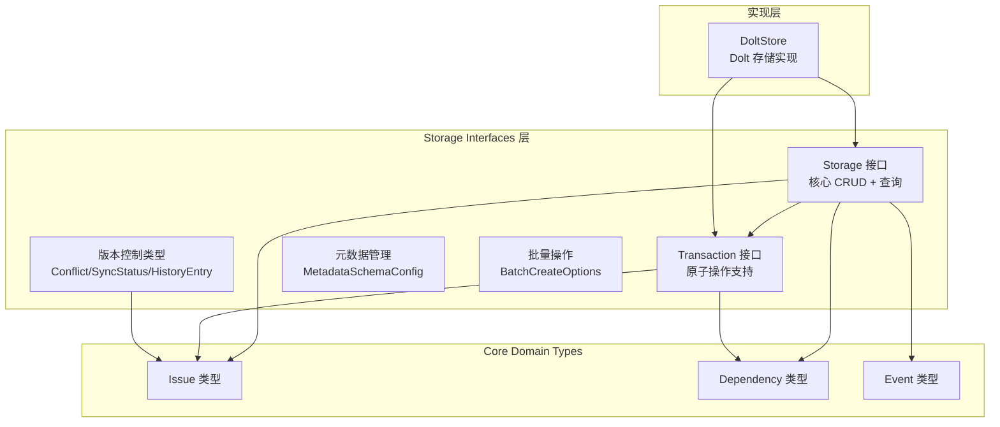

# Storage Interfaces

`Storage Interfaces` 是整个系统的数据“交通枢纽协议层”：上层命令、路由、同步、观测模块都想操作 issue，但不应该知道底层是 Dolt 还是别的后端。这个模块的价值，就是把“要做什么”（创建 issue、建依赖、查 ready work、事务提交）定义成稳定契约，把“怎么做”留给后端实现。简言之：它让系统能演进存储实现，而不撕裂业务层。

想象一下，如果您需要构建一个支持 Git 风格版本控制、冲突解决和联邦同步的问题追踪系统，您会如何设计数据存储层？Storage Interfaces 模块就是这个系统的核心抽象层——它定义了一个与具体实现无关的契约，使得上层应用可以在不关心底层存储细节的情况下，进行问题管理、事务处理和版本同步。

这个模块存在的核心原因是**解耦**：通过定义清晰的接口，系统可以支持多种存储实现（目前主要是 Dolt），同时保持业务逻辑的一致性。它就像一个通用的"插座"，任何符合接口规范的存储后端都可以"插入"使用。

---

## 1. 这个模块解决了什么问题？

在没有接口层时，最常见的退化路径是：CLI 或服务直接调用某个后端实现（例如 Dolt 的具体方法）。短期快，长期会出现三类问题：

1. **耦合爆炸**：调用方依赖后端细节（事务、错误文案、特定查询行为），后端一改，调用方连锁修改。
2. **语义漂移**：每个调用点都“自己理解存储动作”，同样是 close issue，参数、审计和边界行为可能不一致。
3. **可测试性差**：没有稳定接口，就难以插入 mock/proxy，也难做跨模块验证。

`Storage Interfaces` 的策略是把存储定义为**领域动作集合**：Issue CRUD、依赖图、标签、工作查询、评论事件、配置、事务、生命周期。它不是数据库抽象层（ORM）那种“表操作 API”，而是问题跟踪领域的“能力协议”。

---

## 2. 心智模型：港口调度塔 + 专用装卸区

可以这样理解：

- `Storage` 像港口调度塔，提供所有常规航线（增删改查、搜索、统计、事件、配置）。
- `Transaction` 像专用装卸区：当你要一次处理一批互相依赖的货物（例如创建 issue + 添加依赖 + 加标签）时，必须进这个区，保证“要么全成，要么全撤回”。

或者更技术化地说，理解这个模块最有效的方式，是把 `Storage` 看成一个**单仓库领域数据操作系统 API**，而 `Transaction` 是它的“原子批处理上下文”。

`Storage` 负责暴露“平时你能做什么”，例如创建 issue、打标签、查询 blocked work；`RunInTransaction` 则像“进入内核态”，在一个原子边界内执行一组操作，确保要么都成功要么都失败。

其中 `RunInTransaction(ctx, commitMsg, fn)` 是关键门闸。它让调用方描述“要做什么”，而由实现方托管提交/回滚/panic 处理。你不直接拿 begin/commit 句柄，这是有意的：减少误用，统一语义。

---

## 3. 架构概览与数据流

### 架构图

### 叙事化数据流（关键操作）

**场景：原子创建一组关联 issue**

1. 上层（CLI 或集成流程）调用 `Storage.RunInTransaction`。
2. 回调拿到 `Transaction`，依次执行 `CreateIssue`、`AddDependency`、`AddLabel`。
3. 任一步返回 error -> 实现层回滚；全部成功 -> 提交。
4. 上层只处理业务错误，不处理底层事务细节。

**场景：普通查询路径**

1. 上层调用 `GetIssue` / `SearchIssues` / `GetReadyWork`。
2. 接口实现（当前是 Dolt backend）执行具体查询。
3. 返回 `types.Issue`、`types.BlockedIssue` 等领域对象给上层。

数据流上可以分成两类热点路径：
1. **高频读写路径**：`GetIssue`、`SearchIssues`、`UpdateIssue`、`AddDependency`、`GetReadyWork` 等，服务日常命令和自动化流程。
2. **工作流型原子路径**：例如一次操作里同时创建 issue、关联依赖、打标签、写评论，此时通过 `RunInTransaction` 把多个动作包进单次提交边界。

> 说明：当前提供源码是接口与共享类型定义，不包含完整调用图实现体。具体 SQL/提交细节在 [Dolt Storage Backend](Dolt Storage Backend.md) 中。

---

## 4. 核心设计决策与权衡

### 决策 A：接口 vs 具体实现的分离

**选择**：定义了独立的 `Storage` 接口，而不是直接使用具体的 `DoltStore` 类型。

**为什么**：调用方通常以“用例”驱动，不想拼接多个 repository。统一入口可降低业务层复杂度，同时便于测试和未来扩展。

**代价**：实现方负担更重；接口演进要谨慎，变更影响面大。

**权衡分析**：
- ✅ **优点**：
  - 便于测试：可以轻松创建 mock 实现进行单元测试
  - 未来灵活性：如果需要支持其他存储后端（如 PostgreSQL、SQLite），只需实现接口即可
  - 清晰的职责划分：接口定义"做什么"，实现决定"怎么做"
  
- ⚠️ **缺点**：
  - 增加了一定的间接层开销
  - 接口变更需要同时更新所有实现

---

### 决策 B：事务使用回调模型（`RunInTransaction`）

**选择**：不暴露 begin/commit/rollback 给调用方，而是回调包裹。

**为什么**：注释已经明确语义（错误回滚、panic 回滚、成功提交），可强制统一行为，减少资源泄漏和半提交。

**代价**：高级场景下灵活性略低（比如想手动控制更细粒度事务生命周期）。

**权衡分析**：
- ✅ **优点**：
  - 自动资源管理：无需担心忘记提交或回滚
  - 错误处理简单：回调返回错误自动触发回滚
  - Panic 安全：即使回调 panic，也会正确回滚
  
- ⚠️ **缺点**：
  - 回调嵌套可能导致代码可读性下降
  - 在回调中使用外部变量需要小心处理

---

### 决策 C：`UpdateIssue` 使用 `map[string]interface{}`

**选择**：动态 patch，而不是每个字段一个方法。

**为什么**：面对多来源更新（CLI、集成同步、导入）更灵活，减少接口膨胀。

**代价**：类型安全下移到运行期；调用方和实现方必须严格遵守字段约定。

---

### 决策 D：定义哨兵错误（`ErrNotFound` 等）

**选择**：在接口层统一错误语义（`ErrAlreadyClaimed`、`ErrNotFound`、`ErrNotInitialized`、`ErrPrefixMismatch`）。

**为什么**：上层可用 `errors.Is` 稳定分流，不依赖后端错误文案。

**代价**：后端需要做错误映射工作，不能直接透传任意底层错误。

---

## 5. 子模块导览

### 核心存储接口
- [storage_contracts](storage_contracts.md)  
  详细解释 `Storage` 与 `Transaction` 契约本身、事务语义、调用边界与常见误区。核心组件：`Storage` 接口、`Transaction` 接口、哨兵错误定义。

### 版本控制类型
- [versioning_and_sync_types](versioning_and_sync_types.md)  
  聚焦历史、差异、冲突、远端与同步状态等版本化类型，解释它们为何作为共享语言存在。核心组件：`Conflict`、`SyncStatus`、`DiffEntry`、`FederationPeer`、`HistoryEntry`、`RemoteInfo`。

### 元数据管理
- [metadata_validation](metadata_validation.md)  
  讲解 `NormalizeMetadataValue`、schema 校验和 key 校验；这是 `UpdateIssue` 动态更新安全性的关键防线。核心组件：`MetadataFieldSchema`、`MetadataSchemaConfig`。

### 批量操作
- [batch_creation_options](batch_creation_options.md)  
  解释批量导入时 orphan 策略与 prefix 校验开关，及其在“正确性 vs 兼容性”中的取舍。核心组件：`BatchCreateOptions`。

---

## 6. 跨模块依赖与耦合边界

### 向下依赖（该模块依赖谁）

- 直接依赖 [Core Domain Types](Core Domain Types.md) 中的 `types.Issue`、`types.Dependency`、`types.Event`、`types.WorkFilter` 等。
- 元数据校验依赖 Go 标准库 `encoding/json`、`regexp`、`fmt`（低耦合工具型依赖）。

### 向上被依赖（谁依赖该模块）

- 由 [Dolt Storage Backend](Dolt Storage Backend.md) 实现 `Storage`/`Transaction` 契约。
- 被 [Routing](Routing.md) 的路由存储组合层消费。
- 可被 [Telemetry](Telemetry.md) 的 `InstrumentedStorage` 包装，做观测增强。
- CLI 与集成模块通过该接口间接访问存储。

### 隐式契约（最容易忽略）

1. `Transaction` 只是 `Storage` 子集，不是全量镜像。
2. `GetIssue` / `SearchIssues` 在事务中需要满足 read-your-writes 预期（注释已明确）。
3. `ErrPrefixMismatch` 与 `ErrNotInitialized` 说明 ID 与配置存在强约束，不是随意字符串系统。

---

## 7. 新贡献者应重点警惕

1. **别绕过接口语义**：新增后端能力时，先判断是否属于领域契约，避免把后端细节泄漏到上层。
2. **谨慎扩展 `UpdateIssue`**：动态字段更新很灵活，但每加一个字段都要同步校验、序列化与错误语义。
3. **事务中不要做“接口外假设”**：只能依赖 `Transaction` 暴露的方法，不要假定实现层还有隐藏能力。
4. **处理好元数据策略层**：`ValidateMetadataSchema` 返回错误列表，但是否 `warn/error` 由上层策略决定，别遗漏执行分支。
5. **批量导入策略要显式**：`OrphanAllow` 虽然兼容性高，但会引入拓扑数据债；重要场景建议显式指定 `OrphanStrict` 或 `OrphanResurrect`。

---

## 8. 总结

`Storage Interfaces` 的本质是“把存储变成可替换的领域协议”。它同时承担三件事：

- 对上提供稳定业务语义；
- 对下允许后端实现演进；
- 在关键点（事务、错误、元数据、批量策略）固化系统级约束。

这个模块采用了经典的**接口-实现分离**模式，其设计思想体现了几个核心原则：

- **面向接口编程**：依赖抽象而不是具体实现
- **安全优先**：事务模型设计确保数据一致性
- **灵活性与约束的平衡**：元数据验证既保持了灵活性，又确保了数据质量
- **为未来扩展设计**：接口分离使得系统可以演进而不需要大规模重构

对新加入的高级工程师，最重要的不是记住每个方法，而是守住这条边界：**业务层依赖语义，不依赖后端细节**。这正是模块长期可演进的根基。
