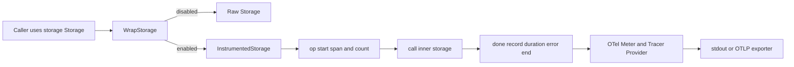

# Telemetry

`Telemetry` 模块的核心价值，是把“存储层正在发生什么”从黑盒变成可观测系统：每一次 `storage.Storage` 调用都会被自动打点（计数、时延、错误、追踪）。如果把存储层想象成数据库高速公路，`InstrumentedStorage` 就像收费站上的传感器：不改变车流方向，不参与业务决策，只负责记录“谁来了、花了多久、哪里出故障”。关键设计点是：**可观测性是可插拔的**——当 telemetry 未启用时，`WrapStorage` 直接返回原始 `storage.Storage`，避免把观测成本强加给所有运行场景。

## 架构与数据流



从职责上看，这个模块是一个典型的 **Decorator（装饰器）**。调用方依然面向 [Storage Interfaces](Storage Interfaces.md) 中的 `storage.Storage` 编程，但在对象边界处套上一层 `InstrumentedStorage`。这层做三件事：第一，在操作开始前统一创建 span 并记录操作计数；第二，在操作结束时统一记录耗时与错误；第三，在少数高价值路径补充业务维度指标（例如 `GetStatistics` 对 `bd.issue.count` gauge 的快照写入）。

数据流是线性的且对称：方法入口进 `op`，调用 `s.inner.<Method>`，然后在出口进 `done`。这使得所有存储操作都遵循相同观测协议，避免“某些接口有 tracing，某些接口漏掉”的长期漂移问题。

## 模块解决的问题：为什么不能用“朴素方案”

朴素做法通常是：在每个业务命令里手工 `time.Now()` + `log.Printf()`。这个方案短期可用，但会很快失败：第一，分散在调用层的日志无法保证覆盖率，新增存储方法时极易漏埋点；第二，日志格式缺乏统一标签体系（actor、issue id、operation），跨命令聚合几乎不可维护；第三，业务层自己打点会造成重复和耦合，调用方被迫理解观测细节。

`Telemetry` 的设计洞察是：**把可观测性下沉到稳定接口边界（`storage.Storage`）**。存储接口天然是高频且关键的“热点路径”，在这里统一拦截一次，就能让上层 CLI、同步流程、迁移流程共享同一套指标语义，同时保持业务代码干净。

## 心智模型：把它当作“无侵入探针层”

理解这个模块最有效的方式，是把它看成“协议适配层”而不是“业务层”。`InstrumentedStorage` 不拥有状态机，不重写领域规则，不改变返回值，只做三件机械且稳定的事情：

1. 生成统一 operation 标签（如 `db.operation=GetIssue`）。
2. 把调用生命周期映射到 span 生命周期。
3. 把结果映射成 metrics（总数、时延、错误）。

这与网络世界里的 sidecar 很像：流量照常经过主服务，sidecar 只观察并上报，不改业务语义。你可以默认：若 `inner` 的行为是正确的，那么 `InstrumentedStorage` 应该是“透明的正确”。

## 组件深潜

### `InstrumentedStorage`（struct）

`InstrumentedStorage` 持有一个 `inner storage.Storage` 和四类 OTel instrument：`ops`（计数器）、`dur`（耗时直方图）、`errs`（错误计数器）、`issueGauge`（状态快照 gauge）。这个字段布局表达了设计意图：前 3 个是所有操作共享的通用观测维度，`issueGauge` 是少数业务语义更强的特例指标。

它的关键约束是“接口同构”：它实现与 `storage.Storage` 一致的方法集合，因此能在任何期待 `storage.Storage` 的地方无缝替换。

### `WrapStorage(s storage.Storage) storage.Storage`

`WrapStorage` 是装饰器入口，也是性能策略入口。它先调用 `Enabled()`：若 telemetry 未启用，直接返回 `s`；若启用，则创建 meter instruments 并返回 `&InstrumentedStorage{...}`。

这个选择是典型的“运行时开关 + 零侵入调用端”：调用端不需要 if/else，也不需要知道 exporter 存不存在。tradeoff 是初始化阶段要承担一次 instrument 构造成本，但换来运行时路径极简。

### `op(ctx, name, attrs...)`

`op` 在操作开始时做两件事：`tracer.Start` 创建 `storage.<name>` span，并将 `db.operation` 与调用方属性合并；随后 `ops.Add` 记录一次操作计数。它返回 `(context.Context, trace.Span, time.Time)`，本质上是为后续 `done` 准备“结束凭证”。

返回 `time.Time` 而不是在 `done` 里直接 `time.Now()` 的原因很直接：保证耗时区间准确覆盖 inner 调用，且避免各方法重复计时代码。

### `done(ctx, span, start, err, attrs...)`

`done` 是统一收口：记录 `dur`，如果 `err != nil` 则 `RecordError + SetStatus(codes.Error, ...) + errs.Add`，最后 `span.End()`。这确保了“无论成功失败都结束 span”，避免 trace 泄漏。

一个细节是：`dur.Record` 使用调用端传入 attrs，这让指标聚合时能按 actor/issue id 等标签切片；但也意味着标签设计需要克制，否则会有高基数风险（见后文 gotchas）。

### 存储接口方法包装（CRUD / 依赖 / 标签 / 查询 / 配置 / 事务）

几乎所有公开方法都遵循同一模板：

```go
ctx, span, t := s.op(ctx, "Method", attrs...)
v, err := s.inner.Method(ctx, ...)
s.done(ctx, span, t, err, attrs...)
return v, err
```

这种高度重复并不是坏味道，而是刻意的“可审计重复”：每个方法可单独定制 attrs（如 `bd.issue.id`、`bd.dep.from`），同时保持统一生命周期逻辑。相比反射/泛型动态代理，这种显式包装在 Go 中更可读、更易调试，也不会引入额外动态调用复杂度。

### `GetStatistics(ctx)` 的 gauge 快照逻辑

`GetStatistics` 在 inner 调用成功且结果非空时，向 `bd.issue.count` 记录四个 status 维度（`open/in_progress/closed/deferred`）。这不是增量计数，而是“当前状态快照”。

这个设计让仪表盘可以直接展示当前 issue 分布，不必通过事件流回放推导库存量。代价是快照更新依赖该接口被调用频率；如果长时间无人调用 `GetStatistics`，gauge 更新也会滞后。

### `RunInTransaction(ctx, commitMsg, fn)`

事务包装只在外层记录一次 `RunInTransaction` span/metrics，并把 `fn` 直接透传给 `inner.RunInTransaction`。也就是说，事务内部每个 `tx` 操作本身不会自动由 `InstrumentedStorage` 逐条打点（因为 `Transaction` 不是这里被装饰的对象）。这是一个明确边界：该模块观测的是 Storage API 层，不是 Transaction API 层。

### `Close()`

`Close` 完全透传到 `inner.Close()`，不做额外打点。设计上它被视为生命周期清理动作而非核心业务操作。

## 与其他组件的依赖关系

从代码可验证的依赖关系如下：

`Telemetry` 模块（尤其 `storage.go`）直接依赖：
- [Storage Interfaces](Storage Interfaces.md) 的 `storage.Storage` / `storage.Transaction` 契约，用于“同接口装饰”。
- [Core Domain Types](Core Domain Types.md) 中被 `storage.Storage` 方法签名引用的类型（如 `types.Issue`、`types.Statistics`、`types.Dependency` 等）。
- OpenTelemetry API（`trace`、`metric`、`attribute`、`codes`）用于构建跨后端可移植的观测模型。

在模块内部，`WrapStorage` 依赖 `Enabled`、`Meter`、`Tracer`（定义在 `telemetry.go`）；`buildMetricProvider` 依赖 `buildOTLPMetricExporter`（定义在 `otlp.go`）。因此它不是孤立文件，而是一个“初始化 + 导出 + 存储装饰”协作体。

关于“谁调用 `WrapStorage`”：当前提供的代码片段没有展示具体调用点文件，因此无法在本文中精确列出调用方函数名。可以确定的是，任何以 `storage.Storage` 为依赖注入点的模块都可接入该装饰器，且无需修改调用签名。

## 关键设计决策与权衡

这个模块偏向“简单可靠优先”。它选择显式方法包装而不是元编程代理，选择统一标签键而不是按调用方自定义 schema，选择可选启用而不是全局强制埋点。这些选择减少了认知负担，尤其适合 CLI/本地仓库工具这种运行环境差异大的项目。

同时也有代价。第一，显式包装意味着当 `storage.Storage` 新增方法时，这里必须同步补齐，否则该方法会缺失 telemetry；编译器会帮助发现接口未实现，但不会提醒“标签语义是否合理”。第二，属性里包含 `bd.issue.id`、`bd.actor`、`bd.query` 等可能高基数字段，在某些 metrics backend 上会放大存储压力。第三，`time.Since(start).Milliseconds()` 以毫秒粒度记录，对超短操作会丢失亚毫秒信息，但换来更稳定、易读的指标桶。

## 使用方式与示例

初始化 telemetry：

```go
ctx := context.Background()
if err := telemetry.Init(ctx, "bd", "1.0.0"); err != nil {
    return err
}
defer telemetry.Shutdown(context.Background())
```

包装存储实现：

```go
var s storage.Storage = realStore
s = telemetry.WrapStorage(s)
```

环境变量驱动行为（来自 `Enabled` / `Init`）：
- `BD_OTEL_METRICS_URL`：启用 telemetry，并通过 OTLP HTTP 导出 metrics。
- `BD_OTEL_STDOUT=true`：启用 telemetry，并将 traces/metrics 输出到 stdout exporter（调试友好）。
- 二者都未设置：安装 no-op provider，`WrapStorage` 直接返回原对象。

## 新贡献者最该注意的坑

第一，新增 `storage.Storage` 方法时，记得在 `InstrumentedStorage` 同步实现；否则装饰器将不再满足接口契约。第二，新增 attrs 时先考虑 cardinality：`id`、自由文本 query、用户标识等不一定适合放入 metrics 标签（trace attribute 通常更宽容）。第三，`GetStatistics` 的 gauge 是快照，不是事件计数；不要把它当成“每次 +1/-1”解释。第四，`Shutdown` 依赖 `shutdownFns`，应在进程退出路径明确调用，避免缓冲数据未 flush。

## 参考

- [Storage Interfaces](Storage Interfaces.md)
- [Dolt Storage Backend](Dolt Storage Backend.md)
- [Core Domain Types](Core Domain Types.md)
