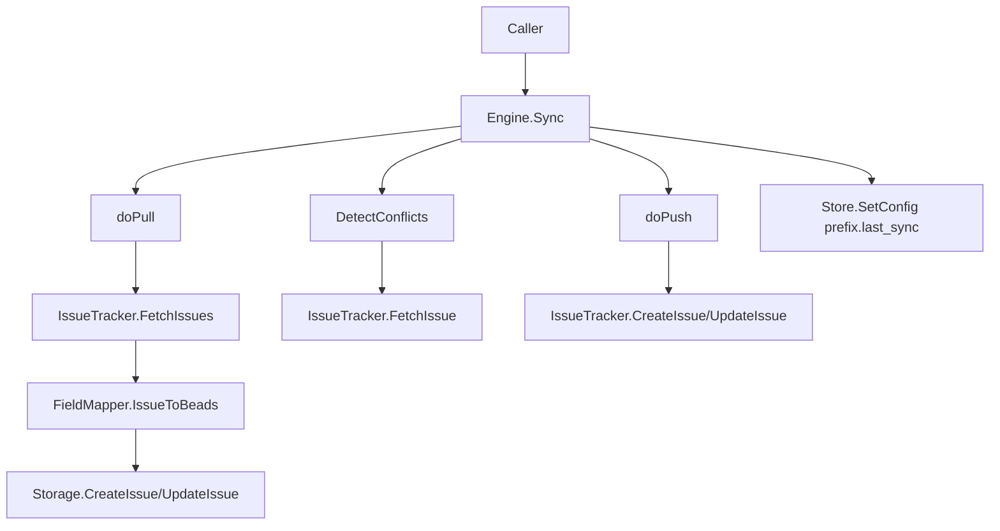

# Tracker Integration Framework

`Tracker Integration Framework` 是 Beads 与外部工单系统之间的“同步变压器”。它的核心价值不是“连上某个 API”，而是把 **Linear / GitLab / Jira** 这类语义差异巨大的系统，压到同一套同步流程里：统一拉取、统一冲突判定、统一推送、统一统计。这样团队不必为每个平台重复造一套同步引擎，也能保证行为一致性。

## 1) 这个模块解决什么问题？（先讲问题，再讲方案）

现实问题是“同一业务，不同语法”：

- 外部系统字段模型不同（状态、优先级、类型表达差异大）
- 标识体系不同（内部 ID vs 人类可读编号）
- 同步时会发生双写冲突（本地和远端都改了同一条 issue）
- 需要增量同步（否则每次全量成本高）
- 需要 dry-run / 过滤 / 统计 / 可观测性

如果不用框架，最容易走向：每个集成都手写一套 pull/push/conflict 逻辑。结果通常是：

1. 逻辑重复，维护成本线性增长；
2. 行为漂移（某平台有冲突保护，某平台没有）；
3. 任何改动都难以全局验证。

该模块的设计选择是：

- 用 `IssueTracker` + `FieldMapper` 定义插件契约（把平台差异锁进边界）
- 用 `Engine` 统一编排同步阶段（Pull → Detect/Resolve → Push）
- 用 `TrackerIssue` / `SyncOptions` / `SyncResult` 等统一数据契约

换句话说，它是一个 **策略统一 + 实现可插拔** 的同步骨架。

---

## 2) 心智模型：把它当成“机场塔台 + 航司适配器”

可以用这个比喻理解：

- `Engine` 是机场塔台：决定起降顺序、冲突处理、状态记录。
- `IssueTracker` 是航司地服系统：负责与具体外部平台通信（fetch/create/update）。
- `FieldMapper` 是翻译官：把各平台字段语义翻成 Beads 语义，再翻回去。
- `SyncOptions` 是飞行计划；`SyncResult` 是航班运行报告。

塔台不关心每家航司内部系统长什么样，只要求它们遵守统一指令接口。

---

## 3) 架构总览

### 架构叙事（数据/控制流）

1. `Engine.Sync(ctx, opts)` 是统一入口；若 `opts.Pull` 与 `opts.Push` 都为 false，会默认双向同步。
2. Pull 阶段 (`doPull`)：
   - 读取 `<ConfigPrefix>.last_sync` 组装 `FetchOptions.Since`（增量拉取）
   - 调用 `IssueTracker.FetchIssues`
   - 对每条远端 issue 执行 `FieldMapper.IssueToBeads`
   - 写入本地 `Storage.CreateIssue` / `Storage.UpdateIssue`
   - 延后执行依赖创建（`createDependencies`）
3. 双向时进入冲突检测 (`DetectConflicts`)：
   - 基于 `last_sync` 找本地更新项
   - 对应拉远端单条 `FetchIssue`
   - 若两边都在 `last_sync` 后改动，形成 `Conflict`
4. 冲突处理 (`resolveConflicts`)：按 `SyncOptions.ConflictResolution` 决定“跳过 push”或“强制 push”，必要时 `reimportIssue` 回灌远端版本。
5. Push 阶段 (`doPush`)：
   - 从本地 `SearchIssues` 取候选
   - 应用基础过滤（`shouldPushIssue`）+ `PushHooks.ShouldPush`
   - 无 `external_ref` 则 `CreateIssue`，有则 `UpdateIssue`
   - 创建成功后回写本地 `external_ref`
6. 非 dry-run 时写回 `<prefix>.last_sync`。

---

## 4) 关键设计决策与取舍

### 决策 A：接口抽象优先（`IssueTracker` / `FieldMapper`）

**选了什么**：同步引擎只依赖接口，不依赖具体平台实现。

**为什么**：平台数量会增长，核心流程不能跟着分叉。

**代价**：接口语义必须非常稳定，插件实现方需要严格遵守隐式契约（如 external ref 规则）。

**未选方案**：在 `Engine` 中写 tracker-specific `if/else`。短期快，长期不可维护。

### 决策 B：中间模型容忍弱类型（`interface{}` / `map[string]interface{}`）

**选了什么**：`TrackerIssue.State/Type/Raw` 使用 `interface{}`，`IssueToTracker` 返回 `map[string]interface{}`。

**为什么**：Jira/GitLab/Linear 的 payload 差异太大，强行统一强类型会使框架僵化。

**代价**：编译期类型安全下降，错误更偏运行时暴露。

### 决策 C：冲突处理基于时间戳与阶段化流程

**选了什么**：Pull 后检测冲突，冲突策略支持 `timestamp/local/external`。

**为什么**：跨平台通用、实现成本可控。

**代价**：`DetectConflicts` 可能产生逐条远端查询开销；依赖 `UpdatedAt` 可靠性。

### 决策 D：依赖关系后置创建

**选了什么**：`IssueConversion` 可携带 `[]DependencyInfo`，在 issue 主体落库后统一建边。

**为什么**：避免引用目标尚未导入导致的失败。

**代价**：流程多一阶段，且依赖 external ref 语义一致性。

---

## 5) 子模块导读

### [tracker_plugin_contracts](tracker_plugin_contracts.md)

定义插件边界：`IssueTracker`（生命周期、远端 I/O、external_ref 协议）与 `FieldMapper`（双向字段映射、完整 issue 转换）。它是“扩展点”的核心，任何新 tracker 都必须先满足这份契约。

### [sync_orchestration_engine](sync_orchestration_engine.md)

框架大脑：`Engine` 实现同步阶段编排、冲突检测与决策、统计汇总、OTel 埋点、dry-run 语义。`PullHooks` / `PushHooks` 提供受控可插拔策略，避免在核心流程里硬编码平台特例。

### [sync_data_models_and_options](sync_data_models_and_options.md)

统一数据语言：`TrackerIssue`、`FetchOptions`、`SyncOptions`、`Conflict`、`SyncResult` 等。它让“编排层”和“插件层”用同一种协议对话，是跨集成一致性的地基。

> 建议阅读顺序：先看 `tracker_plugin_contracts`（边界），再看 `sync_data_models_and_options`（数据语义），最后看 `sync_orchestration_engine`（时序与策略）。

---

## 6) 与系统其他模块的依赖关系

### 向下依赖（本模块依赖谁）

- [Storage Interfaces](Storage Interfaces.md)：`Engine` 通过 `storage.Storage` 读写 issue、依赖和配置（`GetConfig/SetConfig`、`SearchIssues`、`CreateIssue`、`UpdateIssue`、`AddDependency` 等）。
- [Core Domain Types](Core Domain Types.md)：映射目标是 `types.Issue`、`types.Status`、`types.IssueType`。

### 横向耦合（谁实现它的契约）

- [GitLab Integration](GitLab Integration.md)：`internal.gitlab.tracker.Tracker`
- [Jira Integration](Jira Integration.md)：`internal.jira.tracker.Tracker`
- [Linear Integration](Linear Integration.md)：`internal.linear.tracker.Tracker`

这些集成模块通过实现 `IssueTracker` / `FieldMapper` 与框架对接。

### 上游调用（谁驱动它）

在当前提供片段中能明确看到测试通过 `NewEngine(...).Sync(...)` 调用；生产命令入口应在 CLI 侧模块中组装 tracker 与配置后触发同步（本次给定代码未直接展示具体函数调用链）。

---

## 7) 新贡献者实战注意事项（高频坑）

1. **`external_ref` 三件套必须闭环**：`BuildExternalRef` 产物必须被 `IsExternalRef` 识别，并可被 `ExtractIdentifier` 正确解析，否则冲突检测和更新路径会静默失效。
2. **区分 `TrackerIssue.ID` 与 `Identifier`**：前者是远端内部 ID，后者是人类可读号。接口注释里两者用途不同，混用会造成更新失败或错更。
3. **`FetchIssue` 的 not-found 语义是 `nil, nil`**：不要把“未找到”当错误返回。
4. **`ConfigPrefix` 不宜轻易改名**：`last_sync` 键基于该前缀，改名会导致增量历史断档。
5. **`DryRun` 不落库、不写 `last_sync`**：统计是“would do”，不是实际落地。
6. **`Success` 不等于零错误**：单条 push 失败会累积到 `Stats.Errors`，但流程可能仍成功返回。
7. **同一 `Engine` 并发复用要谨慎**：实例有 `stateCache` 运行态字段，默认不应假设并发安全。

---

## 8) 扩展建议（新增一个 tracker 时）

最小路径：

1. 实现 `IssueTracker`（`Init/Validate/FetchIssues/FetchIssue/CreateIssue/UpdateIssue/...`）
2. 实现 `FieldMapper`（至少完成状态、优先级、类型和 `IssueToBeads`）
3. 明确定义 external ref 协议（构造、识别、提取一致）
4. 先跑 `Pull` 单向验证映射，再启用双向 + 冲突策略
5. 为平台特例优先使用 `PullHooks` / `PushHooks`，避免污染核心流程

一句话总结：这个框架的长期价值，在于把“变化快的平台细节”隔离到插件边界，把“变化慢的同步策略”沉淀为统一基础设施。
