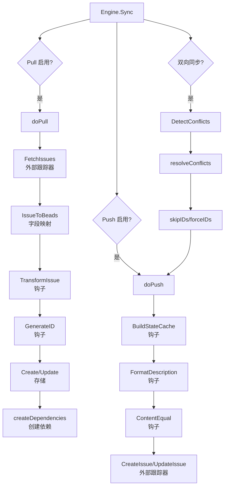

# sync_orchestration_engine 模块技术深度解析

## 问题空间与设计意图

在构建问题跟踪系统集成时，你会遇到一个经典的分布式系统难题：如何在两个独立系统之间实现可靠、一致的双向同步，同时处理冲突、保持幂等性，并且支持增量更新？

每个跟踪器（Linear、GitLab、Jira 等）都有自己独特的 API、字段表示法和状态机。如果直接为每个跟踪器编写完整的同步逻辑，会导致大量的代码重复。更重要的是，同步的核心挑战——冲突检测、增量拉取、幂等更新——这些都是与具体跟踪器无关的通用问题。

`sync_orchestration_engine` 模块的核心使命就是**将同步的通用模式与跟踪器特定的细节解耦**，通过定义清晰的契约和可插拔的钩子系统，让每个跟踪器集成只需关注自己的独特部分。

## 核心心智模型

想象这个引擎是一个**双向的海关检查站**：

1. **入境（Pull）**：外部问题经过检查、转换、重新编号后进入本地系统
2. **冲突检测（Conflict Detection）**：检查两边是否有同时修改的物品
3. **出境（Push）**：本地问题经过格式化、状态映射后发送到外部系统

而 `PullHooks` 和 `PushHooks` 就像是不同国家的海关官员——他们知道如何处理本国特有的文档格式和规则，但都遵循相同的检查流程。

## 架构与数据流程



### 关键组件角色

1. **Engine**：整个同步流程的指挥者，维护状态并协调各个阶段
2. **PullHooks/PushHooks**：可插拔的扩展点，用于注入跟踪器特定的逻辑
3. **IssueTracker**：外部跟踪器的抽象接口，由具体实现提供
4. **FieldMapper**：负责在跟踪器和本地格式之间转换问题

## 核心组件深度解析

### Engine 结构体

Engine 是整个同步流程的中枢神经，它不仅仅是一个函数集合，更是一个状态机。

```go
type Engine struct {
    Tracker   IssueTracker  // 外部跟踪器接口
    Store     storage.Storage  // 本地存储
    Actor     string  // 操作执行者标识
    PullHooks *PullHooks  // 拉取阶段的扩展点
    PushHooks *PushHooks  // 推送阶段的扩展点
    // ... 回调和状态字段
}
```

**设计意图**：Engine 采用了**模板方法模式**——它定义了同步的骨架流程（Pull→Detect→Resolve→Push），但将具体的实现细节通过 `IssueTracker` 接口和钩子系统委托给外部。

### Sync 方法

这是整个模块的入口点，它实现了一个完整的同步生命周期。

**关键流程**：
1. **默认行为**：如果未指定方向，默认双向同步
2. **三阶段执行**：严格按照 Pull → Detect Conflicts → Push 的顺序
3. **冲突影响传递**：冲突解析的结果（skipIDs/forceIDs）直接影响 Push 阶段
4. **元数据更新**：最后更新 `last_sync` 时间戳，为下一次增量同步做准备

**设计洞察**：注意这个顺序是经过精心设计的。如果先 Push 再 Pull，那么刚刚推送的变更会被立即拉取回来，造成不必要的更新和潜在的冲突误报。

### doPull 方法

这个方法实现了从外部跟踪器导入问题的逻辑。

**核心机制**：
1. **增量同步优先**：尝试使用 `last_sync` 时间戳进行增量拉取
2. **冲突感知的更新**：跳过那些在本地已被修改的问题（避免覆盖本地更改）
3. **依赖延迟创建**：先导入所有问题，最后统一创建依赖关系（解决引用顺序问题）

**关键代码段解析**：
```go
// 冲突感知的拉取保护
if lastSync != nil && existing.UpdatedAt.After(*lastSync) {
    stats.Skipped++
    continue
}
```

这段代码是整个同步可靠性的关键。如果没有这个保护，在双向同步场景下，拉取阶段会默默地覆盖本地更改，然后冲突检测阶段永远不会发现这些更改——因为本地修改的痕迹已经被抹去了。

### DetectConflicts 方法

冲突检测基于一个简单但强大的直觉：**比较双方相对于上次同步的修改时间**。

**算法逻辑**：
```
对于每个有外部引用的本地问题：
    如果本地在 last_sync 后有修改：
        获取外部版本
        如果外部在 last_sync 后也有修改：
            标记为冲突
```

**设计权衡**：这种基于时间戳的冲突检测简单且高效，但它假设：
1. 所有系统的时钟是大致同步的（不需要完美，只要在合理范围内）
2. 修改时间是可靠的（不会被任意篡改）

对于问题跟踪系统集成来说，这些假设通常是成立的。

### doPush 方法

推送阶段将本地变更导出到外部跟踪器。

**关键特性**：
1. **状态预缓存**：通过 `BuildStateCache` 一次性获取工作流状态，避免在循环中重复请求
2. **幂等更新检查**：使用 `ContentEqual` 钩子或时间戳比较来跳过不必要的更新
3. **描述格式化**：应用 `FormatDescription` 钩子时，操作的是问题的副本，避免修改本地数据

**为什么要复制问题？**
```go
pushIssue := issue
if e.PushHooks != nil && e.PushHooks.FormatDescription != nil {
    copy := *issue
    copy.Description = e.PushHooks.FormatDescription(issue)
    pushIssue = &copy
}
```

这是一个很好的防御性编程示例。格式化描述可能需要添加跟踪器特定的标记（如 Linear 的结构化字段），这些不应该污染本地存储的版本。

### PullHooks 和 PushHooks

这两个结构体是引擎的扩展点，它们体现了**开闭原则**——对扩展开放，对修改关闭。

**PullHooks**：
- `GenerateID`：在导入前为问题分配 ID（常用于基于哈希的 ID 生成）
- `TransformIssue`：转换问题字段（如描述格式化、规范化）
- `ShouldImport`：过滤要导入的问题

**PushHooks**：
- `FormatDescription`：推送前格式化描述
- `ContentEqual`：比较内容是否相同（用于跳过不必要的更新）
- `ShouldPush`：过滤要推送的问题
- `BuildStateCache/ResolveState`：预缓存和解析工作流状态

**设计洞察**：注意这些钩子的设计非常精确——每个钩子只做一件事，并且在流程中有明确的调用时机。这种设计使得跟踪器集成可以组合使用多个钩子，而不会互相干扰。

## 依赖分析

### 入站依赖（谁使用这个模块）

这个模块被具体的跟踪器集成使用：
- [GitLab Integration](GitLab-Integration.md)
- [Jira Integration](Jira-Integration.md)
- [Linear Integration](Linear-Integration.md)

### 出站依赖（模块使用了什么）

- **[Core Domain Types](Core-Domain-Types.md)**：`Issue`、`Dependency` 等核心数据结构
- **[Storage Interfaces](Storage-Interfaces.md)**：`Storage` 接口用于持久化
- **[Tracker Integration Framework - sync_data_models_and_options](Tracker-Integration-Framework-sync_data_models_and_options.md)**：`SyncOptions`、`Conflict` 等同步相关类型

### 关键契约

1. **IssueTracker 接口**：引擎依赖这个接口来与外部跟踪器交互
   - `FetchIssues`、`FetchIssue`：获取问题
   - `CreateIssue`、`UpdateIssue`：修改问题
   - `FieldMapper`：获取字段映射器
   - `BuildExternalRef`、`IsExternalRef`、`ExtractIdentifier`：处理外部引用

2. **Storage 接口**：引擎假设存储层支持
   - 按外部引用查找问题
   - 事务性的创建和更新
   - 配置键值存储（用于 `last_sync`）

## 设计决策与权衡

### 1. 基于时间戳的冲突检测 vs 基于内容的冲突检测

**选择**：基于时间戳

**原因**：
- 性能：不需要获取和比较整个问题内容
- 简单：时间戳是大多数 API 都提供的元数据
- 足够好：对于问题跟踪场景，时间戳通常能准确反映修改情况

**权衡**：可能会有误报（时间戳改变但内容未变），但通过 `ContentEqual` 钩子可以在 Push 阶段缓解这个问题。

### 2. 严格的三阶段流程 vs 灵活的组合

**选择**：严格的 Pull → Detect → Push 顺序

**原因**：
- 正确性：避免了先 Push 后 Pull 导致的变更循环
- 可预测性：开发者知道确切的执行顺序
- 冲突处理：确保在 Push 前已经解决了所有冲突

**权衡**：对于某些只需要单向同步的场景，这会带来轻微的 overhead，但为了整体一致性，这个代价是值得的。

### 3. 钩子系统 vs 继承/接口实现

**选择**：组合式的钩子系统

**原因**：
- 灵活性：可以选择性地实现需要的钩子，而不需要实现整个接口
- 可组合性：多个钩子可以独立工作，互不干扰
- 渐进式实现：新的跟踪器集成可以从简单开始，逐步添加钩子

**权衡**：钩子系统增加了一定的间接性，代码阅读者需要理解钩子的调用时机和上下文。

### 4. 依赖延迟创建 vs 即时创建

**选择**：先导入所有问题，最后统一创建依赖

**原因**：
- 解决引用顺序问题：被依赖的问题可能在依赖它的问题之后被拉取
- 批量处理效率：可以一次性处理所有依赖关系
- 错误隔离：依赖创建失败不会影响问题导入

**权衡**：如果在依赖创建阶段发生错误，已经导入的问题不会回滚，这可能导致部分完成的状态。

## 使用指南与常见模式

### 基本使用

```go
// 创建引擎
engine := tracker.NewEngine(trackerImpl, store, "user@example.com")

// 设置钩子（可选）
engine.PullHooks = &tracker.PullHooks{
    TransformIssue: func(issue *types.Issue) {
        // 自定义转换逻辑
    },
}

// 执行同步
result, err := engine.Sync(ctx, tracker.SyncOptions{
    Pull: true,
    Push: true,
    ConflictResolution: tracker.ConflictLocal,
})
```

### 实现自定义 ID 生成

```go
// 预加载已使用的 ID
usedIDs := loadUsedIDs()

engine.PullHooks = &tracker.PullHooks{
    GenerateID: func(ctx context.Context, issue *types.Issue) error {
        // 基于内容生成哈希 ID
        id := generateHashID(issue)
        for usedIDs[id] {
            id = incrementID(id)
        }
        issue.ID = id
        usedIDs[id] = true
        return nil
    },
}
```

### 实现状态缓存

```go
engine.PushHooks = &tracker.PushHooks{
    BuildStateCache: func(ctx context.Context) (interface{}, error) {
        // 一次性获取所有工作流状态
        states, err := tracker.FetchAllStates(ctx)
        if err != nil {
            return nil, err
        }
        // 构建映射
        stateMap := make(map[types.Status]string)
        for _, s := range states {
            stateMap[beadsStatusFor(s)] = s.ID
        }
        return stateMap, nil
    },
    ResolveState: func(cache interface{}, status types.Status) (string, bool) {
        stateMap := cache.(map[types.Status]string)
        id, ok := stateMap[status]
        return id, ok
    },
}
```

## 边缘情况与注意事项

### 1. 时钟漂移

**问题**：如果本地和外部系统的时钟差异很大，冲突检测可能会误报或漏报。

**缓解**：
- 时间戳比较时考虑一定的容差
- 在 `ContentEqual` 钩子中实现更精确的内容比较

### 2. 部分完成的同步

**问题**：如果同步在中间阶段失败，会留下部分完成的状态。

**缓解**：
- 同步是幂等的——重试通常会自动修复问题
- 冲突检测会在下一次同步时处理任何不一致

### 3. 外部引用格式变更

**问题**：如果跟踪器更改了其外部引用格式，引擎可能无法识别已同步的问题。

**缓解**：
- 实现 `IsExternalRef` 时考虑向后兼容
- 在迁移期间，可以同时识别新旧两种格式

### 4. 依赖循环

**问题**：如果外部系统有依赖循环，延迟创建依赖可能会失败。

**缓解**：
- 存储层应该处理依赖循环（要么允许，要么给出清晰的错误）
- 可以在 `createDependencies` 中添加循环检测和警告

## 总结

`sync_orchestration_engine` 模块是一个精心设计的同步框架，它通过将通用同步逻辑与跟踪器特定细节解耦，实现了高度的可重用性和可扩展性。其核心价值在于：

1. **定义了清晰的同步模式**：Pull → Detect → Push
2. **提供了精确的扩展点**：通过 `PullHooks` 和 `PushHooks`
3. **处理了分布式同步的难点**：冲突检测、增量更新、幂等性

对于新加入团队的开发者，理解这个模块的关键是把握住"海关检查站"的心智模型——引擎管理流程，钩子处理细节，契约确保兼容性。


