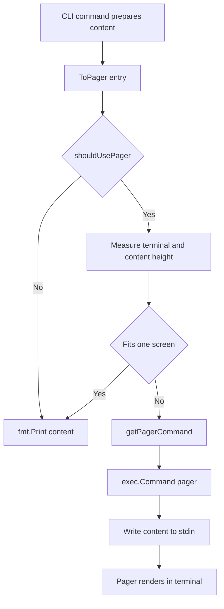

# UI Utilities

`internal/ui/pager.go` 这个模块做的事很“小”，但它解决的是一个非常真实的 CLI 体验问题：同一份输出在不同上下文里需要不同展示策略。直接 `fmt.Print` 虽然简单，但在交互式终端里会把长输出刷屏、淹没上下文；而无脑走 `less` 又会破坏管道场景（比如 `bd ... | jq`）和自动化脚本。这个模块的价值就在于把“是否分页、如何分页、何时退化为直接输出”集中成一套一致策略，让上层命令只关心“我要输出什么”，不用反复处理终端探测和环境兼容细节。

## 架构与数据流



从架构角色看，`UI Utilities` 不是一个“渲染引擎”，而是一个**输出策略网关（output policy gateway）**。它位于命令层输出和终端能力之间，像一个“分流闸门”：

1. 先判断当前是否适合进入 pager 路径（交互式 TTY、未禁用分页）；
2. 再判断内容是否值得分页（是否超出屏高）；
3. 最后才组装并执行外部分页器进程。

这个分层判断很关键：它避免了昂贵/脆弱的外部进程调用出现在不必要路径里，并且把“用户意图（flag/env）”置于“系统能力（TTY）”之前，减少惊喜行为。

## 组件深潜

### `PagerOptions`

`PagerOptions` 当前只有一个字段：`NoPager bool`。它看起来很轻，但设计意图明确：把“命令级显式意图”（`--no-pager`）作为强覆盖开关，优先级高于自动探测。换句话说，它是调用方和模块之间最小但清晰的契约：调用方只需声明“本次是否禁用分页”，其余策略由模块负责。

这种最小配置对象的好处是未来可扩展（例如以后增加 `ForcePager` 或 `PagerCommandOverride`），又不把环境变量读取逻辑泄漏到命令层。

### `ToPager(content string, opts PagerOptions) error`

`ToPager` 是模块唯一导出入口，也是策略编排器。它的内部流程体现了“先便宜检查，再昂贵操作”的思路：

- 先走 `shouldUsePager(opts)`，若不满足直接 `fmt.Print(content)`；
- 若可分页，再比较 `contentHeight(content)` 与 `getTerminalHeight()`；内容一屏可容纳时仍直接输出；
- 只有长输出才调用 `getPagerCommand()` 并 `exec.Command(...)` 启动 pager。

它返回 `error`，只在外部命令执行 (`cmd.Run()`) 失败时向上传播；直接打印路径返回 `nil`。这意味着调用方可统一按“输出可能失败”的方式处理，而无需关心底层到底是本地打印还是外部进程。

还有一个非显然细节：当未设置 `LESS` 时，函数为子进程注入 `LESS=-RFX`。这组参数等于给默认 `less` 提供更符合 CLI 工具的行为（保留颜色、短内容自动退出、退出不清屏），属于“默认体验优化但可被用户覆写”的策略。

### `shouldUsePager(opts PagerOptions) bool`

这是第一道策略门，顺序是：

1. `opts.NoPager`；
2. `BD_NO_PAGER`；
3. `term.IsTerminal(os.Stdout.Fd())`。

顺序本身体现优先级语义：先看显式禁用，再看全局环境禁用，最后才看能力探测。尤其是 TTY 检查，保证了管道和重定向输出不会被 pager 劫持，这是 CLI 工具“可组合性（composability）”的核心要求。

### `getPagerCommand() string`

命令选择优先级：`BD_PAGER` > `PAGER` > `"less"`。这是典型“工具私有配置覆盖通用配置”的设计：

- `BD_PAGER` 允许 beads 生态内部精细控制；
- `PAGER` 继承用户系统习惯；
- 默认 `less` 保证开箱可用。

### `getTerminalHeight() int`

只在 `stdout` 为 TTY 时尝试 `term.GetSize`，失败返回 `0`。`0` 在本模块里是“未知高度”的哨兵值，而不是错误抛出。这个选择避免了终端探测失败导致命令失败；代价是策略会更保守（无法确认一屏时，更倾向继续分页路径）。

### `contentHeight(content string) int`

按换行符计数（`strings.Count(content, "\n") + 1`）估算行数，空串返回 `0`。这是一个有意识的近似：速度快、无状态、足够支撑“是否超过一屏”的粗粒度判断，但不处理软换行、ANSI 控制序列显示宽度、多字节宽字符换行折叠等显示层细节。

## 依赖分析：它调用谁、谁调用它

在当前代码中，`internal/ui/pager.go` 的调用关系非常聚焦。

向下依赖（模块调用外部）：

- 标准库：`fmt`（直接输出）、`os`（环境变量和 stdout fd）、`os/exec`（启动 pager 子进程）、`strings`（命令和文本处理）。
- 第三方：`golang.org/x/term`（TTY 判断与终端尺寸获取）。

模块内部调用链（可视为局部依赖图）：

- `ToPager` 依赖 `shouldUsePager`、`getTerminalHeight`、`contentHeight`、`getPagerCommand`；
- `shouldUsePager` 与 `getTerminalHeight` 都依赖 `term.IsTerminal`；
- `ToPager` 最终可能依赖 `exec.Command(...).Run()`。

向上依赖（谁调用它）：

- 从提供的模块清单可判断它服务于 CLI 输出场景，但当前给出的代码与片段未直接列出 `ToPager` 的 `depended_by` 明细；因此无法在本文中精确枚举具体调用函数名。
- 但契约很清楚：上游只需提供完整字符串 `content` 与 `PagerOptions`，并处理 `error`。

这也说明该模块是一个“横切基础设施”：理论上任何命令模块（如状态展示、列表输出、图形文本输出）都可以统一接入，而不必复制分页判断逻辑。

## 设计取舍与背后的理由

这里最核心的取舍是**体验优先但保持 Unix 兼容**。

第一，模块选择“自动分页 + 自动跳过分页”的双重策略，而不是固定分页。这样在长输出时提升可读性，在短输出和管道场景保持轻量、可组合。

第二，使用外部 pager 进程（`exec.Command`）而不是内置分页渲染。优点是复用用户熟悉工具（尤其 `less`）、实现简单；代价是依赖运行环境可执行文件，且命令解析基于 `strings.Fields`，不支持复杂 shell quoting 语义。

第三，`contentHeight` 采用近似估算而非精确终端渲染模拟。优点是低开销、逻辑清晰；代价是在含 ANSI 颜色码、长行自动折行等场景下可能误判“是否一屏可容纳”。这在 CLI 场景通常可接受，因为即便误判，多数时候只影响“是否进入 pager”，不影响内容正确性。

第四，失败处理上将“无法探测终端尺寸”降级为哨兵值而不是错误。这个选择把系统鲁棒性放在前面：输出不能因为环境能力不完整而中断。

## 使用方式与示例

典型用法是命令层先拼接完整文本，再交给 `ToPager`：

```go
content := renderLongReport(data)
err := ui.ToPager(content, ui.PagerOptions{NoPager: noPagerFlag})
if err != nil {
    return fmt.Errorf("display output: %w", err)
}
```

环境变量控制示例：

```bash
# 全局禁用分页
export BD_NO_PAGER=1

# 指定 beads 专用 pager
export BD_PAGER="less -R"

# 若未设置 BD_PAGER，则回退到系统 PAGER
export PAGER="more"
```

行为优先级（高到低）可概括为：命令参数 `NoPager` → `BD_NO_PAGER` → TTY 能力与内容长度判断 → `BD_PAGER/PAGER/less` 命令选择。

## 新贡献者要特别注意的点

最容易踩坑的是“把它当成纯打印函数”。`ToPager` 可能启动外部进程，因此在测试和批处理场景要明确设置 `NoPager` 或相关环境变量，避免测试挂起在交互式 pager 上。

另一个隐含契约是：函数以 `stdout` 为目标终端做探测和输出，`stderr` 仅用于 pager 子进程错误输出透传。如果调用方把主要结果写到其他流，这套判断不会自动适配。

还要注意 `getPagerCommand` 的解析方式是 `strings.Fields`：像 `BD_PAGER='less -R -P "my prompt"'` 这类带复杂引号的命令可能无法按用户预期切分。当前实现更偏向简单、常见命令参数组合。

最后，`#nosec G204` 在这里是有意识的风险接受：命令来自用户环境变量，属于“用户可配置能力”。如果后续引入多租户或受限执行环境，需要重新审视这条安全边界（例如白名单 pager 或禁用自定义命令）。

## 参考

`UI Utilities` 主要被 CLI 命令层消费，建议结合以下模块文档理解调用上下文（而非在此重复）：

- [CLI Issue Management Commands](cli_issue_management_commands.md)
- [CLI Graph Commands](cli_graph_commands.md)
- [CLI Molecule Commands](cli_molecule_commands.md)
- [CLI Formula Commands](cli_formula_commands.md)
