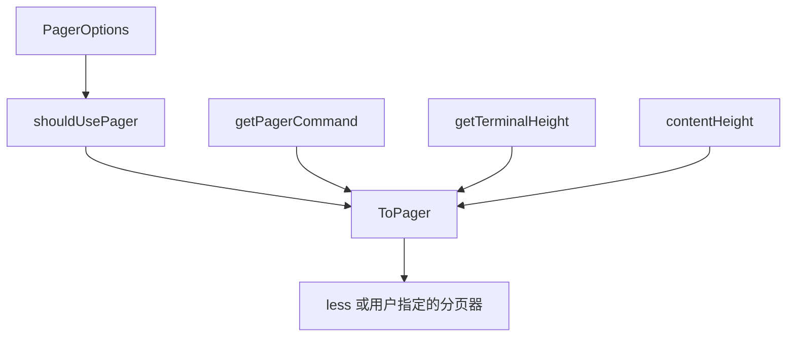

# UI Utilities 模块深度解析

## 概述

UI Utilities 模块是一个专注于终端输出体验优化的基础设施组件，为 beads CLI 提供了智能分页、终端检测和样式支持。它解决的核心问题是：如何在保持命令行工具简洁性的同时，为大量输出提供良好的阅读体验，同时尊重用户的配置偏好和环境差异。

这个模块的设计理念是"智能但不强制"——它会自动判断是否需要分页，但同时提供多层级的配置覆盖机制，确保用户始终拥有最终控制权。

## 架构与核心组件



### 核心组件职责

1. **PagerOptions**：配置契约，提供明确的 API 来控制分页行为
2. **shouldUsePager**：环境与配置决策引擎，综合判断是否应该启用分页
3. **getPagerCommand**：分页器解析器，处理用户配置的分页器命令
4. **getTerminalHeight**：终端检测层，获取终端尺寸信息
5. **contentHeight**：内容分析器，计算内容的行数
6. **ToPager**：编排层，整合所有逻辑并执行分页决策

## 组件深度解析

### PagerOptions 结构体

```go
type PagerOptions struct {
    NoPager bool
}
```

这个结构体看似简单，实则体现了**最小配置原则**。它只暴露最核心的控制开关（--no-pager 标志），而将更复杂的配置（如分页器选择）留给环境变量，这样既保持了 API 的简洁性，又不损失灵活性。

### shouldUsePager 函数

这是模块的决策核心，它实现了一个**分层决策模型**：

1. 命令行标志优先：如果 NoPager 为 true，直接禁用分页
2. 环境变量其次：检查 BD_NO_PAGER 环境变量
3. 终端检测最后：验证 stdout 是否为 TTY

这种设计确保了用户意图的清晰表达——命令行标志具有最高优先级，因为它是用户在执行命令时的明确选择；环境变量次之，适合持久化的用户偏好；而终端检测则作为安全网，确保在非交互环境中不会意外启用分页。

### getPagerCommand 函数

这个函数实现了**渐进式回退策略**：

1. 首先检查 BD_PAGER（beads 专用配置）
2. 然后检查 PAGER（通用 Unix 配置）
3. 最后默认使用 less（最广泛可用的分页器）

这种设计尊重了 Unix 哲学中的约定俗成——PAGER 环境变量是许多命令行工具都遵循的标准，而 BD_PAGER 则提供了针对 beads 的专用覆盖，满足了用户可能希望对不同工具使用不同分页器的需求。

### ToPager 函数

这是模块的编排核心，它实现了**智能内容感知分页**：

1. 首先调用 shouldUsePager 进行基础判断
2. 然后获取终端高度并计算内容高度
3. 如果内容能在一屏内显示（contentHeight <= termHeight-1），则直接输出
4. 否则，启动分页器

这里的 termHeight-1 是一个精心设计的细节——它为 shell 提示符预留了一行空间，避免了内容刚好填满屏幕时提示符被挤到下一页的尴尬体验。

### less 配置的默认值

```go
if os.Getenv("LESS") == "" {
    cmd.Env = append(os.Environ(), "LESS=-RFX")
}
```

这是一个**用户体验优化**的典范：

- -R：允许 ANSI 颜色代码通过（保持输出的视觉效果）
- -F：如果内容 fits 一屏则直接退出（避免不必要的分页）
- -X：退出时不清屏（保持上下文可见）

这些默认值被精心选择以提供最佳的开箱即用体验，但同时也尊重用户已有的 LESS 配置——如果用户已经设置了自己的 LESS 环境变量，模块不会覆盖它。

## 数据流向

让我们以一个典型的 bd issue list 命令为例，追踪数据如何流经这个模块：

1. CLI 层调用 ToPager，传入问题列表的字符串表示和 PagerOptions
2. shouldUsePager 检查：
   - 是否有 --no-pager 标志？
   - 是否设置了 BD_NO_PAGER 环境变量？
   - stdout 是否是 TTY？
3. 如果通过了上述检查，getTerminalHeight 获取终端行数
4. contentHeight 计算输出内容的行数
5. 如果内容行数超过终端高度，getPagerCommand 确定使用哪个分页器
6. 解析分页器命令，设置环境变量（特别是 LESS=-RFX）
7. 将内容通过 stdin 传递给分页器进程
8. 分页器将输出写入 stdout/stderr

## 设计决策与权衡

### 1. 内容高度检测 vs 直接分页

**决策**：仅在内容超出终端高度时才启用分页
**权衡**：
- 优点：对于短输出，避免了分页器的启动开销和交互成本
- 缺点：需要预先计算内容高度，这意味着整个输出必须先在内存中生成
- 为什么合理：在 CLI 上下文中，输出大小通常是可控的，内存开销相对于用户体验的提升是值得的

### 2. 多层配置覆盖 vs 单一配置

**决策**：实现命令行标志 → 环境变量 → 默认值的三层配置
**权衡**：
- 优点：灵活性高，满足不同用户的偏好和使用场景
- 缺点：配置来源分散，调试可能更复杂
- 为什么合理：这是 Unix 工具的标准做法，用户已经习惯了这种模式

### 3. 默认 less 参数 vs 完全依赖用户配置

**决策**：在用户未设置 LESS 环境变量时提供合理默认值
**权衡**：
- 优点：开箱即用体验好，新用户无需配置就能获得良好体验
- 缺点：可能与某些用户的预期不符（尽管我们只在用户未设置时才应用）
- 为什么合理：默认值的选择非常保守且用户友好，不太可能引起问题

### 4. 直接使用 exec.Command 执行用户配置的分页器

**决策**：允许用户配置任意分页器命令，并直接执行
**权衡**：
- 优点：极大的灵活性，用户可以使用任何他们喜欢的分页器
- 缺点：存在安全风险（代码中有 #nosec G204 注释明确承认了这一点）
- 为什么合理：这是一个开发者工具，用户被信任能够控制自己的环境；而且分页器命令是用户显式配置的，不是来自不可信的输入

## 使用指南与最佳实践

### 基本使用

```go
// 简单使用，启用智能分页
ui.ToPager(longOutput, ui.PagerOptions{})

// 禁用分页（例如，当用户指定 --no-pager 时）
ui.ToPager(output, ui.PagerOptions{NoPager: true})
```

### 配置选项

1. 命令行标志：在你的命令中添加 --no-pager 标志，并将其值传递给 PagerOptions.NoPager
2. 环境变量：
   - BD_NO_PAGER=1：永久禁用 beads 命令的分页
   - BD_PAGER=more：为 beads 命令使用特定的分页器
   - PAGER=most：为所有工具设置默认分页器
   - LESS=-R：自定义 less 的行为

### 常见模式

在 CLI 命令中集成分页的标准模式：

```go
// 在命令定义中
var noPager bool
cmd.Flags().BoolVar(&noPager, "no-pager", false, "Disable pager")

// 在命令执行中
output := generateOutput()
if err := ui.ToPager(output, ui.PagerOptions{NoPager: noPager}); err != nil {
    return err
}
```

## 边缘情况与陷阱

### 1. 非 TTY 输出

**问题**：当输出被管道到另一个命令或重定向到文件时，分页器不应该启动
**解决方案**：shouldUsePager 中的 term.IsTerminal 检查已经处理了这种情况

### 2. 终端大小改变

**问题**：在分页器运行期间终端大小可能改变
**解决方案**：这是分页器（如 less）自身的责任，我们的模块不处理运行时的大小变化

### 3. 分页器命令包含空格和参数

**问题**：用户可能配置类似 less -R -M 的分页器命令
**解决方案**：strings.Fields() 正确处理了这种情况，它会将命令拆分为可执行文件和参数

### 4. 彩色输出

**问题**：ANSI 颜色代码可能被分页器干扰
**解决方案**：默认的 -R 参数确保 less 会正确传递颜色代码

### 5. 分页器不存在或执行失败

**问题**：用户可能配置了一个不存在的分页器
**当前行为**：cmd.Run() 会返回错误，这个错误会传播给调用者
**建议**：调用者应该考虑处理这种错误，或者在这种情况下回退到直接输出

## 与其他模块的关系

UI Utilities 是一个**基础设施模块**，它被上层的 CLI 命令模块使用，例如：
- CLI Issue Management Commands：在列出问题时使用
- CLI Graph Commands：在显示图形时使用
- 任何可能产生大量输出的 CLI 命令

它是一个典型的**支持性模块**——不包含业务逻辑，专注于提供通用的 UI 功能。

## 总结

UI Utilities 模块是一个小而美的组件，它体现了**关注细节的用户体验设计**。通过智能判断、多层配置和合理默认值，它在保持简单性的同时解决了 CLI 输出分页的实际问题。

这个模块的设计告诉我们：好的基础设施组件往往是那些"看不见"的组件——它们默默地工作，处理边界情况，尊重用户偏好，让上层组件可以专注于业务逻辑。
