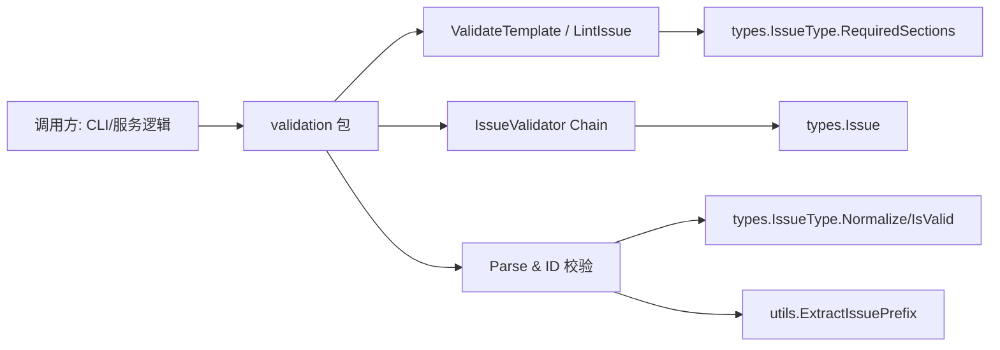

# Validation

`Validation` 模块是系统里的“入口质检台”。它不负责存储、不负责业务编排，而是专门做一件事：在数据进入核心流程前，尽可能早、尽可能明确地拒绝无效输入和非法状态。你可以把它理解成机场安检：它不决定你要飞去哪里（业务逻辑），但它决定你是否允许登机（数据/状态是否符合规则）。这个模块存在的意义，不是“锦上添花的校验”，而是把错误从深层存储或后续流程提前拉到边界处，让调用者得到可读、可修复的反馈。

---

## 这个模块解决了什么问题？

如果没有统一的 validation 层，系统通常会退化成“每个调用点自己做一点检查”。短期看很灵活，长期会出现三个典型问题：第一，规则分散，`create`、`update`、`close` 各自有一套不一致判断；第二，错误时机过晚，很多错误要等到写库或跨模块调用时才暴露；第三，错误信息不可操作，调用方拿到的是底层失败而不是“你缺少了 `## Acceptance Criteria`”。

`Validation` 的设计思路是把校验拆成三类能力：模板完整性校验（`ValidateTemplate`/`LintIssue`）、issue 状态机前置校验（`IssueValidator` + `Chain` + 一组谓词校验器）、以及输入规范化/格式校验（优先级、issue type、ID/prefix）。这三类覆盖了“文本结构是否合规”“对象状态是否允许当前操作”“字符串输入是否可被系统稳定解释”三个层面，形成一个轻量但高频的防线。

---

## 心智模型：三道闸门

理解这个模块最有效的方式，是把它想成三道串联闸门。

第一道是**模板闸门**，关注 issue 内容是不是“可评审、可执行”的结构化文本；第二道是**状态闸门**，关注这个 issue 在当前生命周期节点上是否允许该操作（比如模板不可改、pinned 默认不可动）；第三道是**标识闸门**，关注外部输入字符串是否能被解释成系统认可的语义（priority、type、ID prefix）。

这三道闸门都遵循同一个哲学：**宁可在边界做保守拒绝，也不要让不确定输入流入深层模块**。因此很多函数实现看起来“简单直接”，但背后是有意选择：保持无副作用、同步执行、尽量 deterministic，使它们可以在 CLI、服务层、测试里被高频复用。

---

## 架构与数据流



`validation` 在架构里的角色是一个**纯校验转换层**：上游把原始输入（字符串、`*types.Issue`、操作上下文参数）交给它，它返回“可继续”或“必须终止”的 error。它自己不持久化状态，不访问存储层，也不触发副作用。这样的设计让它天然适合放在热路径前端。

在模板校验链路里，`ValidateTemplate` 先调用 `IssueType.RequiredSections()` 获取类型所需章节，再做大小写无关的文本包含匹配；缺失时返回 `*TemplateError`，包含完整缺失列表。`LintIssue` 是这个能力在实体级别的包装：它把 `Issue.Description` 与 `Issue.AcceptanceCriteria` 合并后再调用 `ValidateTemplate`，避免“章节在专用字段里但仍被误判缺失”。

在状态校验链路里，核心抽象是 `type IssueValidator func(id string, issue *types.Issue) error`。`Chain` 负责顺序执行并在首个错误短路。像 `forUpdate`、`forClose`、`forDelete`、`forReopen` 这些组合器，本质是把业务动作映射成固定规则序列。数据流非常线性：调用方取到 issue -> 执行 chain -> 通过则进入真正操作。

在输入格式链路里，`ParsePriority`/`ValidatePriority` 处理 `0-4` 与 `P0-P4` 双格式；`ParseIssueType` 走 `IssueType.Normalize()` + `IsValid()`，把别名映射和合法性校验统一收口；`ValidateIDFormat` 和 `ValidateIDPrefixAllowed` 则把 ID 与 prefix 规则显式化，其中前者依赖 `utils.ExtractIssuePrefix` 解决多连字符前缀解析问题。

---

## 组件深潜

### `MissingSection`

`MissingSection` 是模板校验的最小报告单元，只有 `Heading` 和 `Hint` 两个字段。它故意不带位置、上下文片段等复杂信息，原因是当前校验策略是“是否出现该章节语义”，不是 Markdown AST 级精确 lint。这个结构越小，越容易在 CLI 或 JSON 输出层复用。

### `TemplateError` 与 `(*TemplateError).Error()`

`TemplateError` 把一次校验中的所有缺失项聚合起来，而不是“每缺一个就返回一个 error”。这是一个明显的可用性取舍：一次性给全量反馈，减少用户“修一个、再跑一次、再报下一个”的往返。

`Error()` 的实现使用 `strings.Builder` 拼接多行文本，格式形如 `missing required sections for <type>:` 加项目列表。注意它在 `Missing` 为空时返回空字符串，这意味着如果外部错误处理仅基于 `err.Error() != ""` 进行判断会踩坑；正确做法应始终先判断 `err != nil`。

### `ValidateTemplate(issueType types.IssueType, description string) error`

这个函数是模板校验核心。它先取 `issueType.RequiredSections()`；当返回空时直接放行，表示该类型无模板约束。这个“按类型驱动”的设计把规则定义放在 [Core Domain Types](core_domain_types.md) 的 `IssueType` 上，而不是散落在 validation 包内部，减少双向漂移风险。

匹配算法是“降为小写后的子串包含”。同时会把要求中的 heading 去掉 `## ` 或 `# ` 前缀后再匹配，因此既支持标准 markdown heading，也容忍纯文本内联表达。这个选择偏向兼容性和低成本：不用 AST 解析即可覆盖绝大多数真实输入；代价是可能出现 false positive（例如正文提到“acceptance criteria”但并非章节）。

当发现缺失项时函数返回 `*TemplateError`；全部满足时返回 `nil`。

### `LintIssue(issue *types.Issue) error`

`LintIssue` 是 `ValidateTemplate` 的“实体入口”。它有两个关键行为：一是 `issue == nil` 直接 `nil`，体现其定位为 lint 帮助函数而非存在性断言；二是把 `Description` 与 `AcceptanceCriteria` 拼接后校验，反映了当前数据模型中章节可能分布在多个字段的现实。

如果你在新流程里已经做了 `Exists()`，再调用 `LintIssue` 不会冲突；反过来如果你只调用 `LintIssue`，它不会替你兜底空指针业务错误。

### `IssueValidator`、`Chain` 与状态规则函数族（`Exists`/`NotTemplate`/`NotPinned`/`NotClosed`/`NotHooked`/`HasStatus`/`HasType`）

`IssueValidator` 采用函数类型而不是 interface，这个决定很 Go idiomatic：零样板、可闭包捕获参数（如 `force bool`）、组合成本低。

`Chain` 的行为是严格顺序、首错短路。它像一个同步 middleware pipeline，但更轻：没有上下文变换，只有 pass/fail。短路的好处是性能稳定且错误定位明确；代价是调用者一次只能看到第一个失败原因。

这些规则函数里有一个隐含约定：除 `Exists()` 外，大多对 `nil issue` 直接放行，把“是否存在”责任交给上游或 chain 前置步骤。这是为了支持可组合性（避免每个规则重复报“not found”），但也要求贡献者在组合顺序上保持纪律。

`NotPinned(force)` 和 `NotHooked(force)` 把“策略豁免”显式参数化，而不是全局变量或上下文魔法；`HasStatus`/`HasType` 则提供白名单式前置条件，适合在动作语义很明确的操作前做保护。

### 预设组合器：`forUpdate` / `forClose` / `forDelete` / `forReopen`

这些未导出函数是模块内部的“策略模板”。它们把常见操作映射为固定链路：

- `forUpdate`: `Exists` + `NotTemplate`
- `forClose`: `Exists` + `NotTemplate` + `NotPinned(force)`
- `forDelete`: `Exists` + `NotTemplate`
- `forReopen`: `Exists` + `NotTemplate` + `HasStatus(types.StatusClosed)`

这种封装减少了调用点复制粘贴和规则遗漏，但因为是未导出函数，跨包复用受限。它体现了边界策略：validation 包把“常见内部语义”收敛起来，但不承诺对外提供完整 workflow DSL。

### 输入解析与格式校验：`ParsePriority` / `ValidatePriority` / `ParseIssueType`

`ParsePriority` 只做解析，返回 `int` 或 `-1` 哨兵值；`ValidatePriority` 在其上补充错误语义。这是典型“parse 与 validate 分离”设计：调用方可根据场景选择轻量路径（只要数值）或可读错误路径（要提示用户）。

`ParseIssueType` 先 `Normalize()` 再 `IsValid()`，其中 normalize 目前处理别名（如 `enhancement -> feature`, `dec/adr -> decision`）。注意它并不会自动把全部输入 lower-case 成 canonical type；因此 `BUG` 这类输入会失败。这个行为在测试里是显式锁定的，属于“严格输入优先”的策略选择。

### ID / Prefix 校验：`ValidateIDFormat`、`validatePrefix`、`validatePrefixWithAllowed`、`ValidateIDPrefixAllowed`

`ValidateIDFormat` 校验“至少有连字符”并调用 `utils.ExtractIssuePrefix` 抽取 prefix。它支持 `prefix-number`、`prefix-hash`、层级子 ID（如 `.1`）以及多连字符 prefix。函数在 `id == ""` 时返回空前缀且不报错，这通常用于“可选 ID 输入”的流程。

`validatePrefix` 是 `validatePrefixWithAllowed` 的简化包装。后者支持主前缀 + `allowedPrefixes` 列表，并包含一个非显然策略：允许 `requestedPrefix` 成为某个 allowed 前缀的前缀（`strings.HasPrefix(allowed, requestedPrefix+"-")`），这是为了兼容 `ExtractIssuePrefix` 在英文词尾场景下可能返回更短前缀的历史问题（见 GH#1135 注释）。

`ValidateIDPrefixAllowed` 则换了一个角度：不再依赖“提取出的前缀”，而是直接检查完整 ID 是否以某前缀加 `-` 开头。这种“starts-with 校验”对多连字符前缀更鲁棒，属于用更直接的数据契约替代推断逻辑。

---

## 依赖关系与契约分析

从代码可见，`Validation` 模块对外部依赖非常少，主要依赖两处：

第一是 [Core Domain Types](core_domain_types.md)（`internal/types`）。模板校验依赖 `IssueType.RequiredSections()` 提供规则源；状态校验依赖 `types.Issue` 的字段语义（`IsTemplate`、`Status`、`IssueType`）；issue type 解析依赖 `Normalize()` 与 `IsValid()`。这意味着类型枚举、状态值、required section 规则的变更会直接影响 validation 行为。

第二是工具函数层（`internal/utils`）里的 `ExtractIssuePrefix`。`ValidateIDFormat` 把 prefix 解析职责外包出去，validation 自身只做 contract enforcement。好处是解析逻辑集中；代价是如果 `ExtractIssuePrefix` 的启发式改变，validation 的接受/拒绝边界会随之改变。

反向看调用关系，validation 函数被设计成无状态纯函数，因此理论上可被 CLI 命令、导入流程、lint/doctor 检查等上游广泛调用。基于当前提供组件可以确认：模板校验结果可映射到类似 `cmd.bd.lint.LintResult` 这类输出结构；输入契约也与 `cmd.bd.markdown.IssueTemplate` 等创建路径字段对齐。更细粒度的具体调用点不在本次提供代码片段中，因此这里不做未经验证的逐函数调用声明。

---

## 设计决策与权衡

这个模块最关键的决策是：**选择轻量字符串规则和函数式组合，而不是重型 schema/AST/规则引擎**。这让它极易读、易测、低开销，适合高频前置校验；但同时牺牲了一些语义精度（尤其模板校验的 substring 匹配）。

第二个决策是：**优先 deterministic 与可解释错误，而不是最大化一次性报告**。例如 `Chain` 首错短路、状态校验函数多数只返回单一错误文案。这能让调用方快速定位首要阻塞，但不提供“全量失败列表”。

第三个决策是：**容错与严格并存，但按场景区分**。模板匹配偏容错（大小写不敏感、无 markdown 也可）；`ParseIssueType` 偏严格（`BUG` 不自动接受）；prefix 校验提供 `force` 明确逃生口。整体看是“默认安全 + 显式绕过”模型，而不是隐式宽松。

---

## 使用方式与示例

下面是几个典型调用模式。

```go
// 1) 创建/更新前做模板校验
if err := validation.ValidateTemplate(issueType, description); err != nil {
    // err 可能是 *validation.TemplateError
    return err
}
```

```go
// 2) 对完整 Issue 做 lint（会合并 Description + AcceptanceCriteria）
if err := validation.LintIssue(issue); err != nil {
    return err
}
```

```go
// 3) 组合状态校验链（示例）
validator := validation.Chain(
    validation.Exists(),
    validation.NotTemplate(),
    validation.NotPinned(force),
)
if err := validator(id, issue); err != nil {
    return err
}
```

```go
// 4) 解析并验证 priority/type
p, err := validation.ValidatePriority("P1")
if err != nil {
    return err
}
_ = p

typ, err := validation.ParseIssueType("enhancement") // -> feature
if err != nil {
    return err
}
_ = typ
```

```go
// 5) 校验 ID 前缀是否允许
if err := validation.ValidateIDPrefixAllowed(id, dbPrefix, allowedPrefixes, force); err != nil {
    return err
}
```

---

## 新贡献者最容易踩的坑

最常见坑是把 `LintIssue` 当成“完整合法性校验器”。它只做模板章节检查，不校验 issue 是否存在、状态是否合法、字段间业务约束是否冲突。要做操作前置校验，请组合 `IssueValidator` 链。

第二个坑是忽略 `Chain` 的顺序语义。因为多数校验器对 `nil issue` 放行，如果你把 `Exists()` 放在后面，前面的规则不会报错，但语义上会让错误信息变得反直觉。

第三个坑是误解模板匹配精度。`ValidateTemplate` 使用 `strings.Contains`，所以“正文提到了关键词”也可能被判定为已满足章节；如果你在新场景需要严格 markdown 结构，请不要直接增强现函数行为（会影响现有兼容性），而应考虑新增更严格模式或新函数。

第四个坑是 prefix 校验的双路径：`validatePrefixWithAllowed`（基于提取前缀）和 `ValidateIDPrefixAllowed`（基于完整 ID starts-with）在边界行为上不同。新增逻辑时要先确认你需要“推断前缀”还是“验证完整 ID”。

最后，`TemplateError.Error()` 可能返回空字符串（当 `Missing` 为空）是刻意行为，不要用空字符串判定 error 是否存在。

---

## 参考阅读

- [Core Domain Types](core_domain_types.md)：`Issue`、`IssueType`、`RequiredSection` 语义来源
- [CLI Issue Management Commands](cli_issue_management_commands.md)：典型上游输入来源与用户交互层
- [CLI Doctor Commands](cli_doctor_commands.md)：诊断/检查类命令如何消费校验结果
