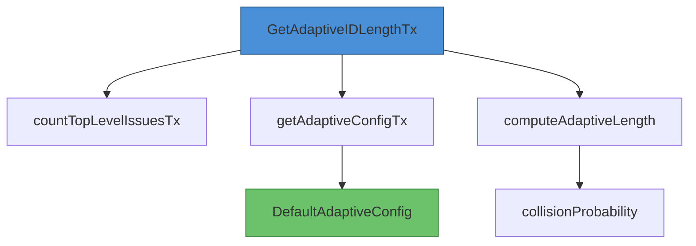

# Adaptive ID 模块深度解析

## 1. 模块概述

Adaptive ID 模块解决了一个经典的设计难题：如何在保持标识符简洁性的同时，避免哈希碰撞。对于问题跟踪系统来说，短小易读的 ID 是用户体验的关键，但随着数据量增长，短 ID 会带来碰撞风险。这个模块通过**自适应长度缩放**机制，根据当前数据库规模动态调整 ID 长度，在易用性和安全性之间找到了优雅的平衡点。

想象一下：当你只有几十个问题时，使用像 "abc-123" 这样的短 ID 既友好又高效；但当你有数十万个问题时，你需要更长的 ID 来防止碰撞。Adaptive ID 模块就是那个自动调整这个平衡点的"智能调节器"。

## 2. 核心设计思想

### 2.1 生日悖论与碰撞概率

模块的核心数学基础是**生日悖论**（Birthday Paradox）——这不是一个真正的悖论，而是一个反直觉的概率现象：在 23 个人中，至少有两人生日相同的概率就超过了 50%。对于哈希碰撞来说，这个原理同样适用：当样本数量达到可能值空间的平方根时，碰撞概率就会显著上升。

模块使用的碰撞概率近似公式为：

$$ P(\text{collision}) \approx 1 - e^{-n^2/2N} $$

其中：
- $n$ = 当前问题数量
- $N$ = 总可能值数量（对于 base36 编码的长度为 $L$ 的 ID，$N = 36^L$）

### 2.2 关键抽象

该模块的主要抽象是 `AdaptiveIDConfig` 结构体，它封装了三个关键参数：
- `MaxCollisionProbability`：可接受的最大碰撞概率阈值
- `MinLength`：最小 ID 长度（默认 3）
- `MaxLength`：最大 ID 长度（默认 8）

## 3. 架构与数据流

### 3.1 组件架构图



### 3.2 数据流详解

获取自适应 ID 长度的完整流程如下：

1. **入口函数** `GetAdaptiveIDLengthTx` 作为主要入口点，协调三个核心步骤：
   - 首先调用 `countTopLevelIssuesTx` 统计当前顶级问题数量
   - 然后调用 `getAdaptiveConfigTx` 从数据库读取配置（或使用默认值）
   - 最后调用 `computeAdaptiveLength` 计算最优长度

2. **问题计数** `countTopLevelIssuesTx` 只统计顶级问题（ID 中不包含点号的问题），因为子问题继承父问题的前缀，不会影响哈希碰撞概率。

3. **配置获取** `getAdaptiveConfigTx` 尝试从数据库的 `config` 表读取配置参数，如果读取失败或配置不存在，则使用 `DefaultAdaptiveConfig` 提供的默认值。

4. **长度计算** `computeAdaptiveLength` 从最小长度开始逐步尝试，返回第一个满足碰撞概率阈值的长度；如果即使最大长度也不满足阈值，则返回最大长度。

## 4. 核心组件深度解析

### 4.1 AdaptiveIDConfig 结构体

```go
type AdaptiveIDConfig struct {
    MaxCollisionProbability float64  // 碰撞概率阈值
    MinLength               int      // 最小 ID 长度
    MaxLength               int      // 最大 ID 长度
}
```

**设计意图**：这个结构体将配置参数封装在一起，提供了清晰的关注点分离。通过将配置与逻辑分离，系统可以在不修改核心算法的情况下调整行为。

### 4.2 DefaultAdaptiveConfig 函数

```go
func DefaultAdaptiveConfig() AdaptiveIDConfig {
    return AdaptiveIDConfig{
        MaxCollisionProbability: 0.25,  // 25% 阈值
        MinLength:               3,
        MaxLength:               8,
    }
}
```

**设计思考**：默认值的选择经过了精心考虑：
- **25% 的碰撞概率**：这是一个保守的阈值，意味着在实际应用中几乎不会发生碰撞（因为系统会在碰撞风险出现前就增加长度）
- **最小长度 3**：对于 base36 编码，3 个字符提供约 46,656 种可能，足够小型项目使用
- **最大长度 8**：8 个字符提供约 2.8 万亿种可能，足以支持超过 100 万个问题

注释中提供的容量参考表特别有价值，它清晰地展示了不同长度的 ID 在 25% 碰撞概率下可支持的问题数量。

### 4.3 collisionProbability 函数

```go
func collisionProbability(numIssues int, idLength int) float64 {
    const base = 36.0  // base36 编码
    totalPossibilities := math.Pow(base, float64(idLength))
    exponent := -float64(numIssues*numIssues) / (2.0 * totalPossibilities)
    return 1.0 - math.Exp(exponent)
}
```

**实现细节**：这个函数使用了生日悖论的近似公式，而不是精确计算。精确计算需要计算排列数，对于大数值来说既慢又容易溢出。近似公式在 $n$ 相对于 $N$ 较小时非常准确，而这正是我们关心的场景（因为一旦碰撞概率升高，我们就会增加 ID 长度）。

### 4.4 computeAdaptiveLength 函数

```go
func computeAdaptiveLength(numIssues int, config AdaptiveIDConfig) int {
    for length := config.MinLength; length <= config.MaxLength; length++ {
        prob := collisionProbability(numIssues, length)
        if prob <= config.MaxCollisionProbability {
            return length
        }
    }
    return config.MaxLength  // 即使不满足阈值也返回最大长度
}
```

**算法设计**：这个函数采用了最简单但最有效的策略——**贪心算法**。它从最小长度开始尝试，返回第一个满足条件的长度。这种设计确保了我们总是使用最短的可用 ID，符合用户体验优先的原则。

**边界处理**：值得注意的是，即使最大长度也不满足阈值，函数仍然返回最大长度。这是一个防御性设计决策——在极端情况下，系统应该继续工作而不是失败，即使这意味着碰撞概率可能超过阈值。

### 4.5 countTopLevelIssuesTx 函数

```go
func countTopLevelIssuesTx(ctx context.Context, tx *sql.Tx, prefix string) (int, error) {
    var count int
    err := tx.QueryRowContext(ctx, `
        SELECT COUNT(*)
        FROM issues
        WHERE id LIKE CONCAT(?, '-%')
          AND INSTR(SUBSTRING(id, LENGTH(?) + 2), '.') = 0
    `, prefix, prefix).Scan(&count)
    return count, err
}
```

**SQL 查询设计**：这个查询有几个值得注意的细节：
- 使用 `LIKE CONCAT(?, '-%')` 来匹配特定前缀的问题
- 使用 `INSTR(SUBSTRING(...), '.') = 0` 来排除子问题（ID 中包含点号的问题）
- 同时传入两次 `prefix` 参数，这是因为 SQL 查询中的两个占位符需要分别绑定

**为什么只统计顶级问题？** 因为子问题的 ID 通常是从父问题派生的（如 `abc-123.1`），它们不会占用新的哈希命名空间，因此不应该影响碰撞概率计算。

## 5. 依赖分析

### 5.1 被依赖关系

从模块树来看，`adaptive_id` 是 `Dolt Storage Backend` 的子模块，它主要被同一层级的其他组件使用，特别是：
- **事务管理**（transaction_management）：在创建新问题时需要获取适当的 ID 长度
- **Dolt 存储核心**（store）：可能在初始化或创建操作中使用

### 5.2 数据契约

该模块依赖以下隐式数据契约：

1. **数据库表结构**：
   - `issues` 表存在且有 `id` 列
   - `config` 表存在且有 `key` 和 `value` 列
   - ID 格式为 `{prefix}-{hash}[.{sub-issue}]`

2. **事务契约**：
   - 所有数据库操作都在传入的事务 `*sql.Tx` 中执行
   - 调用方负责事务的提交或回滚

3. **错误处理契约**：
   - `GetAdaptiveIDLengthTx` 在出错时返回默认长度 6 而不是失败
   - 这种设计确保了即使配置或计数出现问题，系统仍能继续工作

## 6. 设计决策与权衡

### 6.1 使用 base36 而非 hex 或 base64

**决策**：选择 base36 编码（0-9, a-z）作为 ID 的字符集。

**权衡分析**：
- **为什么不是 hex**：hex 只有 16 个字符，要达到相同的碰撞抗性需要更长的 ID
- **为什么不是 base64**：base64 包含特殊字符，不适合在 URL、文件名或人工输入中使用
- **base36 的优势**：在可读性和空间效率之间取得了很好的平衡，不区分大小写，适合人工输入和复制粘贴

### 6.2 25% 的碰撞概率阈值

**决策**：将默认碰撞概率阈值设置为 25%。

**权衡分析**：
- **保守的选择**：25% 的阈值意味着系统会在碰撞成为实际问题之前就增加 ID 长度
- **避免过度工程**：设置一个极低的阈值（如 1%）会导致 ID 长度过早增加，损害用户体验
- **经验法则**：这个选择反映了一个实用的工程原则——在理论风险和实际用户体验之间进行合理权衡

### 6.3 只统计顶级问题

**决策**：在计算碰撞概率时，只统计顶级问题，忽略子问题。

**权衡分析**：
- **正确性**：子问题不占用新的哈希命名空间，因此不应该影响碰撞概率
- **性能**：减少了需要计数的问题数量，提高了查询效率
- **耦合**：这种设计耦合了 ID 的格式（用点号表示子问题），如果 ID 格式改变，这个逻辑也需要相应调整

### 6.4 出错时返回默认值而非失败

**决策**：`GetAdaptiveIDLengthTx` 在出错时返回默认长度 6 而不是将错误传播给调用方。

**权衡分析**：
- **可用性优先**：确保系统在面对临时性错误时仍能继续工作
- **容错设计**：承认在分布式系统中错误是不可避免的，并为此做好准备
- **潜在风险**：掩盖了潜在的问题，调用方可能不知道发生了错误
- **缓解措施**：仍然返回错误值，让关心的调用方可以检查错误并采取相应措施

## 7. 使用指南与示例

### 7.1 基本使用

在创建新问题时获取适当的 ID 长度：

```go
// 在事务中获取自适应 ID 长度
length, err := GetAdaptiveIDLengthTx(ctx, tx, "abc")
if err != nil {
    // 处理错误（但即使出错，length 也会有一个合理的默认值）
    log.Printf("Warning: using default ID length: %v", err)
}

// 使用获取到的长度生成 ID
id := generateID(prefix, length)
```

### 7.2 自定义配置

可以通过数据库的 `config` 表来自定义配置：

```sql
-- 设置更保守的碰撞概率阈值
INSERT INTO config (`key`, value) VALUES ('max_collision_prob', '0.10');

-- 设置更大的最小长度
INSERT INTO config (`key`, value) VALUES ('min_hash_length', '4');

-- 设置更大的最大长度
INSERT INTO config (`key`, value) VALUES ('max_hash_length', '10');
```

### 7.3 直接使用计算函数

如果需要更精细的控制，可以直接使用底层的计算函数：

```go
config := AdaptiveIDConfig{
    MaxCollisionProbability: 0.15,  // 15% 阈值
    MinLength:               4,
    MaxLength:               10,
}

numIssues := 5000
optimalLength := computeAdaptiveLength(numIssues, config)
```

## 8. 边缘情况与注意事项

### 8.1 并发创建问题

**问题**：如果多个事务同时创建问题，它们可能会读取相同的问题计数，然后生成相同长度的 ID，导致实际碰撞概率高于预期。

**缓解措施**：
- 这是一个固有的并发问题，无法完全消除
- 保守的碰撞概率阈值（25%）提供了足够的缓冲
- 实际应用中，ID 生成通常还会结合其他唯一性机制

### 8.2 数据库快速增长

**问题**：如果数据库规模在短时间内快速增长，ID 长度可能无法及时跟上，导致碰撞风险增加。

**缓解措施**：
- 每次创建新问题时都会重新计算长度，所以系统会自动适应增长
- 保守的阈值设计确保了即使有一定延迟，碰撞风险仍然很低

### 8.3 配置参数的有效性

**问题**：数据库中存储的配置参数可能是无效的（如非数字字符串）。

**缓解措施**：
- `getAdaptiveConfigTx` 函数会解析配置，如果解析失败则使用默认值
- 这种设计确保了即使配置损坏，系统仍能继续工作

### 8.4 ID 格式变更

**问题**：如果 ID 格式发生变化（如不再使用点号表示子问题），`countTopLevelIssuesTx` 函数的逻辑将会出错。

**缓解措施**：
- 这个函数与 ID 格式紧密耦合，任何格式变更都需要相应修改此函数
- 建议在 ID 格式上保持向后兼容，或在变更时进行全面的测试

## 9. 总结

Adaptive ID 模块展示了一个优秀的工程解决方案应该具备的特质：它解决了一个实际问题，使用了恰当的数学模型，在多个相互冲突的目标之间找到了平衡，并且实现简洁优雅。

该模块的设计理念可以总结为：
1. **用户体验优先**：始终使用最短的可用 ID
2. **安全可靠**：通过保守的阈值确保碰撞风险可控
3. **自适应**：根据实际使用情况动态调整行为
4. **容错设计**：在面对错误时优雅降级，而不是完全失败

对于新加入团队的开发者来说，理解这个模块不仅要知道它做了什么，更要理解它为什么这样做——这些设计决策背后的思考才是最有价值的财富。
