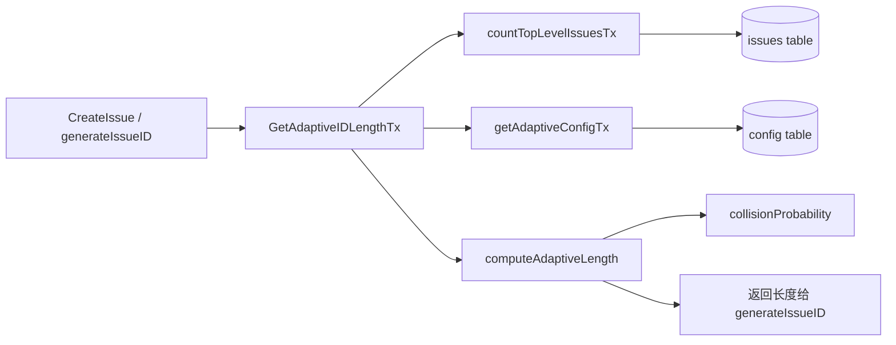

# adaptive_id_generation（`internal/storage/dolt/adaptive_length.go`）技术深潜

这个模块解决的是一个很“工程现实”的问题：Issue ID 既要短（人类可读、易复制），又要在数据规模增长时避免碰撞。固定长度方案在小库里太冗长，在大库里又不安全；固定阈值方案又难以适配不同团队规模。`adaptive_id_generation` 的设计意图就是把这个矛盾变成一个可计算的问题：根据当前库里 top-level issue 数量，动态选择 hash 长度，让碰撞概率控制在可配置阈值之下。

## 这个模块为什么存在

如果我们用朴素方案，比如“永远 6 位 hash”，它在多数情况下看起来可用，但本质是在用一个静态假设应对动态规模。库很小时，6 位是多余噪音；库持续增长时，固定长度最终会进入高碰撞区。这个模块的核心洞察是：ID 长度不应是常量，而应是一个由“当前样本规模 + 可接受风险”共同决定的函数。

换个类比：它像一个自动变速器。车速低（issue 少）时用低档（短 ID，提高可读性）；车速高（issue 多）时自动升档（加长 ID，降低碰撞风险）。你不需要每次手动调档，但它背后有明确的物理模型（这里是生日悖论近似）。

## 架构与数据流



这个模块在架构上的角色是一个**策略计算器（policy calculator）**，不直接生成 ID，而是给 ID 生成流程提供“当前应使用的长度”。

从已验证的调用关系看（`internal/storage/dolt/issues.go`）：`generateIssueID(...)` 会调用 `GetAdaptiveIDLengthTx(...)` 获取 `baseLength`，然后再在 `baseLength..8` 区间内尝试候选 ID 与 nonce。因此，`adaptive_id_generation` 处于“生成前决策”位置，而不是“冲突后补救”位置。

## 组件深潜

### `AdaptiveIDConfig`

`AdaptiveIDConfig` 是策略参数容器，包含三个字段：`MaxCollisionProbability`、`MinLength`、`MaxLength`。它表达的不是“怎么生成 hash”，而是“系统能接受多大风险，以及可用长度边界”。这使得数学模型与业务风险偏好解耦：算法可保持不变，风险口径可通过配置调整。

### `DefaultAdaptiveConfig() AdaptiveIDConfig`

该函数给出默认策略：`0.25` 碰撞概率阈值，长度范围 `3..8`。默认值明显偏向“短 ID 优先”，因为底层是 base36（信息密度高于 hex），在中小规模下可用更短字符串。

这里的设计不是追求“零碰撞”，而是追求“可控风险 + 可读性平衡”。这是现实系统常见取舍：把碰撞当成概率事件，通过后续冲突检测与 nonce 重试兜底，而不是一开始就把 ID 拉得很长。

### `collisionProbability(numIssues int, idLength int) float64`

这是模型核心，使用生日悖论近似：
`P(collision) ≈ 1 - e^(-n²/2N)`，其中 `N = 36^idLength`。

关键点在于它按 base36 计算命名空间大小，不是按字节长度硬编码。也就是说，长度变化对风险的影响是指数级的，这也是为何算法采用“从短到长逐级尝试”：通常只需增加 1 位就能显著降低概率。

### `computeAdaptiveLength(numIssues int, config AdaptiveIDConfig) int`

这个函数的策略非常直接：从 `MinLength` 递增到 `MaxLength`，找到第一个使碰撞概率 `<= MaxCollisionProbability` 的长度并返回。

它的“first-fit”逻辑体现了明确偏好：在满足风险约束前提下，尽量短。若整个区间都不满足，则返回 `MaxLength`。这是一种“有界最优”策略：保证结果总可用，不因极端规模或配置异常而失去返回值。

### `getAdaptiveConfigTx(ctx context.Context, tx *sql.Tx) AdaptiveIDConfig`

这个函数从 `config` 表读三项配置：`max_collision_prob`、`min_hash_length`、`max_hash_length`。读取失败或解析失败时静默保留默认值。

这是一个典型的“宽容读取”设计。优点是系统鲁棒，配置缺失或脏值不会中断创建流程；代价是错误可能被吞掉，调参失效时不容易第一时间被发现。这个 tradeoff 在 CLI/本地数据库场景里通常是合理的：可用性优先于严格配置校验。

### `countTopLevelIssuesTx(ctx context.Context, tx *sql.Tx, prefix string) (int, error)`

它只统计某个 `prefix` 下的 top-level issue，SQL 条件是：`id LIKE prefix-%` 且去掉前缀后不含 `.`。这意味着子任务（如 `bd-abc.1`）不参与规模估算。

这个选择背后有很强的语义假设：自适应长度应由“主 issue 空间”决定，而不是被层级子节点放大。否则某些 heavily-nested 项目会过早把长度推高，损失可读性。

### `GetAdaptiveIDLengthTx(ctx context.Context, tx *sql.Tx, prefix string) (int, error)`

这是唯一导出的决策函数，也是模块对外契约。执行流程是：
先计数，再读配置，再计算长度。

非显而易见但重要的行为：若计数失败，返回 `(6, err)`。也就是“带错误返回的功能降级”。调用方（`generateIssueID`）当前会在报错时再兜底到 `baseLength = 6`，形成双层 fallback，确保 ID 生成流程尽量不中断。

## 依赖关系与契约

该模块向下依赖很轻量：`context`、`database/sql`、`math`、`strconv`。它不依赖 `idgen`，也不直接写 `issues`，所以边界很清晰：**只做长度策略，不做 ID 生成与持久化**。

向上调用方在已检查代码中是 `generateIssueID`（位于 `internal/storage/dolt/issues.go`）。其契约可概括为：

- 输入：当前事务 `*sql.Tx` 与目标 `prefix`
- 输出：一个建议长度（始终给出）和可选错误
- 语义：错误不必然致命，调用方可降级处理

如果上游改变 `issues` 表 ID 规则（例如不再使用 `prefix-` 或层级 `.` 语法），`countTopLevelIssuesTx` 的统计语义会立刻失真；如果下游移除 `config` 表 key 或改名，`getAdaptiveConfigTx` 会悄然退回默认值。这些都是隐式耦合点。

## 设计取舍与非显然决策

这个模块整体选择了“**简单数学模型 + 宽容运行时行为**”。它没有引入实时冲突学习、滑动窗口、贝叶斯估计等复杂机制，而是用生日悖论近似快速决策。好处是可解释、可维护、计算成本极低；代价是模型只反映总体概率，不感知某些分布偏态。

另一个关键取舍是“**优先可用性而非严格配置治理**”：配置解析失败不报错、计数失败返回默认长度。这让创建流程韧性更高，但牺牲了配置错误的显式性。团队若要更强治理，通常应在外围加 `doctor`/lint，而不是把这个模块改成硬失败。

## 使用方式与示例

在当前代码里，典型用法是事务内调用：

```go
baseLength, err := GetAdaptiveIDLengthTx(ctx, tx, prefix)
if err != nil {
    baseLength = 6 // fallback
}

for length := baseLength; length <= 8; length++ {
    // 结合 generateHashID + 碰撞检查继续尝试
}
```

可配置项来自 `config` 表：

- `max_collision_prob`（float）
- `min_hash_length`（int）
- `max_hash_length`（int）

常见调参模式是：大型仓库降低 `max_collision_prob` 或提高最小长度；极度强调可读性的团队可在小规模仓库保持更激进的短 ID。

## 新贡献者需要特别注意的点

第一，`getAdaptiveConfigTx` 不校验 `MinLength <= MaxLength`、也不校验概率范围是否在 `[0,1]`。这意味着脏配置可能导致“看起来正常、实际退化”的行为（例如直接落到 `MaxLength` 路径）。如果你要增强健壮性，优先考虑在读取后增加轻量归一化。

第二，`countTopLevelIssuesTx` 依赖 ID 命名约定（`prefix-...` 与 `.` 子级语法）。任何 ID 语法演进都必须同步更新这个查询，否则自适应策略会基于错误基数计算。

第三，`numIssues*numIssues` 在极端大整数下理论上有溢出风险（`int` 乘法先发生，再转 `float64`）。当前业务规模通常远达不到该边界，但这是潜在技术债。

第四，`GetAdaptiveIDLengthTx` 的 fallback=6 与 `DefaultAdaptiveConfig`（最小 3、最大 8）是“跨函数约定”，不是单点配置。改动任何一处都要检查 `generateIssueID` 的重试窗口与上限是否仍一致。

## 相关模块参考

- [store_core](store_core.md)：`DoltStore` 事务与执行包装的整体上下文。
- [transaction_layer](transaction_layer.md)：事务边界与调用语义。
- [issue_domain_model](issue_domain_model.md)：Issue ID 与领域对象约束。
- [schema_migrations](schema_migrations.md)：`config` 表与相关 schema 演进来源。
