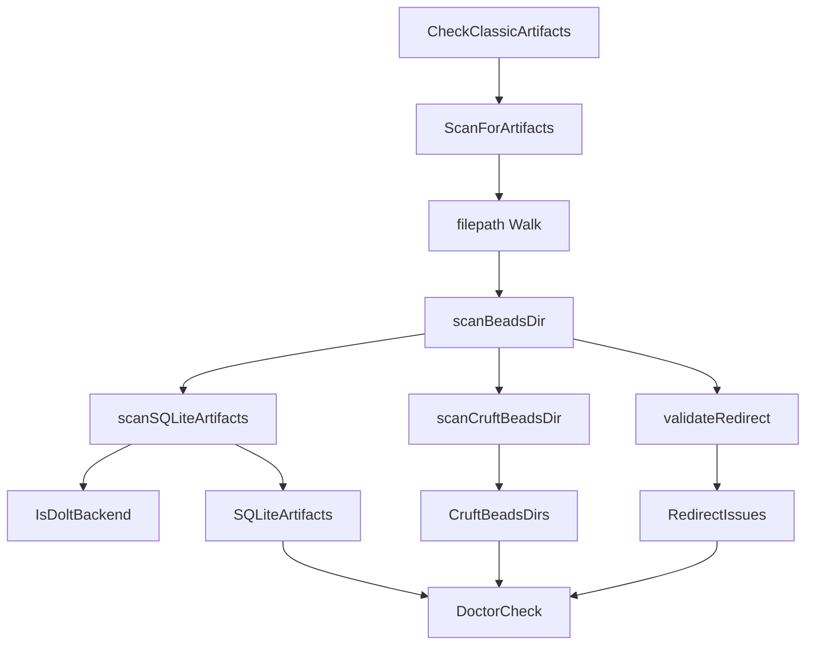

# artifact_scanning_and_classic_cleanup

`artifact_scanning_and_classic_cleanup` 模块是 `bd doctor` 的“迁移后卫生巡检员”。它不负责业务数据读写，而是专门在文件系统层面找出 **Dolt 迁移后遗留的经典（classic）痕迹**：比如残留的 `beads.db`、本该只保留 `redirect` 的 `.beads/` 目录里混入了杂物、或者 `redirect` 文件指向了不存在的路径。你可以把它想成机场安检里的“违禁品二次筛查”：平时系统能跑不代表环境干净，这个模块就是在运行前后给出一份可操作的“卫生报告”，避免后续命令在脏状态上叠加问题。

## 这个模块要解决什么问题（先讲问题空间）

在从 SQLite/classic 存储迁移到 Dolt 的过程中，真正麻烦的不是“迁移脚本能不能跑完”，而是 **迁移后长尾状态是否一致**。团队里常见的真实场景是：一个仓库里同时存在多个工作树、`polecats/crew/refinery` 这样的层级目录、历史遗留 `.beads` 目录、以及人工改过的 `redirect` 文件。朴素方案（例如只检查 `./.beads/beads.db` 是否存在）在这种结构下几乎一定漏检，因为问题分布在多个 `.beads` 位置，而且“是否是问题”取决于上下文：

- `beads.db` 在 SQLite backend 下是活数据，在 Dolt backend 下才是遗留物；
- 某些 `.beads/` 按设计就是 redirect-only，出现额外文件就属于“污染”；
- `redirect` 文件存在不代表合法，还可能空文件、注释无路径、目标不存在、目标不是目录。

所以这个模块的核心价值不是“扫描文件”，而是把 **路径模式 + backend 语义 + 安全删除判定** 合并成统一判断逻辑，最后产出能直接驱动 `doctor` 告警和后续 `--fix` 决策的数据结构。

## 心智模型：三段式巡检管线

理解这个模块最稳的方式是把它看成三段式流水线：

1. **发现候选点**：递归遍历目录，只锁定名为 `.beads` 的目录作为检查目标；
2. **对候选点做规则评估**：每个 `.beads` 目录依次跑 SQLite 遗留检查、redirect-only 污染检查、redirect 有效性检查；
3. **聚合成诊断语义**：把细粒度发现 (`ArtifactFinding`) 聚成 `ArtifactReport`，再包装为 `DoctorCheck` 输出给 doctor 主流程。

这像“城市环卫巡检”：先确定要巡的街区（`.beads`），再按垃圾类型分桶（sqlite / cruft-beads / redirect），最后把分桶统计转成管理平台可读告警（warning + detail + fix 文案）。

## 架构与数据流



`CheckClassicArtifacts(path)` 是 doctor 视角的入口：它调用 `ScanForArtifacts(path)`，拿到聚合报告后决定状态。如果 `TotalCount == 0`，输出 `StatusOK`；否则输出 `StatusWarning`，并把三类问题压缩成摘要 `Message` 与样例 `Detail`。这里有个明确的产品化取舍：详情最多展示每类前三条，其余用“... and N more”折叠，避免 doctor 输出失控。

`ScanForArtifacts(rootPath)` 是遍历与聚合层。它通过 `filepath.Walk` 全树扫描，但做了两个性能/噪声控制：跳过 `node_modules/vendor/__pycache__`，并且每当命中 `.beads` 目录后立刻 `SkipDir`，避免深入扫描其内部层级。这让复杂仓库下的扫描成本可控，同时保证关注点聚焦在 `.beads` 粒度。

命中 `.beads` 后，`scanBeadsDir` 扮演“单点规则编排器”，顺序执行三类检查。它先计算上下文条件：`isRedirectExpectedDir`（这个位置是否应是 redirect-only）和 `hasRedirectFile`（是否已有 redirect），再决定是否执行 `scanCruftBeadsDir` 与 `validateRedirect`。这体现了 **上下文驱动校验**，而不是“看到文件就报错”的静态规则。

## 组件深潜

### `ArtifactFinding`

`ArtifactFinding` 是最小诊断单元，字段包括 `Path`、`Type`、`Description`、`SafeDelete`。设计上它不是通用错误模型，而是“可修复运维问题”模型：除了描述问题，还显式编码“删除是否安全”。这使上层修复逻辑可以做保守自动化（例如只自动删 `SafeDelete=true` 的项），把不可逆操作和人工确认边界分开。

### `ArtifactReport`

`ArtifactReport` 不是一维列表，而是按语义分桶：`SQLiteArtifacts`、`CruftBeadsDirs`、`RedirectIssues`，并附加 `TotalCount` 与 `SafeDeleteCount`。这种结构的好处是 doctor 输出可以自然地按类别汇总，同时保留每类后续差异化处理空间（例如未来可能只自动清理 sqlite，不动 redirect）。代价是新增类别时需要改聚合和展示逻辑，扩展成本略高于纯列表。

### `CheckClassicArtifacts(path string)`

这是对 doctor 框架暴露的检查函数。其关键职责不是“发现问题”，而是把发现结果翻译成 doctor 协议对象（代码中返回 `DoctorCheck`，字段与 `doctorCheck` 结构一致）。

内部有两个值得注意的实现决定：

- **摘要消息按类别拼接**：`"X SQLite artifact(s), Y cruft .beads dir(s)..."`，给调用者快速定位问题类型分布；
- **详情限流**：每类最多三条示例，兼顾可读性与信息密度。

这说明它定位为“CLI 诊断输出适配层”，而不是完整报告导出层。

### `ScanForArtifacts(rootPath string)`

该函数负责“目录遍历 + 结果聚合”。它容错性较强：`filepath.Walk` 回调里遇到读取错误直接忽略继续（`return nil`），意味着模块偏向“尽量产出部分可用报告”而不是因局部权限问题整体失败。这是典型 doctor 工具思路：诊断优先可用性。

遍历阶段的关键规则：

- 只处理目录名严格等于 `.beads` 的节点；
- 遇到 `.git` 不强制跳过（注释说明需要保留进入 `.git/beads-worktrees` 的能力）；
- 明确跳过常见体积目录，避免扫描退化。

### `scanBeadsDir(beadsDir string, report *ArtifactReport)`

这是单目录的 orchestrator。它不直接做复杂判断，而是协调子检查函数，保持每类规则独立。这个“薄编排 + 厚规则函数”结构降低了认知耦合：你改 redirect 规则时基本不会碰 sqlite 逻辑。

### `isRedirectExpectedDir(beadsDir string)`

这是模块里最有“业务地形知识”的函数：通过父/祖父目录名匹配判断某个 `.beads` 是否应为 redirect-only。当前硬编码了以下模式：

- `*/polecats/*/.beads/`
- `*/crew/*/.beads/`
- `*/refinery/rig/.beads/`
- `.git/beads-worktrees/*/.beads/`
- rig-root 场景：同级存在 `mayor` 或 `polecats`，且 `mayor/rig/.beads` 存在

这类路径启发式非常实用，但也是潜在脆弱点：目录约定一旦演进，规则需要同步更新。

### `scanSQLiteArtifacts(beadsDir string, report *ArtifactReport)`

这段逻辑体现了“正确性优先于激进清理”：它先调用 `IsDoltBackend(beadsDir)`，只有 Dolt 激活时才把 SQLite 文件当遗留物。否则直接返回，避免误报活跃 SQLite 数据。

匹配目标包括：

- `beads.db` / `beads.db-shm` / `beads.db-wal`
- `beads.backup-*.db`

`SafeDelete` 判定相对保守：`-shm/-wal` 和备份默认安全，主库 `beads.db` 不标安全。

### `scanCruftBeadsDir(beadsDir, hasRedirect, report)`

用于检查“本应 redirect-only 的 `.beads` 目录里是否有杂物”。它允许 `redirect` 与 `.gitkeep`，其余都算额外文件。`SafeDelete` 只在已有 redirect 时为 true，这个设计很关键：没有 redirect 的情况下直接删目录可能导致定位丢失。

### `validateRedirect(beadsDir, report)`

`redirect` 校验流程是逐级收紧的：

1. 读文件失败 -> `redirect file unreadable`
2. 去空白并跳过注释行，取首个有效路径
3. 空路径 -> `redirect file is empty`
4. 相对路径按 `filepath.Dir(beadsDir)` 解析
5. `os.Stat` 验证目标存在且为目录

它接受“带注释的 redirect 文件”，体现了对人工维护场景的兼容性。与此同时，它只验证“可达且是目录”，并不验证“目标是否是合法 `.beads` 结构”，这是有意保持低耦合的边界。

## 依赖关系与契约分析

从代码可见，这个模块主要依赖 Go 标准库 (`os`, `filepath`, `strings`, `fmt`) 与 doctor 框架类型契约（返回 `DoctorCheck`，并使用 `StatusOK/StatusWarning/CategoryMaintenance`）。另外 `scanSQLiteArtifacts` 依赖外部函数 `IsDoltBackend(beadsDir)`，这是最关键的跨模块语义契约：**backend 判定必须准确且稳定**，否则会直接导致 sqlite 误报或漏报。

被调用方向上，结合模块树可知它属于 `CLI Doctor Commands` 的子模块，处于诊断管线中的一个 maintenance 类检查项。它的输出会被 doctor 聚合结果模型承接（参见 [doctor_contracts_and_taxonomy](doctor_contracts_and_taxonomy.md)）。换句话说，它在架构里是一个“专用检查插件”，而非底层可复用存储组件。

如果上游 doctor 输出协议改变（例如状态枚举、分类字段名、detail 展示策略），这里的适配逻辑会受影响；如果下游文件布局约定变化（比如 `polecats` 改名），`isRedirectExpectedDir` 会成为首要维护点。

## 关键设计取舍

这个模块明显选择了 **规则驱动、保守诊断** 的路线，而不是通用可配置引擎。

第一，简单性 vs 灵活性：当前路径规则硬编码在 `isRedirectExpectedDir`，实现简单、运行快、易读，但对目录约定变化敏感。若未来目录形态频繁演进，可能需要把规则外置配置化。

第二，性能 vs 覆盖度：扫描是递归全树，但通过跳过大目录和 `.beads` 命中后停止下钻来控制复杂度。这样牺牲了 `.beads` 内部更深层异常的发现能力，换取常规 doctor 运行速度。

第三，自治 vs 耦合：`scanSQLiteArtifacts` 把 backend 语义委托给 `IsDoltBackend`，减少本模块重复判断，但引入对外部实现正确性的强依赖。

第四，可操作性 vs 完整性：`CheckClassicArtifacts` 默认只展示样例而非全量，提升 CLI 可读性；但排障时用户仍可能需要二次命令获得完整细节。

## 使用方式与示例

在 doctor 流程中，这个模块通常通过检查函数接入：

```go
check := CheckClassicArtifacts(repoPath)
// check.Name / check.Status / check.Message / check.Detail
```

如果你在代码里需要结构化结果（例如做自定义修复策略），直接使用：

```go
report := ScanForArtifacts(repoPath)
fmt.Println(report.TotalCount, report.SafeDeleteCount)
for _, f := range report.SQLiteArtifacts {
    fmt.Println(f.Path, f.SafeDelete)
}
```

实践上建议把 `SafeDelete` 当作“自动修复白名单信号”，而不是唯一判断条件；涉及 `beads.db` 主库或 redirect 异常时，优先人工确认。

## 新贡献者最该注意的坑

最容易踩的坑是把“文件存在”直接等同“应删除”。这里很多判断是上下文相关的，尤其是 backend 与目录角色（canonical vs redirect-only）。修改规则时要先确认你是在改变“检测准确性”，还是在改变“安全边界”。

另一个隐性点是 `isDoltNative(beadsDir)` 当前在该文件中未被使用。如果你准备基于 `dolt/` 子目录做新规则，请先核实现有 backend 判定是否统一由 `IsDoltBackend` 管理，避免出现双标准。

此外，`filepath.Walk` 中的错误被静默跳过，这有利于诊断鲁棒性，但也可能掩盖权限问题导致的漏检。若你要做“严格模式”，需要显式引入错误收集与上报机制。

最后，`validateRedirect` 对相对路径的解析基于 `filepath.Dir(beadsDir)`。调整这一语义会影响历史 redirect 文件兼容性，属于高风险变更。

## 参考阅读

- [doctor_contracts_and_taxonomy](doctor_contracts_and_taxonomy.md)：了解 doctor 检查项的数据契约与分类语义。
- [CLI Doctor Commands](CLI Doctor Commands.md)：doctor 命令整体上下文与其他检查模块位置（若你本地文档文件名不同，请按实际命名打开）。
- [storage_contracts](storage_contracts.md)：理解存储层抽象，有助于把“文件遗留检查”和“存储语义”边界分清。
