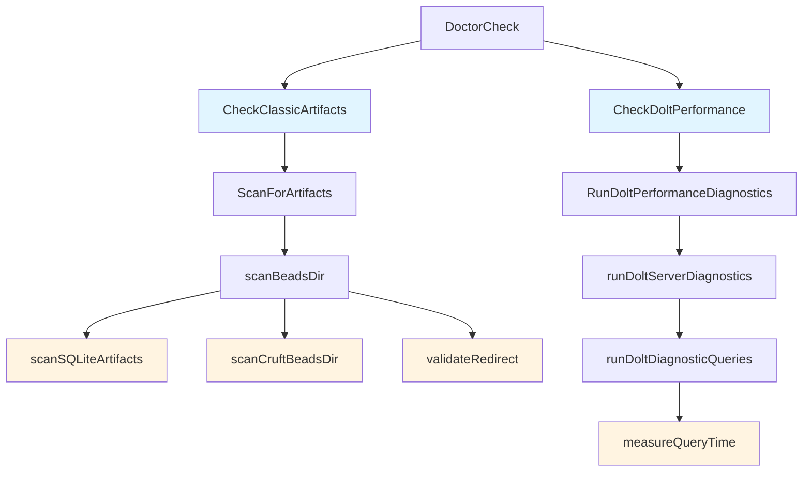

# 制品与性能诊断模块 (artifacts_and_performance)

## 概述

`artifacts_and_performance` 模块是 Beads 诊断系统的重要组成部分，专注于两个关键领域：**遗留制品清理**和**Dolt 数据库性能诊断**。这个模块是 `bd doctor` 命令的核心支撑，帮助团队保持仓库整洁、数据库运行高效。

想象一下，这个模块就像是仓库的"体检医生"——它会检查仓库中是否有迁移后遗留的"垃圾文件"，同时也会测量数据库的"健康指标"，确保系统运行在最佳状态。

## 架构设计



### 核心角色

1. **制品扫描器** (`ScanForArtifacts`)：负责遍历目录树，寻找迁移后遗留的文件
2. **性能诊断器** (`RunDoltPerformanceDiagnostics`)：执行一系列数据库查询，测量性能指标
3. **报告生成器**：将扫描结果和性能数据转换为用户可读的报告

## 核心组件深度解析

### ArtifactFinding 和 ArtifactReport

这两个结构体构成了制品扫描的核心数据模型。

```go
type ArtifactFinding struct {
    Path        string // 绝对路径
    Type        string // "jsonl", "sqlite", "cruft-beads", "redirect"
    Description string // 人类可读描述
    SafeDelete  bool   // 是否可以安全删除
}

type ArtifactReport struct {
    SQLiteArtifacts []ArtifactFinding
    CruftBeadsDirs  []ArtifactFinding
    RedirectIssues  []ArtifactFinding
    TotalCount      int
    SafeDeleteCount int
}
```

**设计意图**：
- `ArtifactFinding` 设计得足够通用，可以表示任何类型的遗留文件，同时通过 `Type` 字段区分不同类别
- `SafeDelete` 字段是一个关键的安全机制——它让系统知道哪些文件可以自动清理，哪些需要人工确认
- `ArtifactReport` 采用分类存储的方式，便于后续生成针对性的报告

### CheckClassicArtifacts

这是制品扫描的入口函数，它协调扫描过程并生成诊断检查结果。

**工作流程**：
1. 调用 `ScanForArtifacts` 进行实际扫描
2. 根据扫描结果构建 `DoctorCheck` 对象
3. 如果没有发现问题，返回 `StatusOK`
4. 如果发现问题，构建详细的摘要和示例，返回 `StatusWarning`

**设计亮点**：
- 函数将"扫描"和"报告生成"分离，这使得测试更简单，也便于未来扩展其他扫描类型
- 示例展示采用了"最多3个示例 + 剩余数量统计"的策略，既提供了足够的上下文，又避免了报告过长

### ScanForArtifacts

这是制品扫描的核心函数，它递归遍历目录树，寻找 `.beads` 目录并检查其中的内容。

**关键设计决策**：
- 跳过 `.git`、`node_modules`、`vendor`、`__pycache__` 等目录——这是性能优化，避免在大型项目中扫描无关目录
- 找到 `.beads` 目录后立即调用 `scanBeadsDir`，然后使用 `filepath.SkipDir` 避免进一步深入——这是基于 `.beads` 目录结构的知识做出的优化
- 错误处理采用"跳过无法读取的目录"策略——这确保了即使在部分目录不可读的情况下，扫描也能继续进行

### scanBeadsDir

这个函数检查单个 `.beads` 目录，执行三类检查：
1. SQLite 遗留文件
2. 应该只包含重定向文件的目录
3. 重定向文件的有效性

**设计意图**：
函数首先判断目录"应该是什么"（通过 `isRedirectExpected`），然后检查"实际是什么"，这种"期望 vs 实际"的模式使得逻辑清晰易懂。

### isRedirectExpectedDir

这个函数判断一个 `.beads` 目录是否应该只包含重定向文件。

**关键模式识别**：
函数通过路径模式识别多种场景：
- `*/polecats/*/.beads/` - polecat 工作树
- `*/crew/*/.beads/` - crew 工作空间
- `*/refinery/rig/.beads/` - refinery rig
- `.git/beads-worktrees/*/.beads/` - Git 工作树
- 有 `mayor/` 或 `polecats/` 兄弟目录的 rig-root 目录

**设计权衡**：
这里采用了基于路径模式的硬编码判断，而不是更灵活的配置方式。这种设计：
- ✅ 优点：性能好，不需要额外配置，逻辑集中
- ❌ 缺点：如果未来添加新的工作空间类型，需要修改代码

### scanSQLiteArtifacts

这个函数检查 SQLite 遗留文件。

**关键安全检查**：
函数首先调用 `IsDoltBackend` 确认后端确实是 Dolt——只有在 Dolt 是活动后端时，SQLite 文件才被视为遗留文件。这是一个重要的安全措施，避免误删正在使用的数据库。

**文件类型**：
- `beads.db` - 主数据库文件
- `beads.db-shm` 和 `beads.db-wal` - SQLite 的 WAL 模式文件
- `beads.backup-*.db` - 迁移前的备份文件

### scanCruftBeadsDir

这个函数检查应该只包含重定向文件的目录是否有额外文件。

**设计细节**：
- 允许 `.gitkeep` 文件存在——这是 Git 仓库的常见实践
- 只有在重定向文件存在时才标记为 `SafeDelete`——这确保了在清理前重定向已经生效

### validateRedirect

这个函数验证重定向文件是否有效。

**验证步骤**：
1. 读取文件内容
2. 跳过注释，找到第一个非空行
3. 解析相对路径
4. 检查目标是否存在且是目录

**设计亮点**：
函数支持注释，这使得重定向文件更易于人类理解和维护。

### DoltPerfMetrics

这个结构体存储 Dolt 性能诊断的所有指标。

```go
type DoltPerfMetrics struct {
    Backend      string
    ServerMode   bool
    ServerStatus string
    Platform     string
    GoVersion    string
    DoltVersion  string
    TotalIssues  int
    OpenIssues   int
    ClosedIssues int
    Dependencies int
    DatabaseSize string
    
    // 时间指标（毫秒）
    ConnectionTime   int64
    ReadyWorkTime    int64
    ListOpenTime     int64
    ShowIssueTime    int64
    ComplexQueryTime int64
    CommitLogTime    int64
    
    ProfilePath string
}
```

**设计意图**：
- 分为环境信息、数据库统计和操作性能三类指标
- 每个查询都有对应的时间指标，便于定位瓶颈
- 支持 CPU  profiling，便于深入分析性能问题

### RunDoltPerformanceDiagnostics

这是性能诊断的入口函数。

**工作流程**：
1. 验证是 Dolt 后端
2. 初始化指标对象
3. 检查服务器状态
4. 启动 profiling（如果请求）
5. 运行服务器诊断
6. 计算数据库大小

**设计亮点**：
函数使用 `defer stopCPUProfile()` 确保 profiling 总是被停止，这是 Go 中资源管理的常见模式。

### runDoltDiagnosticQueries

这个函数执行所有诊断查询并填充指标。

**查询类型**：
1. 统计查询（问题计数、依赖计数）
2. 版本查询（Dolt 版本）
3. 性能查询（准备工作、列出开放问题、显示单个问题、复杂查询、提交日志）

**设计细节**：
- 使用 `measureQueryTime` 统一测量查询时间
- 对于可选查询（如 `ShowIssueTime`），如果失败则设置为 -1 而不是返回错误
- 查询限制为 100 行，避免在大型数据库上运行时间过长

### measureQueryTime

这个函数测量查询执行时间。

**关键设计**：
- 函数不仅测量查询开始的时间，还遍历所有行——这确保了测量的是完整的执行时间，而不仅仅是发送查询的时间
- 使用 `defer rows.Close()` 确保资源总是被释放

### assessDoltPerformance

这个函数提供性能评估和建议。

**评估规则**：
- 如果准备工作查询超过 200ms，警告并建议检查索引
- 如果复杂查询超过 500ms，警告并建议审查查询模式和索引
- 如果有很多已关闭的问题，建议运行 `bd cleanup`

**设计意图**：
函数将"检测"和"建议"结合起来，不仅告诉用户"有问题"，还告诉用户"如何解决"。

## 依赖关系

### 输入依赖

- `internal/configfile` - 用于读取 Dolt 数据库配置
- `internal/doltserver` - 用于获取服务器默认配置
- `github.com/go-sql-driver/mysql` - MySQL 驱动，用于连接 Dolt 服务器

### 输出依赖

- `DoctorCheck` - 诊断检查结果，被 doctor 模块的主函数使用

## 设计决策与权衡

### 1. 硬编码路径模式 vs 配置

**决策**：使用硬编码的路径模式来识别重定向目录。

**权衡**：
- ✅ 优点：性能好，不需要额外配置，逻辑集中
- ❌ 缺点：不够灵活，如果未来添加新的工作空间类型，需要修改代码

**原因**：在这个场景下，工作空间类型相对稳定，性能和简单性比灵活性更重要。

### 2. 分类存储 vs 统一列表

**决策**：`ArtifactReport` 使用分类存储（`SQLiteArtifacts`、`CruftBeadsDirs`、`RedirectIssues`）而不是统一的列表。

**权衡**：
- ✅ 优点：便于生成分类报告，逻辑清晰
- ❌ 缺点：添加新类型时需要修改结构体

**原因**：制品类型相对稳定，分类的好处超过了灵活性的损失。

### 3. 跳过错误 vs 失败

**决策**：在扫描过程中，如果遇到无法读取的目录，跳过而不是失败。

**权衡**：
- ✅ 优点：扫描可以继续，即使部分目录不可读
- ❌ 缺点：可能遗漏一些问题

**原因**：对于诊断工具来说，"尽可能多地发现问题"比"要么全部发现要么什么都不发现"更重要。

### 4. 查询限制 vs 完整测量

**决策**：性能查询使用 `LIMIT 100` 而不是查询所有数据。

**权衡**：
- ✅ 优点：查询时间可控，不会在大型数据库上运行过长
- ❌ 缺点：可能不能完全反映真实场景的性能

**原因**：对于诊断来说，相对性能指标比绝对性能指标更重要，而且我们希望诊断命令能够快速完成。

## 使用指南

### 基本使用

制品扫描和性能诊断通常通过 `bd doctor` 命令使用：

```bash
# 运行所有检查，包括制品和性能
bd doctor

# 只检查制品
bd doctor --check=artifacts

# 详细的性能诊断
bd doctor perf-dolt

# 带 profiling 的性能诊断
bd doctor perf-dolt --profile
```

### 编程使用

如果你想在代码中使用这个模块：

```go
// 制品扫描
report := doctor.ScanForArtifacts("/path/to/repo")
fmt.Printf("Found %d artifacts\n", report.TotalCount)

// 性能诊断
metrics, err := doctor.RunDoltPerformanceDiagnostics("/path/to/repo", false)
if err != nil {
    log.Fatal(err)
}
doctor.PrintDoltPerfReport(metrics)
```

## 注意事项与陷阱

### 1. 制品删除的安全性

虽然 `ArtifactFinding` 有 `SafeDelete` 字段，但在自动删除前，总是应该先查看一下报告。特别是在自定义的 `.beads` 目录中，可能有你不想删除的文件。

### 2. 性能查询的局限性

性能查询使用 `LIMIT 100`，这意味着它们可能不能完全反映真实场景的性能。如果你有特定的性能问题，可能需要直接在数据库上运行更真实的查询。

### 3. 服务器必须运行

性能诊断需要 Dolt 服务器正在运行。如果服务器没有运行，你会得到一个错误。

### 4. 路径模式的限制

`isRedirectExpectedDir` 使用硬编码的路径模式，如果你的工作空间不在这些模式中，可能会被误报。如果你有自定义的工作空间布局，可能需要修改这个函数。

## 相关模块

- [Doctor](doctor.md) - 诊断系统的主模块
- [Dolt Storage](dolt_storage.md) - Dolt 存储后端
- [Beads Context](beads_repository_context.md) - 仓库上下文管理
