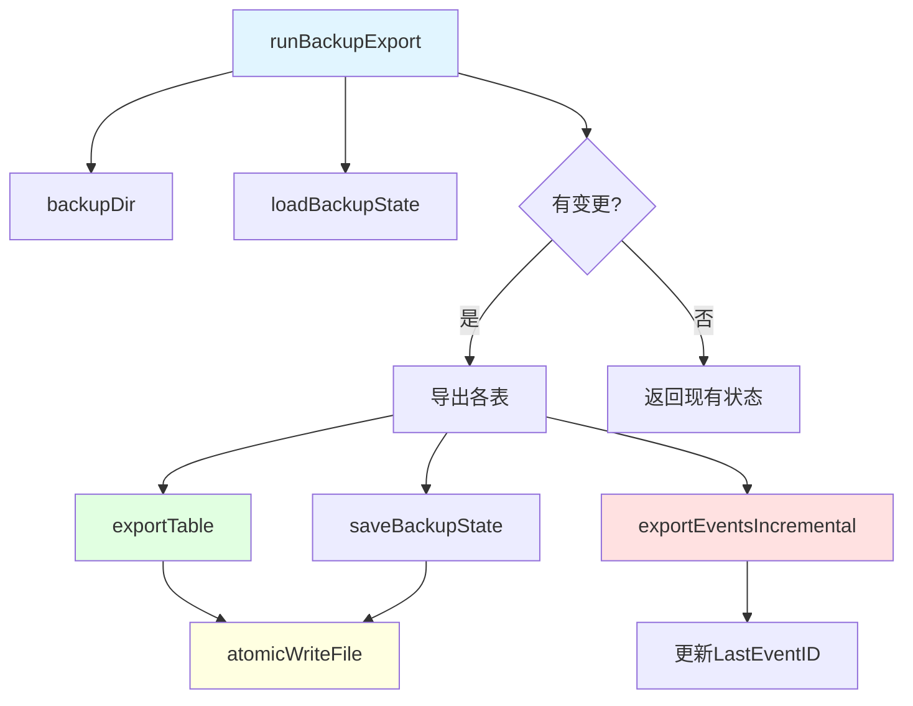

# backup_export 模块技术深度解析

## 1. 问题空间

在问题跟踪和项目管理系统中，数据备份是至关重要的。随着项目的发展，我们需要：

1. **数据安全性**：确保重要的问题、事件、评论和依赖关系不会丢失
2. **增量备份**：避免每次都完整导出所有数据，提高效率
3. **可移植性**：将数据导出为标准格式（如 JSONL），便于迁移和分析
4. **版本感知**：结合 Dolt 的版本控制特性，只在数据变更时进行备份

简单的完整导出方案虽然容易实现，但存在明显缺点：
- 每次备份都需要大量时间和存储空间
- 对于大型项目来说效率极低
- 没有利用版本控制信息来优化备份过程

`backup_export` 模块通过智能增量备份策略解决了这些问题。

## 2. 核心概念与心智模型

### 2.1 核心数据结构

**`backupState`** 是模块的核心，它记录了备份的关键元数据：

```go
type backupState struct {
    LastDoltCommit string    // 上次备份时的 Dolt 提交哈希
    LastEventID    int64     // 上次备份的最后一个事件 ID（高水位标记）
    Timestamp      time.Time // 备份时间戳
    Counts         struct {  // 各类数据的计数
        Issues       int
        Events       int
        Comments     int
        Dependencies int
        Labels       int
        Config       int
    }
}
```

### 2.2 心智模型

可以将 `backupExport` 想象成一个**智能的数据采集员**：

1. **水位标记**：它会记住上次采集到哪里（`LastEventID`）
2. **变更检测**：通过检查 Dolt 提交哈希来判断是否有新数据
3. **选择性采集**：对于事件表，只采集上次之后的新数据
4. **完整快照**：对于其他表，每次都采集完整快照（因为这些表的变更相对较小）
5. **原子写入**：使用临时文件和重命名机制确保备份过程的崩溃安全性

### 2.3 备份策略

- **事件表**：增量追加
- **其他表**：完整快照
- **Wisp 支持**：自动检测并合并 wisps 表的数据

## 3. 架构与数据流程



### 3.1 主要流程说明

1. **备份目录准备** (`backupDir`)：
   - 优先使用配置的 git 仓库中的 backup 目录
   - 回退到 `.beads/backup/` 目录

2. **状态加载** (`loadBackupState`)：
   - 读取 `backup_state.json` 文件
   - 如果文件不存在，返回零值状态

3. **变更检测**：
   - 获取当前 Dolt 提交哈希
   - 与上次备份的提交哈希比较
   - 相同且非强制时跳过备份

4. **数据导出**：
   - 问题表：使用 `SELECT *` 获取所有字段，支持与 wisps 表合并
   - 事件表：增量导出，使用高水位标记
   - 其他表：完整快照导出

5. **状态保存** (`saveBackupState`)：
   - 更新提交哈希和时间戳
   - 原子写入状态文件

## 4. 组件深度解析

### 4.1 backupState 结构体

**用途**：跟踪备份进度和统计信息

**设计要点**：
- 使用 Dolt 提交哈希作为整体变更检测
- 使用事件 ID 作为增量备份的高水位标记
- 记录各类数据的计数，便于验证备份完整性

### 4.2 backupDir 函数

**用途**：确定并创建备份目录

**设计决策**：
- 支持配置 git 仓库作为备份目标
- 自动处理 `~` 开头的用户目录路径
- 验证 git 仓库的有效性（检查 `.git` 目录）
- 优雅降级：如果配置的 git 仓库无效，回退到默认目录

### 4.3 loadBackupState / saveBackupState

**用途**：持久化备份状态

**设计亮点**：
- 使用 JSON 格式，便于人类阅读和调试
- `saveBackupState` 使用原子写入，确保状态文件的完整性
- 错误处理友好，提供清晰的错误信息

### 4.4 runBackupExport 函数

**用途**： orchestrate 整个备份过程

**关键设计决策**：
1. **变更检测优先**：先检查是否有新提交，避免不必要的工作
2. **表存在性检查**：动态检测 wisps 表，提供向后兼容性
3. **使用 SELECT \***：捕获所有列，适应不断演化的 schema
4. **增量事件导出**：单独处理事件表，使用高水位标记优化

### 4.5 exportTable 函数

**用途**：通用的表导出函数

**技术亮点**：
- 动态列扫描：不依赖硬编码的列名
- 自动类型规范化：处理数据库特定类型到 JSON 友好类型的转换
- 内存缓冲：先在内存中构建所有行，然后原子写入
- 返回导出行数，便于统计

### 4.6 exportEventsIncremental 函数

**用途**：增量导出事件数据

**设计策略**：
- 首次导出（LastEventID=0）：完整快照
- 后续导出：只追加新事件
- 使用 UNION ALL 合并常规事件和 wisp 事件
- 跟踪最大 ID 更新高水位标记

**注意**：增量追加不使用原子写入，因为追加操作本身是相对安全的。

### 4.7 atomicWriteFile 函数

**用途**：崩溃安全的文件写入

**实现机制**：
1. 创建临时文件
2. 写入数据并同步到磁盘
3. 关闭文件
4. 重命名到目标位置

**为什么这样做**：
- 避免写入过程中崩溃导致文件损坏
- 重命名操作在大多数文件系统上是原子的
- 确保要么完整写入新文件，要么保留旧文件

### 4.8 normalizeValue 函数

**用途**：将数据库类型转换为 JSON 友好类型

**处理的特殊情况**：
- `[]byte` → `string`
- 零值 `time.Time` → `nil`
- 非零值 `time.Time` → RFC3339 格式字符串

## 5. 依赖分析

### 5.1 依赖的模块

- **[Configuration](configuration.md)**：读取备份配置，特别是 `backup.git-repo` 选项
- **internal/debug**：调试日志输出
- **store**（隐式）：访问 Dolt 数据库和获取当前提交，与 [Dolt Storage Backend](dolt_storage_backend.md) 紧密集成

### 5.2 被依赖情况

这个模块主要被 CLI 命令层调用，作为 `bd backup export` 命令的实现。

### 5.3 数据契约

- **输入**：Dolt 数据库连接，配置选项
- **输出**：JSONL 格式的表数据文件，`backup_state.json` 状态文件
- **假设**：数据库表结构符合预期，store 提供有效的 Dolt 提交哈希

## 6. 设计决策与权衡

### 6.1 增量 vs 完整备份

**决策**：事件表增量，其他表完整

**理由**：
- 事件表是最大且增长最快的表
- 其他表相对较小，完整备份的开销可接受
- 简化了恢复逻辑（不需要合并多个增量文件）

**权衡**：
- ✅ 事件备份效率高
- ❌ 其他表每次都要完整重写

### 6.2 SELECT * vs 明确列名

**决策**：使用 SELECT *

**理由**：
- Schema 有 50+ 个字段且不断增长
- 避免每次 schema 变更都要更新备份代码
- 动态列扫描器可以自动处理

**权衡**：
- ✅ 适应 schema 演化
- ❌ 可能导出不需要的列
- ❌ 依赖列顺序的处理会有风险（但这里不依赖）

### 6.3 原子写入 vs 直接写入

**决策**：大多数文件使用原子写入，事件增量使用追加

**理由**：
- 状态文件和完整快照文件的完整性至关重要
- 事件追加操作相对安全，且原子写入对大文件不现实

**权衡**：
- ✅ 关键文件的崩溃安全性
- ❌ 事件文件在追加过程中崩溃可能导致部分写入

### 6.4 内存缓冲 vs 流式写入

**决策**：exportTable 使用内存缓冲

**理由**：
- 简化原子写入实现
- 对于除事件外的表，数据量通常可接受

**权衡**：
- ✅ 实现简单
- ❌ 对于非常大的表可能内存不足
- （注意：事件表的增量导出是流式的，避免了这个问题）

## 7. 使用与扩展

### 7.1 基本使用

```go
// 执行备份
state, err := runBackupExport(ctx, false) // 非强制

// 强制备份（即使没有变更）
state, err := runBackupExport(ctx, true)
```

### 7.2 配置选项

- `backup.git-repo`：配置 git 仓库作为备份目标

### 7.3 扩展点

如果需要添加新的表到备份中，只需在 `runBackupExport` 中添加类似的导出调用：

```go
n, err = exportTable(ctx, db, dir, "new_table.jsonl",
    "SELECT * FROM new_table ORDER BY id")
if err != nil {
    return nil, fmt.Errorf("backup new_table: %w", err)
}
state.Counts.NewTable = n
```

## 8. 边缘情况与陷阱

### 8.1 Wisps 表检测

- 模块会自动检测 `wisps` 表是否存在
- 如果存在，会与主表合并导出
- 注意：使用 `UNION ALL` 时要确保两个表的 schema 兼容

### 8.2 事件高水位标记

- 初始状态 `LastEventID=0` 会触发完整事件导出
- 如果事件文件损坏，可能需要手动删除文件并重置状态
- 合并 wisp 事件时，两个表都使用相同的高水位标记

### 8.3 原子写入的临时文件

- 临时文件命名为 `.backup-tmp-*`
- 如果在写入过程中崩溃，可能会留下临时文件
- 建议定期清理备份目录中的临时文件

### 8.4 时间处理

- 零值时间会被序列化为 `null`
- 非零值时间使用 RFC3339 格式
- 备份状态的时间戳使用 UTC

## 9. 相关模块

- **[backup_restore](backup_restore.md)**：备份恢复模块，与本模块配合使用
- **[Dolt Storage Backend](dolt_storage_backend.md)**：提供数据存储和版本控制功能
- **[Configuration](configuration.md)**：配置管理，包括备份相关配置
- **[import_shared](import_shared.md)**：提供通用的导入基础设施

## 10. 总结

`backup_export` 模块是一个精心设计的备份解决方案，它：

1. **智能高效**：结合 Dolt 的版本控制和增量备份策略
2. **安全可靠**：使用原子写入确保关键文件的完整性
3. **适应演化**：使用动态列扫描适应不断变化的 schema
4. **向后兼容**：优雅处理 wisps 表的存在性

它的设计体现了"简单事情简单做，复杂事情高效做"的原则，为项目的数据安全提供了坚实的保障。
