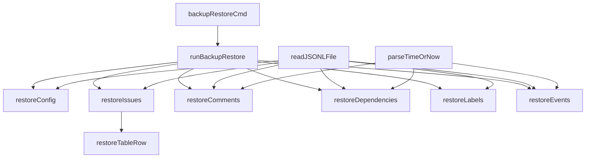

# backup_restore 模块技术深度解析

## 1. 问题与目标

在软件开发过程中，数据库备份和恢复是数据保护和灾难恢复的关键环节。`backup_restore` 模块专门设计用于从 JSONL (JSON Lines) 格式的备份文件中恢复 beads 项目的 Dolt 数据库。该模块解决了以下核心问题：

- **数据丢失恢复**：当 Dolt 数据库因机器崩溃、误操作或新克隆而丢失时，可以从 JSONL 备份中恢复完整数据
- **增量备份恢复**：恢复备份状态的水印信息，确保增量备份能够正确继续
- **数据完整性**：按正确顺序恢复配置、问题、评论、依赖关系、标签和事件等所有关键数据
- **安全性**：提供干运行选项，允许在实际修改数据库前预览恢复操作

## 2. 核心架构与组件

### 2.1 主要组件



#### 核心组件说明

1. **backupRestoreCmd**：Cobra 命令定义，处理命令行参数和用户交互
2. **runBackupRestore**：恢复流程的主协调器，按正确顺序调用各个恢复函数
3. **restoreConfig**：恢复配置数据（如 issue_prefix 等）
4. **restoreIssues**：恢复问题数据，自动检测并设置 issue_prefix
5. **restoreComments**：恢复评论数据
6. **restoreDependencies**：恢复依赖关系数据
7. **restoreLabels**：恢复标签数据
8. **restoreEvents**：恢复事件数据
9. **restoreTableRow**：通用的表行恢复函数
10. **readJSONLFile**：读取 JSONL 格式的备份文件
11. **parseTimeOrNow**：安全解析时间字符串，失败时返回当前时间

## 3. 数据流程与处理逻辑

### 3.1 恢复流程

数据恢复流程遵循严格的顺序，确保数据完整性和引用关系的正确性：

1. **配置恢复**：首先恢复配置数据，因为它设置了 issue_prefix 等关键参数
2. **问题恢复**：接着恢复问题数据，其他数据（评论、依赖、标签、事件）都引用问题 ID
3. **评论恢复**：恢复问题的评论数据
4. **依赖关系恢复**：恢复问题之间的依赖关系
5. **标签恢复**：恢复问题的标签数据
6. **事件恢复**：最后恢复事件数据

### 3.2 关键处理机制

#### 3.2.1 顺序恢复的重要性

恢复顺序的设计是为了确保数据引用的完整性。例如，评论表中的 `issue_id` 必须引用问题表中已存在的记录。如果先恢复评论再恢复问题，就会导致引用错误。

#### 3.2.2 使用原始 SQL 而非高级 API

模块在恢复大多数数据时使用原始 SQL 而不是高级 API，这是一个关键的设计决策：
- 避免高级 API 的副作用（如验证、事件创建等）
- 精确匹配备份导出格式，避免类型不匹配
- 提高恢复性能，绕过不必要的业务逻辑检查

#### 3.2.3 自动检测和设置 issue_prefix

在恢复问题数据时，模块会自动从第一个问题的 ID 中提取前缀，并设置为配置项，确保后续操作能正确工作。

## 4. 核心组件深度解析

### 4.1 restoreResult 结构体

```go
type restoreResult struct {
    Issues       int `json:"issues"`
    Comments     int `json:"comments"`
    Dependencies int `json:"dependencies"`
    Labels       int `json:"labels"`
    Events       int `json:"events"`
    Config       int `json:"config"`
    Warnings     int `json:"warnings"`
}
```

这个结构体用于跟踪恢复操作的结果，统计每种数据类型的恢复数量和警告数量。它提供了清晰的恢复操作反馈，帮助用户了解恢复过程的详细情况。

### 4.2 runBackupRestore 函数

这是恢复流程的主协调器，负责按正确顺序调用各个恢复函数。它的设计体现了关注点分离原则，每个恢复函数负责一种数据类型，而主函数负责协调和事务管理。

### 4.3 restoreTableRow 函数

这是一个通用的表行恢复函数，它动态构建 SQL 插入语句，使用 `INSERT IGNORE` 来处理重复记录。这种设计使得恢复过程更加健壮，能够处理部分恢复的情况。

### 4.4 readJSONLFile 函数

这个函数读取 JSONL 格式的文件，并将每行作为原始 JSON 返回。它处理了大文件的情况，使用了适当的缓冲区大小，并确保每个行数据都被正确复制，避免了缓冲区重用的问题。

## 5. 设计决策与权衡

### 5.1 使用原始 SQL 而非高级 API

**决策**：在恢复大多数数据时使用原始 SQL 而不是高级 API
**原因**：
- 避免高级 API 的副作用（如验证、事件创建等）
- 精确匹配备份导出格式，避免类型不匹配
- 提高恢复性能，绕过不必要的业务逻辑检查
**权衡**：
- 优点：恢复过程更直接、更快速、更可靠
- 缺点：绕过了一些业务逻辑验证，可能需要在恢复后进行额外的验证

### 5.2 严格的恢复顺序

**决策**：按照配置、问题、评论、依赖、标签、事件的顺序恢复数据
**原因**：确保数据引用的完整性，避免引用不存在的记录
**权衡**：
- 优点：保证了数据的完整性和一致性
- 缺点：降低了恢复过程的并行性，可能影响恢复速度

### 5.3 使用 INSERT IGNORE

**决策**：在 SQL 插入语句中使用 INSERT IGNORE
**原因**：处理重复记录，使恢复过程更加健壮
**权衡**：
- 优点：可以处理部分恢复的情况，不会因为重复记录而失败
- 缺点：可能会掩盖一些真正的错误，需要仔细检查警告信息

## 6. 使用指南与最佳实践

### 6.1 基本使用

```bash
# 使用默认备份目录恢复
bd backup restore

# 使用指定备份目录恢复
bd backup restore /path/to/backup/directory

# 干运行，预览恢复操作
bd backup restore --dry-run
```

### 6.2 最佳实践

1. **先初始化数据库**：确保数据库已经初始化（使用 `bd init`）
2. **先进行干运行**：在实际恢复前，使用 `--dry-run` 选项预览恢复操作
3. **检查警告信息**：恢复完成后，仔细检查警告信息，确保没有重要数据丢失
4. **验证恢复结果**：恢复完成后，使用 `bd doctor` 等命令验证数据库的完整性

### 6.3 常见问题与解决方案

1. **备份目录不存在**：确保先运行 `bd backup` 创建备份
2. **issues.jsonl 不存在**：确保备份目录包含有效的 issues.jsonl 文件
3. **恢复后数据不完整**：检查警告信息，可能是备份文件本身有问题
4. **issue_prefix 不正确**：模块会自动检测并设置，但如果有问题，可以手动调整

## 7. 相关模块

- **[backup_export](backup_export.md)**：备份导出模块，与本模块配合使用
- **[import_shared](import_shared.md)**：提供通用的导入基础设施
- **[Dolt Storage Backend](dolt_storage_backend.md)**：提供数据存储和版本控制功能
- **[Configuration](configuration.md)**：配置管理，包括备份相关配置

## 8. 总结

`backup_restore` 模块是 beads 项目数据保护和灾难恢复的关键组件。它通过严格的恢复顺序、使用原始 SQL、处理重复记录等设计，确保了数据恢复的完整性和可靠性。同时，它提供了干运行选项和详细的恢复结果反馈，使得恢复过程更加安全和透明。

对于新加入团队的开发者，理解这个模块的设计思路和实现细节，将有助于更好地维护和扩展 beads 项目的数据管理功能。
