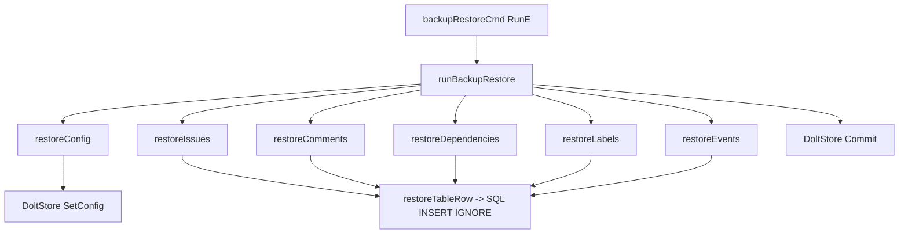

# backup_restore_pipeline 深度解析

`backup_restore_pipeline`（对应 `bd backup restore`）的存在，是为了解决一个很现实的问题：**当本地 Dolt 数据库丢失、损坏或在新环境中尚未包含历史状态时，如何用离线 JSONL 备份把“可工作的 issue 世界”快速、可重复地重建出来**。如果只用业务层 API 一条条“重新创建”数据，恢复过程会触发大量副作用（校验、事件生成、依赖检查等），结果往往不是“原样恢复”，而是“二次演绎”。这个模块的核心设计洞察是：**恢复不是业务写入，而是状态回放（state replay）**，因此它大量采用原始 SQL + 宽容导入策略，优先保证可恢复性和幂等性。

## 架构角色与心智模型

把这个模块想象成“灾备场景下的行李回传流水线”：传送带上有多类物品（config、issues、comments、dependencies、labels、events），每类物品必须按顺序入库；安检规则不是“完美拦截”，而是“尽量放行、记录告警、不中断主流程”。

从架构角色看，它是一个**CLI 层恢复编排器（orchestrator）**，并不负责复杂领域决策。它做三件事：

1. 校验输入备份目录是否可用（至少有 `issues.jsonl`）。
2. 以固定顺序调用各 `restore*` 子流程完成表级恢复。
3. 在非 `dry-run` 情况下执行一次 Dolt 提交，形成恢复后的版本快照。



这个图里最关键的是 `runBackupRestore`：它像调度中枢，管理顺序、容错和最终提交；`restore*` 函数是“表级回放器”；`restoreTableRow` 和各函数里的 `INSERT IGNORE` 体现了“尽力恢复，不因单条坏数据全盘失败”的策略。

## 端到端数据流：从命令到可提交状态

用户执行 `bd backup restore [path]` 后，`backupRestoreCmd` 的 `RunE` 先解析目录参数；如果未传路径，就通过 `backupDir()` 取默认目录。随后做两层前置检查：目录存在、且至少存在 `issues.jsonl`。这个最小约束背后的含义是：没有 issue 主表就无法构建有意义的恢复基线。

然后它读取 `--dry-run`，调用 `runBackupRestore(ctx, store, dir, dryRun)`。该函数内部先拿 `db := s.DB()`，随后严格按以下顺序恢复：

先恢复 `config.jsonl`（如果存在），因为配置里可能包含 `issue_prefix` 等影响后续解析的设置；接着强制恢复 `issues.jsonl`，这是其它关系表引用的主实体；之后按 comments、dependencies、labels、events 的顺序补全关系与历史。每个可选文件都先 `os.Stat` 判存在，不存在就跳过，不视为错误。

恢复结束后，如果不是 dry-run，会调用 `s.Commit(ctx, "bd backup restore")`。这里对“nothing to commit”做了特判并忽略，目的是让幂等重复执行恢复时仍然是成功路径，而不是制造伪失败。

最终 `RunE` 将 `restoreResult` 输出为 JSON（`jsonOutput` 模式）或可读文本摘要，包含每张表恢复计数与告警总数。

## 核心组件深潜

### `restoreResult`

`restoreResult` 是恢复执行报告的最小契约，字段覆盖 `Issues/Comments/Dependencies/Labels/Events/Config/Warnings`。它的设计很朴素，但意图明确：**把“恢复是否成功”从布尔值提升为可观测的分层结果**。对于运维和 CI 来说，warning 数量与各表计数比单纯成功/失败更有诊断价值。

### `runBackupRestore(ctx, s, dir, dryRun)`

这是编排核心。它把恢复拆成若干“可独立失败归因”的阶段，错误信息统一包装为 `restore <table>: ...` 风格，方便快速定位。一个重要设计点是“顺序先后有语义”：

- `config` 先于 `issues`，确保前缀等配置尽量在主数据导入前到位；
- `issues` 先于关系表，降低外键/引用失败概率；
- 末尾统一 commit，避免每表都提交导致版本历史噪声。

它选择的是**单次流水线式执行**而非事务包裹全部步骤。好处是兼容“部分文件缺失、部分行损坏”的现实备份；代价是中途失败时可能留下部分已导入数据，需要重跑（通常可重跑，因为大量使用 `INSERT IGNORE`）。

### `restoreConfig(ctx, s, path, dryRun)`

该函数逐行解析 `config.jsonl` 的 `{key, value}`。策略是“坏行告警并跳过”，不是中断。写入通过 `s.SetConfig` 完成。这里体现一个权衡：**配置恢复容错 > 配置严格一致性**。即使少量配置恢复失败，主体 issue 数据仍可继续导入。

### `restoreIssues(ctx, s, path, dryRun)`

这是最关键的数据入口。它先读取 JSONL，dry-run 直接返回行数。非 dry-run 下会尝试从首行 `id` 自动提取 prefix：

- 先查 `s.GetConfig("issue_prefix")`；
- 若为空，则用 `utils.ExtractIssuePrefix(id)` 推导并 `s.SetConfig`。

这个自动推导是一个很实用的“自愈”机制：在配置缺失时尽量让后续系统行为接近原环境。

真正导入时，它把每行反序列化成 `map[string]interface{}`，只要有 `id` 字段就交给 `restoreTableRow("issues", row)`。使用动态列而非固定 struct，是为了和导出格式尽可能对齐，减少类型漂移（注释中特别提到布尔值在 DB 里可能是 `0/1`）。

### `restoreTableRow(ctx, db, table, row)`

这是通用“单行插入器”。它动态构造列名、占位符和值，再执行：

`INSERT IGNORE INTO <table> (...) VALUES (...)`

核心思想是**幂等优先**：重复恢复或已有行不会报错；失败则记 warning 并继续。这里有一个隐含事实：Go 的 map 遍历列顺序不稳定，但由于列和值是同一次遍历同步 append，参数绑定仍是一一对应的，不会错位。

### `restoreComments / restoreDependencies / restoreLabels / restoreEvents`

这四个函数模式一致：读取 JSONL、逐行反序列化、做最小必填校验、`INSERT IGNORE` 写入、记录 warning。它们都显式绕开高层 API，原因直接写在注释里：避免恢复期间触发副作用或强校验，例如：

- comment 恢复不走可能检查 issue 存在性的高层路径；
- dependency 恢复避免循环检测、存在性校验；
- label 恢复避免自动创建事件。

这正是“状态回放”与“业务写入”分离的体现。

### `readJSONLFile(path)`

该函数一次性 `os.ReadFile` 后用 `bufio.Scanner` 按行切，跳过空行，并复制 scanner 缓冲区内容（避免底层复用导致数据被覆盖）。它把 scanner 上限调到 64MB，明显是为“大字段/长文本行”做的防御。

实现上它是“简单优先”而非流式内存最优：整个文件先入内存，再逐行切分。对备份恢复命令来说，这通常可接受，但超大备份时会有内存峰值压力。

### `parseTimeOrNow(s)`

时间解析采用 RFC3339，失败回退 `time.Now().UTC()`。这个策略牺牲了“时间精确还原”，换来“恢复不中断”。因此如果备份里时间字段损坏，数据仍可导入，但时间线会被“当前时间”污染，需要在审计场景特别注意。

## 依赖关系分析：它依赖谁、谁依赖它

从调用关系看，本模块主要被 CLI 命令入口驱动（`backupRestoreCmd`），属于 [CLI Import/Export Commands](CLI%20Import%2FExport%20Commands.md) 下的恢复分支，并与 [backup_export_pipeline](backup_export_pipeline.md) 形成导出/导入闭环。

向下它依赖：

- `*dolt.DoltStore`：`DB()` 获取底层 `*sql.DB`，`Commit()` 形成恢复提交，`SetConfig()/GetConfig()` 管理配置；
- 标准库 `database/sql`：执行原始 SQL；
- `internal.utils.ExtractIssuePrefix`：从 issue id 推导前缀；
- `internal/ui`：CLI 文本渲染（`RenderPass/RenderWarn`）。

数据契约上，它强依赖导出侧产物的文件名和字段语义（`issues.jsonl`、`comments.jsonl` 等）。一旦导出格式改名或关键字段变更（例如 `issue_id` 更名），恢复会静默降级（跳过行）或产生 warning，而不是自动迁移。这意味着恢复与导出之间是“弱版本化、强约定”的耦合。

## 关键设计取舍

这个模块的选择很鲜明：

它放弃了“严格事务一致性”与“领域规则完整重放”，换取“灾备恢复的高成功率与可重复执行”。`INSERT IGNORE`、坏行跳过、可选文件容忍、`nothing to commit` 忽略，都是同一个方向。对于备份恢复场景，这比“某一行坏数据导致全盘失败”更符合工程预期。

另一个取舍是“直接 SQL vs 高层 API”。直接 SQL 让恢复过程更接近原始数据、避免副作用，但也绕过了业务校验网；这要求调用方信任备份来源（该模块默认来自自身导出）。如果把它用于不受信任输入，风险会显著上升。

## 新贡献者应重点关注的坑

第一，恢复顺序不要随意改。`issues` 必须先于关联表，`config` 最好先行。顺序变更会显著增加 warning 或造成隐式数据缺失。

第二，`restoreIssues` 当前忽略了 `restoreTableRow` 返回的 warning（`_ = warnings`）。这意味着 issue 级插入失败不会计入 `restoreResult.Warnings`。这是现有可观测性盲区，修改时要考虑是否要纳入统计以及是否影响现有脚本预期。

第三，`readJSONLFile` 不是流式处理，超大文件可能内存吃紧；如果未来备份规模增长，可能需要改为真正的 streaming decode。

第四，`parseTimeOrNow` 的回退策略会隐藏时间字段质量问题。若你在做审计、回放精确性增强，建议把“时间解析失败”升级为可选严格模式。

第五，`INSERT IGNORE` 会吞掉一部分冲突信息。它提升幂等性，但降低了错误可见度；如果你要做“严格恢复验证”，可能需要增加 post-restore 校验步骤，而不是仅看 error 返回值。

## 使用方式与示例

最常见用法是直接恢复默认目录：

```bash
bd backup restore
```

从自定义目录恢复：

```bash
bd backup restore /path/to/backup
```

仅预演，不写数据库：

```bash
bd backup restore --dry-run
```

JSON 输出（便于自动化处理）：

```bash
bd backup restore --dry-run --json
```

返回结果对应 `restoreResult`，典型结构：

```json
{
  "issues": 120,
  "comments": 340,
  "dependencies": 89,
  "labels": 210,
  "events": 560,
  "config": 12,
  "warnings": 3
}
```

## 相关模块

- [CLI Import/Export Commands](CLI%20Import%2FExport%20Commands.md)
- [backup_export_pipeline](backup_export_pipeline.md)
- [Dolt Storage Backend](Dolt%20Storage%20Backend.md)
- [Storage Interfaces](Storage%20Interfaces.md)

如果你准备改恢复格式，请优先联动阅读导出侧文档，确保两端契约同步演进。
