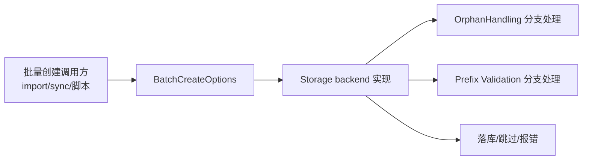

# batch_creation_options 模块深度解析

`batch_creation_options` 模块很小，但它解决的是一个“高风险入口”的问题：当系统一次性创建大量 issue（尤其是 import/migration 场景）时，主流程会遇到两类经常互相冲突的诉求——一边要保证数据关系正确（比如 parent 不能丢），另一边又要允许历史脏数据或跨系统差异顺利落库。这个模块的核心价值，不在于“多了两个字段”，而在于它把这类策略性决策从具体后端实现里抽出来，变成一个后端无关（backend-agnostic）的显式契约，避免每个存储实现各自发明一套隐式行为。

## 这个模块要解决的根问题

如果没有 `BatchCreateOptions`，最朴素的做法通常是把批量创建逻辑写死在某个后端（例如 Dolt 存储）里：遇到 orphan 就报错，或者就直接放行；ID 前缀校验也固定开启。短期看实现快，长期会出现三个问题。第一，行为不可预测：不同入口（CLI import、同步、脚本）可能走到不同后端代码路径，得到不同结果。第二，策略无法组合：你可能想“允许 orphan，但仍保留其它校验”，但写死逻辑时很难局部开关。第三，演进困难：当团队需要在 correctness 与兼容性之间切换时，改动会散落在多处。

`BatchCreateOptions` 把这些策略前置成配置对象：调用方明确表达“这批数据应该按什么容忍度处理”，存储层只负责执行。这其实是把“数据写入动作”与“数据治理策略”解耦。

## 心智模型：把它当作“海关通关策略单”

可以把批量创建看成一批货物入境。`BatchCreateOptions` 不是货物本身，而是随货附带的一张“通关策略单”：

- `OrphanHandling` 决定遇到“货物缺少上游单据（parent）”时，海关是拒收、补单、跳过，还是直接放行。
- `SkipPrefixValidation` 决定是否暂时关闭“条码格式检查”（ID prefix 校验），用于处理历史系统导入时已存在的特殊 ID。

这个模型的关键是：策略由发起方声明，而不是由执行方猜测。存储后端实现只需遵守这张策略单，不需要理解调用方业务背景。

## 架构位置与数据流



从模块树看，`batch_creation_options` 位于 **Storage Interfaces** 下，与 [storage_contracts](storage_contracts.md) 同层，说明它是接口层契约的一部分，而不是某个后端私有实现细节。数据流可以这样理解：上层批量入口在调用存储层时构造 `BatchCreateOptions`，后端在处理每条 issue 时读取选项并执行对应策略，最终形成“成功写入、跳过、或失败中断”的结果。

需要强调的是：当前提供的源码仅包含类型定义（`OrphanHandling`、`BatchCreateOptions`），没有直接展示具体调用链函数名。因此我们可以确认契约本身，但不能在这里准确列出“哪个函数在何处读取该字段”。这部分应结合具体后端实现文档（例如 [store_core](store_core.md)）交叉阅读。

## 组件深潜

## `type OrphanHandling string`

`OrphanHandling` 是一个字符串枚举风格的类型，用来表达“parent 缺失时的策略”。它的设计意图不是做复杂状态机，而是把一类高影响决策压缩成稳定、可序列化、可配置的离散值。

已定义的取值：

- `OrphanStrict`: 缺失 parent 立即失败（最安全）
- `OrphanResurrect`: 尝试从数据库历史中自动“复活”缺失 parent
- `OrphanSkip`: 跳过 orphan issue，并给出 warning
- `OrphanAllow`: 不做 orphan 校验直接导入（注释中说明这是默认，且用于绕过历史 bug）

这里有个重要信号：注释把 `OrphanAllow` 标注为 default 且“works around bugs”。这意味着系统曾经面对现实数据质量问题，选择了“可运行优先”的默认值，而不是“严格正确性优先”。这是一种务实但需要治理的策略：默认放宽能减少导入失败，但会引入结构不完整数据，后续依赖 parent 关系的功能需要承担额外复杂度。

## `type BatchCreateOptions struct`

`BatchCreateOptions` 目前只有两个字段：

- `OrphanHandling OrphanHandling`
- `SkipPrefixValidation bool`

这个结构体的价值在于“集中表达批量写入期间允许的偏差”。它像一个小型 policy object，未来扩展时可以继续在这里增加与批量创建语义相关的开关，而不污染核心实体模型（例如 `Issue`）本身。

`SkipPrefixValidation` 的存在体现了一个典型迁移场景：当外部系统导入已有 ID 时，强制执行 prefix 规则可能导致本来可接受的数据被拒绝。因此这个开关允许在受控场景中暂时关闭校验，换取迁移成功率。

## 依赖关系与契约边界

从依赖层级上，这个模块几乎不依赖其他复杂组件；它定义的是基础类型契约。它与上层/下层的关系可以概括为：

- 上游（调用方）依赖它来声明策略。
- 下游（存储实现）依赖它来执行策略。
- 它本身不实现策略算法，不持有状态，也不触发 I/O。

这类模块在架构上属于“协议层（contract layer）”：低耦合、低复杂度、但高影响。因为一旦字段语义变化，会影响所有批量创建路径。尤其是字符串常量值（`"strict"`、`"resurrect"` 等）如果被配置文件、CLI 参数或远端协议复用，变更成本会非常高。

如果你要理解完整调用端契约，建议配合阅读：

- [storage_contracts](storage_contracts.md)：存储接口边界与事务模型
- [metadata_validation](metadata_validation.md)：与校验策略相关但不同层面的 schema 约束
- [store_core](store_core.md)：具体存储后端如何落地接口语义

## 设计决策与权衡

这个模块的设计选择非常克制：用简单类型 + 常量，而不是引入接口、多态或策略对象树。这样的好处是学习成本低、跨后端实现一致、配置传递简单；代价是表达能力有限，复杂策略组合需要在调用方或后端代码中额外实现。

另一个明显权衡是“字符串枚举”而非 iota 整型。字符串值更利于日志、配置和调试可读性，也更容易跨进程/跨语言传递；但缺点是拼写错误只有在运行期才能暴露（除非调用点全部使用常量）。

默认值倾向 `OrphanAllow` 体现了“可用性优先”的策略选择。它对导入与迁移很友好，但会降低关系一致性的下限。团队如果要提升数据质量，通常需要在更靠近入口的地方显式改为 `OrphanStrict` 或 `OrphanResurrect`，并配套治理流程。

## 使用方式与示例

典型使用是：在批量创建调用前构造 `BatchCreateOptions`，根据场景选择不同策略，再传给存储层批量接口（具体接口名需看对应实现）。

```go
opts := storage.BatchCreateOptions{
    OrphanHandling:       storage.OrphanStrict,
    SkipPrefixValidation: false,
}
```

迁移/导入场景通常更宽松：

```go
opts := storage.BatchCreateOptions{
    OrphanHandling:       storage.OrphanResurrect,
    SkipPrefixValidation: true,
}
```

如果你的目标是“尽可能吞吐，不阻断流程”，可能会选择：

```go
opts := storage.BatchCreateOptions{
    OrphanHandling:       storage.OrphanSkip, // 或 storage.OrphanAllow
    SkipPrefixValidation: true,
}
```

实际工程中，建议把选项选择逻辑放在入口层（例如 import command / sync pipeline），不要散落在后端内部，这样才能保持行为可审计、可回放。

## 新贡献者最该注意的坑

第一，`OrphanAllow` 虽然“方便”，但会制造后续技术债。任何依赖 parent 拓扑完整性的功能（例如树展示、依赖分析、某些统计）都可能表现异常。放宽策略时应同时记录告警与后续修复计划。

第二，`SkipPrefixValidation` 是“手术刀”而不是“常开开关”。它应主要用于导入历史数据；在常规创建路径长期开启，会让 ID 规范逐步失效，最终影响查询、路由或跨系统映射稳定性。

第三，新增 `OrphanHandling` 枚举值时，不只是改这个文件。你还需要确认所有存储后端和调用入口都能识别新值；否则会出现“编译通过但运行语义分裂”的问题。

第四，这个模块没有内建默认值注入机制（从代码可见只是纯 struct/type 定义）。因此“默认策略是什么”取决于上游如何初始化该结构体，以及具体消费端如何处理零值。若你在新代码中依赖默认行为，请显式赋值，不要赌隐式约定。

## 总结

`batch_creation_options` 是一个小而关键的契约模块。它把批量创建中最容易引发事故的策略点（orphan 处理、前缀校验）从实现细节提升为显式输入参数，让系统在“严格一致性”与“现实兼容性”之间可控切换。对新成员来说，真正要掌握的不是字段名，而是它背后的治理思想：策略必须显式、可追踪、可按场景切换。
