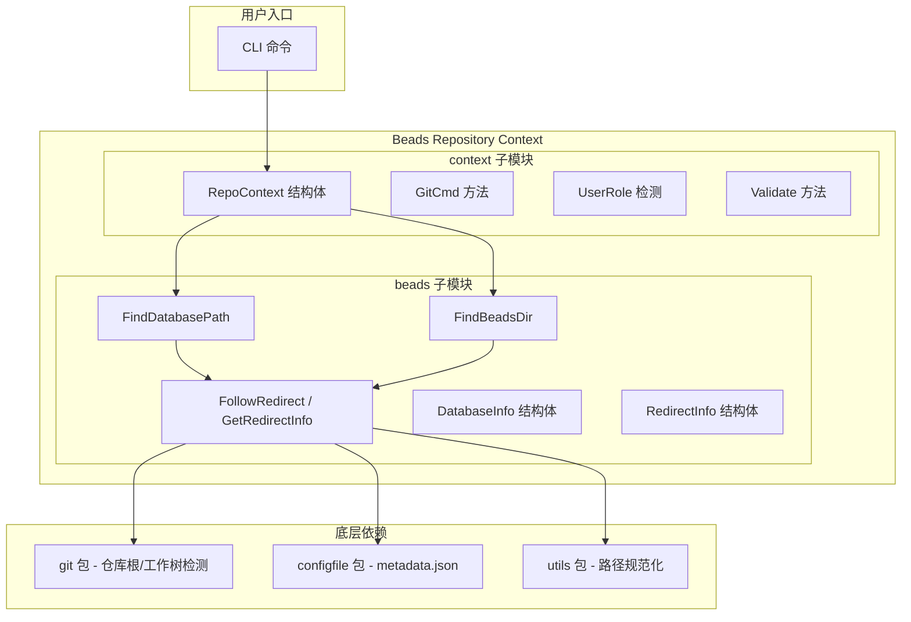
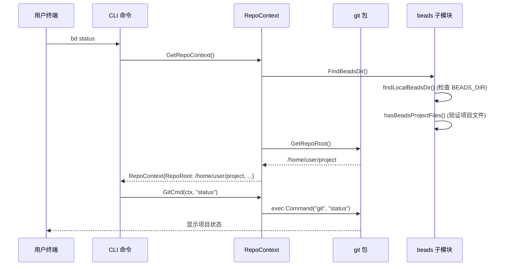
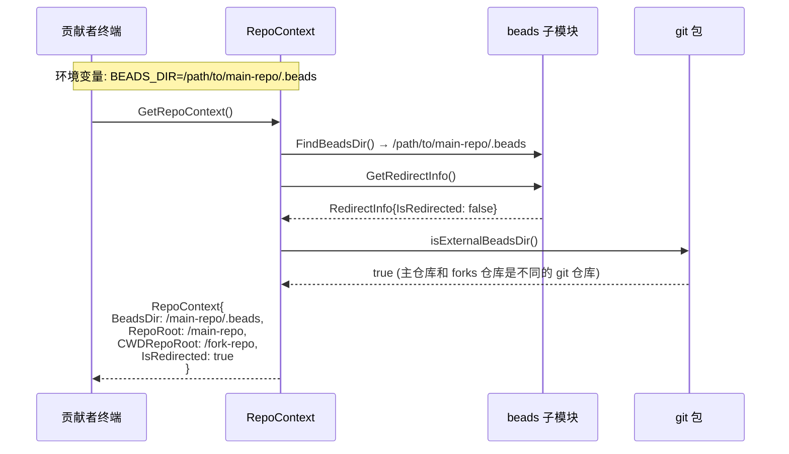
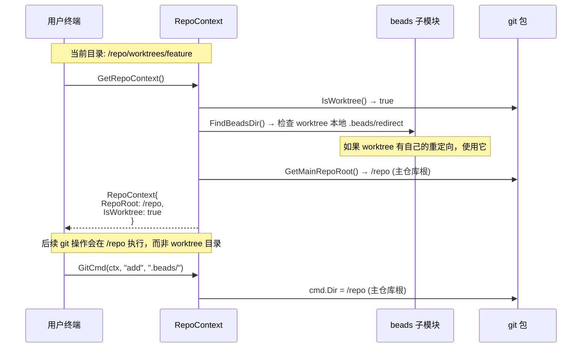

# Beads Repository Context 模块

> **一句话概括**：Beads Repository Context 是 bd 系统的"导航中心"——它解决了一个看似简单却至关重要的核心问题：**当用户在任何目录执行命令时，如何找到正确的 .beads 数据库并在其所属的 git 仓库中执行操作？**

## 问题空间：为什么需要这个模块？

在深入代码之前，我们先理解这个模块要解决的根本问题。

### 问题一：50+ 命令不知道在哪里执行

想象一下这个场景：你有一个主仓库 `main-repo`，还有一个贡献者 forks 的仓库 `fork-repo`。你正在 `fork-repo` 的某个子目录中工作，但你的 `BEADS_DIR` 环境变量指向了 `main-repo` 的 `.beads` 目录。当你执行 `bd status` 时，会发生什么？

**没有 RepoContext 之前**：命令会在当前工作目录（CWD）执行 git 操作，结果指向了错误的仓库。

这不只是理论问题——bd 有超过 50 个 git 命令散布在整个代码库中，它们都假设当前工作目录就是仓库根目录。

### 问题二：工作树（Worktree）带来的复杂性

现代开发中，工作树（git worktree）是非常常见的：你可能在 `feature/worktree` 中开发新功能，同时在主分支上进行 hotfix。当你从工作树执行 bd 命令时，git 需要操作的是**包含 .beads 的那个仓库**（通常是主仓库），而不是当前工作树。

### 问题三：重定向机制的困惑

bd 支持在 `.beads/redirect` 文件中写一个路径，将整个 beads 操作重定向到另一个仓库。这对于多仓库工作流很有用，但也让"哪里是正确的工作目录"这个问题变得更加复杂。

### 问题四：数据库发现的各种路径

bd 支持多种数据库位置配置方式：
- `$BEADS_DIR` 环境变量（指向 .beads 目录）
- `$BEADS_DB` 环境变量（直接指向数据库文件，已废弃）
- 在当前目录或祖先目录中自动搜索 `.beads/*.db`

这些路径可能包含重定向、符号链接、工作树等变体。

---

## 架构概览



### 核心抽象

**Beads 子模块** 负责：
- 发现 beads 数据库的物理位置
- 解析 `.beads/redirect` 重定向文件
- 处理符号链接、工作树等路径变体
- 提供 `DatabaseInfo` 和 `RedirectInfo` 数据结构

**Context 子模块** 负责：
- 聚合所有路径信息，形成统一的 `RepoContext`
- 区分"用户当前工作目录所在的仓库"和"beads 数据库所在的仓库"
- 提供安全的 git 命令执行环境
- 检测用户角色（贡献者 vs 维护者）

---

## 核心设计决策

### 决策一：为什么需要区分 RepoRoot 和 CWDRepoRoot？

这是整个模块最核心的设计洞察。

```go
type RepoContext struct {
    // .beads 目录的实际路径（解析重定向后）
    BeadsDir string
    
    // 包含 BeadsDir 的 git 仓库根目录
    // git 命令应该在这里执行
    RepoRoot string
    
    // 当前工作目录所在的 git 仓库根目录
    // 可能与 RepoRoot 不同（当 BEADS_DIR 指向外部仓库时）
    CWDRepoRoot string
    
    // 是否发生了重定向
    IsRedirected bool
    
    // 当前是否在 worktree 中
    IsWorktree bool
}
```

**设计意图**：想象一个贡献者在 forks 的仓库工作，但 `BEADS_DIR` 指向主仓库的 `.beads`。此时：
- `RepoRoot` = 主仓库的根目录（所有 beads 数据的真正位置）
- `CWDRepoRoot` = forks 仓库的根目录（用户"感觉上"的工作位置）

这样，当执行 `bd sync` 时，git 操作会在 `RepoRoot` 执行（操作正确的仓库）；而当显示状态时，可以在 `CWDRepoRoot` 显示（反映用户实际的工作上下文）。

### 决策二：为什么不直接用 CWD 而是要缓存 Context？

```go
var (
    repoCtx     *RepoContext
    repoCtxOnce sync.Once
)
```

`GetRepoContext()` 使用 `sync.Once` 确保在整个命令执行过程中只解析一次。

**理由**：
1. CWD 在单次命令执行过程中不会改变
2. BEADS_DIR 在单次命令执行过程中不会改变
3. 重复的文件系统访问（如每次调用都执行 `git rev-parse`）是浪费的

但这也意味着：**不要在测试之外修改全局状态后调用 GetRepoContext()**——它会返回缓存的结果。

### 决策三：为什么禁用 Git Hooks 和模板？

在 `GitCmd()` 方法中：

```go
cmd.Env = append(os.Environ(),
    "GIT_HOOKS_PATH=",        // 禁用 hooks
    "GIT_TEMPLATE_DIR=",      // 禁用模板
    // ...
)
```

**安全理由（SEC-001, SEC-002）**：当用户从外部仓库（通过 BEADS_DIR）操作 beads 时，他们可能是在一个**不受信任的仓库**中执行代码。Git hooks 可以执行任意 shell 命令，这构成了代码执行风险。

### 决策四：为什么不支持重定向链？

```go
// Redirect chains are not followed - only one level of redirection is supported.
```

`FollowRedirect()` 只处理一级重定向。这是有意设计的：
- 防止无限循环
- 保持行为可预测
- 避免复杂的依赖追踪

### 决策五：为什么需要路径安全边界检查？

```go
var unsafePrefixes = []string{
    "/etc", "/usr", "/var", "/root", "/System", "/Library",
    "/bin", "/sbin", "/opt", "/private",
}
```

**安全理由（SEC-003）**：防止路径遍历攻击。如果 BEADS_DIR 指向 `/etc/beads` 这样的系统目录，攻击者可能利用它来读写系统文件。

---

## 数据流：关键操作解析

### 场景一：普通用户执行 `bd status`



**关键点**：
1. `FindBeadsDir()` 首先检查 `BEADS_DIR` 环境变量
2. 如果不存在，则向上搜索目录树寻找 `.beads/`
3. 在 git 仓库根目录停止搜索，避免找到无关的 .beads
4. `GitCmd()` 设置正确的 `cmd.Dir` 为 `RepoRoot`

### 场景二：贡献者在 Forks 仓库工作



**关键洞察**：当检测到 `BEADS_DIR` 指向外部仓库时，`IsRedirected` 被设置为 `true`，这会自动将用户视为"贡献者"角色（贡献者不能直接推送回主仓库，需要通过 PR）。

### 场景三：从 Worktree 执行命令



---

## 子模块文档

### 1. [beads - 路径发现与重定向](./internal-beads-beads.md)

负责 beads 数据库的物理发现和重定向机制。

**核心组件**：
- `RedirectInfo` - 重定向信息数据结构
- `DatabaseInfo` - 数据库发现结果
- `FollowRedirect()` - 解析重定向文件
- `FindDatabasePath()` - 查找数据库文件
- `FindBeadsDir()` - 查找 .beads 目录

### 2. [context - 仓库上下文管理](./internal-beads-context.md)

负责聚合路径信息并提供统一的 git 操作接口。

**核心组件**：
- `RepoContext` - 仓库上下文核心结构
- `UserRole` - 用户角色（贡献者/维护者）
- `GitCmd()` - 创建在正确仓库执行的 git 命令
- `GetRepoContext()` - 获取缓存的上下文

---

## 依赖关系

### 被依赖（谁依赖这个模块）

这个模块是 bd 系统的**基础设施层**，几乎所有其他模块都可能间接依赖它：

- **CLI 命令**：几乎所有 `cmd.bd.*` 命令都通过 `GetRepoContext()` 获取正确的执行上下文
- **存储层**：`FindDatabasePath()` 决定了 Storage 接口的初始化位置
- **Tracker 集成**：各种 tracker（GitLab、Jira、Linear）需要知道在哪里读写数据

### 依赖（这个模块依赖什么）

- **`internal/git`**：获取仓库根目录、判断工作树、获取 git 公共目录
- **`internal/configfile`**：读取 `metadata.json` 获取数据库配置
- **`internal/utils`**：`CanonicalizePath()` 规范化路径
- **`internal/storage`**：导出 `Storage` 和 `Transaction` 类型别名供扩展使用

---

## 潜在陷阱与注意事项

### 陷阱一：缓存导致的测试问题

`GetRepoContext()` 使用 `sync.Once` 缓存结果。在测试中修改目录或环境变量后，必须调用 `ResetCaches()`：

```go
t.Cleanup(func() {
    beads.ResetCaches()
    git.ResetCaches()
})
```

### 陷阱二：Worktree 中的主仓库优先逻辑

对于 worktree，代码优先查找**主仓库的 .beads**，而不是 worktree 本地的：

```go
// 对于 worktrees，搜索主仓库根目录优先
mainRepoRoot, err := git.GetMainRepoRoot()
if err == nil && mainRepoRoot != "" {
    beadsDir := filepath.Join(mainRepoRoot, ".beads")
    // ...
}
```

这意味着除非你在 worktree 中显式创建了 `.beads/redirect` 文件，否则工作树会自动使用主仓库的 beads 数据库。

### 陷阱三：符号链接可能导致重复数据库

`FindAllDatabases()` 使用 `filepath.EvalSymlinks()` 来规范化路径并去重：

```go
if resolved, err := filepath.EvalSymlinks(dbPath); err == nil {
    canonicalPath = resolved
}
if seen[canonicalPath] {
    // 跳过已见过的数据库
}
```

这是为了处理这种情况：假设 `/Users/user/Code` 是 `/Users/user/Documents/Code` 的符号链接，系统应该识别这是同一个数据库。

### 陷阱四：Role 检测的隐式逻辑

```go
func (rc *RepoContext) Role() (UserRole, bool) {
    // BEADS_DIR 意味着外部仓库模式 -> 隐式贡献者
    if rc.IsRedirected {
        return Contributor, true
    }
    // 否则从 git config 读取
}
```

这意味着即使没有设置 `beads.role`，只要 `BEADS_DIR` 指向外部仓库，系统就会认为你是贡献者。这是合理的设计——外部仓库模式本身就是贡献者工作流的标志。

### 陷阱五：重定向文件格式的灵活性

重定向文件可以包含：
- 相对路径（相对于 .beads 的父目录解析）
- 绝对路径
- 空行和注释（以 `#` 开头）

```text
# 这是注释
../actual-beads-directory

# 上面第一个非空非注释行就是目标路径
```

---

## 扩展点与定制

### 扩展点一：自定义数据库发现逻辑

`findDatabaseInBeadsDir()` 函数先检查 `metadata.json`，然后回退到 `dolt/` 目录：

```go
func findDatabaseInBeadsDir(beadsDir string, _ bool) string {
    // 1. 检查 metadata.json（单一可信源）
    if cfg, err := configfile.Load(beadsDir); err == nil && cfg != nil {
        return cfg.DatabasePath(beadsDir)
    }
    // 2. 回退到 dolt/ 目录
    doltPath := filepath.Join(beadsDir, "dolt")
    // ...
}
```

如果需要支持其他数据库后端，可以修改 `configfile.Config` 的 `DatabasePath()` 方法。

### 扩展点二：安全边界定制

`unsafePrefixes` 列表定义了禁止 beads 目录存在的位置：

```go
var unsafePrefixes = []string{
    "/etc", "/usr", "/var", "/root", "/System", "/Library",
    "/bin", "/sbin", "/opt", "/private",
}
```

如果需要在特定环境中运行（如容器内的特定路径），可以调整这个列表，但**不建议移除系统目录**。

---

## 总结

Beads Repository Context 模块看似只是"找路径"的简单功能，实际上处理了分布式开发环境中的复杂问题：

1. **路径发现**：多种配置方式和自动搜索
2. **重定向机制**：支持单级重定向，避免循环
3. **仓库区分**：精确区分"数据仓库"和"工作仓库"
4. **工作树支持**：正确处理 git worktree 场景
5. **安全防护**：路径边界检查和 hooks 禁用

理解这个模块的关键是认识到：**在任何目录下执行命令时，都需要知道"正确的 git 仓库是哪个"以及"beads 数据库在哪里"**。这两个问题的答案往往不同，而 RepoContext 正是统一回答这两个问题的地方。