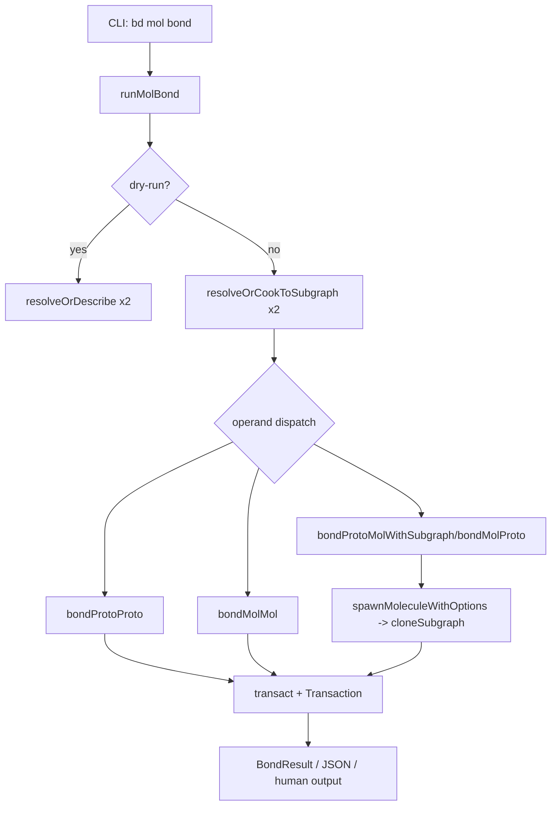

# bond_polymorphic_orchestration

`bond_polymorphic_orchestration` 对应的是 `bd mol bond` 这条命令背后的编排逻辑（核心代码在 `cmd/bd/mol_bond.go`）。它解决的不是“如何加一条依赖”这么简单的问题，而是**如何用一条统一命令，安全地组合不同形态的工作单元**：已有 molecule、可复用 proto、以及即时烹饪（cook）的 formula。你可以把它想象成一个“化学反应调度台”——输入两种“物质”，系统先判别形态，再选择正确反应路径，并保证数据库状态在事务里一致落地。

## 这个模块为什么存在：它解决了什么问题？

如果没有这个模块，调用方（CLI 用户或上层命令）就得手动判断：参数是 issue ID 还是 formula 名？是 proto 还是 molecule？是要合并模板、还是实例化并挂接、还是只加依赖？每种组合都要写一套流程、错误处理、事务边界和输出格式。很快会出现三类问题：第一，重复逻辑遍地都是；第二，不同命令分支的语义会逐渐漂移（例如 parallel 在某处是“无阻塞”，在另一处却变成“普通 blocking 依赖”）；第三，半成功状态（先创建了子图，再挂接失败）会制造孤儿 issue。

`runMolBond` 的设计洞察是：**先把输入统一归一到 `TemplateSubgraph + root issue + 是否由 formula 现烹(cooked)`，再做一次分派**。这样复杂性被压缩到一个“多态分发器”里，调用者只需记住一条命令和少量 flag。

## 心智模型：一个“分诊台 + 反应器”的 orchestrator

理解这个模块时，建议把它看成两层：

第一层是“分诊台”。`resolveOrDescribe`（dry-run）和 `resolveOrCookToSubgraph`（执行态）负责把输入判别为 issue 或 formula，并尽可能统一成 subgraph 结构。分诊台的目标是把异构输入变成同构中间表示。

第二层是“反应器”。`runMolBond` 根据两侧操作数的“proto/molecule 属性”选择反应路径：`bondProtoProto`、`bondProtoMolWithSubgraph`、`bondMolProto`、`bondMolMol`。每条路径都把“bond type（sequential/parallel/conditional）”翻译成具体依赖类型与事务写入。

这很像机场中转：先过安检（身份识别与标准化），再根据航班类型走不同登机口（分支执行）。

## 架构与数据流



从调用关系看，这个模块在 CLI 分层里是被 `molCmd` 收编的子命令：`init()` 中 `molCmd.AddCommand(molBondCmd)`，而 `molCmd` 本身在 `cmd/bd/mol.go` 被注册到 `rootCmd`。所以它的上游是命令路由系统，下游是三组能力：

一组是解析能力（`utils.ResolvePartialID`、`formula.NewParser().LoadByName`、`resolveAndCookFormulaWithVars`）；一组是模板/子图能力（`loadTemplateSubgraph`、`extractAllVariables`、`spawnMoleculeWithOptions`）；最后是存储事务能力（`transact` + `storage.Transaction` 的 `CreateIssue`/`AddLabel`/`AddDependency`）。

## 关键组件深潜

### `runMolBond(cmd, args)`：多态编排入口

这是整个模块的控制平面。它先做约束校验：数据库连接必须存在；`--ephemeral` 与 `--pour` 互斥；`--type` 必须是 `types.BondTypeSequential` / `types.BondTypeParallel` / `types.BondTypeConditional`。然后解析 `--var key=value` 到 map。

接下来分两条大路径。`--dry-run` 时走 `resolveOrDescribe`，只做可解析性和类型预览，不执行烹饪、不写库。执行态时走 `resolveOrCookToSubgraph`，把两边都归一成 subgraph，并拿到 `cookedA/cookedB` 标记。最后依据 `aIsProto/bIsProto` 做四路分发。

设计上最重要的是：**执行态分发前不关心输入来源（ID / formula）**，只关心操作数语义（proto 还是 molecule）。这使 polymorphic 行为稳定且可扩展。

### `BondResult`：统一输出契约

`BondResult` 包含 `ResultID`、`ResultType`、`BondType`，以及可选的 `Spawned`、`IDMapping`。这让不同分支可以对齐输出格式，特别是 JSON 模式下上游脚本处理更简单：不需要按组合类型写 N 套解析逻辑。

### `resolveOrDescribe(ctx, s, operand)`：dry-run 的轻量解析

这个函数先尝试把 operand 当 issue（`ResolvePartialID` + `GetIssue`），失败再尝试 formula（前置 `looksLikeFormulaName`，再 `parser.LoadByName`）。它不执行 cook，目的是低成本给出“会发生什么”的预览。

### `resolveOrCookToSubgraph(ctx, s, operand, vars)`：执行态归一化

它是 polymorphic 的关键转换器：

- 若 operand 是 issue 且是 proto（通过 `isProto` 判断 label），加载完整模板子图 `loadTemplateSubgraph`。
- 若是普通 molecule，则包成单节点 subgraph。
- 若不是 issue，但“看起来像 formula 名”，调用 `resolveAndCookFormulaWithVars` 直接烹饪为**内存子图**。

这一步消除了“来源差异”，后续逻辑只处理 subgraph。

### `bondProtoProto(...)`：模板合成

该路径创建一个新的 compound root（`types.IssueType = types.TypeEpic`），写入 `BondedFrom`，给新根打 `MoleculeLabel`，再加两条 `DepParentChild` 把两个 proto 根挂到新根下。若 bond type 是 sequential/conditional，还会为 `protoB -> protoA` 补一条执行顺序依赖（`DepBlocks` 或 `DepConditionalBlocks`）。

它的语义是“生成一个新的可复用模板骨架”，所以 `ResultType` 返回 `compound_proto`。

### `bondProtoMolWithSubgraph(...)`：实例化并原子挂接

这是最“热”的路径之一。它可接收预加载 subgraph（formula cook 场景）或按 proto ID 加载。之后做变量完整性检查（当前使用 `extractAllVariables`），确定 phase（默认跟随目标 molecule 的 `Ephemeral`，可被 `--ephemeral/--pour` 覆盖），再把 `bondType` 映射为挂接依赖类型。

核心在 `CloneOptions`：通过 `AttachToID` + `AttachDepType` 把“spawn + attach”放进同一事务（实际由 `spawnMoleculeWithOptions -> cloneSubgraph` 实现），避免“已创建但未挂接”的孤儿问题。

### `bondMolMol(...)`：纯依赖级别的组合

该路径不复制子图，只在事务里写一条 `molB -> molA` 的依赖，依赖类型按 bond type 映射。代码注释明确了一个存储约束：schema 对 `(issue_id, depends_on_id)` 只允许一条依赖记录，这会影响你后续想叠加多种关系时的设计空间。

### `looksLikeFormulaName(operand)`：启发式识别

规则很简单：`mol-` 前缀、含 `.formula`、或含路径分隔符。它的作用是减少无谓 parser 尝试，但本质是 heuristic，不是严格判定器。

## 依赖分析：它依赖谁，谁依赖它

从代码可确认的“被调用”关系如下：

- 输入解析：`utils.ResolvePartialID`、`dolt.DoltStore.GetIssue`、`formula.NewParser().LoadByName`、`resolveAndCookFormulaWithVars`
- 模板/克隆：`loadTemplateSubgraph`、`extractAllVariables`、`spawnMoleculeWithOptions`（在 `cmd/bd/mol.go`，实际委托 `cloneSubgraph`）
- 事务写入：`transact` + `storage.Transaction`（`CreateIssue`、`AddLabel`、`AddDependency`）
- CLI 运行时：`CheckReadonly`、`FatalError`、`outputJSON`、`ui.RenderPass`

“调用它”的入口关系在代码中是显式注册：`cmd/bd/mol_bond.go:init` 里 `molCmd.AddCommand(molBondCmd)`，而 `molCmd` 在 `cmd/bd/mol.go` 中挂到 `rootCmd`。也就是说，它不是库 API，而是 CLI command handler。

数据契约方面，最关键的是：

1. 操作数归一后必须能落在 `TemplateSubgraph`（至少有 `Root`）。
2. `bondType` 必须是 `types` 中定义的三种常量之一。
3. 挂接与依赖语义通过 `types.DependencyType` 表达，存储层只认依赖记录，不理解“bond”高层概念。

## 设计决策与权衡

### 1) 多态单入口 vs 多命令拆分

当前选的是单入口 `bd mol bond` + 内部分发。优点是用户心智简单、复用解析与事务逻辑；代价是入口函数偏重，新增操作数形态会继续加分支。

### 2) 内存 cook vs 落库 proto

formula 在这里走 `resolveAndCookFormulaWithVars`，直接转内存 subgraph，而不是先写数据库再引用。优点是避免数据库污染、减少中间态；代价是调试时少了可回溯中间对象，且 dry-run 与执行态之间可能出现细微差异（例如 dry-run 不真正 cook）。

### 3) 语义保真 vs 实现统一

parallel 在某些分支被映射成 `DepParentChild`（组织关系，不阻塞）。这在实现上统一了“非阻塞关系”的表达，但也把“并行执行语义”折叠进依赖类型解释，要求其他模块正确理解 `DepParentChild` 的运行含义。

### 4) 原子性优先

`AttachToID` 设计很关键：clone 与 attach 同事务，牺牲了一些实现解耦，换来强一致性。这对 CLI 场景非常值，因为用户更怕数据残缺而不是函数层优雅。

## 使用方式与典型模式

```bash
# proto + proto -> compound proto
bd mol bond mol-feature mol-deploy --type sequential --as "Feature + Deploy"

# proto(formula) + molecule -> cook inline + spawn + attach
bd mol bond mol-polecat-arm bd-patrol --var polecat_name=ace --type parallel

# 动态 bonding：可读子 ID
bd mol bond mol-arm bd-patrol --ref arm-{{name}} --var name=ace

# phase 覆盖
bd mol bond mol-critical-bug wisp-patrol --pour
bd mol bond mol-temp-check bd-feature --ephemeral

# 仅预览
bd mol bond mol-feature bd-abc123 --dry-run
```

对扩展者来说，最安全的入口是补充分发分支和 `CloneOptions` 的能力，而不是在多个命令里复制 bonding 逻辑。

## 新贡献者最该注意的坑

第一，`isProto(issue)` 通过 label（`MoleculeLabel`）判断，而执行态分发又使用 `issue.IsTemplate || cooked`。这意味着“proto 判定”有两套信号源，dry-run 与执行态的分类可能在边缘数据上不完全一致。

第二，`bondProtoMolWithSubgraph` 当前用 `extractAllVariables` 检查缺失变量，而不是 `extractRequiredVariables`。如果 subgraph 带有默认变量定义（`VarDefs`），这里依然可能要求用户显式传参，策略偏保守。

第三，`looksLikeFormulaName` 是启发式，不是语法保证。某些合法 formula 命名如果不匹配规则，会在“不是 issue 也不像 formula”的早期校验里失败。

第四，`--ephemeral` 和 `--pour` 互斥，且默认“跟随目标 molecule 的 phase”。如果你在扩展 phase 语义，必须保持这个优先级链：显式 flag > 目标 phase > 默认行为。

第五，动态 ID 通过 `generateBondedID` 受 `bondedIDPattern` 约束，只允许字母数字、`-`、`_`、`.`。`--ref` 变量替换后为空或含非法字符会直接失败。

## 边界条件与运行约束

- 无数据库连接直接失败（`store == nil`）。
- `bondType` 非法值立即失败。
- `--var` 非 `key=value` 失败。
- proto/molecule 挂接和 mol+mol 链接都依赖 `AddDependency`，若已有同键依赖（同 `(issue_id, depends_on_id)`）可能触发存储层冲突。
- `bondMolMol` 注释指出 `bonded_from` 暂未被存储层支持，当前主要靠 dependency 关系表达语义。

## 参考阅读

- [CLI Molecule Commands](CLI Molecule Commands.md)
- [molecule_progress_and_dispatch](molecule_progress_and_dispatch.md)
- [Formula Engine](Formula Engine.md)
- [formula_loading_and_resolution](formula_loading_and_resolution.md)
- [Storage Interfaces](Storage Interfaces.md)
- [Dolt Storage Backend](Dolt Storage Backend.md)
- [Core Domain Types](Core Domain Types.md)
- [issue_domain_model](issue_domain_model.md)
