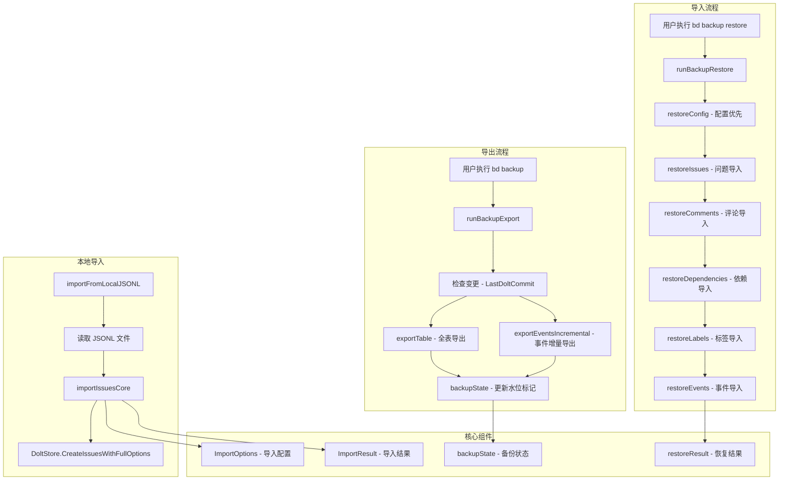
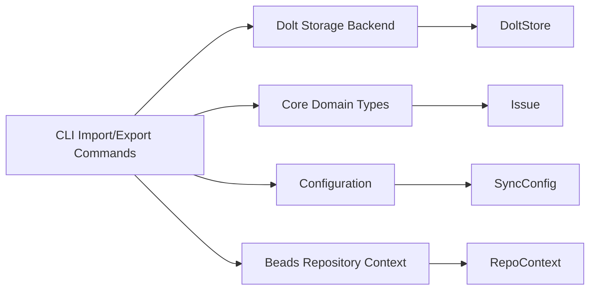

# CLI Import/Export Commands 模块

## 概述

CLI Import/Export Commands 模块是 beads 系统的数据生命线，负责在 Dolt 数据库与外部世界之间建立安全、可靠的桥梁。想象一下，如果没有这个模块，当你需要迁移数据库、备份重要数据、或者在多个仓库之间同步问题时，你将不得不手动操作数据库表——这既耗时又容易出错。

这个模块的核心价值在于：
- **数据备份与恢复**：将整个数据库导出为人类可读的 JSONL 格式，并能完整恢复
- **增量变更跟踪**：通过水位标记实现高效的增量备份
- **数据迁移**：支持仓库间的问题迁移和数据导入
- **数据安全**：原子化写入、幂等操作、干运行模式等安全机制

## 架构概览



### 数据流详解

#### 1. 导出流程（Backup）

当用户执行 `bd backup` 时：

1. **变更检测**：首先检查当前 Dolt 提交哈希是否与上次备份相同，避免无意义的重复备份
2. **全表导出**：使用 SELECT * 查询所有表，确保捕获所有字段（schema 可能随时间增长）
3. **增量事件导出**：通过 `LastEventID` 水位标记，只导出新增的事件，大幅提升性能
4. **原子化写入**：备份状态文件通过临时文件+重命名的方式原子更新，避免崩溃导致的损坏
5. **智能目录选择**：优先使用配置的 git 仓库作为备份目录，否则回退到 `.beads/backup/`

#### 2. 恢复流程（Restore）

当用户执行 `bd backup restore` 时：

1. **顺序导入**：严格按照 config → issues → comments → dependencies → labels → events 的顺序导入
   - 这是因为后续表都依赖 issue_id 外键，必须先有问题记录
   - config 优先是因为它设置了 issue_prefix 等关键配置
2. **原始 SQL 导入**：使用原始 SQL 而非高级 API，避免副作用（如验证、事件触发）
3. **幂等操作**：使用 INSERT IGNORE 处理重复记录，确保恢复操作可以安全重试
4. **提交保护**：只有在非干运行模式下才会提交到 Dolt

#### 3. 本地 JSONL 导入

当用户从本地 JSONL 文件导入时：

1. **大文件支持**：配置 64MB 的行缓冲区，处理包含大型描述的问题
2. **自动前缀检测**：从第一个问题 ID 中提取前缀并自动配置
3. **灵活导入选项**：支持跳过前缀验证、重命名、孤儿处理等多种选项

## 核心设计决策

### 1. JSONL 格式选择

**决策**：使用 JSON Lines（每行一个 JSON 对象）而非完整 JSON 数组

**为什么**：
- **可流式处理**：可以逐行读取，无需将整个文件加载到内存（支持 GB 级文件）
- **可部分恢复**：即使文件末尾损坏，前面的数据仍然可用
- **Git 友好**：每行一个记录，Git 差异更清晰
- **易于调试**：人类可读，可以用普通文本编辑器查看和修改

**替代方案**：
- 完整 JSON 数组：需要全量加载，不适合大文件
- 二进制格式：不可读，难以调试
- CSV：不支持嵌套结构

### 2. 增量备份策略

**决策**：基于 Dolt 提交哈希和事件 ID 双重水位标记

**为什么**：
- **Dolt 提交哈希**：快速检测整体变更，避免无意义的备份
- **事件 ID 水位**：实现事件表的高效增量导出，避免全表扫描
- **组合使用**：既保证了变更检测的速度，又保证了事件导出的效率

**替代方案**：
- 完全增量：复杂度高，恢复时需要重放所有变更
- 完全全量：备份慢，存储占用大

### 3. 原始 SQL 恢复

**决策**：在恢复时使用原始 SQL INSERT 而非高级 API

**为什么**：
- **避免副作用**：高级 API 会触发验证、事件创建、钩子执行等，这些在恢复时不需要
- **性能优化**：绕过业务逻辑层，直接写入数据库
- **幂等性**：使用 INSERT IGNORE 可以安全重试
- **Schema 兼容性**：直接使用导出的列，不依赖 Go 结构体定义

**替代方案**：
- 使用高级 API：会创建重复事件，可能触发钩子，性能差
- ORM：Schema 变更时需要更新代码

### 4. 原子化文件写入

**决策**：使用临时文件 + rename 模式实现原子化写入

**为什么**：
- **崩溃安全**：如果写入过程中崩溃，原文件不受影响
- **无锁设计**：不需要文件锁，避免死锁
- **简单可靠**：利用文件系统的原子 rename 操作

**实现细节**：
```go
// 1. 创建临时文件
tmp, err := os.CreateTemp(dir, ".backup-tmp-*")
// 2. 写入数据
tmp.Write(data)
// 3. 同步到磁盘
tmp.Sync()
// 4. 原子重命名
os.Rename(tmpPath, path)
```

## 子模块详解

### [backup_export](backup_export.md)

负责将 Dolt 数据库导出为 JSONL 文件。核心是 `backupState` 结构，它跟踪增量备份的水印，并使用 `exportTable` 动态导出任意表，以及 `exportEventsIncremental` 进行高效的事件增量导出。

### [backup_restore](backup_restore.md)

负责从 JSONL 备份恢复 Dolt 数据库。严格按照依赖顺序恢复表，使用原始 SQL 确保数据原样恢复，并通过 `restoreResult` 提供详细的恢复统计。

### [import_shared](import_shared.md)

提供通用的导入基础设施，包括 `ImportOptions` 配置导入行为，`ImportResult` 跟踪导入结果，以及 `importFromLocalJSONL` 从本地文件导入问题。

## 核心组件详解

### ImportOptions - 导入配置中心

`ImportOptions` 结构体是导入操作的控制中心，提供了 10+ 个配置选项来调整导入行为：

```go
type ImportOptions struct {
    DryRun                     bool          // 试运行，不实际修改
    SkipUpdate                 bool          // 跳过更新现有记录
    Strict                     bool          // 严格模式，遇到错误立即停止
    RenameOnImport             bool          // 导入时重命名冲突 ID
    ClearDuplicateExternalRefs bool          // 清除重复的外部引用
    OrphanHandling             string        // 孤儿处理策略
    DeletionIDs                []string      // 要删除的 ID 列表
    SkipPrefixValidation       bool          // 跳过前缀验证
    ProtectLocalExportIDs      map[string]time.Time // 保护本地导出的 ID
}
```

**设计意图**：将所有导入配置集中管理，避免函数参数爆炸，同时提供合理的默认值。

### ImportResult - 导入结果统计

`ImportResult` 详细记录了导入操作的结果，用于用户反馈和调试：

```go
type ImportResult struct {
    Created             int               // 新创建的数量
    Updated             int               // 更新的数量
    Unchanged           int               // 未变化的数量
    Skipped             int               // 跳过的数量
    Deleted             int               // 删除的数量
    Collisions          int               // 冲突数量
    IDMapping           map[string]string // ID 映射（旧→新）
    CollisionIDs        []string          // 冲突的 ID 列表
    PrefixMismatch      bool              // 是否有前缀不匹配
    ExpectedPrefix      string            // 期望的前缀
    MismatchPrefixes    map[string]int    // 不匹配的前缀统计
    SkippedDependencies []string          // 跳过的依赖
}
```

**设计意图**：提供足够的信息让用户了解导入做了什么，以及为什么某些操作被跳过。

### backupState - 备份水位标记

`backupState` 跟踪备份的进度和状态，实现增量备份：

```go
type backupState struct {
    LastDoltCommit string    // 上次备份的 Dolt 提交哈希
    LastEventID    int64     // 上次备份的最大事件 ID
    Timestamp      time.Time // 备份时间戳
    Counts         struct {  // 各表的记录数
        Issues       int
        Events       int
        Comments     int
        Dependencies int
        Labels       int
        Config       int
    }
}
```

**设计意图**：
- `LastDoltCommit`：快速检测是否有变更
- `LastEventID`：实现事件的增量导出
- `Counts`：验证备份完整性的快速检查

### restoreResult - 恢复结果统计

`restoreResult` 简单清晰地记录恢复操作的结果：

```go
type restoreResult struct {
    Issues       int
    Comments     int
    Dependencies int
    Labels       int
    Events       int
    Config       int
    Warnings     int
}
```

## 与其他模块的关系

### 依赖关系



### 关键交互

1. **[Dolt Storage Backend](dolt_storage_backend.md)**：
   - 使用 `DoltStore.CreateIssuesWithFullOptions` 批量创建问题
   - 使用 `DoltStore.GetConfig/SetConfig` 读取和设置配置
   - 直接使用 `DoltStore.DB()` 获取 SQL 连接进行原始操作

2. **[Core Domain Types](core_domain_types.md)**：
   - 导入时反序列化为 `types.Issue`
   - 使用 `utils.ExtractIssuePrefix` 提取问题前缀

3. **[Configuration](configuration.md)**：
   - 读取 `backup.git-repo` 配置确定备份目录

## 使用指南

### 典型工作流

#### 1. 完整备份与恢复

```bash
# 创建备份
bd backup

# 模拟灾难：删除数据库
rm -rf .beads/db

# 初始化并恢复
bd init && bd backup restore
```

#### 2. 从 JSONL 文件导入

```bash
# 从本地文件导入
bd import issues.jsonl

# 从另一个仓库复制并导入
cp ../other-repo/.beads/backup/issues.jsonl ./
bd import issues.jsonl
```

#### 3. 干运行模式

```bash
# 查看恢复会做什么，但不实际修改
bd backup restore --dry-run
```

### 常见问题与解决方案

#### Q: 恢复时提示 "no issues.jsonl found"
**A**: 确保备份目录存在且包含 issues.jsonl。运行 `bd backup` 创建备份。

#### Q: 导入时出现前缀不匹配错误
**A**: 使用 `--skip-prefix-validation` 选项，或先配置正确的 issue_prefix。

#### Q: 恢复后事件丢失
**A**: 检查 backup_state.json 中的 LastEventID，如果是 0 会全量导出，否则只导出增量。

## 新贡献者注意事项

### 陷阱与边界情况

1. **导入顺序很重要**：
   - 永远是 config → issues → 其他表
   - 不要改变顺序，否则会因为外键约束失败

2. **事件表的增量导出**：
   - 第一次导出时 LastEventID=0，会全量导出
   - 后续导出只导出新增事件
   - 如果 backup_state.json 丢失，会重新全量导出

3. **Wisp 表的处理**：
   - 代码会检查 wisps 表是否存在
   - 如果存在，会使用 UNION ALL 合并 issues 和 wisps
   - 确保你的测试覆盖有 wisps 和没有 wisps 的情况

4. **大文件处理**：
   - 配置了 64MB 的行缓冲区
   - 测试时要包含大型描述的问题
   - 注意内存使用，不要一次性加载整个文件

### 代码约定

1. **错误处理**：
   - 恢复时尽量继续，只记录警告
   - 使用 `fmt.Fprintf(os.Stderr, "Warning: ...")` 输出警告
   - 最终在 result.Warnings 中统计

2. **原子化操作**：
   - 所有文件写入都使用临时文件 + rename 模式
   - 不要直接写入目标文件

3. **干运行模式**：
   - 所有修改操作都要检查 dryRun 标志
   - 干运行时也要统计会做什么

## 总结

CLI Import/Export Commands 模块虽然看似简单，但却是 beads 系统数据安全的基石。它的设计体现了几个重要原则：

1. **简单即可靠**：使用 JSONL 这样的简单格式，避免复杂的二进制协议
2. **安全第一**：原子化写入、干运行模式、幂等操作
3. **性能优化**：增量备份、流式处理、原始 SQL
4. **用户友好**：详细的统计信息、清晰的警告、可调试的格式

这个模块不需要频繁修改，但每次修改都要非常小心——因为它负责用户数据的安全。
