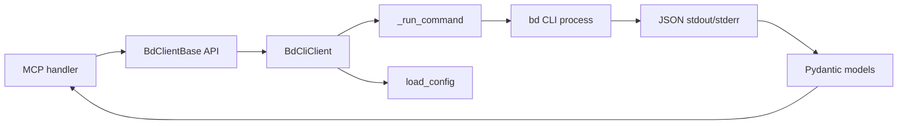

# cli_transport_client 深度解析

`cli_transport_client` 模块的存在意义，不是“把命令行包一层”这么简单。它真正解决的是：MCP 侧需要一个**稳定、可编排、可类型校验**的异步 API，但底层 `bd` 是一个外部进程接口，输出形状并不完全一致、运行环境依赖很多、失败模式也偏“系统级”（路径、权限、工作目录、版本）。这个模块就像一个“协议减震器”：上游拿到统一的 `BdClientBase` 语义，下游的 CLI 噪声被吸收在 `BdCliClient` 内。

## 模块要解决的问题：为什么不能直接 `subprocess("bd ...")`

朴素方案通常是每个 MCP tool handler 各自调用一次 `bd`，然后 `json.loads`。短期看很快，长期会出现三类结构性问题。第一，命令返回形状不统一：有的命令返回 `dict`，有的返回 `list`，有的命令（例如 `dep add`）根本不是 JSON 输出。第二，环境上下文分散：`BEADS_DIR`、`BEADS_DB`、`cwd`、`actor`、`--no-auto-*` 如果散落在各调用点，行为会漂移。第三，错误语义不稳定：`FileNotFoundError`、非零退出码、JSON 解析失败如果不统一包装，上层会被迫理解进程细节。

`BdCliClient` 的设计目标就是把这些复杂性集中：统一参数映射、统一命令执行、统一异常分层、统一输出模型校验。

## 心智模型：把它看作“外部进程适配网关”

一个实用类比是“机场地面代理”。旅客（上游 MCP 调用）只关心“我要去哪里”（`ready/list/show/create/...`），地面代理负责把需求翻译成航班系统可执行动作（CLI 参数）、检查证件（模型校验）、处理异常（航班取消/延误）。旅客不需要直接和塔台协议打交道。

在代码中，这个心智模型对应三层：

1. `BdClientBase`：定义“语义航班表”——有哪些能力、入参出参是什么。
2. `BdCliClient`：具体“地面执行层”——把语义调用翻成 `bd` 命令并执行。
3. 错误与工厂：`BdError` 家族 + `create_bd_client(...)`，负责把底层失败和通道选择变成可控行为。

## 架构与数据流



关键路径可以按“读操作”和“写操作”理解。

读操作（例如 `ready` / `list_issues` / `blocked`）的主链路是：参数模型（`ReadyWorkParams`、`ListIssuesParams`、`BlockedParams`）进入客户端方法，方法把可选字段映射成 CLI flags，调用 `_run_command(..., --json)`，拿到输出后做类型分支（`list`/`dict`），再通过 `Issue.model_validate(...)` 或 `BlockedIssue.model_validate(...)` 回填强类型对象。

写操作（例如 `create` / `update` / `claim` / `close` / `reopen` / `add_dependency`）同样先做参数到 flags 的翻译，但更强调行为语义：例如 `claim` 固定走 `update <id> --claim`，把“原子认领”语义绑定到底层命令；`init` 特意不复用 `_run_command`，因为它不是 JSON 通道且有“不能带 `--db`”的约束。

## 组件深潜

### `BdClientBase`

`BdClientBase` 是 transport 抽象层，定义了 MCP 侧依赖的完整能力面：`ready`、`list_issues`、`show`、`create`、`update`、`claim`、`close`、`reopen`、`add_dependency`、`quickstart`、`stats`、`blocked`、`init`、`inspect_migration`、`get_schema_info`、`repair_deps`、`detect_pollution`、`validate`。

设计意图是“语义稳定优先”。也就是说，上层应该依赖这些动作语义，而不是依赖某个 transport 的细节（CLI 参数或 daemon RPC envelope）。这让 `BdCliClient` 与 `BdDaemonClient` 可替换，且便于测试替身实现。

### `BdCliClient.__init__`、`load_config()` 与配置收敛

构造函数参数都可显式传入，但默认会从 `load_config()` 读取。这个选择非常关键：它允许调用方按需覆盖，同时保证默认行为集中在配置模块而不是散落常量。

`BdCliClient` 持有的状态（`bd_path`、`beads_dir`、`beads_db`、`actor`、`no_auto_flush`、`no_auto_import`、`working_dir`）本质是一次“命令执行上下文快照”。对象创建后，多次调用共享同一上下文，减少重复拼装和偏差。

### `_get_working_dir()` 与数据库发现语义

`_get_working_dir()` 优先使用显式 `working_dir`，否则回退 `os.getcwd()`。这不是小细节：`bd` 的数据库定位与当前目录相关（注释里也明确 `--db` 已移除，走 cwd 自动发现）。因此 working directory 在这个模块里不是“执行目录”，而是“数据库路由输入”。

### `_global_flags()`：全局执行策略注入点

`_global_flags()` 统一处理 `--actor`、`--no-auto-flush`、`--no-auto-import`。它的价值在于把“横切选项”集中，避免每个命令都重复拼接且可能遗漏。

这里也体现一个权衡：集中式拼装让一致性更高，但意味着新增全局 flag 必须修改该函数，否则不会自动渗透到所有命令。

### `_run_command()`：模块最热路径

`_run_command()` 是 `BdCliClient` 的核心执行器，承担了四项职责：

- 统一命令组装：`[bd_path, *args, *global_flags, "--json"]`
- 统一环境注入：`BEADS_DIR` 优先，退回 `BEADS_DB`（兼容旧路径）
- 统一进程执行策略：`stdin=DEVNULL`、捕获 stdout/stderr、支持 `cwd`
- 统一失败语义：
  - `FileNotFoundError` → `BdNotFoundError`
  - 非零退出码 → `BdCommandError`
  - JSON 解析失败 → `BdCommandError`

为什么要 `stdin=DEVNULL`？因为 MCP server 本身可能有 stdin 语义，如果子进程继承 stdin，容易出现阻塞或意外交互。这里是一个典型“正确性优先于简洁”的选择。

### `_sanitize_issue_deps(issue)`：兼容性补丁，不是清洗噪声

该函数处理一个非显然契约错位：`bd list/ready/blocked --json` 可能返回“原始依赖记录”（含 `depends_on_id` 等），但 `Issue` 模型期待的是 `LinkedIssue` 富化结构。策略是：检测到 raw 记录时，把 `dependencies/dependents` 置空，并把数量写到 `dependency_count/dependent_count`。

这个设计偏向“保主流程可用”。它牺牲了依赖详情，但保证模型校验成功，调用方至少能得到主 issue 列表与计数信息。

### 关键业务方法的行为差异

`ready()` 与 `list_issues()` 都支持 `labels`（AND）和 `labels_any`（OR），并把 `unassigned` 映射到不同 CLI flag（`ready` 用 `--unassigned`，`list` 用 `--no-assignee`）。这说明该模块并不是简单字段直传，而是做了命令级语义翻译。

`show()`、`update()`、`claim()` 都显式处理“返回值可能是数组”的情况，抽取首元素并做空数组检查。这是对 CLI 历史输出行为的兼容处理，避免上游感知这种不一致。

`add_dependency()` 与 `quickstart()`、`init()` 刻意不走 `_run_command()`，因为它们并不遵循统一 JSON 返回约定。这里的重复代码是有意为之：为了让“异常行为命令”与“JSON 命令”分开，减少核心路径的分支复杂度。

`inspect_migration()`、`get_schema_info()`、`repair_deps()`、`detect_pollution()`、`validate()` 体现了该客户端不仅服务日常 issue CRUD，也覆盖诊断/维护类命令。它们都要求返回 `dict[str, Any]`，并在形状不符时抛 `BdCommandError`。

### `_check_version()`：预防性守门

该方法执行 `bd version`，解析语义版本并校验 `>= 0.9.0`。它当前在文件中没有被自动调用，但设计意图明确：把“协议兼容性”前置为可诊断失败，而不是在运行中出现难定位行为差异。

这也是一个贡献者要注意的点：如果引入新 CLI 特性依赖，最好考虑在合适生命周期调用版本检查。

### 异常类型：`BdError` 家族

`BdNotFoundError` 用 `installation_message(...)` 提供安装指引；`BdCommandError` 保留 `stderr` 与 `returncode`；`BdVersionError` 表达版本不兼容。这个分层让上层能按错误类别处理，而不是全都当通用异常。

## 依赖关系与契约边界

从调用方向看，这个模块对外部依赖主要有三类。第一类是配置：`load_config()`/`Config` 提供默认路径和校验。第二类是数据契约：`Issue`、`Stats`、`BlockedIssue` 及各参数模型。第三类是系统接口：`asyncio.create_subprocess_exec`、`os.environ`、`cwd`。

从“谁调用它”看，根据模块树它处于 MCP Integration 下的传输客户端层，供上层 MCP 处理逻辑通过 `BdClientBase` 语义调用。该层对调用方的隐式契约是：传入的参数应是模型对象，返回值将是模型实例或标准异常，不应直接依赖 CLI 原始输出文本。

另外，`create_bd_client(...)` 展示了与 daemon 客户端的连接关系：当 `prefer_daemon=True` 时，它会搜索 `.beads/bd.sock`（本地向上查找，找不到再看 `~/.beads/bd.sock`），若可用则构造 `BdDaemonClient`，否则静默回退 `BdCliClient`。这说明 `cli_transport_client` 在整体架构里承担“可靠兜底”角色。

## 设计取舍与理由

这里有几个值得新成员重点理解的取舍。

首先是“统一抽象 vs transport 特性泄漏”。项目选择了 `BdClientBase` 统一接口，优点是上层稳定；代价是两种 transport 能力不齐时需要回退策略。结合现状（daemon 仍有未覆盖命令），这是合理折中。

其次是“严格 JSON 契约 vs 命令兼容性”。`_run_command()` 强制 `--json` 并严格解析，失败即报错。这提高了可预测性，但也意味着 CLI 输出一旦变化会立即暴露问题。对 MCP 这种自动化系统来说，这通常比“吞错继续”更安全。

再次是“可用性优先 vs 数据完整性”。`_sanitize_issue_deps()` 在依赖详情与主流程可用之间选择后者。它避免模型爆炸，但调用方如果需要依赖详情，应该进一步调用 `show()` 等更稳定接口拉全量。

## 如何使用与扩展

典型用法：

```python
from beads_mcp.bd_client import create_bd_client
from beads_mcp.models import ListIssuesParams

client = create_bd_client(prefer_daemon=False)
issues = await client.list_issues(ListIssuesParams(status="open", limit=20))
```

如果你明确希望“有 daemon 就用 daemon，否则 CLI 兜底”：

```python
client = create_bd_client(prefer_daemon=True, working_dir="/path/to/repo")
```

新增命令时，建议遵循当前模式：先在 `BdClientBase` 声明抽象方法，再在 `BdCliClient` 实现；如果该命令不返回 JSON，不要硬塞进 `_run_command()`，可参考 `add_dependency()` 的单独执行路径。

## 边界情况与常见坑

最容易踩的坑是把所有命令都当作统一 JSON 响应。`show/update/claim` 可能返回数组；`dep add`、`quickstart`、`init` 不走 JSON 模式。第二个坑是忽略 working directory 对数据库路由的影响，导致“命令成功但读写到错误仓库”。第三个坑是删除 `_sanitize_issue_deps()` 这类“看起来多余”的逻辑，会直接打破 `Issue` 校验。第四个坑是把 `BEADS_DB` 当主路径继续扩展；从注释看它是兼容通道，首选应是 `BEADS_DIR` + cwd 自动发现。

还有一个隐性点：`create_bd_client(prefer_daemon=True)` 的回退是“静默”的（异常被吞并后回到 CLI）。这提升了可用性，但降低了可观测性；如果你在做性能排查，需要显式记录最终选用的 client 类型。

## 参考

- [MCP Integration](MCP Integration.md)
- [mcp_models_and_data_contracts](mcp_models_and_data_contracts.md)
- [Configuration](Configuration.md)
