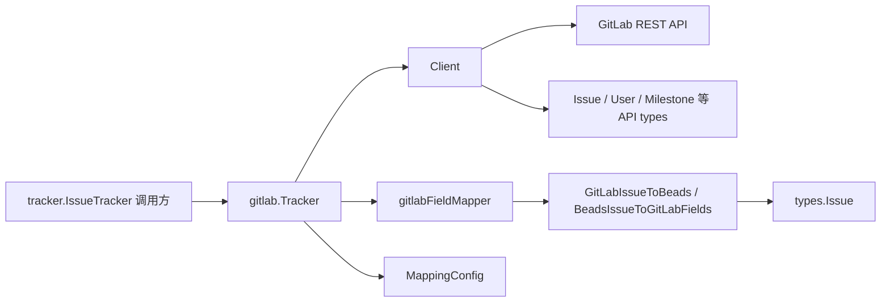

# client_and_api_types

`client_and_api_types` 可以把它理解成 GitLab 集成里的“海关与翻译层”：一边面对 GitLab REST API 的原生 JSON/分页/限流语义，另一边面对系统内部统一的 issue 语义。它存在的核心原因不是“多写几个 struct”，而是隔离**外部 API 的不稳定细节**（字段差异、状态词汇、标签约定、分页头、429 重试）与**内部领域模型的稳定契约**。如果直接在业务流程里到处拼 GitLab URL、解析标签、映射状态，代码会快速变成脆弱耦合网——任何 GitLab 字段变化都会在多个路径同时炸裂。

## 架构角色与数据流



从架构上看，`Client` 是“传输层网关”，`Issue/User/Project...` 这些类型是“协议模型”，`MappingConfig + 映射函数` 是“语义翻译器”，而 `Tracker` 则是把上面三者编排成 `tracker.IssueTracker` 契约的“适配器”。

一次典型 `FetchIssues` 数据流是：调用方通过 `tracker.IssueTracker` 接口进入 `(*Tracker).FetchIssues`，它先把 `open` 纠正为 GitLab 的 `opened`，再根据 `opts.Since` 选择 `Client.FetchIssues` 或 `Client.FetchIssuesSince`。`Client` 内部用 `buildURL` + `doRequest` 处理鉴权、分页、429 重试，返回 `[]Issue`（GitLab 协议对象）。随后 `Tracker` 把每个 `Issue` 转成 `tracker.TrackerIssue`（`gitlabToTrackerIssue`），供上层同步引擎继续处理。

反向路径（本地推送到 GitLab）是：`(*Tracker).CreateIssue` / `(*Tracker).UpdateIssue` 先调用 `BeadsIssueToGitLabFields` 将 `*types.Issue` 翻译为 GitLab 更新字段（title/description/labels/state_event/weight），再交给 `Client.CreateIssue` / `Client.UpdateIssue` 发请求，最后再回填为 `tracker.TrackerIssue`。

## 心智模型：三层翻译管线

理解这个模块最有效的方式，是把它看成三层翻译管线：

第一层是“线协议层”（`Client` + API structs），只关心 HTTP 与 JSON，不关心业务意图；第二层是“词汇层”（`parseLabelPrefix`、`PriorityMapping`、`StatusMapping`、`typeMapping`、`MappingConfig`），把 GitLab 的表达词汇映射成系统词汇；第三层是“语义层”（`GitLabIssueToBeads` / `BeadsIssueToGitLabFields` / `gitlabFieldMapper`），把字段组合成可执行的业务含义（优先级、状态、类型、依赖）。

这个分层的价值在于：当 GitLab API 变化时，大多改动停留在第一层；当团队想改标签约定时，多数改动在第二层；当同步策略变化时，才会触及第三层。

## 组件深潜

### `Client`

`Client`（`Token`, `BaseURL`, `ProjectID`, `HTTPClient`）负责所有 GitLab HTTP 调用。`NewClient` 给出默认超时（`DefaultTimeout`），`WithHTTPClient`/`WithEndpoint` 采用“返回新对象”的轻量不可变风格，减少调用方无意篡改共享客户端配置的风险。

`doRequest` 是热点路径：它做 JSON 序列化、加 `PRIVATE-TOKEN`、执行请求、限制响应体最大 50MB、处理 2xx 判断、并在 429 时做指数退避（`RetryDelay * 2^attempt`，最多 `MaxRetries`）。这里的设计偏“稳健正确”而不是“极致性能”：例如每次都统一 marshal/read/校验，代码更直观，错误语义更一致。

分页逻辑在 `FetchIssues` / `FetchIssuesSince`：依赖 `X-Next-Page` 头前进，并用 `MaxPages` 防止服务端返回异常分页头导致死循环。这个上限是一个典型的防御式工程权衡：宁可在异常时失败，也不让同步线程无限跑。

### GitLab 协议类型：`Issue`, `IssueLink`, `IssueLinks`, `User`, `Milestone`, `Label`, `Project`, `Namespace`

这些结构体本质是“API 契约镜像”，字段与 GitLab JSON 一一对齐。例如 `Issue` 同时有 `ID`（全局）和 `IID`（项目内），这对后续链接与 external ref 解析非常关键；`IssueLink` 用 `SourceIssue`/`TargetIssue` + `LinkType` 表示依赖关系方向；`Project` 里保留 `PathWithNamespace` 和 `Namespace`，为多项目场景预留上下文。

这层的设计选择是**高保真映射**而非“先抽象再落地”。好处是调试时可直接对照 GitLab API 文档；代价是上层必须显式做语义归一化（由映射层承担）。

### 映射配置：`MappingConfig` 与默认映射常量

`MappingConfig` 提供四张映射表：`PriorityMap`, `StateMap`, `LabelTypeMap`, `RelationMap`。`DefaultMappingConfig` 会复制 `PriorityMapping` 与 `typeMapping`，避免调用方拿到 map 后意外改写全局“单一事实来源”。这是一个很实用的防共享可变状态策略。

`PriorityMapping` / `StatusMapping` / `typeMapping` 与 `parseLabelPrefix` 共同定义了“GitLab scoped labels -> beads 语义”的词法规则。例如 `priority::high` 会被拆成 `("priority", "high")`，再进入优先级映射。

### 核心转换函数：`GitLabIssueToBeads` 与 `BeadsIssueToGitLabFields`

`GitLabIssueToBeads` 把 GitLab 的“松散表达”压成内部 `types.Issue`：

- `IssueType` 来自 `typeFromLabels`
- `Priority` 来自 `priorityFromLabels`（默认中优先级 2）
- `Status` 由 `statusFromLabelsAndState` 决定（`state=closed` 优先）
- `Labels` 通过 `filterNonScopedLabels` 去掉 `priority/status/type` 这些控制标签
- `Weight` 转 `EstimatedMinutes`（1 weight = 60 分钟）
- 构造 `SourceSystem = gitlab:<projectID>:<iid>` 与 `ExternalRef = WebURL`

`BeadsIssueToGitLabFields` 走反向路径，生成可直接提交 GitLab API 的字段 map。它将类型/优先级/状态重新编码为 scoped labels，并在 `StatusClosed` 时写 `state_event=close`。这里体现了一个设计取向：**把 GitLab 的“状态 + 标签”混合语义统一收口在一个函数**，而不是散落在调用点。

### `gitlabFieldMapper` 与 `Tracker`

`gitlabFieldMapper` 是对 `tracker.FieldMapper` 的实现。它并不重复造轮子，而是复用 `GitLabIssueToBeads` 与 `BeadsIssueToGitLabFields`，保证 tracker 框架路径与直接转换路径语义一致。

`Tracker` 负责实现 `tracker.IssueTracker`：

- `Init` 从 `storage.Storage` 读取 `gitlab.token`, `gitlab.url`, `gitlab.project_id`，并回退到环境变量 `GITLAB_TOKEN`, `GITLAB_URL`, `GITLAB_PROJECT_ID`
- `FetchIssues`/`FetchIssue`/`CreateIssue`/`UpdateIssue` 调度 `Client`
- `BuildExternalRef` 优先返回 issue.URL，否则降级为 `gitlab:<identifier>`
- `IsExternalRef` + `ExtractIdentifier` 用正则 `/issues/(\d+)` 处理 GitLab URL

它的角色是“集成边界面”，对上提供统一 tracker 接口，对下固定 GitLab 实现细节。

### 其他类型：`stateCache`

`stateCache` 目前只包含 `Labels` 与 `Milestones` 两个切片，是轻量缓存容器。就当前代码可见范围，它是数据结构预留点，不承担复杂逻辑。

## 依赖关系分析（谁调用它、它调用谁）

从模块树和实际调用看，本模块向下依赖 GitLab API 与标准库 HTTP/JSON；向上被 GitLab 适配层使用，进而接入 Tracker Integration Framework。

在代码级调用上，`Tracker` 直接依赖 `Client` 与映射函数：`(*Tracker).FetchIssues -> (*Client).FetchIssues/FetchIssuesSince`，`(*Tracker).CreateIssue/UpdateIssue -> BeadsIssueToGitLabFields -> (*Client).CreateIssue/UpdateIssue`。`gitlabFieldMapper.IssueToBeads` 则调用 `GitLabIssueToBeads`，再转成 `tracker.IssueConversion`。这些路径意味着：如果 `Issue` 字段语义改变，最先受影响的是映射函数，其次才是 tracker 上层。

与外部契约的关键耦合有两个：一是 `tracker.IssueTracker` 接口（见 [Tracker Integration Framework](tracker_integration_framework.md)），二是内部领域对象 `types.Issue`（见 [Core Domain Types](Core Domain Types.md)）。本模块本质上就是这两个契约之间的“胶水层”。

## 关键设计取舍

这个模块的多数选择偏向“可维护的正确性优先”。例如它没有把所有映射做成高度可配置 DSL，而是提供 `MappingConfig` + 明确默认规则，牺牲一点灵活性，换来可读性与可测试性；`statusFromLabelsAndState` 里 `closed` 状态强优先，也是为了避免标签和状态冲突时产生不一致。

另一个取舍是耦合粒度：`BeadsIssueToGitLabFields` 直接生成 `map[string]interface{}`，对 GitLab API 字段名有显式耦合。这让调用简单直接，但 GitLab 字段若变更，需要集中调整该函数。考虑这是 API 适配层，这种“把耦合放在边界”是合理的。

`doRequest` 的重试策略也体现取舍：明确处理 429 限流和网络错误，但并未对所有 5xx 做复杂重试矩阵，保持实现简单可预测。

## 使用方式与示例

最常见是通过 `Tracker` 间接使用；若你在做低层调试，也可直接用 `Client`。

```go
ctx := context.Background()
client := gitlab.NewClient(token, "https://gitlab.com", "group/project")
issues, err := client.FetchIssues(ctx, "opened")
if err != nil {
    // handle error
}
_ = issues
```

通过 tracker 框架使用（更接近生产路径）：

```go
var t tracker.IssueTracker = &gitlab.Tracker{}
if err := t.Init(ctx, store); err != nil {
    // missing config or invalid setup
}
list, err := t.FetchIssues(ctx, tracker.FetchOptions{State: "open"})
_ = list
```

如果你要改字段语义，优先修改 `MappingConfig` 与转换函数，而不是在 `Tracker` 的业务流程里塞特殊分支。

## 新贡献者要特别注意的坑

`BaseURL` 与 `DefaultAPIEndpoint` 有隐含契约：`buildURL` 会追加 `"/api/v4"`，因此 `BaseURL` 应是实例根 URL（如 `https://gitlab.com`），否则可能出现重复路径。

`doRequest` 里请求体重建只在 429 分支显式处理；如果你未来扩展“对其他错误也重试”，要确认 body reader 可重复读取，否则 POST/PUT 重试可能发送空体。

`statusFromLabelsAndState` 中 `closed` 绝对优先，且状态标签只识别 `in_progress/blocked/deferred`。这意味着某些自定义 `status::*` 标签会被忽略，属于当前设计的有意收敛。

`issueLinksToDependencies` 会为每个 link 生成依赖项；若 link 数据不完整（source/target 缺失）可能得到 `ToGitLabIID=0` 的结果，调用方在落库前应做防御校验。

最后，`filterNonScopedLabels` 会剥离 `priority/status/type` 控制标签，这是为了避免内部 labels 被“控制语义”污染，但也意味着这三类标签不会原样保留到 `types.Issue.Labels`。

## 参考

- [tracker_adapter](tracker_adapter.md)
- [field_mapping_layer](field_mapping_layer.md)
- [sync_and_conversion_types](sync_and_conversion_types.md)
- [Core Domain Types](Core Domain Types.md)
- [Tracker Integration Framework](tracker_integration_framework.md)
