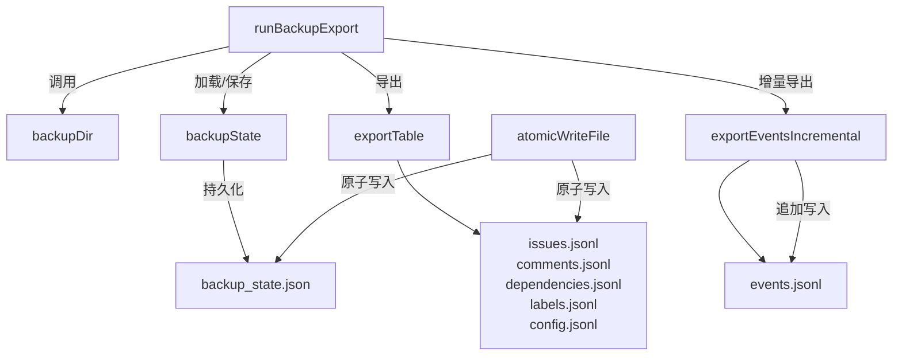

# backup_export 模块技术深度解析

## 1. 模块概览与问题背景

**backup_export** 模块解决的是一个关键的数据安全问题：如何安全、高效地备份 Beads 问题跟踪系统的所有数据，同时支持增量和全量备份，并确保备份过程的原子性和一致性。

### 核心问题空间

在一个基于 Dolt 数据库的版本控制系统中，简单的数据库快照备份面临以下挑战：

1. **数据完整性**：需要备份多个关联表（issues、events、comments、dependencies、labels、config）
2. **增量效率**：events 表可能会非常大，全量备份每次都导出所有数据不现实
3. **原子性**：备份过程中不能让系统处于不一致状态
4. **可移植性**：备份格式需要简单、人类可读、便于恢复
5. **Wisp 兼容**：需要兼容标准问题和 "wisp" 两种数据模型

这个模块的设计洞察是：**使用 JSONL（JSON Lines）作为备份格式，结合高水位标记（high-water mark）实现增量备份，并通过原子文件写入确保数据一致性**。

## 2. 核心架构与数据流

### 核心组件架构图



### 核心抽象与设计思路

这个模块围绕以下几个核心抽象构建：

1. **backupState**：增量备份的"水位标记"，记录上次备份的 Dolt 提交哈希、最后事件 ID 和各种计数
2. **JSONL 导出**：每行一个 JSON 对象，便于流式处理和恢复
3. **原子写入**：对于除 events 外的所有表，使用临时文件+重命名的原子写入模式
4. **增量事件导出**：events 表使用高水位标记+追加模式

### 数据流与执行流程

当执行 `runBackupExport` 时，数据流如下：

1. **准备阶段**：
   - 确定备份目录位置（优先使用配置的 git 仓库，否则使用默认 .beads/backup）
   - 加载上次的备份状态

2. **变更检测阶段**：
   - 比较当前 Dolt 提交哈希与上次备份的哈希
   - 如果没有变化且未强制备份，则跳过

3. **全量表导出阶段**：
   - 使用 `exportTable` 原子写入 issues、comments、dependencies、labels、config 表
   - 自动检测并处理 wisps 表的存在

4. **增量事件导出阶段**：
   - 使用 `exportEventsIncremental` 增量导出新事件
   - 首次运行时导出全部事件，后续追加新事件

5. **状态更新阶段**：
   - 更新备份状态的高水位标记
   - 原子写入新的备份状态

## 3. 核心组件深度解析

### backupState：增量备份的记忆核心

```go
type backupState struct {
	LastDoltCommit string    `json:"last_dolt_commit"`
	LastEventID    int64     `json:"last_event_id"`
	Timestamp      time.Time `json:"timestamp"`
	Counts         struct {
		Issues       int `json:"issues"`
		Events       int `json:"events"`
		Comments     int `json:"comments"`
		Dependencies int `json:"dependencies"`
		Labels       int `json:"labels"`
		Config       int `json:"config"`
	} `json:"counts"`
}
```

**设计意图**：
- `LastDoltCommit`：利用 Dolt 的版本控制特性，作为全量备份的快照点
- `LastEventID`：events 表的高水位标记，实现增量导出
- `Counts`：提供备份完整性的验证指标
- 这种双重快照+增量的混合策略，平衡了备份大小和恢复复杂度

### backupDir：灵活的备份位置管理

**设计亮点**：
- 支持配置 `backup.git-repo` 将备份放入另一个 git 仓库
- 自动处理 `~` 展开为用户主目录
- 优雅降级：如果配置的 git 仓库无效，自动回退到默认位置
- 确保目录存在（权限 0700，只有所有者可读写）

### exportTable：动态列扫描与通用导出

```go
func exportTable(ctx context.Context, db *sql.DB, dir, filename, query string) (int, error)
```

**核心技术细节**：
- 使用 `SELECT *` 动态获取所有列，适应 schema 演进
- 动态列扫描：不依赖固定列定义，而是在运行时获取列信息
- 构建 map[string]interface{} 进行 JSON 序列化
- 原子写入：先写临时文件再重命名，防止崩溃安全

**设计理由**：
- **Schema 演进友好**：即使表结构变化也能正常工作
- **零维护**：不需要在代码中硬编码列名
- **一致性**：原子写入确保备份文件始终处于一致状态

### exportEventsIncremental：增量事件导出的精妙设计

```go
func exportEventsIncremental(ctx context.Context, db *sql.DB, dir string, state *backupState, hasWisps bool) (int, error)
```

**核心机制**：
- 首次运行（LastEventID=0）：全量快照，原子写入
- 后续运行：增量追加，直接写入现有文件
- 追踪最高事件 ID 作为下一次的高水位标记
- 支持 wisps_events 表的合并导出

**为什么 events 表使用不同策略？**
因为 events 表是**只追加**（append-only）的，这使得增量追加是安全且高效的。其他表可能有更新和删除，所以每次都需要全量快照。

### atomicWriteFile：崩溃安全的文件写入

```go
func atomicWriteFile(path string, data []byte) error
```

**实现细节**：
1. 创建临时文件（.backup-tmp-*）
2. 写入数据
3. 调用 Sync() 确保数据写入磁盘
4. 关闭文件
5. 重命名临时文件到目标位置

**为什么需要 Sync()？**
防止操作系统的 write-back 缓存导致的数据丢失。即使进程崩溃或断电，数据也能确保在磁盘上。

## 4. 设计决策与权衡分析

### 设计决策 1：JSONL vs 二进制格式

| 维度 | JSONL | 二进制格式 |
|------|-------|-----------|
| 可读性 | ✅ 高，可直接检查 | ❌ 低 |
| 恢复工具 | ✅ 通用工具（jq, grep） | ❌ 专用工具 |
| 空间效率 | ❌ 较低 | ✅ 较高 |
| 兼容性 | ✅ 跨语言，跨版本 | ❌ 版本相关 |

**决策理由**：选择 JSONL 是因为**可观测性和可恢复性**比空间效率更重要。备份数据需要在紧急情况下能够被人工检查和恢复，而不需要特殊工具。

### 设计决策 2：双重快照+增量策略

**权衡**：
- **events 表**：只追加，使用高水位标记增量
- **其他表**：可能有更新删除，每次全量快照

**为什么不全部增量？**
因为增量跟踪更新和删除的复杂度很高，而且其他表相对较小，全量快照的成本可接受。events 表通常是最大的表，而且是只追加的，适合增量。

### 设计决策 3：原子写入 vs 直接写入

**原子写入的成本**：
- 需要额外的临时文件空间
- 多了一次重命名操作

**收益**：
- 崩溃安全：备份文件永远不会处于部分写入状态
- 一致性：要么备份成功，要么保持上次的备份

**决策理由**：备份的**一致性**比性能更重要。部分写入的备份文件是无用的，甚至可能误导恢复过程。

### 设计决策 4：Wisp 表的动态检测

```go
hasWisps := tableExistsCheck(ctx, db, "wisps")
```

**设计理由**：
- 保持向后兼容：旧版本没有 wisps 表也能正常工作
- 优雅演进：新版本引入 wisps 表时不需要修改备份代码
- 统一导出：将 issues 和 wisps 合并导出，简化恢复逻辑

## 5. 模块依赖与数据契约

### 输入依赖

1. **internal.storage.storage.Storage**：
   - 使用 `store.GetCurrentCommit(ctx)` 获取当前 Dolt 提交哈希
   - 使用 `store.DB()` 获取底层 SQL 数据库连接

2. **配置依赖**：
   - `config.GetString("backup.git-repo")`：获取备份 git 仓库配置

### 输出数据契约

备份目录包含以下文件：

| 文件名 | 内容 | 格式 |
|---------|------|------|
| backup_state.json | 备份状态元数据 | JSON |
| issues.jsonl | 问题数据（包含 wisps） | JSONL |
| events.jsonl | 事件数据 | JSONL |
| comments.jsonl | 评论数据 | JSONL |
| dependencies.jsonl | 依赖关系 | JSONL |
| labels.jsonl | 标签数据 | JSONL |
| config.jsonl | 配置数据 | JSONL |

## 6. 使用场景与常见模式

### 典型使用流程

```go
// 常规备份（跳过无变更）
state, err := runBackupExport(ctx, false)

// 强制备份（即使无变更也执行）
state, err := runBackupExport(ctx, true)
```

### 自定义备份位置

通过配置设置备份位置：

```
backup.git-repo = "~/my-backups-repo"
```

这会将备份放在 `~/my-backups-repo/backup/` 目录下。

## 7. 边缘情况与潜在陷阱

### 边缘情况 1：首次备份

- 检测到 `LastEventID = 0`，events 表全量导出，原子写入

### 边缘情况 2：无变更备份

- 当前 Dolt 提交哈希与上次备份相同，且未强制备份，直接返回

### 边缘情况 3：Wisps 表不存在

- 自动检测并跳过 wisps 相关的 UNION ALL 查询

### 陷阱 1：备份目录权限

- 确保备份目录权限为 0700，防止其他用户读取敏感数据

### 陷阱 2：events.jsonl 损坏

- 如果 events.jsonl 损坏，需要删除 backup_state.json 并重新全量备份

### 陷阱 3：磁盘空间不足

- 原子写入需要额外的临时文件空间，确保磁盘空间足够

## 8. 扩展与维护指南

### 添加新表备份

要添加新表的备份，在 `runBackupExport` 中添加：

```go
n, err = exportTable(ctx, db, dir, "new_table.jsonl",
    "SELECT * FROM new_table ORDER BY id")
if err != nil {
    return nil, fmt.Errorf("backup new_table: %w", err)
}
state.Counts.NewTable = n
```

并在 `backupState` 结构中添加对应的计数字段。

### 自定义增量备份策略

对于新的只追加表，可以参考 `exportEventsIncremental` 的模式：

1. 在 `backupState` 中添加高水位标记字段
2. 实现类似的增量导出函数
3. 在 `runBackupExport` 中调用

## 9. 总结

**backup_export** 模块是一个精心设计的数据安全组件，它通过：

- **JSONL 格式**保证了备份的可观测性和可移植性
- **双重快照+增量策略**平衡了备份大小和恢复复杂度
- **原子写入**确保了备份的一致性和崩溃安全性
- **动态列扫描**适应了 schema 演进
- **灵活的备份位置**支持 git 仓库集成

这个模块展示了如何在数据安全、性能、可观测性之间做出优雅的权衡。
