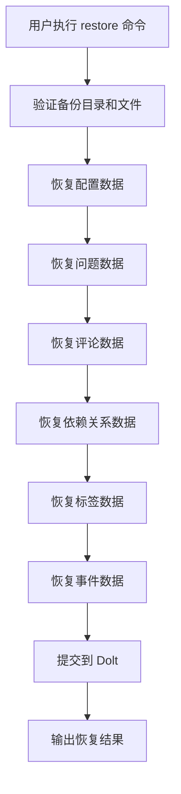

# backup_restore 模块技术深度解析

## 1. 问题与解决方案

在软件开发过程中，数据备份与恢复是至关重要的功能。beads 系统使用 Dolt 作为底层存储，但用户可能会遇到数据库损坏、机器崩溃或者需要在新环境中重新初始化数据库的情况。此时，简单的 Dolt 提交可能不足以恢复完整的历史状态，特别是当用户需要将备份数据纳入版本控制时。

`backup_restore` 模块解决的核心问题是：**如何从 JSONL 格式的备份文件中完整恢复 beads 数据库的所有数据，包括配置、问题、评论、依赖关系、标签和事件，同时确保数据的一致性和完整性**。

为什么选择 JSONL 格式？因为它是文本格式，易于版本控制、查看和调试，同时保持了结构化数据的特性。这与 Dolt 的二进制格式形成了很好的互补。

## 2. 架构与核心概念

### 2.1 核心概念

**恢复流程**：一个有顺序的、分步骤的数据恢复过程，按照依赖关系的顺序恢复不同类型的数据。

**dry-run 模式**：允许用户预览恢复操作的结果，而不实际修改数据库。

**restoreResult**：跟踪恢复操作的统计信息，包括恢复的各类数据数量和警告数量。

### 2.2 架构流程



这个架构体现了**依赖关系驱动的恢复顺序**：配置必须最先恢复（因为它可能影响后续操作），然后是问题（其他数据都引用问题），最后是各种关联数据。

## 3. 核心组件深度解析

### 3.1 restoreResult 结构体

```go
type restoreResult struct {
    Issues       int `json:"issues"`
    Comments     int `json:"comments"`
    Dependencies int `json:"dependencies"`
    Labels       int `json:"labels"`
    Events       int `json:"events"`
    Config       int `json:"config"`
    Warnings     int `json:"warnings"`
}
```

**设计意图**：这是一个纯粹的数据统计结构，用于跟踪恢复操作的成果。它既用于程序内部统计，也用于 JSON 格式输出给用户。每个字段都直接对应一种数据类型的恢复数量，让用户清晰地看到恢复了什么。

### 3.2 runBackupRestore 函数

这是模块的核心编排函数，负责协调整个恢复流程。

**核心机制**：
1. **顺序恢复**：严格按照配置 → 问题 → 评论 → 依赖 → 标签 → 事件的顺序执行
2. **dry-run 支持**：每个恢复函数都接收 dry-run 参数，在模拟模式下不实际修改数据库
3. **统计收集**：累加每个步骤的恢复数量和警告
4. **最终提交**：在非 dry-run 模式下，将所有更改作为一个 Dolt 提交

**为什么这个顺序很重要？**
- 配置可能包含 `issue_prefix`，会影响后续问题的处理
- 问题是其他所有数据的父实体，必须先存在才能引用
- 评论、依赖、标签都引用问题 ID
- 事件通常记录其他操作的历史，放在最后恢复

### 3.3 restoreIssues 函数

这是最复杂的恢复函数之一，体现了几个重要的设计决策。

**核心特点**：
1. **原始 SQL 插入**：不使用高级 API，直接构建 SQL 语句
2. **动态列处理**：从 JSON 数据中自动提取列名和值
3. **前缀自动检测**：如果配置中没有设置前缀，从第一个问题 ID 中提取
4. **使用 restoreTableRow**：委托实际的插入操作给通用函数

**为什么使用原始 SQL 而不是高级 API？**
代码注释中解释得很清楚：
- 避免类型不匹配问题（例如数据库中的 0/1 整数与 Go 的布尔类型）
- 精确匹配备份导出格式
- 避免高级 API 可能带来的副作用

### 3.4 restoreTableRow 函数

这是一个通用的表行恢复函数，用于将 JSON 映射插入到指定表中。

**核心机制**：
1. 从 JSON 映射中提取列名和值
2. 动态构建 `INSERT IGNORE` 语句
3. 使用参数化查询防止 SQL 注入

**关键设计点**：
- 使用 `INSERT IGNORE` 而不是普通的 `INSERT`：这意味着如果行已经存在（通过主键判断），它会静默跳过而不是报错。这使得恢复操作具有幂等性。
- 列名来自备份 JSONL：这是我们自己的导出格式，所以是可信的。

### 3.5 其他恢复函数

每个特定类型的恢复函数（`restoreComments`、`restoreDependencies`、`restoreLabels`、`restoreEvents`）都有类似的模式，但也有各自的特殊处理：

**共同点**：
- 读取 JSONL 文件
- 逐行解析 JSON
- 验证必要字段存在
- 在非 dry-run 模式下执行插入
- 统计数量和警告

**不同点**：
- 每个函数处理特定的数据结构
- 使用针对该表的特定 SQL 语句
- 有些需要特殊的时间解析（`parseTimeOrNow`）

## 4. 依赖关系分析

### 4.1 输入依赖

`backup_restore` 模块依赖以下关键组件：

1. **`dolt.DoltStore`**：提供数据库访问和配置管理
2. **`sql.DB`**：底层数据库连接，用于执行原始 SQL
3. **备份文件**：JSONL 格式的各种数据文件

### 4.2 被调用关系

这个模块主要由 CLI 命令框架调用，用户通过 `bd backup restore` 命令触发。

### 4.3 数据契约

模块与备份文件之间有明确的契约：
- 每个表对应一个 `.jsonl` 文件
- 每行是一个 JSON 对象，对应表中的一行
- JSON 字段名与数据库列名匹配
- 必须至少存在 `issues.jsonl` 文件

## 5. 设计决策与权衡

### 5.1 使用原始 SQL 而非高级 API

**决策**：直接使用 SQL 插入数据，而不是通过 DoltStore 的高级方法。

**原因**：
- 避免类型转换问题（如数据库的 0/1 与 Go 的 bool）
- 精确匹配导出格式
- 绕过高级 API 的验证和副作用（如添加标签时创建事件）
- 对于恢复操作，我们想要精确地重建数据，而不是重新执行业务逻辑

**权衡**：
- ✅ 优点：数据精确性、避免副作用、性能更好
- ❌ 缺点：代码更底层、需要手动处理 SQL、绕过了某些验证

### 5.2 INSERT IGNORE 的使用

**决策**：使用 `INSERT IGNORE` 而不是普通的 `INSERT`。

**原因**：
- 使恢复操作幂等：可以多次运行而不会出错
- 处理部分恢复的情况：如果之前恢复过一部分，不会报错
- 简化错误处理

**权衡**：
- ✅ 优点：幂等性、容错性好
- ❌ 缺点：可能 silently 忽略真正的错误（如果数据有问题）

### 5.3 严格的恢复顺序

**决策**：按照配置 → 问题 → 评论 → 依赖 → 标签 → 事件的固定顺序恢复。

**原因**：
- 数据依赖关系：其他表都引用问题表
- 配置可能影响后续操作
- 外键约束（如果有的话）

**权衡**：
- ✅ 优点：确保数据一致性、避免引用不存在的实体
- ❌ 缺点：不够灵活，不能并行处理

### 5.4 警告而非失败

**决策**：当遇到无效数据或错误时，发出警告并继续，而不是中止整个恢复过程。

**原因**：
- 最大化恢复的数据量：部分数据总比没有好
- 容错性：备份文件可能有小问题，但不应该阻止整个恢复
- 用户体验：用户可以看到哪些出了问题，而不是只看到一个失败消息

**权衡**：
- ✅ 优点：容错性好、用户体验好
- ❌ 缺点：可能错过严重问题（需要用户仔细检查警告）

## 6. 使用指南与常见模式

### 6.1 基本使用

```bash
# 使用默认备份目录
bd backup restore

# 使用指定目录
bd backup restore /path/to/backup

# 预览恢复结果
bd backup restore --dry-run
```

### 6.2 初始化并恢复

```bash
bd init && bd backup restore
```

### 6.3 输出格式

默认是人类可读的格式，也可以使用 JSON 输出：

```bash
bd backup restore --json
```

JSON 输出示例：
```json
{
  "issues": 10,
  "comments": 25,
  "dependencies": 8,
  "labels": 30,
  "events": 50,
  "config": 5,
  "warnings": 0
}
```

## 7. 边缘情况与注意事项

### 7.1 数据完整性

- **部分备份**：如果某些 `.jsonl` 文件缺失，会跳过它们并继续恢复其他文件
- **无效数据**：无效的 JSON 行会被跳过，并发出警告
- **缺失字段**：缺少必要字段的行会被跳过

### 7.2 幂等性

由于使用了 `INSERT IGNORE`，可以多次运行恢复命令而不会出错。但要注意：
- 如果数据已存在，不会被覆盖
- 警告数量可能会增加

### 7.3 配置处理

- 如果 `issue_prefix` 未配置，会从第一个问题 ID 中自动提取
- 配置恢复是可选的，如果 `config.jsonl` 不存在会跳过

### 7.4 时间戳处理

使用 `parseTimeOrNow` 函数：
- 有效 RFC3339 时间会被正确解析
- 无效时间或空字符串会被替换为当前 UTC 时间
- 这确保了数据完整性，即使备份中的时间戳有问题

### 7.5 事务处理

- 整个恢复操作在一个 Dolt 提交中完成
- 如果在恢复过程中发生错误，已经恢复的数据不会自动回滚
- 建议在实际恢复前使用 `--dry-run` 预览

## 8. 总结

`backup_restore` 模块是一个精心设计的数据恢复工具，它体现了几个重要的设计原则：

1. **依赖关系驱动**：按照数据依赖关系确定恢复顺序
2. **容错优先**：在遇到问题时继续执行，最大化恢复的数据量
3. **精确重建**：使用原始 SQL 确保数据精确匹配备份
4. **用户友好**：提供 dry-run 模式和清晰的统计输出

这个模块不是一个简单的"导入工具"，而是一个考虑了数据一致性、容错性和用户体验的完整恢复解决方案。它与 backup_export 模块配合，构成了 beads 系统的数据安全网。
