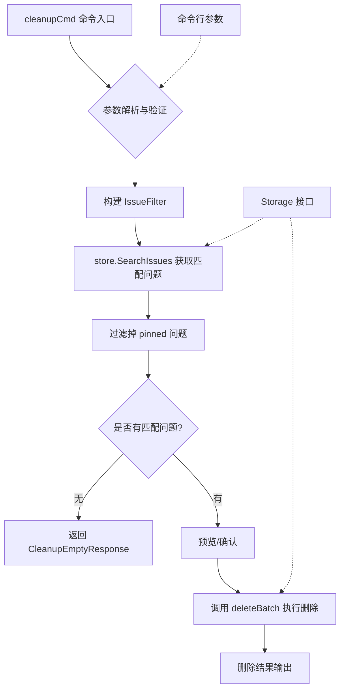
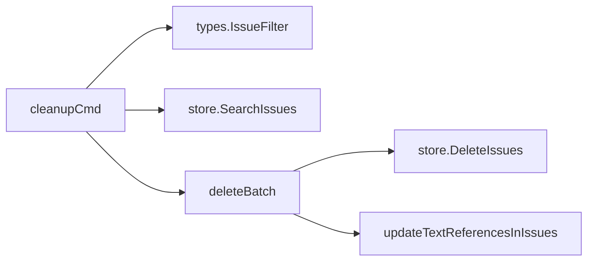

# issue_cleanup 模块技术深度解析

## 1. 问题与定位

### 1.1 为什么需要这个模块？

在长时间的使用过程中，issue tracker 数据库会积累大量已关闭的问题。这些问题虽然不再活跃，但仍然占据着存储空间，可能会影响查询性能和整体用户体验。

简单的"删除所有已关闭问题"方法显然不够，因为：
- 我们需要保留一些重要的已关闭问题（例如 pinned 问题）
- 用户可能希望只删除一定时间之前的已关闭问题
- 特殊类型的问题（如 wisps/临时分子）可能需要单独处理
- 安全性：删除操作不可逆，需要明确的确认机制

### 1.2 模块的核心目标

`issue_cleanup` 模块设计的核心目标是提供一个安全、灵活、可控的机制，用于清理数据库中的已关闭问题，同时提供完善的保护措施，防止误操作。

## 2. 架构与数据流

### 2.1 整体架构



### 2.2 核心组件角色

1. **`cleanupCmd`** - Cobra 命令定义，作为模块入口点
2. **`CleanupEmptyResponse`** - 空结果响应结构，用于JSON输出
3. **参数过滤器** - 构建问题筛选条件的逻辑
4. **安全检查层** - 强制确认机制，防止误操作
5. **批量删除委托** - 调用 `deleteBatch` 函数执行实际删除

### 2.3 数据流程

执行 `bd admin cleanup` 命令时，数据流程如下：

1. **参数解析阶段**：解析命令行标志（`--force`, `--dry-run`, `--cascade`, `--older-than`, `--ephemeral`）
2. **存储初始化阶段**：确保存储层可用
3. **筛选构建阶段**：根据参数构建 `IssueFilter`，包括：
   - 状态筛选：仅已关闭问题
   - 时间筛选：可选的"早于 N 天"条件
   - 类型筛选：可选的"仅临时 wisps"条件
4. **问题获取阶段**：调用 `store.SearchIssues()` 获取匹配问题
5. **保护过滤阶段**：排除 pinned 问题（受保护，不被清理）
6. **确认阶段**：如果没有 `--force` 或 `--dry-run`，显示预览并退出
7. **执行阶段**：调用 `deleteBatch` 函数执行实际删除操作
8. **结果输出阶段**：显示删除统计信息

## 3. 核心组件解析

### 3.1 `CleanupEmptyResponse` 结构

```go
type CleanupEmptyResponse struct {
    DeletedCount int    `json:"deleted_count"`
    Message      string `json:"message"`
    Filter       string `json:"filter,omitempty"`
    Ephemeral    bool   `json:"ephemeral,omitempty"`
}
```

这个结构用于在没有匹配问题时返回 JSON 响应，包含：
- `DeletedCount`：始终为 0，表示没有删除任何问题
- `Message`：人类可读的消息
- `Filter`：可选的筛选描述（如果使用了 `--older-than`）
- `Ephemeral`：可选的标志，表示是否只筛选了临时 wisps

**设计意图**：提供结构化的空响应，便于脚本和自动化工具解析。

### 3.2 `cleanupCmd` 命令定义

这是一个 Cobra 命令，定义了：
- **使用语法**：`cleanup`
- **简短描述**：删除已关闭问题以减少数据库大小
- **详细帮助**：包括安全说明、使用示例和相关命令参考
- **执行逻辑**：包含完整的命令处理流程

**设计特点**：
- 与 [`adminCmd`](cmd-bd-admin.md) 集成，作为高级管理命令的一部分
- 详细的帮助文档，明确区分了与其他维护命令的关系
- 推荐用户优先使用 `bd doctor --fix` 进行常规维护

### 3.3 筛选逻辑

筛选逻辑是该模块的核心，包含多个层次：

1. **基础筛选**：
   ```go
   statusClosed := types.StatusClosed
   filter := types.IssueFilter{
       Status: &statusClosed,
   }
   ```

2. **时间筛选**（如果指定了 `--older-than`）：
   ```go
   if olderThanDays > 0 {
       cutoffTime := time.Now().AddDate(0, 0, -olderThanDays)
       filter.ClosedBefore = &cutoffTime
   }
   ```

3. **类型筛选**（如果指定了 `--ephemeral`）：
   ```go
   if wispOnly {
       wispTrue := true
       filter.Ephemeral = &wispTrue
   }
   ```

4. **保护筛选**（在获取问题后）：
   ```go
   for _, issue := range closedIssues {
       if issue.Pinned {
           pinnedCount++
           continue
       }
       filteredIssues = append(filteredIssues, issue)
   }
   ```

**设计意图**：
- 使用 [`IssueFilter`](internal-types-types.md) 作为筛选的统一接口
- 多层次筛选，确保不会意外删除重要问题
- 清晰的保护机制（pinned 问题）

### 3.4 安全机制

该模块实现了多层安全机制：

1. **强制确认**：需要 `--force` 标志才能实际删除
2. **预览模式**：`--dry-run` 允许用户查看将要删除的内容
3. **明确反馈**：显示将被删除的问题数量和类型
4. **受保护问题**：自动跳过 pinned 问题
5. **与 [`deleteBatch`](cmd-bd-delete.md) 集成**：重用已有的安全删除逻辑

**设计意图**：防止误操作，同时提供足够的灵活性。

## 4. 依赖分析

### 4.1 输入依赖

| 依赖 | 用途 | 设计意图 |
|------|------|----------|
| [`types.IssueFilter`](internal-types-types.md) | 构建问题筛选条件 | 利用统一的筛选接口，保持与其他查询功能的一致性 |
| [`types.Status`](internal-types-types.md) | 指定已关闭状态 | 使用标准化的状态枚举 |
| [`Storage`](internal-storage-storage.md) 接口 | 问题检索和删除 | 抽象存储层，与具体实现解耦 |
| [`deleteBatch`](cmd-bd-delete.md) 函数 | 实际删除执行 | 重用已有的批量删除逻辑，避免代码重复 |

### 4.2 输出依赖

| 输出 | 接收者 | 格式 | 用途 |
|------|--------|------|------|
| 控制台文本 | 终端用户 | 人类可读 | 交互式使用时的反馈 |
| JSON 结构 | 脚本/自动化工具 | 结构化 | 集成到自动化流程中 |
| 删除操作 | 存储层 | - | 实际修改数据库 |

### 4.3 调用关系



## 5. 设计决策与权衡

### 5.1 重用 `deleteBatch` vs 实现独立删除逻辑

**决策**：重用 `deleteBatch` 函数

**原因**：
- 避免代码重复
- 确保删除行为的一致性
- 利用已有的测试和安全机制

**权衡**：
- 增加了对 [`deleteBatch`](cmd-bd-delete.md) 的依赖
- 稍微降低了模块的独立性

### 5.2 筛选条件的构建方式

**决策**：使用 `IssueFilter` 结构，然后在获取问题后额外过滤 pinned 问题

**原因**：
- `IssueFilter` 已经提供了大部分所需的筛选能力
- pinned 问题的保护是一个特殊的安全机制，值得显式处理
- 在获取问题后再过滤，提供了额外的安全保障

**权衡**：
- 可能会获取一些不需要的问题（pinned 问题），然后丢弃
- 稍微增加了内存使用

### 5.3 命令的位置（在 admin 子命令下）

**决策**：将 `cleanup` 命令放在 `admin` 子命令下

**原因**：
- 这是一个高级管理功能，不应该是日常使用的命令
- 与其他管理命令（`compact`, `reset`）放在一起
- 强调其破坏性和需要谨慎使用的性质

**权衡**：
- 稍微增加了命令的长度（`bd admin cleanup` 而不是 `bd cleanup`）
- 降低了命令的可见性，但这是有意为之

### 5.4 安全机制的多层设计

**决策**：实现多层安全机制（`--force`, `--dry-run`, pinned 保护）

**原因**：
- 删除操作不可逆，需要多重保护
- 不同用户有不同的安全需求
- 提供从"完全安全"到"完全自由"的选择范围

**权衡**：
- 增加了命令的复杂性
- 可能会让一些用户感到困惑

## 6. 使用指南与示例

### 6.1 基本用法

**删除所有已关闭问题**：
```bash
bd admin cleanup --force
```

**只删除 30 天前关闭的问题**：
```bash
bd admin cleanup --older-than 30 --force
```

**只删除已关闭的 wisps（临时分子）**：
```bash
bd admin cleanup --ephemeral --force
```

**预览将要删除的内容**：
```bash
bd admin cleanup --dry-run
```

### 6.2 组合使用

**删除 30 天前关闭的 wisps**：
```bash
bd admin cleanup --older-than 30 --ephemeral --force
```

**级联删除依赖问题**：
```bash
bd admin cleanup --cascade --force
```

### 6.3 配置选项

| 选项 | 描述 | 默认值 |
|------|------|--------|
| `--force`, `-f` | 实际执行删除 | false |
| `--dry-run` | 预览将要删除的内容 | false |
| `--cascade` | 级联删除依赖问题 | false |
| `--older-than <days>` | 只删除 N 天前关闭的问题 | 0（所有） |
| `--ephemeral` | 只删除临时 wisps | false |
| `--json` | 以 JSON 格式输出 | false |

## 7. 边缘情况与注意事项

### 7.1 受保护的问题

**pinned 问题**始终不会被删除，即使它们符合其他筛选条件。这是一个硬编码的安全机制，不能通过命令行选项覆盖。

### 7.2 空结果处理

当没有匹配的问题时，命令会优雅地处理，返回适当的消息而不是错误。

### 7.3 级联删除的风险

使用 `--cascade` 选项时要特别小心，因为它会递归删除所有依赖问题，这可能会导致意外删除大量问题。

### 7.4 与其他维护命令的关系

- 对于常规维护，推荐使用 `bd doctor --fix`
- 对于存储优化（而不是完全删除），使用 `bd admin compact`
- `cleanup` 命令专门用于问题生命周期管理（已关闭 → 已删除）

### 7.5 JSON 输出格式

当使用 `--json` 选项时，输出格式会根据情况变化：
- 如果没有匹配问题，返回 `CleanupEmptyResponse`
- 如果有删除操作，返回 [`deleteBatch`](cmd-bd-delete.md) 提供的 JSON 结构

## 8. 相关模块

- [`cmd-bd-delete`](cmd-bd-delete.md) - 提供底层的批量删除功能
- [`internal-types-types`](internal-types-types.md) - 定义 `IssueFilter` 和相关类型
- [`internal-storage-storage`](internal-storage-storage.md) - 定义存储接口
- [`cmd-bd-admin`](cmd-bd-admin.md) - 提供 admin 命令组
