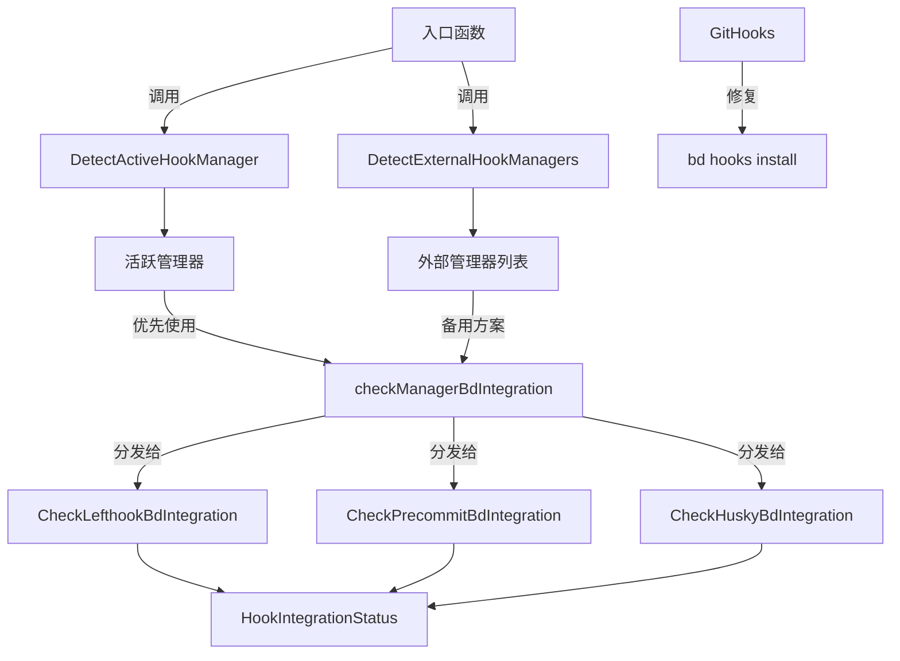

# hook 集成检测与修复 模块技术深度解析

## 1. 问题与解决方案

在 Git 工作流中，项目经常使用各种外部钩子管理工具（如 Lefthook、Husky、pre-commit 等）来自动化开发流程中的检查和验证工作。当这些工具与我们的 `beads` 系统集成时，可能会产生以下问题：

- **钩子冲突**：`beads` 的钩子可能被外部工具覆盖或替换
- **集成缺失**：开发者可能忘记在外部工具配置中添加 `beads` 钩子执行命令
- **环境复杂性**：多个钩子管理工具共存时，难以确定哪个工具实际生效
- **修复困难**：手动修复钩子集成问题需要了解多个工具的配置格式和工作原理

这个模块的核心价值在于：它提供了一个统一的检测和修复机制，能够自动识别外部钩子管理工具，检查 `beads` 钩子是否正确集成，并提供修复方案。

## 2. 核心概念与心智模型

想象这个模块就像一个**仓库的"电气安全检查员"**：

1. **环境扫描**：首先检查仓库里都有哪些"电气设备"（外部钩子管理工具）
2. **设备识别**：确定哪个设备是实际在工作的（活跃的钩子管理器）
3. **接线检查**：查看这些设备是否正确连接了 `beads` 系统（检查集成状态）
4. **安全修复**：如果发现连接问题，重新建立正确的连接（修复钩子集成）

### 关键抽象

- **`ExternalHookManager`**：代表一个检测到的外部钩子管理工具，包含工具名称和配置文件路径
- **`HookIntegrationStatus`**：描述 `beads` 在外部钩子管理器中的集成状态，包括哪些钩子已集成、哪些未集成等信息
- **检测与检查函数**：一系列专门针对不同钩子管理工具的检测函数

## 3. 架构与数据流



### 数据流分析

1. **检测阶段**：
   - `CheckExternalHookManagerIntegration` 作为主要入口
   - 首先调用 `DetectActiveHookManager` 检查实际活跃的钩子管理器
   - 同时调用 `DetectExternalHookManagers` 获取所有可能的外部钩子管理器

2. **检查阶段**：
   - 优先检查活跃的钩子管理器的集成状态
   - 如果活跃管理器无法检查，则按优先级依次检查其他检测到的管理器
   - 每个管理器都有专门的检查函数解析其配置格式

3. **修复阶段**：
   - `GitHooks` 函数负责修复钩子集成问题
   - 检测是否存在外部钩子管理器
   - 相应地调用 `bd hooks install` 命令，必要时使用 `--chain` 选项保留现有钩子

## 4. 核心组件详解

### 4.1 ExternalHookManager

```go
type ExternalHookManager struct {
    Name       string // 工具名称，如 "lefthook", "husky", "pre-commit"
    ConfigFile string // 检测到的配置文件路径
}
```

这个结构体简单明了地表示一个检测到的外部钩子管理工具。它的设计体现了"最小知识原则"——只存储识别工具所需的最基本信息。

### 4.2 HookIntegrationStatus

```go
type HookIntegrationStatus struct {
    Manager          string   // 钩子管理器名称
    HooksWithBd      []string // 已集成 bd 的钩子
    HooksWithoutBd   []string // 已配置但未集成 bd 的钩子
    HooksNotInConfig []string // 推荐但根本未配置的钩子
    Configured       bool     // 是否找到任何 bd 集成
    DetectionOnly    bool     // 是否仅检测到管理器但无法验证配置
}
```

这个结构体是整个模块的核心输出，它提供了 `beads` 在外部钩子管理器中集成状态的全面视图。设计上考虑了以下几点：

- **分层信息**：将钩子分为三个不同的列表，提供了精细的状态信息
- **布尔标记**：`Configured` 和 `DetectionOnly` 提供了快速判断集成状态的途径
- **扩展性**：可以轻松添加新的状态字段而不破坏现有代码

### 4.3 检测与检查函数

#### DetectExternalHookManagers

这个函数通过检查仓库中是否存在特定的配置文件来识别外部钩子管理工具。它按照预定义的优先级顺序检查各种工具的配置文件，这是基于实际项目中工具的流行程度和稳定性决定的。

**设计亮点**：
- 支持多种配置文件位置和格式
- 优先级排序确保先检查更常见的工具
- 对文件和目录都进行检查，适应不同工具的配置方式

#### DetectActiveHookManager

这个函数比 `DetectExternalHookManagers` 更进一步，它通过检查实际的 Git 钩子文件内容来确定哪个工具是真正活跃的。这解决了多个工具配置文件共存时的歧义问题。

**实现特点**：
- 使用 `git rev-parse --git-common-dir` 来正确处理 Git 工作树
- 考虑了自定义 `core.hooksPath` 配置
- 通过检查常见钩子文件（pre-commit、pre-push、post-merge）的内容来识别管理器
- 有特定的优先级顺序，特别是处理 prek 和 pre-commit 的关系

#### 管理器特定的检查函数

每个支持的钩子管理器都有专门的检查函数：

1. **CheckLefthookBdIntegration**：支持 YAML、TOML 和 JSON 格式的 Lefthook 配置，同时处理旧版的 "commands" 语法和新版的 "jobs" 语法
2. **CheckPrecommitBdIntegration**：解析 pre-commit 配置，处理新旧阶段名称的映射
3. **CheckHuskyBdIntegration**：直接检查 .husky 目录中的钩子脚本内容

这些函数都遵循相同的模式：查找配置文件、解析配置、检查是否包含 `bd hooks run` 命令、生成状态报告。

### 4.4 GitHooks 修复函数

这个函数是模块的"行动"部分，负责实际修复钩子集成问题。

**设计特点**：
- 首先验证是否在有效的 beads 工作区和 Git 仓库中
- 检测外部钩子管理器，决定是否使用 `--chain` 选项
- 使用 `--force` 选项确保干净地替换过时的钩子
- 执行 `bd hooks install` 命令完成实际修复

## 5. 设计决策与权衡

### 5.1 优先级顺序的设计

模块中的多个地方都使用了优先级顺序（如 `hookManagerConfigs` 和 `hookManagerPatterns`），这不是随意决定的：

- **优先考虑 Lefthook**：因为它是功能最全面且跨语言的工具
- **prek 排在 pre-commit 之前**：因为 prek 的钩子可能包含 "pre-commit" 字符串，但反之不成立
- **基于流行度和稳定性**：整体顺序反映了工具在实际项目中的使用频率和可靠性

### 5.2 检测策略的选择

模块采用了**多层检测策略**：

1. 首先尝试检测活跃的钩子管理器（通过检查实际钩子文件）
2. 如果失败，再退而检查配置文件
3. 最后提供仅检测的状态

这种设计的权衡是：
- **优点**：提高了检测的准确性，特别是在多工具共存的环境中
- **缺点**：增加了代码复杂度，需要维护多种检测逻辑

### 5.3 配置解析的灵活性

模块在解析配置时采用了**灵活但保守**的策略：

- 支持多种配置格式（YAML、TOML、JSON）
- 处理同一工具的不同配置语法版本
- 但在解析失败时不会尝试"猜测"或修复配置，而是直接返回 nil

这种设计确保了：
- 兼容性：能适应不同版本的工具配置
- 安全性：不会因为错误的解析而产生误导性的结果

### 5.4 修复策略的选择

`GitHooks` 函数采用了**安全但果断**的修复策略：

- 使用 `--force` 选项：确保钩子是最新的，但不创建备份
- 检测外部管理器时使用 `--chain`：保留现有钩子，避免破坏用户的工作流

这种设计考虑了：
- 用户体验：避免过多的备份文件混乱
- 安全性：通过链式调用保留现有钩子功能

## 6. 使用指南与示例

### 6.1 基本检测流程

```go
// 检测外部钩子管理器
managers := DetectExternalHookManagers(repoPath)

// 检测活跃的钩子管理器
activeManager := DetectActiveHookManager(repoPath)

// 检查集成状态
status := CheckExternalHookManagerIntegration(repoPath)
```

### 6.2 修复钩子集成

```go
// 修复钩子集成问题
err := GitHooks(repoPath)
if err != nil {
    log.Fatalf("Failed to fix git hooks: %v", err)
}
```

### 6.3 扩展支持新的钩子管理器

要添加对新钩子管理器的支持，需要：

1. 在 `hookManagerConfigs` 中添加配置文件信息
2. 在 `hookManagerPatterns` 中添加检测模式
3. 创建 `CheckXxxBdIntegration` 函数
4. 在 `checkManagerBdIntegration` 中添加新的 case

## 7. 注意事项与边缘情况

### 7.1 隐式假设

- 假设 `bd` 二进制文件在路径中可用（通过 `getBdBinary` 获取）
- 假设推荐的钩子是固定的：pre-commit、post-merge、pre-push
- 假设 Git 钩子目录的标准结构

### 7.2 边缘情况

1. **多个钩子管理器共存**：模块会优先选择活跃的那个，但如果无法确定，则按配置顺序检查
2. **自定义 hooksPath**：通过 `git config core.hooksPath` 正确处理
3. **Git 工作树**：使用 `--git-common-dir` 确保在工作树中也能正确工作
4. **pre-commit 配置中的旧阶段名称**：自动映射到新名称（如 "commit" → "pre-commit"）

### 7.3 限制

- 目前只支持有限的钩子管理器（Lefthook、Husky、pre-commit/prek、overcommit、yorkie、simple-git-hooks）
- 对于不支持的管理器，只能提供检测级别的信息，不能检查集成状态
- 不支持修改外部管理器的配置文件来添加 bd 集成（只通过 `bd hooks install --chain` 来集成）

## 8. 与其他模块的关系

- **CLI Doctor Commands**：本模块是 doctor 命令的一部分，属于 "维护与修复" 子模块
- **CLI Hook Commands**：最终调用 `bd hooks install` 命令来实际修复钩子
- **Configuration**：可能依赖配置来确定推荐的钩子和行为

这个模块在整个系统中扮演着"诊断专家"的角色，专门负责处理与外部钩子管理工具的集成问题，确保 `beads` 能在各种开发环境中正常工作。