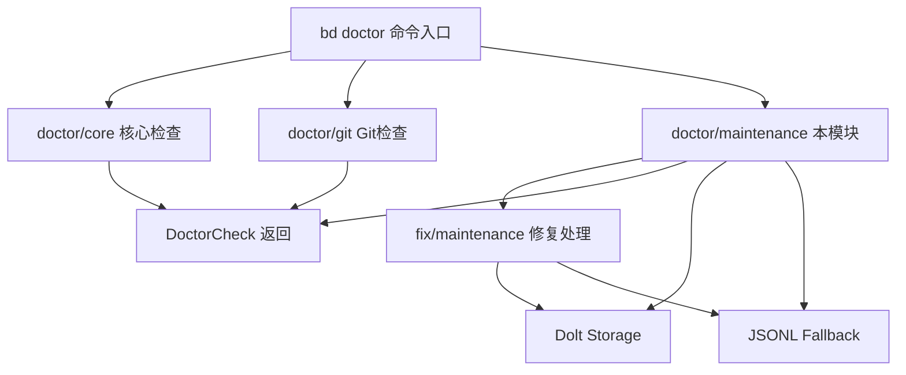

# cmd_bd_doctor_fix_maintenance 模块技术深度解析

## 模块概述

`cmd_bd_doctor_fix_maintenance` 是 beads 项目中 `bd doctor` 命令体系的核心维护诊断模块。想象一下，你的身体需要定期体检来发现潜在的健康问题——这个模块就是 beads 数据库的"体检医生"。它专门负责检测和修复那些随着时间推移在数据库中积累的"垃圾数据"：过期的已关闭问题、应该被删除但仍存在的临时分子、遗留的旧系统文件等。

这个模块的设计哲学非常务实：它不是试图预防所有垃圾数据的产生（这需要大幅重构其他模块），而是提供了一个集中式的"清洁工"角色，让用户能够定期清理数据库，保持系统的健康状态。这类似于运维中的"垃圾回收"概念——与其设计一个零垃圾产生的完美系统，不如设计一个高效清理垃圾的机制。

## 架构定位与数据流

### 在命令体系中的位置



从架构上看，这个模块处于 **Doctor 命令的检测层** 与 **Fix 命令的执行层** 之间的位置。它向上承接 `bd doctor` 命令的调用，向下调用存储层（Dolt 或 JSONL）进行数据查询，最终将检测结果以 `DoctorCheck` 结构返回，供用户决策是否执行修复。

### 核心组件及其职责

#### 1. 检测函数层 (`cmd/bd/doctor/maintenance.go`)

这些函数负责"发现问题"，每个函数对应一种潜在的数据库污染类型：

- **`CheckStaleClosedIssues`**: 检测超过配置天数的已关闭问题
- **`CheckStaleMolecules`**: 检测已完成但未关闭的分子（Epic）
- **`CheckCompactionCandidates`**: 检测适合压缩的问题（Dolt 后端返回 N/A）
- **`CheckPersistentMolIssues`**: 检测应该 ephemeral 但却持久化的问题
- **`CheckStaleMQFiles`**: 检测遗留的 `.beads/mq/*.json` 文件
- **`checkMisclassifiedWisps`**: 检测错误分类的 wisp（缺少 ephemeral 标记）
- **`CheckPatrolPollution`**: 检测巡逻操作产生的临时数据污染

#### 2. 修复处理层 (`cmd/bd/doctor/fix/maintenance.go`)

这些函数负责"解决问题"，是检测函数的修复搭档：

- **`StaleClosedIssues`**: 删除超期的已关闭问题
- **`PatrolPollution`**: 删除巡逻污染数据
- **`FixStaleMQFiles`**: 删除遗留的 MQ 目录

#### 3. 数据结构

```go
// patrolPollutionResult - 巡逻污染检测结果
type patrolPollutionResult struct {
    PatrolDigestCount int      // "Digest: mol-*-patrol" 模式的 bead 数量
    SessionBeadCount  int      // "Session ended: *" 模式的 bead 数量  
    PatrolDigestIDs   []string // 示例 ID，用于显示
    SessionBeadIDs    []string // 示例 ID，用于显示
}

// cleanupResult - 清理操作结果
type cleanupResult struct {
    DeletedCount  int  // 删除的问题数量
    SkippedPinned int  // 跳过的置顶问题数量
}
```

## 核心检测机制详解

### 1. 陈旧已关闭问题检测 (CheckStaleClosedIssues)

**设计洞察**：时间阈值只是一个粗略的代理指标。代码中的注释明智地指出了这一点：

> "Time-based thresholds are a crude proxy for the real concern, which is database size. A repo with 100 closed issues from 5 years ago doesn't need cleanup, while 50,000 issues from yesterday might."

这种设计选择体现了务实的工程态度：与其等待一个完美的数据库大小检测方案（这需要复杂的基准测试和配置），不如提供一个简单但可配置的基于时间的清理机制。用户可以根据自己的仓库规模和使用模式调整阈值。

**关键实现细节**：

```go
// 使用 SQL COUNT 而非加载全部数据到内存
// 之前的方案使用 SearchIssues 加载所有已关闭问题，
// 在大型数据库上灾难性地慢（~23k 问题通过 MySQL 协议需要 57 秒）
err := db.QueryRow("SELECT COUNT(*) FROM issues WHERE status = 'closed'").Scan(&closedCount)
```

这里有一个重要的性能优化：从加载全部问题（内存爆炸）改为 SQL COUNT 查询（O(1) 复杂度）。这是一个典型的"用数据库擅长的方式解决问题"的例子。

### 2. 巡逻污染检测 (CheckPatrolPollution)

**问题背景**：patrol 是 beads 系统中的一种自动化巡逻机制，它会定期扫描工作区并生成"巡逻摘要"（Digest）bead。理想情况下，这些 bead 应该是短暂的（ephemeral），不应持久化到数据库中。但由于历史原因或配置错误，这些"临时"数据污染了数据库。

**检测模式**：

```go
// 巡逻摘要: "Digest: mol-*-patrol" 格式
case strings.HasPrefix(title, "Digest: mol-") && strings.HasSuffix(title, "-patrol"):
    return patrolIssueDigest

// 会话结束: "Session ended: *" 格式
case strings.HasPrefix(title, "Session ended:"):
    return patrolIssueSessionEnded
```

**阈值设计**：

```go
const (
    PatrolDigestThreshold = 10 // 超过 10 个巡逻摘要才警告
    SessionBeadThreshold  = 50 // 超过 50 个会话 bead 才警告
)
```

使用阈值而非"存在即警告"的原因是：少量的巡逻数据可能是正常的（最近一次巡逻的残留），只有大量累积才表明真正的问题。

### 3. 持久化 mol 问题检测 (CheckPersistentMolIssues)

**问题背景**：beads 中有两种类型的分子工作流：
- `bd mol pour`：创建持久化的分子（mol- 前缀）
- `bd mol wisp`：创建短暂的工作项（wisp- 前缀，ephemeral=true）

用户有时会混淆这两个命令，导致本应是短暂的工作项被持久化到数据库中，污染 `bd ready` 的输出。

**检测逻辑**：

```go
// 寻找 mol- 前缀但没有 ephemeral 标记的问题
if strings.HasPrefix(issue.ID, "mol-") && !issue.Ephemeral {
    // 这是一个错误：mol- 问题应该是 ephemeral 的
}
```

### 4. 数据加载的双源策略

模块采用"数据库优先，JSONL 备选"的策略：

```go
func loadMaintenanceIssues(path string) ([]*types.Issue, error) {
    // 首先尝试从 Dolt 数据库加载
    issues, err := loadMaintenanceIssuesFromDatabase(beadsDir)
    if err == nil {
        return issues, nil
    }
    
    // 回退到 JSONL 文件（兼容性考虑）
    issues, jsonlErr := loadMaintenanceIssuesFromJSONL(beadsDir)
    if jsonlErr == nil {
        return issues, nil
    }
    
    // 两者都失败，返回组合错误
    return nil, fmt.Errorf("database read failed: %w; JSONL fallback read failed: %v", err, jsonlErr)
}
```

这种设计反映了一个重要的架构决策：**向后兼容**。JSONL 是 beads 早期的存储格式，虽然官方已迁移到 Dolt，但保留 JSONL 回退确保了旧仓库的可访问性。

## 4. Design Decisions and Tradeoffs

### 4.1 Default Disabled vs Default Enabled

**Decision**: Choose to disable stale issue cleanup by default.

**Tradeoff Analysis**:
- 🔵 **Security**: Prevents users from losing historical data without knowing it
- 🔴 **Usability**: Increases user configuration burden, may lead to underutilization of this feature
- **Rationale**: For operations involving data deletion, security should always take precedence over convenience

### 4.2 Delete One by One vs Batch Delete

**Decision**: Current implementation uses a one-by-one deletion approach.

**Tradeoff Analysis**:
- 🔵 **Simplicity**: Code implementation is intuitive, error handling is simple
- 🔵 **Fault Tolerance**: Individual deletion failures do not affect other operations
- 🔴 **Performance**: For large amounts of data, multiple database operations are inefficient
- **Context**: Considering that cleanup operations usually execute in the background, and the amount of pollution data is generally not large, this choice is reasonable

### 4.3 Title-Based Pattern Matching vs Dedicated Markers

**Decision**: Use title pattern matching to identify patrol pollution data.

**Tradeoff Analysis**:
- 🔵 **No Data Migration Needed**: No need to modify existing data structures or add new fields
- 🔵 **Simple Implementation**: No complex marking system required
- 🔴 **Fragility**: Relies on consistency of title format, may fail to recognize if title format changes
- 🔴 **Misjudgment Risk**: Theoretically may accidentally delete user-created issues matching this pattern
- **Mitigation**: The pattern is special enough that the possibility of users creating similar titles is extremely low

## 5. Usage Guide and Best Practices

### 5.1 Configuring Stale Issue Cleanup

To enable automatic cleanup of stale closed issues, add the following configuration to `metadata.json`:

```json
{
  "stale_closed_issues_days": 90
}
```

**Recommended Practices**:
- For active projects, recommend setting a threshold of 30-90 days
- For projects needing to retain complete history, can set a longer threshold (such as 365 days)
- Regularly back up the database to prevent accidental deletion of important issues

### 5.2 Protecting Important Issues from Cleanup

For closed issues that need to be retained permanently, can use the "pin" feature:

```go
// Set in code
issue.Pinned = true

// Or via CLI command
bd pin <issue-id>
```

**Best Practices**:
- Pin milestone issues, major bug fixes, and key decision records
- Regularly review the pinned issues list, unpin issues no longer needed
- Add tags to pinned issues for categorized management

## 6. Edge Cases and Potential Pitfalls

### 6.1 Backend Compatibility Limitations

Current implementation explicitly skips Dolt backend, only executing cleanup operations on SQLite backend. This means:
- Users using Dolt backend cannot utilize automatic cleanup features
- If this restriction is removed in the future, deletion operations on Dolt need to be fully tested

### 6.2 Time Zone Handling for Time Thresholds

Current implementation uses `time.Now()` to calculate the cutoff date, which depends on the server's local time zone. In cross-timezone teams, this may lead to:
- Cleanup time points inconsistent with expectations
- Users in different regions seeing different cleanup results

**Mitigation Suggestion**: Future versions may consider using UTC time or explicitly configuring time zones.

### 6.3 Dependency Relationship Handling

Current implementation does not consider dependency relationships when deleting issues, which may lead to:
- Deleting closed issues depended on by other issues
- Leaving orphaned dependency references

**Suggestion**: Future may consider checking dependency relationships before deletion, or cascading deletion of related dependencies.

## 7. Summary and Future Directions

The Maintenance Cleanup Execution module is a component focused on a single responsibility, solving practical database hygiene problems through simple design. Its default-disabled security policy, configuration-driven behavior, and fault-tolerant execution approach all embody good engineering practices.

Future development directions may include:
- Supporting cleanup operations on Dolt backend
- Implementing true batch deletion to improve performance
- Adding more configurable cleanup strategies (such as by tags, types, etc.)
- Integrating dependency relationship checks to ensure safety of deletion operations
- Adding preview feature for cleanup operations, allowing users to view content to be deleted before actual deletion

Through these improvements, the Maintenance Cleanup Execution module can provide more powerful and safer database maintenance functionality while maintaining its simple design.
