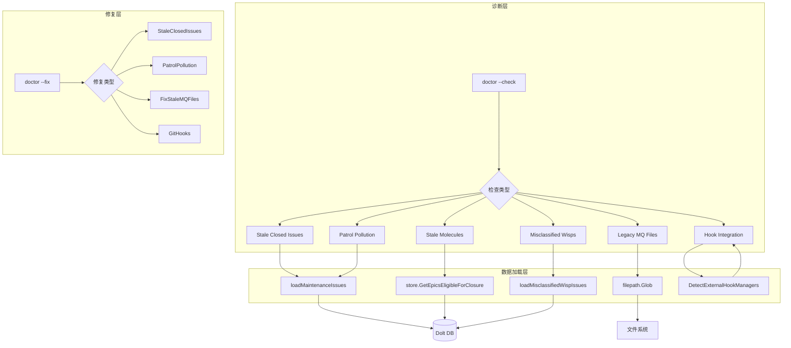

# 维护与修复 (Doctor Fix)

> 想象一下你的身体：定期体检可以发现潜在问题，但发现后需要"治疗"来修复。这个模块就是 beads 系统的"诊疗中心"——它不仅诊断问题，还提供修复能力。

## 问题空间：为什么需要这个模块？

Beads 是一个基于 Git 的分布式问题跟踪系统。随着时间推移，由于用户操作失误、系统迁移、或者外部集成（如 Git hooks）配置问题，数据库中会积累各种"污染物"：

1. **过期的闭单 issue** — 关闭已久的 issue 仍然占用数据库空间
2. **未关闭的完成分子** — 所有子任务都已关闭，但根 epic 仍然开放
3. **本应短暂存在的 mol- issues** — 用户运行 `bd mol pour` 而非 `bd mol wisp` 时产生的持久化问题
4. **遗留的 MQ 文件** — gastown 旧版本留下的本地 merge queue 文件
5. **错误分类的 wisps** — 包含 "-wisp-" 但缺少 ephemeral 标志的问题
6. ** patrol 污染 beads** — patrol 操作产生的临时 beads 不应持久化
7. **Git hooks 集成缺失** — 外部 hook 管理器未正确配置 bd hooks

这些"污染物"不会导致系统崩溃，但会：
- 膨胀数据库体积
- 污染 `bd ready` 等命令的输出
- 导致性能下降
- 在多repo 场景下造成同步混乱

## 架构概览



**数据流向说明：**

1. **诊断流程**：用户运行 `bd doctor --check` 时，系统遍历多种检查项，每项检查从数据库或 JSONL 文件加载 issue 数据，进行模式匹配后返回警告

2. **修复流程**：用户运行 `bd doctor --fix` 时，针对具体问题调用对应的修复函数，执行删除或重新配置操作

3. **Hook 检测**：独立于 issue 维护，检查文件系统中的外部 hook 管理器配置（lefthook、husky、pre-commit 等）

## 核心设计决策

### 1. SQL COUNT 替代全量加载

**旧方案**：使用 `SearchIssues` 加载所有 closed issues 到内存
```go
// 旧代码 - 灾难性慢
issues, err := store.SearchIssues(ctx, "", types.IssueFilter{Status: &statusClosed})
// 23k issues over MySQL wire protocol = 57 seconds!
```

**新方案**：使用 SQL COUNT 查询
```go
// 新代码 - 高效
err := db.QueryRow("SELECT COUNT(*) FROM issues WHERE status = 'closed'").Scan(&closedCount)
```

**权衡分析**：这体现了**性能优先于通用性**的取舍。直接 SQL 查询只返回计数，无法获取 issue 详情，但对于"是否需要清理"这个判断场景已经足够。只有在需要实际删除时才加载具体 issue。

### 2. 双数据源fallback

```go
func loadMaintenanceIssues(path string) ([]*types.Issue, error) {
    // 首选：Dolt 数据库（权威数据源）
    issues, err := loadMaintenanceIssuesFromDatabase(beadsDir)
    if err == nil {
        return issues, nil
    }
    
    // Fallback：JSONL 文件（兼容性考虑）
    issues, jsonlErr := loadMaintenanceIssuesFromJSONL(beadsDir)
    if jsonlErr == nil {
        return issues, nil
    }
    
    return nil, fmt.Errorf("database: %w; JSONL: %v", err, jsonlErr)
}
```

**权衡分析**：这体现了**健壮性优先于一致性**的取舍。优先使用 Dolt（当前唯一后端），但保留 JSONL fallback 以支持旧数据格式或迁移场景。

### 3. 时间阈值 vs 空间阈值

代码注释中明确指出：
```go
// Design note: Time-based thresholds are a crude proxy for the real concern,
// which is database size. A repo with 100 closed issues from 5 years ago
// doesn't need cleanup, while 50,000 issues from yesterday might.
```

**权衡分析**：时间阈值实现简单但不够精确。理想的 `max_database_size_mb` 方案需要额外的存储计算逻辑。选择了简单实现而非完美方案——这是**复杂度 vs 准确性的 tradeoff**。

### 4. Hook 检测的确定性顺序

```go
var hookManagerPatterns = []hookManagerPattern{
    {"lefthook", regexp.MustCompile(`(?i)lefthook`)},
    {"husky", regexp.MustCompile(`(?i)(\.husky|husky\.sh)`)},
    // prek 必须在 pre-commit 之前，因为 prek hooks 可能包含 "pre-commit" 路径
    {"prek", regexp.MustCompile(`(?i)(prek\s+run|prek\s+hook-impl)`)},
    {"pre-commit", ...},
}
```

**权衡分析**：多个 hook 管理器可能共存，需要确定性顺序避免误判。prek 必须优先于 pre-check 检测是因为 prek 兼容 pre-commit 配置但使用不同的运行方式。

## 关键组件

### 诊断核心 (`patrolPollutionResult`)

检测并量化 patrol 污染 beads，包含两个核心指标：
- `PatrolDigestCount`: "Digest: mol-*-patrol" 模式的 digest beads 数量
- `SessionBeadCount`: "Session ended: *" 模式的 session beads 数量

这类 beads 应该在 patrol 结束时自动清理，持久化在数据库中是操作失误的结果。

### Hook 集成检测

支持多种外部 hook 管理器的检测和验证：
- **lefthook**: 多格式支持（YAML、TOML、JSON）
- **husky**: .husky/ 目录脚本检测
- **pre-commit / prek**: .pre-commit-config.yaml 检测
- **overcommit / yorkie / simple-git-hooks**: 基础检测

每个管理器都有对应的 `Check{Manager}BdIntegration` 函数，解析其配置文件验证是否包含 `bd hooks run`。

### 清理执行

提供两种清理方式：
1. **Doctor Fix**: 通过 `bd doctor --fix` 交互式清理
2. **Admin Cleanup**: 通过 `bd admin cleanup --force` 批量清理

## 与其他模块的交互

| 依赖模块 | 交互方式 |
|---------|---------|
| [Dolt 存储后端](../internal-storage-dolt/store.md) | 读取/删除 issue 数据 |
| [配置系统](../internal-config-config.md) | 读取 `stale_closed_issues_days` 等配置 |
| [类型定义](../internal-types-types.md) | 使用 `Issue`, `IssueFilter` 等结构 |
| [Doctor 核心](./cmd-bd-doctor.md) | 作为 fix 子模块被调用 |

## 新贡献者注意事项

### 1. 模式匹配的脆弱性

很多检查依赖字符串模式匹配：
```go
func classifyPatrolIssue(title string) patrolIssueKind {
    switch {
    case strings.HasPrefix(title, "Digest: mol-") && strings.HasSuffix(title, "-patrol"):
        return patrolIssueDigest
    case strings.HasPrefix(title, "Session ended:"):
        return patrolIssueSessionEnded
    }
}
```

如果 patrol 的输出格式改变，这些检查就会失效。需要与 patrol 模块保持同步。

### 2. Dolt 后端的限制

代码中明确区分了后端处理：
```go
// Dolt backend: this fix uses SQLite-specific storage, skip for now
if cfg != nil && cfg.GetBackend() == configfile.BackendDolt {
    fmt.Println("  Stale closed issues cleanup skipped (dolt backend)")
    return nil
}
```

Dolt 后端在某些清理操作上受限，新功能需要注意这个约束。

### 3. JSONL Fallback 的顺序问题

JSONL 加载在数据库失败后作为 fallback，但这意味着：
- JSONL 可能包含数据库中不存在的旧数据
- 两者数据不一致时以数据库为准

### 4. Hook 检测的"检测即存在"逻辑

`DetectExternalHookManagers` 使用文件存在性判断：
```go
if info, err := os.Stat(configPath); err == nil {
    if info.IsDir() || info.Mode().IsRegular() {
        managers = append(managers, ...)
    }
}
```

这意味着：
- 存在配置文件 ≠ 正在使用该管理器
- 需要结合 `DetectActiveHookManager` 从 git hooks 内容判断实际活动的管理器
- 多个管理器可能同时存在，需要优先级判断

### 5. CGO 编译依赖

部分功能受 build tag 控制：
```go
//go:build cgo
```

确保你的环境支持 CGO，否则某些检查会返回 N/A。

## 子模块文档

- [诊断核心：Patrol 污染检测](./cmd-bd-doctor-fix-maintenance.md)
- [Hook 集成检测与修复](./cmd-bd-doctor-fix-hooks.md)
- [维护清理执行](./cmd-bd-doctor-fix-cleanup.md)