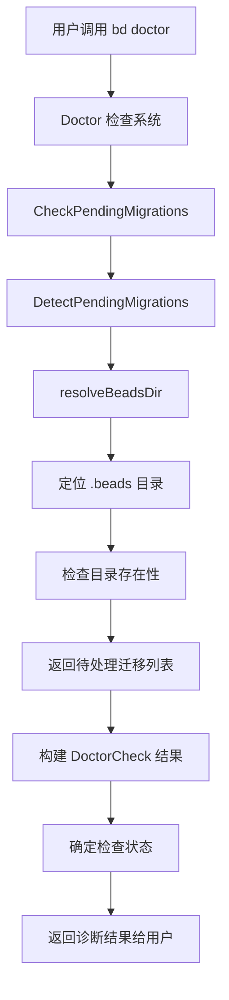

# migration_detection 模块技术深度解析

## 1. 模块概述

`migration_detection` 模块是 Beads 项目诊断系统的核心组件之一，负责检测仓库中尚未应用的待处理迁移。它通过分析 `.beads` 目录状态，识别需要运行的迁移脚本，确保数据结构与当前软件版本保持同步。

这个模块解决了软件演进过程中常见的数据版本兼容性问题：当 Beads 更新后，旧版本创建的数据可能需要通过迁移来适配新版本的结构。migration_detection 就像一个"健康检查员"，在系统启动时检查是否有需要运行的"更新补丁"。

## 2. 核心组件详解

### PendingMigration 结构

```go
type PendingMigration struct {
	Name        string // 迁移名称，如 "sync"
	Description string // 迁移描述，如 "Configure sync branch for multi-clone setup"
	Command     string // 执行迁移的命令，如 "bd migrate sync beads-sync"
	Priority    int    // 优先级：1 = 关键，2 = 推荐，3 = 可选
}
```

`PendingMigration` 是模块的核心数据结构，它封装了单个待处理迁移的完整信息：
- **Name**：迁移的唯一标识符
- **Description**：人类可读的迁移目的说明
- **Command**：执行迁移的具体命令
- **Priority**：迁移的紧急程度，用于确定诊断状态的严重级别

### 核心功能函数

#### DetectPendingMigrations

```go
func DetectPendingMigrations(path string) []PendingMigration
```

这个函数是迁移检测的入口点，负责：
1. 解析指定路径，定位实际的 `.beads` 目录
2. 检查该目录是否存在
3. （目前尚未实现的功能）检测该目录下是否有待处理的迁移

目前该函数的实现比较简单，只做了基本的目录存在性检查，返回空的迁移列表。

#### CheckPendingMigrations

```go
func CheckPendingMigrations(path string) DoctorCheck
```

这个函数将检测结果转换为标准的诊断检查格式：
1. 调用 `DetectPendingMigrations` 获取待处理迁移
2. 如果没有待处理迁移，返回状态为 `StatusOK` 的检查结果
3. 如果有待处理迁移：
   - 构建详细信息列表，包含每个迁移的名称、描述和优先级标签
   - 收集所有迁移的执行命令作为修复建议
   - 根据最高优先级的迁移确定整体状态：
     - 有优先级为 1 的迁移 → `StatusError`
     - 有优先级为 2 的迁移但无 1 → `StatusWarning`
     - 只有优先级为 3 的迁移 → `StatusOK`

## 3. 系统架构与数据流



在 Beads 的诊断系统中，`migration_detection` 模块作为其中一个检查项，与其他检查（如数据库完整性、Git 卫生检查等）一起工作。它的输出是一个 `DoctorCheck` 结构，被集成到整体的诊断报告中。

## 4. 设计决策与权衡

### 现状与未来扩展

目前 `DetectPendingMigrations` 函数的实现比较基础，主要是一个骨架结构。这种设计有以下考虑：

1. **渐进式实现**：先建立接口和框架，后续再添加具体的检测逻辑
2. **向后兼容**：即使没有实现完整功能，也不会导致诊断系统崩溃
3. **易于扩展**：预留了清晰的扩展点，未来可以添加具体的迁移检测逻辑

### 优先级系统设计

迁移优先级系统是一个精心设计的特性：
- 它允许区分不同紧急程度的迁移
- 诊断状态由最高优先级的迁移决定，确保关键问题被优先关注
- 优先级标签（[critical]、[recommended]、[optional]）使用户能直观理解迁移的重要性

### 与 Doctor 系统的集成

该模块完全遵循 Doctor 系统的契约，通过 `DoctorCheck` 结构与其他检查保持一致的接口：
- 使用相同的状态常量（`StatusOK`、`StatusWarning`、`StatusError`）
- 分类为 `CategoryMaintenance`，与其他维护类检查归为一组
- 提供详细信息和修复建议，保持用户体验的一致性

## 5. 使用指南与示例

### 基本使用

`migration_detection` 模块主要通过 `bd doctor` 命令间接使用：

```bash
bd doctor
```

这个命令会运行所有诊断检查，包括迁移检测。

### 扩展迁移检测

未来，当需要添加具体的迁移检测逻辑时，可以在 `DetectPendingMigrations` 函数中实现：

```go
func DetectPendingMigrations(path string) []PendingMigration {
	var pending []PendingMigration

	// 现有代码
	beadsDir := resolveBeadsDir(filepath.Join(path, ".beads"))
	if _, err := os.Stat(beadsDir); os.IsNotExist(err) {
		return pending
	}

	// 新增：检查特定迁移条件
	// 例如：检查是否需要 sync 迁移
	if needsSyncMigration(beadsDir) {
		pending = append(pending, PendingMigration{
			Name:        "sync",
			Description: "Configure sync branch for multi-clone setup",
			Command:     "bd migrate sync beads-sync",
			Priority:    2,
		})
	}

	return pending
}
```

## 6. 注意事项与限制

### 当前限制

1. **未实现的核心功能**：目前 `DetectPendingMigrations` 实际上不检测任何迁移，总是返回空列表
2. **缺少实际迁移定义**：没有定义任何具体的迁移及其检测逻辑
3. **没有版本比较机制**：缺少与 Beads 版本关联的迁移版本管理

### 未来改进方向

1. **实现具体迁移检测**：添加实际的迁移检测逻辑
2. **迁移版本管理**：建立迁移与 Beads 版本的对应关系
3. **迁移历史记录**：跟踪已应用的迁移，避免重复执行
4. **迁移依赖管理**：处理迁移之间的依赖关系

## 7. 相关模块

- Doctor 诊断系统：migration_detection 模块所属的父系统
- [Dolt 存储后端](DOLT-BACKEND.md)：可能包含实际的迁移执行逻辑
- [多仓库迁移](MULTI_REPO_MIGRATION.md)：与仓库间迁移相关的功能
