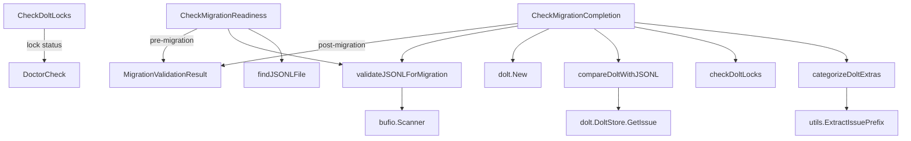

# Migration Validation 模块技术深度解析

## 1. 为什么存在这个模块？

在 Beads 系统从旧有存储后端（JSONL 或 SQLite）向 Dolt 数据库迁移的过程中，确保数据完整性、一致性和迁移安全性至关重要。一个简单的"复制粘贴"数据迁移方式可能会导致：

- 数据丢失：部分问题可能在迁移过程中被遗漏
- 数据损坏：格式错误的 JSONL 记录可能会破坏整个迁移
- 跨设备污染：不同设备的问题数据可能会混在一起
- 未提交的更改：Dolt 数据库的未提交事务可能导致数据不一致

这个模块的核心洞察是：**将迁移验证拆分为两个独立的阶段——迁移前检查和迁移后验证**，并通过机器可读的结构化输出来支持自动化工具和人工调试。

## 2. 核心心智模型

想象这个模块就像一位严格的搬家公司监督员：

1. **搬运前检查**（CheckMigrationReadiness）：
   - 检查旧房子的所有物品（JSONL 文件）是否完好
   - 确认没有损坏的箱子（格式错误的 JSON 记录）
   - 确保搬家通道畅通（目录结构正确）

2. **搬运后验证**（CheckMigrationCompletion）：
   - 核对所有物品是否都到了新家（Dolt 数据库）
   - 确认没有遗漏或多余的物品
   - 检查新家的门锁是否正常（Dolt 未提交更改）
   - 确保没有把邻居的东西也搬过来了（跨设备污染）

关键抽象是 `MigrationValidationResult` 结构体，它就像一份详细的检查报告，包含了所有可能需要的信息，既可以供机器处理，也可以供人阅读。

## 3. 架构与数据流向

### Mermaid 架构图



### 核心组件职责

| 组件 | 职责 | 关键点 |
|------|------|--------|
| `CheckMigrationReadiness` | 迁移前准备检查 | 验证 JSONL 完整性、检查后端状态 |
| `CheckMigrationCompletion` | 迁移后结果验证 | 比较 JSONL 和 Dolt、检查 Dolt 健康状态 |
| `CheckDoltLocks` | Dolt 锁状态检查 | 检测未提交的更改 |
| `MigrationValidationResult` | 结构化验证结果 | 机器可读的完整报告 |

### 数据流向详解

#### 迁移前检查流程

1. **目录检查**：首先确认 `.beads` 目录存在
2. **后端检测**：通过 `GetBackend` 函数确定当前使用的存储后端
3. **JSONL 定位**：查找 `issues.jsonl` 或 `beads.jsonl` 文件
4. **JSONL 验证**：
   - 读取并解析每一行 JSON
   - 统计有效记录数和格式错误数
   - 收集所有有效的问题 ID
   - 如果所有行都是格式错误的，则视为阻塞性错误
5. **结果生成**：根据检查结果设置 `Ready` 标志和相应的状态信息

#### 迁移后验证流程

1. **Dolt 健康检查**：
   - 尝试打开 Dolt 数据库
   - 获取数据库统计信息以验证 schema 完整性
2. **数据一致性验证**：
   - 重新验证 JSONL 文件（如果存在）
   - 逐个检查 JSONL 中的问题是否存在于 Dolt 中
   - 比较问题数量：如果 Dolt 中的数量少于 JSONL，这是错误
3. **额外问题分类**：
   - 如果 Dolt 中有 JSONL 中没有的问题，将它们分为两类：
     - **跨设备污染**：使用非本地前缀的问题
     - **临时问题**：使用本地前缀但不在 JSONL 中的问题
4. **锁状态检查**：检查是否有未提交的更改

## 4. 核心组件深度解析

### MigrationValidationResult 结构体

这是整个模块的核心数据结构，设计时考虑了机器可读性和人工可调试性。

```go
type MigrationValidationResult struct {
    Phase              string         // "pre-migration" 或 "post-migration"
    Ready              bool           // 迁移是否可以继续或成功完成
    Backend            string         // 当前后端类型
    JSONLCount         int            // JSONL 中的问题数量
    SQLiteCount        int            // SQLite 中的问题数量（迁移前）
    DoltCount          int            // Dolt 中的问题数量（迁移后）
    MissingInDB        []string       // JSONL 中有但数据库中没有的问题 ID（样本）
    MissingInJSONL     []string       // 数据库中有但 JSONL 中没有的问题 ID（样本）
    Errors             []string       // 阻塞性错误
    Warnings           []string       // 非阻塞性警告
    JSONLValid         bool           // JSONL 是否可解析
    JSONLMalformed     int            // 格式错误的 JSONL 行数
    DoltHealthy        bool           // Dolt 数据库是否健康
    DoltLocked         bool           // Dolt 是否有未提交的更改
    SchemaValid        bool           // Schema 是否完整
    RecommendedFix     string         // 建议的修复命令
    ForeignPrefixCount int            // 带有非本地前缀的问题数量（跨设备污染）
    ForeignPrefixes    map[string]int // 前缀 -> 数量的映射
}
```

**设计决策**：
- 使用了 `json` 标签以便机器解析，同时字段名直观易懂
- `MissingInDB` 和 `MissingInJSONL` 只返回前 100 个样本，防止输出过大
- `ForeignPrefixes` 使用 map 结构可以快速查看每个外来前缀的数量

### CheckMigrationReadiness 函数

这个函数是迁移流程的"守门员"，确保在开始迁移前一切就绪。

**关键点**：
1. **渐进式错误处理**：每一步检查失败都会立即返回，避免在无效状态下继续执行
2. **多状态返回**：同时返回 `DoctorCheck`（用于人类阅读）和 `MigrationValidationResult`（用于机器处理）
3. **优雅降级**：即使 JSONL 中有部分格式错误，只要有有效记录，仍然可以继续（但会发出警告）

**值得注意的实现细节**：
```go
// 只在所有行都是格式错误时才返回错误
if len(ids) == 0 && malformed > 0 {
    return 0, malformed, ids, fmt.Errorf("JSONL file is completely corrupt: %d malformed lines", malformed)
}
```
这里体现了一个重要的设计决策：**部分损坏的数据仍然可以使用**，只要不是全部损坏。

### CheckMigrationCompletion 函数

这个函数验证迁移是否成功完成，是数据完整性的最后一道防线。

**关键逻辑**：
1. **非对称数量比较**：
   - 如果 Dolt 数量 < JSONL 数量：这是错误（数据丢失）
   - 如果 Dolt 数量 > JSONL 数量：这只是警告（可能有临时问题或跨设备污染）
   
2. **智能问题分类**：
   ```go
   prefix := utils.ExtractIssuePrefix(id)
   if localPrefix != "" && prefix != "" && prefix != localPrefix {
       foreignPrefixes[prefix]++
   } else {
       ephemeralCount++
   }
   ```
   通过前缀识别跨设备污染，这是多设备协作场景下的常见问题。

### validateJSONLForMigration 函数

这个函数是 JSONL 验证的核心，设计时考虑了性能和容错性。

**性能优化**：
```go
scanner.Buffer(make([]byte, 0, 1024), 2*1024*1024) // 2MB buffer for large lines
```
使用 2MB 的缓冲区来处理可能很大的 JSON 行，这在处理包含大量描述或评论的问题时很重要。

**容错设计**：
- 跳过空行
- 只记录前 5 个解析错误，避免输出过多
- 即使有格式错误，也会继续处理剩余的行

## 5. 依赖分析

### 外部依赖

| 依赖 | 用途 | 耦合点 |
|------|------|--------|
| `internal/configfile` | 后端类型检测 | `BackendDolt` 常量 |
| `internal/storage/dolt` | Dolt 数据库操作 | `DoltStore`、`Config` |
| `internal/utils` | 工具函数 | `ExtractIssuePrefix` |
| `bufio` | 文件读取 | `Scanner` |
| `encoding/json` | JSON 解析 | `Unmarshal` |

### 被调用关系

这个模块主要被 `cmd.bd.doctor` 包中的诊断命令调用，用于在 `bd doctor` 命令执行时检查迁移状态。

### 隐含契约

1. **JSONL 文件格式**：每一行必须是一个 JSON 对象，且必须包含 `id` 字段
2. **问题 ID 格式**：问题 ID 应该遵循 `prefix-number` 格式，以便 `ExtractIssuePrefix` 能正确工作
3. **Dolt Schema**：必须包含 `issues` 表，且有 `id` 列
4. **配置键**：Dolt 存储中应该有 `issue_prefix` 配置项

## 6. 设计决策与权衡

### 决策 1：分阶段验证

**选择**：将验证分为迁移前和迁移后两个独立阶段
**替代方案**：使用一个单一的验证函数，通过参数控制行为
**理由**：
- 两个阶段的关注点完全不同：前一阶段关注源数据质量，后一阶段关注目标数据完整性
- 可以在不同时间点调用：迁移前检查可以在计划迁移时运行，迁移后验证在迁移完成后立即运行
- 代码更清晰：每个函数只负责一个阶段，职责单一

### 决策 2：双输出格式

**选择**：同时返回人类可读的 `DoctorCheck` 和机器可读的 `MigrationValidationResult`
**替代方案**：只返回一种格式，在需要时转换
**理由**：
- 支持不同的使用场景：CLI 输出给人看，自动化工具需要结构化数据
- 避免转换开销：两种格式在检查过程中同时生成
- 灵活性：调用者可以根据需要选择使用哪种格式

### 决策 3：样本限制

**选择**：`MissingInDB` 和 `MissingInJSONL` 只返回前 100 个样本
**替代方案**：返回所有缺失的 ID
**理由**：
- 防止输出过大：如果有数千个缺失的问题，完整列表会非常冗长
- 实用性：通常前几个样本就足以诊断问题
- 性能：避免在内存中存储大量 ID

### 决策 4：部分损坏的 JSONL 仍可接受

**选择**：只有当 JSONL 文件完全损坏时才报错，部分损坏只警告
**替代方案**：任何格式错误都阻止迁移
**理由**：
- 数据可用性优先：宁可迁移部分数据，也不阻止整个迁移
- 渐进式修复：可以在迁移后修复或重新导入损坏的记录
- 实际考虑：实际使用中 JSONL 文件可能会有少量损坏的行

### 决策 5：CGO 与非 CGO 构建分离

**选择**：使用构建标签分离 CGO 和非 CGO 实现
**替代方案**：在运行时检测 CGO 可用性
**理由**：
- 编译时确定：避免运行时检测的复杂性
- 依赖清晰：非 CGO 构建不会链接 Dolt 相关的库
- 回退策略明确：非 CGO 版本提供清晰的错误信息

## 7. 使用示例与扩展

### 基本使用

```go
// 迁移前检查
check, result := doctor.CheckMigrationReadiness(".")
if !result.Ready {
    fmt.Printf("Not ready for migration: %v\n", result.Errors)
    return
}

// 执行迁移...

// 迁移后验证
check, result = doctor.CheckMigrationCompletion(".")
if !result.Ready {
    fmt.Printf("Migration failed: %v\n", result.Errors)
    return
}
```

### 自动化集成

由于 `MigrationValidationResult` 是 JSON 可序列化的，可以轻松集成到自动化流程中：

```go
check, result := doctor.CheckMigrationCompletion(".")
jsonBytes, _ := json.Marshal(result)
// 发送到监控系统或保存为报告文件
```

### 自定义验证

当前设计没有明确的扩展点，但可以通过以下方式进行自定义：

1. **包装现有函数**：在调用标准检查前后添加自定义逻辑
2. **使用结果结构**：根据 `MigrationValidationResult` 中的信息做出进一步决策

## 8. 边缘情况与注意事项

### 常见陷阱

1. **空 JSONL 文件**：空文件不会被视为错误，但会导致 `JSONLCount` 为 0
2. **Dolt 中的临时问题**：这些会被视为警告而非错误，因为它们可能是正常的
3. **跨设备污染**：只有在配置了 `issue_prefix` 时才能检测到
4. **wisp 表**：检查锁状态时会忽略 wisp 表的未提交更改，因为它们是临时的

### 性能考虑

1. **大 JSONL 文件**：`validateJSONLForMigration` 会读取整个文件，对于非常大的文件可能需要一些时间
2. **逐个比较**：`compareDoltWithJSONL` 会逐个检查 JSONL 中的每个问题，对于大量问题可能会很慢
3. **Dolt 查询**：`categorizeDoltExtras` 会查询所有问题 ID，对于大型数据库可能会消耗较多内存

### 错误恢复

如果迁移验证失败，建议的恢复步骤：

1. **迁移前失败**：
   - 如果 JSONL 损坏：运行 `bd doctor --fix` 从数据库修复
   - 如果缺少 JSONL：运行 `bd export` 导出
   
2. **迁移后失败**：
   - 如果数据不完整：重新运行迁移
   - 如果有跨设备污染：检查问题来源并考虑清理

## 9. 相关模块

- [Dolt Storage Backend](internal-storage-dolt.md)：提供 Dolt 数据库访问
- [Configuration](internal-configfile-configfile.md)：后端配置和检测
- [CLI Doctor Commands](cmd-bd-doctor.md)：集成此模块的诊断命令框架
