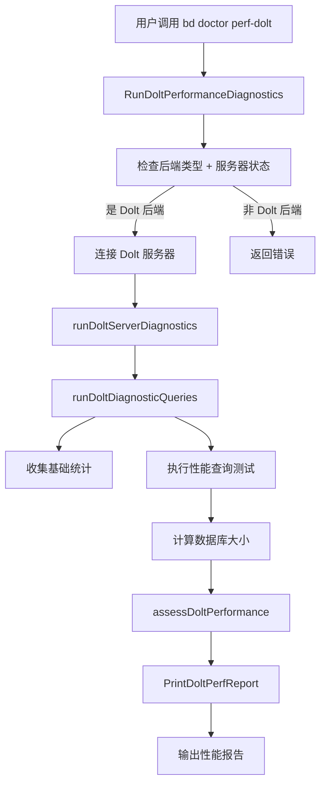

# Dolt 性能诊断模块深度解析

## 1. 问题与定位

**Dolt 性能诊断模块**是 Beads 系统中专门负责测量和评估 Dolt 存储后端性能的诊断工具。当用户遇到响应缓慢或操作卡顿时，传统的诊断方法（如手动查询计划分析）缺乏对 Beads 特定查询模式的针对性。该模块通过模拟真实用户操作，提供了一套**标准化的性能基准测试**，帮助工程师快速定位性能瓶颈。

### 核心问题
- 如何在不引入用户真实业务的情况下，定量评估 Dolt 存储后端的性能？
- 如何将抽象的 "系统慢" 转化为具体的可测量指标？
- 如何在性能问题出现时，快速区分是服务器问题、连接问题还是查询优化问题？

## 2. 核心抽象与心智模型

### 2.1 心智模型

将 Dolt 性能诊断模块想象成一个 **"医生听诊器"**：

```
性能诊断 = 健康体检 + 专项检查 + 诊断建议
```

这个模块不仅收集**基础健康指标**（如问题数量、数据库大小），执行**标准化压力测试**（模拟常见查询），最后给出**健康评估和改进建议**。

### 2.2 核心数据结构

**`DoltPerfMetrics`** 是整个模块的核心，它封装了所有性能指标的收集与报告：

| 字段类别 | 说明 |
|----------|------|
| 系统信息 | 后端类型、服务器状态、平台、Go 版本、Dolt 版本 |
| 数据库统计 | 总问题数、开放问题数、关闭问题数、依赖关系数、数据库大小 |
| 操作性能 | 连接时间、就绪工作查询时间、列表查询时间、单问题查询时间、复杂查询时间、提交日志查询时间 |
| 分析工具 | 性能分析文件路径 |

## 3. 架构与数据流程



### 主要流程：

1. **初始化与验证**：`RunDoltPerformanceDiagnostics` 首先验证后端类型，确保是 Dolt 后端，并检查 Dolt 服务器状态
2. **连接建立**：`runDoltServerDiagnostics` 建立与 Dolt SQL 服务器的连接，并测量连接时间
3. **诊断查询**：`runDoltDiagnosticQueries` 执行一系列标准化查询，收集性能指标
4. **性能评估**：`assessDoltPerformance` 根据收集的指标评估性能健康状况
5. **报告输出**：`PrintDoltPerfReport` 将结果格式化输出给用户

## 4. 关键组件详解

### 4.1 RunDoltPerformanceDiagnostics

**用途**：诊断的入口函数，协调整个性能诊断流程

**设计意图**：
- 首先验证后端类型，确保是 Dolt 后端
- 检查 Dolt 服务器状态
- 处理性能分析（如果启用）
- 协调各个诊断步骤

**重要细节**：
- 使用 `doltserver.DefaultConfig()` 解析服务器配置，处理独立哈希派生端口
- 通过 `isDoltServerRunning()` 快速检查服务器是否响应
- 支持可选的 CPU 性能分析功能

### 4.2 runDoltDiagnosticQueries

**用途**：执行一系列标准化查询，收集性能指标

**设计意图**：
- 模拟真实用户操作
- 覆盖常见查询模式
- 测量查询执行时间

**查询类型**：
1. **基础统计查询**：计算问题总数、开放问题数、关闭问题数、依赖关系数
2. **就绪工作查询**：模拟 `bd ready` 命令的核心查询
3. **开放问题列表查询**：模拟 `bd list --status=open`
4. **单问题查询**：模拟 `bd show <issue>`
5. **复杂过滤查询**：测试带标签过滤和分组的复杂查询
6. **Dolt 特定查询**：查询 `dolt_log` 表

**重要细节**：
- 使用 `measureQueryTime` 辅助函数测量查询执行时间
- 对于失败的查询，将时间标记为 `-1`
- 确保完全迭代结果集，以测量完整的执行时间

### 4.3 measureQueryTime

**用途**：测量查询执行时间的辅助函数

**设计意图**：
- 准确测量查询执行的完整时间
- 处理查询失败的情况
- 确保结果集完全迭代

**重要细节**：
- 使用 `time.Now()` 开始计时
- 使用 `defer rows.Close()` 确保资源释放
- 完全迭代结果集，以确保测量完整的查询执行时间

### 4.4 assessDoltPerformance

**用途**：根据收集的指标评估性能健康状况

**设计意图**：
- 将原始性能数据转化为有意义的评估
- 识别性能瓶颈
- 提供具体的改进建议

**评估标准**：
- 就绪工作查询 > 200ms：警告
- 复杂查询 > 500ms：警告
- 大量关闭问题：建议清理

### 4.5 CheckDoltPerformance

**用途**：作为医生检查的一部分，快速性能检查

**设计意图**：
- 集成到整体医生检查流程
- 提供快速性能评估
- 引导用户进行详细分析

## 5. 依赖关系分析

### 5.1 依赖的外部组件

| 组件 | 用途 |
|------|------|
| `internal.configfile` | 读取配置文件，获取数据库名称 |
| `internal.doltserver` | 获取 Dolt 服务器默认配置 |
| `github.com/go-sql-driver/mysql` | MySQL 驱动，连接 Dolt SQL 服务器 |

### 5.2 被依赖的组件

| 组件 | 用途 |
|------|------|
| `cmd.bd.doctor` | 作为医生检查的一部分 |

## 6. 设计决策与权衡

### 6.1 为什么选择模拟真实查询而非使用 EXPLAIN？

**决策**：模块通过执行真实查询并测量时间，而非仅使用 `EXPLAIN` 分析查询计划。

**原因**：
- `EXPLAIN` 只显示查询计划，不反映实际执行时间
- 真实查询能更准确地反映用户体验
- 可以捕获服务器负载、网络延迟等外部因素的影响

**权衡**：
- 优点：结果更真实、更全面
- 缺点：可能对生产环境造成额外负载

### 6.2 为什么选择固定的查询模式？

**决策**：模块使用固定的查询模式，而非动态生成。

**原因**：
- 固定查询模式确保测试的可重复性
- 便于比较不同时间点的性能
- 覆盖最常见的用户操作

**权衡**：
- 优点：测试结果可比较、可重复
- 缺点：可能无法覆盖所有用户的特定查询模式

### 6.3 为什么选择 Dolt 服务器模式而非嵌入式模式？

**决策**：模块仅支持 Dolt 服务器模式，不支持嵌入式模式。

**原因**：
- 嵌入式模式已不再是推荐的使用方式
- 服务器模式是生产环境的标准配置
- 可以独立测量服务器性能

**权衡**：
- 优点：聚焦于主流使用场景
- 缺点：不支持旧的嵌入式模式

## 7. 使用指南与示例

### 7.1 基本使用

```bash
# 运行详细的 Dolt 性能诊断
bd doctor perf-dolt

# 启用 CPU 性能分析
bd doctor perf-dolt --profile
```

### 7.2 输出示例

```
Dolt Performance Diagnostics
==================================================

Backend: dolt-server
Server Status: running
Platform: darwin/amd64
Go: go1.21.0
Dolt: 1.32.0

Database Statistics:
  Total issues:      1234
  Open issues:       456
  Closed issues:     778
  Dependencies:      89
  Database size:     12.34 MB

Operation Performance (ms):
  Connection:               5ms
  bd ready (GetReadyWork):  45ms
  bd list --status=open:    23ms
  bd show <issue>:          12ms
  Complex filter query:     78ms
  dolt_log query:         34ms

Performance Assessment:
  [OK] Performance looks healthy
```

### 7.3 性能分析

启用性能分析后，可以使用以下命令查看火焰图：

```bash
go tool pprof -http=:8080 beads-dolt-perf-2023-10-05-143022.prof
```

## 8. 边界情况与注意事项

### 8.1 常见边界情况

1. **Dolt 服务器未运行**：模块会检测并提示用户启动服务器
2. **查询失败**：失败的查询时间会被标记为 `-1`
3. **数据库为空**：部分查询可能返回 0 或失败
4. **大量数据**：数据库大小计算会自动格式化（KB/MB/GB）

### 8.2 注意事项

- 性能诊断会对服务器产生额外负载，建议在低峰期运行
- 性能分析文件可能会很大，注意磁盘空间
- 不同版本的 Dolt 可能有不同的性能特性
- 网络延迟会影响连接时间和查询时间

## 9. 相关模块

- [CLI Doctor Commands](cmd-bd-doctor.md)：整体医生检查模块
- [Dolt Storage Backend](internal-storage-dolt.md)：Dolt 存储后端实现
- [Dolt Server](internal-doltserver.md)：Dolt 服务器管理
