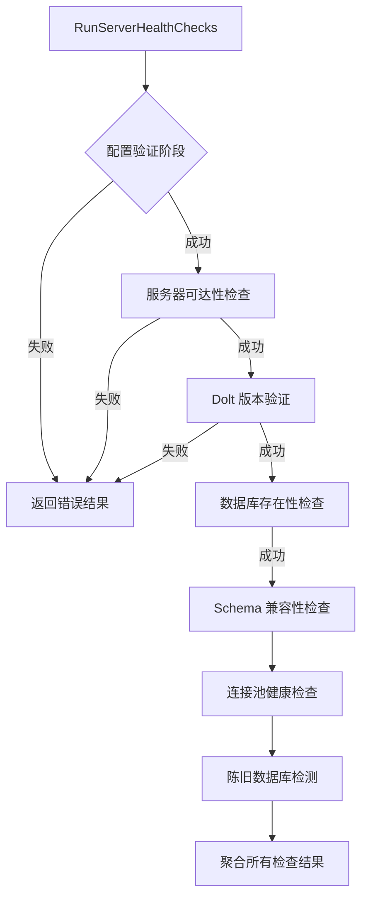

# server_health_checks 模块技术深度解析

## 1. 模块概览

`server_health_checks` 模块是 `bd doctor --server` 命令的核心实现，负责验证 Dolt SQL 服务器模式下的完整健康状态。在分布式或多用户环境中，Beads 可以配置为连接到独立运行的 Dolt 服务器，而不是使用嵌入式 Dolt 模式。这种模式下，任何服务器层面的问题都会导致整个系统故障，因此需要一套全面的诊断工具来快速定位和修复问题。

这个模块的设计哲学类似于机场的预检流程：它不只是检查"飞机是否能飞"，而是系统性地验证从 TCP 连接到数据库 schema 的每一层，确保在实际使用前发现潜在问题。

## 2. 架构与数据流程

### 2.1 架构图



### 2.2 数据流程详解

健康检查采用**分层递进式**设计，每一层的成功都是下一层的前提：

1. **配置验证层**：首先加载 `metadata.json` 配置，验证后端是 Dolt 且服务器模式已启用
2. **网络连接层**：通过 TCP 连接验证服务器主机和端口可访问
3. **协议验证层**：建立 MySQL 连接并验证服务器确实是 Dolt（通过 `dolt_version()` 函数）
4. **数据库层**：验证目标数据库存在且可访问
5. **Schema 层**：验证 Beads 所需的表结构存在且兼容
6. **资源层**：检查连接池状态和是否存在陈旧测试数据库

这种设计的关键在于**故障快速反馈**：如果服务器根本不可达，就不需要浪费时间尝试建立 MySQL 连接；如果连接不上 MySQL，就不需要查询数据库列表。

## 3. 核心组件详解

### 3.1 ServerHealthResult 结构

```go
type ServerHealthResult struct {
    Checks    []DoctorCheck `json:"checks"`
    OverallOK bool          `json:"overall_ok"`
}
```

这个结构是整个模块的输出契约，设计上考虑了**机器可读性和人类可读性的平衡**：
- `Checks` 数组包含每个独立检查的详细结果，便于 CLI 输出和程序处理
- `OverallOK` 提供快速的整体健康状态判断，便于脚本和自动化工具使用

### 3.2 RunServerHealthChecks 函数

这是模块的主入口函数，体现了**渐进式验证**的设计理念：

```go
func RunServerHealthChecks(path string) ServerHealthResult
```

**设计亮点**：
1. **配置优先检查**：首先验证服务器模式是否真的配置了，避免在非服务器模式下做无用功
2. **智能端口解析**：使用 `doltserver.DefaultConfig(beadsDir).Port` 而不是简单的 `cfg.GetDoltServerPort()`，因为后者会错误地回退到 3307
3. **失败终止策略**：在服务器不可达或版本验证失败时立即返回，避免后续检查产生误导性错误
4. **资源清理保证**：使用 `defer` 和显式关闭确保数据库连接总是被释放

### 3.3 检查函数详解

#### checkServerReachable

```go
func checkServerReachable(host string, port int) DoctorCheck
```

这个函数做的事情看似简单——建立 TCP 连接——但设计上有重要考虑：
- **独立于 MySQL 协议**：即使服务器不是 MySQL/Dolt，这个检查也能告诉我们网络层面是否通
- **5 秒超时**：平衡了用户体验和可靠性——足够长以避免网络抖动导致的误报，足够短以避免用户长时间等待
- **立即关闭连接**：建立连接后立即关闭，不占用服务器资源

#### checkDoltVersion

```go
func checkDoltVersion(cfg *configfile.Config, beadsDir string) (DoctorCheck, *sql.DB)
```

这是一个**双重职责**的函数，设计上有些不寻常但有其合理性：
- 既返回检查结果，又返回打开的数据库连接
- 原因：建立连接的成本较高，后续检查需要复用这个连接
- 契约：调用者必须负责关闭返回的连接（通过 `defer` 实现）

**安全设计**：
- 密码只从环境变量 `BEADS_DOLT_PASSWORD` 读取，从不从配置文件读取
- 连接字符串使用 5 秒超时，避免无限等待
- 连接池配置保守（最大 2 个打开连接，1 个空闲连接），因为只是做健康检查

**验证逻辑**：
- 执行 `SELECT dolt_version()` 是验证这确实是 Dolt 服务器的最可靠方法
- 如果函数不存在，明确提示用户可能连接到了普通 MySQL 而不是 Dolt

#### checkDatabaseExists

```go
func checkDatabaseExists(db *sql.DB, database string) DoctorCheck
```

这个函数包含几个**非显而易见的设计决策**：

1. **使用 `SHOW DATABASES` 而不是 `INFORMATION_SCHEMA`**：
   - 代码注释提到这是为了避免"phantom catalog entries"导致的崩溃（R-006, GH#2051, GH#2091）
   - 这是一个从生产环境故障中学习的例子：理论上更"正确"的方法在实践中可能有问题

2. **标识符验证**：
   - `isValidIdentifier` 函数确保数据库名是安全的
   - 对连字符的特殊处理：支持遗留名称但给出警告
   - 这体现了**向后兼容性和最佳实践之间的平衡**

3. **SQL 注入防护**：
   - 虽然使用了字符串拼接 `USE `database``，但前面已经通过 `isValidIdentifier` 验证
   - 这是一个有意识的权衡，因为 `USE` 语句不支持参数化查询

#### checkSchemaCompatible

```go
func checkSchemaCompatible(db *sql.DB, database string) DoctorCheck
```

这个函数采用**实用主义**的验证方法：
- 不检查所有表，只检查 `issues` 表——这是 Beads 最核心的表
- 如果 `metadata` 表存在且有 `bd_version`，则报告版本信息
- 即使没有 metadata 表，只要 issues 表存在，也认为基本可用（但给出警告）

这种设计体现了**渐进降级**的理念：系统可以在不完全"完美"的状态下运行，只要核心功能可用。

#### checkConnectionPool

```go
func checkConnectionPool(db *sql.DB) DoctorCheck
```

这个函数展示了**如何从简单指标中获取洞察**：
- 它不只是报告数字，而是解释这些数字的含义
- 特别关注 `MaxIdleClosed` 和 `MaxLifetimeClosed`——这些是连接池可能存在问题的早期指标
- 目前这个检查总是返回 `StatusOK`，但保留了检测未来问题的框架

#### checkStaleDatabases

```go
func checkStaleDatabases(db *sql.DB) DoctorCheck
```

这个函数解决的是**生产环境中的实际问题**：
- 测试和 polecat（内部工具）经常创建临时数据库，但在中断时不会清理
- 这些数据库会消耗服务器内存，在高并发时可能导致性能问题

**设计特点**：
- 使用前缀匹配而不是硬编码列表，因为临时数据库名称通常包含随机部分
- 保留 `knownProductionDatabases` 白名单，避免误报系统数据库
- 只显示前 10 个陈旧数据库，避免输出过长，但仍然提示总数
- 提供明确的修复命令：`bd dolt clean-databases`

## 4. 依赖关系分析

### 4.1 入站依赖

这个模块主要被 [`cmd.bd.doctor`](cmd-bd-doctor.md) 模块调用，作为 `bd doctor --server` 命令的实现。

### 4.2 出站依赖

- **`internal/configfile`**：加载和解析 `metadata.json` 配置
- **`internal/doltserver`**：获取默认配置，特别是正确的端口解析
- **`github.com/go-sql-driver/mysql`**：MySQL 驱动，用于与 Dolt 服务器通信

### 4.3 数据契约

这个模块依赖几个隐式契约：
1. **配置契约**：`metadata.json` 必须有 `backend`、`dolt_mode`、`dolt_server_host` 等字段
2. **数据库契约**：Dolt 服务器必须支持 `dolt_version()` 函数
3. **Schema 契约**：Beads 数据库应该有 `issues` 表和 `metadata` 表

## 5. 设计决策与权衡

### 5.1 渐进式检查 vs 并行检查

**选择**：渐进式检查，每步依赖前一步成功
**原因**：
- 大多数情况下，早期失败会使后续检查毫无意义
- 避免在服务器不可达时浪费资源建立多个连接
- 错误消息更清晰——用户看到的是根本原因，而不是级联错误

**权衡**：在所有检查都通过的情况下，总耗时会比并行检查稍长，但考虑到健康检查不是频繁执行的操作，这是可接受的。

### 5.2 连接复用 vs 每次新建连接

**选择**：复用同一个数据库连接进行多个检查
**原因**：
- 建立数据库连接的成本相对较高（TCP 握手、认证等）
- 健康检查是短时间内的一系列操作，复用连接效率更高

**权衡**：代码复杂度增加——需要确保连接正确传递和关闭，特别是在错误路径上。

### 5.3 使用 SHOW DATABASES vs INFORMATION_SCHEMA

**选择**：使用 `SHOW DATABASES`
**原因**：
- 生产环境中发现 `INFORMATION_SCHEMA.SCHEMATA` 在某些情况下会导致崩溃
- 这是一个**实证优于理论**的例子

**权衡**：`SHOW DATABASES` 是 MySQL 特定的语法，而 `INFORMATION_SCHEMA` 是标准 SQL。但考虑到我们只针对 Dolt（兼容 MySQL），这是可接受的。

### 5.4 密码来源：环境变量 vs 配置文件

**选择**：只从环境变量读取密码
**原因**：
- 安全最佳实践：密码不应出现在配置文件中（可能被提交到版本控制）
- 遵循 12-Factor App 方法论：配置通过环境变量提供

**权衡**：用户体验稍差——需要设置环境变量而不是在配置文件中一次性配置。但安全考虑优先。

## 6. 使用指南与常见模式

### 6.1 基本使用

```go
// 在 doctor 命令中调用
result := RunServerHealthChecks(path)
if !result.OverallOK {
    // 处理失败情况
}
```

### 6.2 扩展新检查

添加新的健康检查步骤：

1. 在 `RunServerHealthChecks` 中合适的位置添加调用
2. 确保新检查在它依赖的检查之后执行
3. 如果新检查可能失败并使后续检查无意义，考虑在失败时提前返回
4. 更新 `ServerHealthResult` 的 `OverallOK` 状态

### 6.3 配置说明

相关的 `metadata.json` 配置字段：
```json
{
  "backend": "dolt",
  "dolt_mode": "server",
  "dolt_server_host": "localhost",
  "dolt_server_port": 3306,
  "dolt_server_user": "root",
  "dolt_database": "beads"
}
```

环境变量：
- `BEADS_DOLT_PASSWORD`：Dolt 服务器密码（必需）

## 7. 边缘情况与注意事项

### 7.1 已知边缘情况

1. **带连字符的数据库名**：
   - 症状：检查通过但有警告
   - 原因：旧版本 Beads 允许连字符，新版本推荐下划线
   - 处理：可以继续使用，但建议迁移到下划线格式

2. **缺少 metadata 表**：
   - 症状：Schema 检查通过但有警告
   - 原因：数据库是从旧版本升级的，没有运行迁移
   - 处理：运行 `bd migrate` 更新 schema

3. **陈旧数据库**：
   - 症状：警告但不是错误
   - 原因：测试/工具遗留的临时数据库
   - 处理：运行 `bd dolt clean-databases` 清理

### 7.2 常见陷阱

1. **端口配置**：
   - 陷阱：直接使用 `cfg.GetDoltServerPort()` 可能得到错误的 3307 端口
   - 正确做法：使用 `doltserver.DefaultConfig(beadsDir).Port`

2. **连接关闭**：
   - 陷阱：忘记关闭 `checkDoltVersion` 返回的数据库连接
   - 正确做法：使用 `defer db.Close()`

3. **SQL 注入风险**：
   - 陷阱：在没有验证的情况下拼接数据库名到 SQL
   - 正确做法：总是先通过 `isValidIdentifier` 验证

### 7.3 操作考虑

- 这个模块设计为**只读操作**，不会修改任何数据
- 所有查询都有超时，避免在服务器响应慢时长时间阻塞
- 连接池配置保守，不会对服务器造成负担

## 8. 总结

`server_health_checks` 模块展示了一个设计良好的诊断工具应该具备的品质：**分层验证、快速失败、实用主义、安全意识**。它不追求理论上的"完美"，而是解决实际生产环境中遇到的问题，同时保持代码的可维护性和可扩展性。

这个模块的价值不在于它使用了什么高深的技术，而在于它对细节的关注——从为什么使用 `SHOW DATABASES` 而不是 `INFORMATION_SCHEMA`，到如何处理带连字符的遗留数据库名，每一个决策都有其背后的原因和故事。
