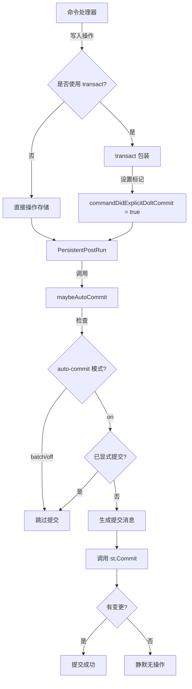

# Dolt Autocommit Policy 模块技术深度解析

## 1. 问题域与模块定位

在使用 Dolt 作为版本化存储后端时，一个关键的设计问题是：**如何在提供 Git 式提交灵活性的同时，保持命令行操作的简单性**？

### 为什么需要这个模块？

如果每次写操作（创建、更新、删除 issue）都需要用户显式执行 `bd dolt commit`，这会让日常使用变得繁琐。但如果总是自动提交，又会失去版本控制的精细粒度控制能力——特别是在需要批量操作并作为单一逻辑提交的场景下。

`dolt_autocommit_policy` 模块正是为了解决这个张力而设计的：它提供了一个可配置的自动提交策略，让用户可以在"每次操作自动提交"和"批量手动提交"之间自由切换。

### 核心问题解决

1. **自动提交的条件判断**：何时应该自动提交，何时不应该？
2. **显式提交的优先级**：如何避免在用户已经显式提交后再重复提交？
3. **提交消息的标准化**：如何生成有意义的自动提交消息？
4. **空提交的优雅处理**：当没有变更时，如何避免报错？

---

## 2. 心智模型与核心抽象

### 心智模型："智能提交开关"

可以把这个模块想象成一个**智能的电灯开关**：
- 当开关处于"on"位置时，每次操作后自动"关灯"（提交）
- 当开关处于"batch"位置时，灯会保持开启状态，直到你手动去关（显式提交）
- 无论开关状态如何，如果你已经手动关过灯了，它不会再尝试关一次

### 核心抽象

| 组件 | 作用 | 类比 |
|------|------|------|
| `doltAutoCommitParams` | 封装自动提交所需的上下文信息 | 开关的"设置面板" |
| `maybeAutoCommit` | 策略决策与执行核心 | 智能开关的"大脑" |
| `transact` | 显式事务包装器 | 手动开关的"手柄" |
| `commandDidExplicitDoltCommit` | 全局状态标记 | 记录"是否已经手动关过灯" |

---

## 3. 架构与数据流向

### 架构图



### 数据流向详解

1. **命令执行阶段**：
   - 命令处理器执行写操作（创建、更新 issue 等）
   - 如果使用 `transact()` 包装事务，会设置 `commandDidExplicitDoltCommit = true`
   
2. **后置钩子阶段**：
   - `PersistentPostRun` 钩子触发，调用 `maybeAutoCommit()`
   - 检查自动提交模式：
     - `batch` 或 `off`：直接返回，不提交
     - `on`：继续检查
   - 检查是否已经显式提交过：
     - 是：跳过
     - 否：继续
   - 生成提交消息（或使用覆盖消息）
   - 调用 `st.Commit()`
   - 处理"无变更"情况，将其视为成功而非错误

---

## 4. 核心组件深度解析

### 4.1 `doltAutoCommitParams` 结构

```go
type doltAutoCommitParams struct {
    Command         string   // 顶级命令名，如 "create", "update"
    IssueIDs        []string // 受影响的主要 issue ID（可选）
    MessageOverride string   // 如果非空，直接使用此消息
}
```

**设计意图**：
- 将自动提交的上下文信息封装成一个独立结构，避免函数参数爆炸
- 支持灵活的提交消息生成策略：既可以自动生成，也可以完全覆盖
- 记录操作元数据（命令名、受影响 issue），用于生成有意义的提交历史

**使用场景**：
- 简单操作：只传 `Command`
- 单 issue 操作：传 `Command` 和 `IssueIDs`
- 需要自定义消息：传 `MessageOverride`

### 4.2 `maybeAutoCommit` 函数

这是模块的核心决策函数，实现了完整的自动提交策略。

**关键决策点**：
1. **模式检查**：只在 `doltAutoCommitOn` 模式下执行
2. **显式提交检查**：通过 `commandDidExplicitDoltCommit` 避免重复提交
3. **存储可用性检查**：确保存储是版本化的 Dolt 存储
4. **消息生成**：优先使用覆盖消息，否则自动生成
5. **空提交处理**：将"nothing to commit"视为成功

**为什么这样设计？**

- **模式检查**：给用户完全的控制权——在批量操作时可以切换到 batch 模式
- **显式提交优先**：避免"提交了又提交"的混淆行为
- **优雅处理空提交**：不是每个操作都会产生变更，这种情况不应该报错

### 4.3 `transact` 函数

```go
func transact(ctx context.Context, s *dolt.DoltStore, commitMsg string, fn func(tx storage.Transaction) error) error {
    err := s.RunInTransaction(ctx, commitMsg, fn)
    if err == nil {
        commandDidExplicitDoltCommit = true
    }
    return err
}
```

**设计亮点**：
- **简单的包装器模式**：几乎是透明的代理，只增加了一个副作用
- **错误条件判断**：只在事务成功时才设置标记
- **约定优于配置**：命令处理器只需要用 `transact` 替代直接调用 `RunInTransaction`

**为什么需要这个？**

如果命令内部已经显式执行了带提交的事务，再在后置钩子中自动提交就是冗余的，甚至可能造成混淆。这个函数提供了一种清晰的方式来标记"已经提交过了"。

### 4.4 `formatDoltAutoCommitMessage` 函数

这个函数生成标准化的提交消息，格式为：
```
bd: {command} (auto-commit) by {actor} [{issueIDs}]
```

**设计细节**：
- **去重与排序**：对 issue ID 进行去重和排序，确保消息稳定性
- **数量限制**：最多显示 5 个 issue ID，避免消息过长
- **默认值处理**：为空的 command 和 actor 提供合理默认值
- **条件格式化**：没有 issue ID 时省略方括号部分

**为什么这些细节重要？**

提交消息是给人看的，一致性和可读性至关重要。去重和排序确保相同的操作集生成相同的消息；数量限制避免在批量操作时消息失控；条件格式化让消息在各种情况下都看起来自然。

---

## 5. 依赖分析

### 5.1 入站依赖（谁调用这个模块）

- **CLI 命令处理器**：所有执行写操作的命令都会间接使用这个模块
  - 通过 `PersistentPostRun` 钩子自动调用 `maybeAutoCommit`
  - 部分命令直接使用 `transact` 包装显式事务

### 5.2 出站依赖（这个模块调用谁）

- **`dolt.DoltStore`**：核心存储实现
  - `RunInTransaction`：执行显式事务
  - `Commit`：执行提交操作
  
- **`storage.Transaction`**：事务接口
  - 被 `transact` 函数传递给回调

- **全局状态**：
  - `commandDidExplicitDoltCommit`：布尔标记，跟踪是否已显式提交
  - `getStore()`：获取当前存储实例
  - `getDoltAutoCommitMode()`：获取自动提交模式配置
  - `getActor()`：获取当前操作者信息

### 5.3 数据契约

**输入契约**：
- `doltAutoCommitParams.Command`：非空字符串，或为空时使用 "write" 作为默认
- `doltAutoCommitParams.IssueIDs`：可以为空，元素会被去重和排序
- `doltAutoCommitParams.MessageOverride`：为空时自动生成，非空时直接使用

**输出契约**：
- `maybeAutoCommit`：成功时返回 `nil`，出错时返回具体错误
- "nothing to commit" 情况被转换为成功（`nil`）

---

## 6. 设计决策与权衡

### 6.1 全局状态 vs 上下文传递

**决策**：使用全局变量 `commandDidExplicitDoltCommit` 跟踪显式提交状态

**替代方案**：
- 通过上下文（context）传递状态
- 通过命令结构字段传递状态

**权衡分析**：
| 维度 | 全局变量 | 上下文传递 |
|------|----------|------------|
| 简单性 | ✅ 极高 | ❌ 需要修改多处签名 |
| 可测试性 | ❌ 需要重置状态 | ✅ 容易隔离 |
| 线程安全 | ❌ （但 CLI 是单线程的） | ✅ 天然安全 |
| 耦合度 | ❌ 隐式依赖 | ✅ 显式依赖 |

**为什么选择全局变量？**

在 CLI 应用的特定上下文中，这是一个合理的选择：
1. CLI 是单线程的，没有并发安全问题
2. 这个状态的生命周期非常明确——单个命令执行期间
3. 避免了在整个调用链中传递这个"横切关注点"
4. 代码更简洁，更容易理解

**不过，这是一个有意识的妥协**——如果这个代码要在更复杂的环境（如服务器）中使用，全局变量就不是合适的选择了。

### 6.2 三种模式 vs 布尔开关

**决策**：设计了三种模式（隐含的 `off`、`on`、`batch`），而不是简单的布尔开关

**为什么？**

简单的"开/关"不足以表达用户的全部意图：
- **关**：完全手动控制
- **开**：每次操作自动提交
- **批处理**：操作但不提交，直到显式提交点

这三种模式对应了三种典型使用场景：
1. 专家用户：完全控制（off）
2. 日常使用：每次操作都保存（on）
3. 批量工作流：一系列操作作为单一逻辑提交（batch）

### 6.3 "无变更"视为成功 vs 错误

**决策**：将"nothing to commit"视为成功返回，而不是错误

**理由**：
1. **幂等性**：多次调用相同的操作应该产生相同的结果
2. **用户体验**：用户不关心是否真的有变更，只关心"操作是否生效"
3. **组合性**：这样更容易在脚本中使用，不需要处理这种"不算错误的错误"

**实现方式**：
通过 `isDoltNothingToCommit` 函数检测错误消息中的特定模式，这种方式有些脆弱（依赖错误消息文本），但在没有更好 API 的情况下是合理的权宜之计。

---

## 7. 使用指南与最佳实践

### 7.1 命令处理器中的使用

#### 场景 1：简单操作，自动提交

```go
func createIssue(cmd *cobra.Command, args []string) error {
    // ... 执行创建操作 ...
    // 不需要特别做什么，PersistentPostRun 会处理自动提交
    return nil
}
```

#### 场景 2：显式事务，避免重复提交

```go
func complexOperation(cmd *cobra.Command, args []string) error {
    // 使用 transact 包装，这样自动提交会被跳过
    return transact(ctx, store, "complex operation", func(tx storage.Transaction) error {
        // ... 在事务中执行多个操作 ...
        return nil
    })
}
```

#### 场景 3：自定义自动提交参数

在命令的 `Run` 函数中设置参数：
```go
// 假设这是在某个命令的 Run 函数中
autoCommitParams = doltAutoCommitParams{
    Command:  "special-command",
    IssueIDs: []string{issueID},
}
```

### 7.2 配置自动提交模式

用户通过配置控制行为：
```bash
# 开启自动提交（默认）
bd config set dolt.autocommit on

# 批处理模式（操作但不自动提交）
bd config set dolt.autocommit batch

# 关闭自动提交
bd config set dolt.autocommit off
```

### 7.3 最佳实践

1. **对于复杂的多步操作**：使用 `transact` 包装，确保原子性并避免双重提交
2. **对于简单的单步操作**：让自动提交处理，保持代码简洁
3. **设置有意义的 Command 名称**：这会出现在提交历史中，帮助理解变更
4. **传递 IssueIDs**：如果操作影响特定 issue，传递它们使提交消息更有用
5. **谨慎使用 MessageOverride**：只在确实需要完全控制消息时使用

---

## 8. 边缘情况与陷阱

### 8.1 全局状态的重置

**问题**：`commandDidExplicitDoltCommit` 是全局变量，需要在每次命令开始时重置

**当前处理**：这个重置是在命令框架的某个地方处理的（代码中没有显示）

**注意**：如果你在非标准流程中使用这些函数，需要确保手动重置这个标志

### 8.2 错误消息的脆弱性

**问题**：`isDoltNothingToCommit` 通过匹配错误消息文本来工作，如果 Dolt 改变了错误消息格式，这会失效

**缓解**：
- 检查了多种可能的消息模式（"nothing to commit" 和 "no changes" + "commit"）
- 转为小写后匹配，提高鲁棒性

**理想解决方案**：Dolt 提供特定的错误类型或错误码，但在没有的情况下，这是合理的折衷

### 8.3 Issue ID 数量限制

**行为**：提交消息中最多显示 5 个 issue ID

**理由**：避免消息过长，影响可读性

**注意**：如果操作影响了大量 issue，提交消息不会完整列出所有 ID——这是有意的设计权衡

### 8.4 空 IssueID 的过滤

**行为**：空字符串的 issue ID 会被过滤掉

**理由**：避免提交消息中出现无意义的空值

**注意**：确保传递给 `IssueIDs` 的是有效的 ID，空 ID 会被静默忽略

---

## 9. 扩展与演进

### 9.1 当前设计的扩展点

1. **更多的自动提交模式**：可以很容易地添加新的模式，如"按时间间隔"或"按变更大小"
2. **更丰富的提交消息模板**：当前的格式是硬编码的，可以改为可配置的模板
3. **提交前钩子**：可以添加在自动提交前执行的钩子，用于验证或补充变更

### 9.2 如果要在服务器环境中使用

如前所述，当前的全局变量设计不适用于服务器环境。如果要移植：

1. 将 `commandDidExplicitDoltCommit` 移到请求上下文中
2. 确保每个请求有独立的状态
3. 可能需要重构 `transact` 和 `maybeAutoCommit` 的签名，接受上下文参数

---

## 10. 总结

`dolt_autocommit_policy` 模块是一个精心设计的"策略层"，它在保持 CLI 简单性的同时，提供了版本控制系统的强大功能。

**关键洞察**：
- 不是非此即彼的选择（要么全手动，要么全自动），而是提供了一个频谱
- 使用简单的全局状态来处理横切关注点，在 CLI 环境中是合理的权衡
- 对"无变更"情况的优雅处理，大大提升了用户体验
- 标准化的提交消息，使版本历史真正有用

这个模块展示了如何在实用性和纯粹性之间取得平衡——它不是完美的（使用了全局变量），但在特定的上下文中，它是恰到好处的解决方案。