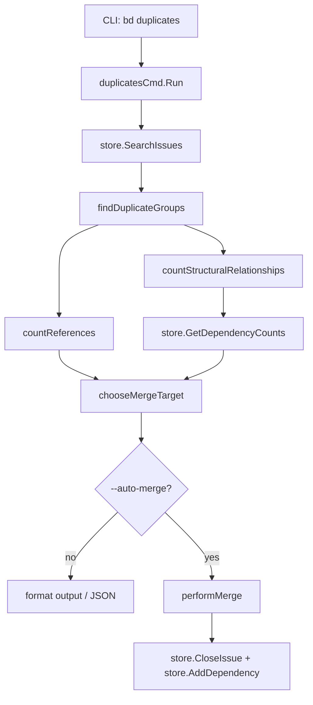

# exact_duplicate_detection_and_merge 模块技术深度分析

## 1. 问题与解决方案

### 问题场景
在项目管理和协作过程中，团队成员往往会在不知情的情况下创建多个内容完全相同的问题（Issue）。这种情况会导致工作分散、依赖分叉、统计失真，最终团队会在“看起来很多任务”里浪费宝贵的协调成本。重复问题的出现让整个任务系统变得不清晰，影响了团队的效率和决策质量。

### 为什么简单的解决方案不行
如果用最朴素的方法，重复检测可能只是“标题相同就算重复”。这在真实数据里会很快失效：标题常常很短、很模板化，真正区分上下文的信息在 `Description`、`Design`、`AcceptanceCriteria`。相反，如果只看长文本，又会漏掉很多仅有标题、但其实就是重复提交的任务。

简单的方案面临的挑战：
- 标题匹配：误报率高，相同标题可能内容完全不同
- 内容完全匹配：只看长文本可能漏掉重要信息
- 语义匹配：复杂、成本高、不稳定，不适合自动化操作

### 核心洞察
该模块采用了明确且可解释的定义：`title + description + design + acceptanceCriteria + status` 全部一致，才归入同一重复组。此外，选择保留目标的策略是优先保护图结构完整性，再考虑文本生态，最后保证确定性输出。

可以把它想象成仓库盘点：先把完全同款货物堆在一起，再决定哪一箱作为主箱，其他箱子贴上“同款并入”标签。

## 2. 架构与核心抽象

### 核心组件关系图


### 心智模型：三阶段流水线
理解这个模块，建议把它当成一个三阶段流水线：

第一阶段是**分桶**。`findDuplicateGroups` 用 `contentKey` 把 issue 按关键字段分组，只保留桶里元素数大于 1 的组。这个阶段不做任何修改，只做识别。

第二阶段是**评分选主**。模块会汇总两类信号：`countReferences` 扫文本里的 issue ID 提及次数；`countStructuralRelationships` 通过 `store.GetDependencyCounts` 一次性拿到每个候选 issue 的依赖/被依赖数量。`chooseMergeTarget` 再按优先级比较，选出每组“主 issue”。

第三阶段是**输出或执行**。默认只输出建议；`--auto-merge` 才执行 `performMerge`：逐条关闭源 issue，并新增 `related` 依赖指向目标 issue。`--dry-run` 会走同样决策流程但不写库。

一个很实用的类比是“城市道路并线”：重复 issue 是多条并行小路，目标 issue 是主干道。评分逻辑就是在找“已经接了最多道路、最不该被拆掉”的那条。

### 核心抽象与数据结构

#### contentKey 结构
`contentKey` 是分组键，字段包括 `title`、`description`、`design`、`acceptanceCriteria`、`status`。设计意图很直接：把“什么叫完全重复”写成可序列化、可比较的结构体键，让 Go map 直接承担聚类功能。

这里的非显然点是 `status`：键里包含状态，理论上允许“open 只和 open 比、closed 只和 closed 比”。但命令入口在分组前已经把 closed 过滤掉了，所以当前实际运行只比较 open issue，`status` 字段更像“保留策略余量”。

#### issueScore 结构
`issueScore` 保存保留目标决策所需的结构信号：`dependentCount`、`dependsOnCount`、`textRefs`。虽然 `textRefs` 字段定义在结构体里，但当前实现里文本引用是单独通过 `refCounts map[string]int` 传递，`issueScore.textRefs` 实际未参与读写。

这透露出一个演进痕迹：模块从“文本引用优先”演进到“结构连接优先”后，数据承载分成了两路。

## 3. 核心组件详解

### findDuplicateGroups - 重复分组
`func findDuplicateGroups(issues []*types.Issue) [][]*types.Issue`

该函数是纯函数式的内存转换：输入 issue 列表，输出重复组列表。内部先构造 `map[contentKey][]*types.Issue`，再筛出长度大于 1 的桶。

设计上它选择“显式字段拼键”，而不是使用 `Issue.ContentHash`。好处是逻辑透明、与存储层 hash 实现解耦；代价是没有做规范化（大小写、空白、Markdown 格式差异都会导致不匹配）。

### countReferences - 文本引用计数
`func countReferences(issues []*types.Issue) map[string]int`

此函数扫描 `Description`、`Design`、`AcceptanceCriteria`、`Notes` 四个文本字段，用正则 `\b[a-zA-Z][-a-zA-Z0-9]*-\d+\b` 抓取形如 `bd-123` 的 ID 并计数。

它的价值在于补齐“软连接”信号：即便没有显式 dependency edge，被很多文本提及的 issue 通常更“中心”。但它不校验提及 ID 是否真实存在，也不排除自引用，因此是启发式而非强一致信号。

### countStructuralRelationships - 结构关系计数
`func countStructuralRelationships(groups [][]*types.Issue) map[string]*issueScore`

该函数只针对重复候选集合提取 ID，调用 `store.GetDependencyCounts(ctx, issueIDs)` 批量拿到 `DependencyCount`/`DependentCount`，再回填到 `issueScore`。

这是一个典型“性能优先但失败可降级”的实现：它避免逐条查询（N+1），但如果批量查询失败，不中断流程，而是返回零值分数，让后续回退到文本引用 + ID 平局规则。换句话说，结构分不是硬依赖，检测结果可用性优先于最优准确性。

### chooseMergeTarget - 合并目标选择
`func chooseMergeTarget(group []*types.Issue, refCounts map[string]int, structuralScores map[string]*issueScore) *types.Issue`

这是核心决策器，比较顺序非常明确：

1. `weight = dependentCount + dependsOnCount`（结构连接总量）
2. `textRefs`（文本被提及次数）
3. `issue.ID` 字典序（稳定性 tie-breaker）

这组优先级体现了当前模块的设计价值观：先保护图结构完整性，再考虑文本生态，最后保证 deterministic 输出。尤其第一条，意味着“有任何结构连接的 issue”会优先于空壳 issue，这对依赖图连续性很关键。

### performMerge - 合并执行
`func performMerge(targetID string, sourceIDs []string) map[string]interface{}`

执行逻辑是顺序式、逐源 issue 处理：先 `store.CloseIssue(ctx, sourceID, reason, actor, "")`，再 `store.AddDependency(ctx, dep, actor)`，其中依赖类型固定为 `types.DependencyType("related")`。

这个顺序的意图是先完成语义状态变更（标记重复并关闭），再补关系边。但它没有事务包裹，所以可能出现“已关闭但未成功加边”的部分成功状态。函数会把这类失败记录到 `errors` 返回，属于显式暴露而非自动回滚策略。

## 4. 关键数据流

### 端到端流程
1. `duplicatesCmd.Run` 读取 `--auto-merge / --dry-run`
2. `store.SearchIssues(ctx, "", types.IssueFilter{})` 拉全量 issue
3. 内存中过滤掉 `StatusClosed`（当前实现只在 open 集合里找重复）
4. `findDuplicateGroups` 用 `contentKey` 分桶，保留 size>1 的组
5. `countReferences` 用正则统计文本字段中的 issue ID 引用
6. `countStructuralRelationships` 批量调用 `store.GetDependencyCounts` 填 `issueScore`
7. `chooseMergeTarget` 决定保留目标（结构权重 > 文本引用 > ID 字典序）
8. 输出建议；若自动合并则 `performMerge`：
   - `store.CloseIssue`
   - `store.AddDependency`（`Type: "related"`）

从调用关系看，这个模块在 CLI 架构里扮演的是**命令级 orchestrator + 轻量决策器**。它本身不持久化状态，不维护缓存，也不做复杂领域建模；它依赖全局 `store`（`*dolt.DoltStore`，实现 `Storage` 接口）完成读写，依赖 Cobra 命令生命周期接入主程序。

## 5. 关键设计决策与权衡

### 决策一：Exact match 而非 semantic match
- **选择方案**：使用严格的内容键匹配
- **原因**：精确匹配可解释性强、误报率低，适合自动合并这种高风险操作
- **权衡**：牺牲召回率（空白差异、大小写差异都会漏），但在 CLI 工具场景，可控性和可解释性优先于完美召回

### 决策二：选主策略优先结构连接，再文本引用
- **选择方案**：`dependent+dependsOn` 优先，`textRefs` 次之，最后 ID 字典序
- **原因**：优先保留依赖图“枢纽节点”，减少图断裂风险
- **权衡**：某些“文本语义上更权威”的 issue 可能不被选为目标，但保护图结构连续性更重要

### 决策三：countStructuralRelationships 失败时降级
- **选择方案**：批量依赖查询失败时不中断流程，返回零值分数
- **原因**：可用性优先于最优准确性，检测结果“有总比没有强”
- **权衡**：在批量查询失败场景，决策质量会下降，但流程不会中断

### 决策四：performMerge 不使用事务
- **选择方案**：顺序写入，没有事务包裹
- **原因**：实现简单，错误可见性高
- **权衡**：可能出现“已 close，未 add dependency”的部分成功状态，要求调用者检查返回的 `errors`

### 决策五：先过滤 closed issue
- **选择方案**：在检测前先把 closed 过滤掉
- **原因**：已关闭的问题已经完成，没有必要检测重复项
- **权衡**：可能会错过已关闭的重复问题，但这是合理的权衡，因为已关闭的问题不需要再处理

## 6. 常见用法与模式

### 基本使用模式
最常见的工作流是先审查、再执行：

```bash
# 仅检测并输出建议
bd duplicates

# JSON 输出，便于脚本处理
bd duplicates --json

# 预演自动合并（不写库）
bd duplicates --auto-merge --dry-run

# 执行自动合并
bd duplicates --auto-merge
```

### 程序复用模式
如果你只想复用算法，不直接执行命令，核心函数链路是：

```go
allIssues, _ := store.SearchIssues(ctx, "", types.IssueFilter{})

openIssues := make([]*types.Issue, 0, len(allIssues))
for _, issue := range allIssues {
    if issue.Status != types.StatusClosed {
        openIssues = append(openIssues, issue)
    }
}

groups := findDuplicateGroups(openIssues)
refCounts := countReferences(allIssues)
structural := countStructuralRelationships(groups)

for _, g := range groups {
    target := chooseMergeTarget(g, refCounts, structural)
    _ = target
}
```

## 7. 注意事项与陷阱

### 文档描述与实际行为的细微偏差
命令说明提到 open/closed 各自分组，但实现先过滤 closed，所以当前不会报告 closed duplicate group。修改前请先统一产品语义与帮助文案。

### 严格字符串匹配的局限性
任何空白、大小写、格式差异都会让重复检测失效。如果需要更宽松的匹配，可能需要考虑使用 `bd find-duplicates` 命令。

### 顺序写入非事务
`performMerge` 可能产生部分成功状态（已 close 但未成功 add dependency），需要后续修复或重试。自动化脚本必须检查 `errors`。

### 输出稳定性
`findDuplicateGroups` 基于 map 迭代，group 顺序天然不稳定；如果你在测试或外部自动化里依赖顺序，需要显式排序。

### 文本引用正则的局限性
文本引用正则依赖 `prefix-number` 格式，若未来 ID 规范变化，这里会静默退化。

## 8. 与其他模块的关系

本模块是“精确重复检测 + 合并建议/执行”，与“语义近似重复检测”是互补关系，不应混淆。建议同时阅读：

- [semantic_duplicate_detection](semantic_duplicate_detection.md)
- [orphan_detection_command](orphan_detection_command.md)
- [CLI Orphan & Duplicate Commands](CLI Orphan & Duplicate Commands.md)
- [Storage Interfaces](Storage Interfaces.md)
- [Core Domain Types](Core Domain Types.md)
- [dependency_and_label_operations](dependency_and_label_operations.md)

### 依赖关系
- 输入依赖：`internal.types.types.Issue`、`internal.storage.storage.Storage`
- 输出：没有直接输出依赖，是一个命令行工具
- 其他模块调用：没有其他模块直接调用本模块的内部函数，它主要通过 CLI 命令入口被使用
