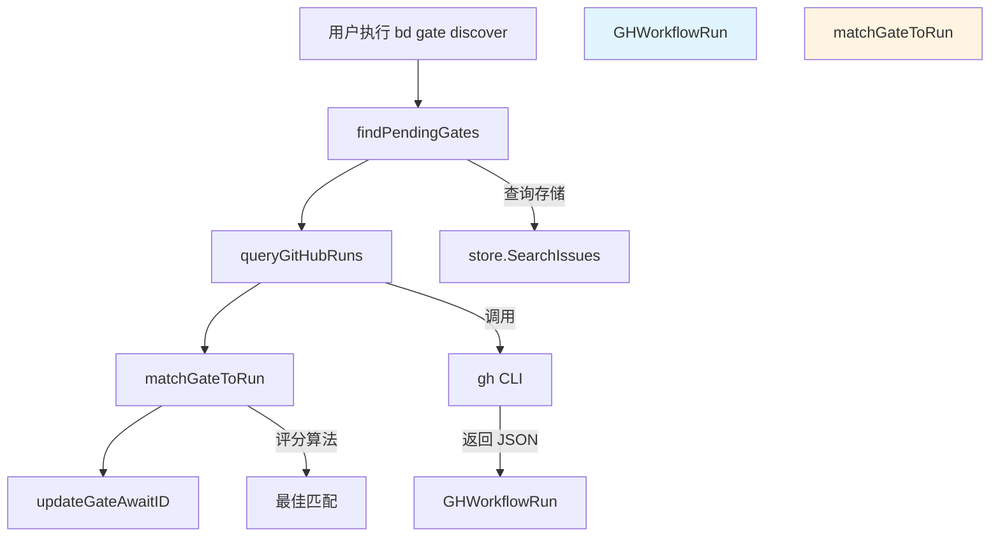

# GitHub Workflow Run 发现模块

## 概述

`github_run_discovery_model` 模块是 Beads 系统中用于自动发现和关联 GitHub Actions 工作流运行记录的核心组件。当系统中的"门控"（gate）问题需要等待 CI/CD 完成但尚未关联具体的运行 ID 时，这个模块通过启发式匹配算法，智能地将门控与 GitHub 上最近的工作流运行关联起来。

这个模块解决的核心问题是：**如何在没有显式配置的情况下，自动找到与特定门控对应的 GitHub 工作流运行？** 答案是通过组合分支匹配、提交 SHA 匹配、时间邻近性和工作流名称匹配等多种启发式信号，构建一个评分系统来找到最佳匹配。

## 架构与数据流程



### 核心流程说明

1. **发现待处理门控**：通过 `findPendingGates` 函数查找所有类型为 "gate"、状态为打开且需要发现运行 ID 的问题。
2. **查询 GitHub 运行记录**：使用 `gh` CLI 工具查询最近的工作流运行记录，解析为 `GHWorkflowRun` 结构。
3. **匹配算法**：`matchGateToRun` 是核心，它通过多维度评分找到最佳匹配。
4. **更新门控**：将找到的运行 ID 更新到门控的 `await_id` 字段，使后续轮询可以检查运行状态。

## 核心组件深度解析

### GHWorkflowRun 结构

`GHWorkflowRun` 是对 GitHub CLI 返回的工作流运行数据的直接映射，它是整个匹配过程的数据载体。

```go
type GHWorkflowRun struct {
    DatabaseID   int64     `json:"databaseId"`   // GitHub 运行的唯一标识符
    DisplayTitle string    `json:"displayTitle"` // 运行的显示标题
    HeadBranch   string    `json:"headBranch"`   // 运行所在的分支
    HeadSha      string    `json:"headSha"`      // 运行的提交 SHA
    Name         string    `json:"name"`         // 工作流文件名
    Status       string    `json:"status"`       // 运行状态
    Conclusion   string    `json:"conclusion,omitempty"` // 运行结论（完成时）
    CreatedAt    time.Time `json:"createdAt"`    // 创建时间
    UpdatedAt    time.Time `json:"updatedAt"`    // 更新时间
    WorkflowName string    `json:"workflowName"` // 工作流显示名称
    URL          string    `json:"url"`          // 运行详情 URL
}
```

这个结构的设计体现了一个重要原则：**保持与外部系统数据结构的一致性**。字段名与 GitHub API 返回的 JSON 字段完全对应，简化了序列化/反序列化过程。

### 匹配逻辑与评分系统

`matchGateToRun` 函数是模块的核心，它实现了一个基于多信号的评分系统。让我们分析其设计：

```go
func matchGateToRun(gate *types.Issue, runs []GHWorkflowRun, maxAge time.Duration) *GHWorkflowRun
```

#### 评分机制详解

评分系统采用累加式设计，每个匹配维度贡献不同的分数：

| 匹配维度 | 分值 | 说明 |
|---------|------|------|
| 工作流名称匹配 | 200 | 最强信号，门控有工作流名称提示时必须满足 |
| 提交 SHA 匹配 | 100 | 次强信号，精确匹配当前提交 |
| 分支匹配 | 50 | 确保运行在正确的分支上 |
| 时间邻近性（<5分钟） | 30 | 运行与门控创建时间高度接近 |
| 时间邻近性（<10分钟） | 20 | 中等时间接近 |
| 时间邻近性（<30分钟） | 10 | 较弱时间接近 |
| 状态为 in_progress/queued | 5 | 偏好正在进行的运行 |

这种设计的巧妙之处在于：**通过分值差异建立明确的信号优先级**。工作流名称匹配（200分）的权重远高于其他信号，确保当用户明确指定了工作流时，匹配是确定性的。

#### 最小置信度阈值

函数最后要求 `bestScore >= 30` 才返回匹配，这是一个关键的设计决策。这个阈值确保：
- 有工作流提示时：工作流匹配（200分）本身就足够
- 无工作流提示时：至少需要分支匹配（50分）或强时间邻近性（30分）

这避免了随机匹配，保证了系统的可靠性。

### 工作流名称匹配策略

`workflowNameMatches` 函数处理了工作流名称匹配的复杂性：

```go
func workflowNameMatches(hint, workflowName, runName string) bool
```

这个函数体现了**对用户体验的细致考虑**，它处理了多种命名约定：
- 精确匹配（不区分大小写）
- 提示带 `.yml/.yaml` 后缀 vs 显示名称不带后缀
- 提示不带后缀 vs 文件名带 `.yml/.yaml`

这种灵活性是必要的，因为用户可能以任何一种方式引用工作流。

## 依赖分析

### 输入依赖

1. **`types.Issue`**：从 [Core Domain Types](core-domain-types.md) 模块导入，代表门控问题
2. **`store.SearchIssues` / `store.UpdateIssue`**：从 [Storage Interfaces](storage-interfaces.md) 模块导入，用于查询和更新问题
3. **`beads.GetRepoContext()`**：从 [Beads Repository Context](beads-repository-context.md) 模块导入，获取 Git 仓库上下文
4. **`gh` CLI**：外部依赖，用于查询 GitHub 工作流运行

### 输出合约

- 更新门控的 `await_id` 字段为 GitHub 运行 ID（字符串形式的数字）
- 控制台输出匹配结果，使用 `ui.RenderPass`/`ui.RenderFail` 进行可视化

## 设计决策与权衡

### 1. 依赖 `gh` CLI 而非直接调用 GitHub API

**决策**：使用 `gh` CLI 而不是直接调用 GitHub REST API

**原因**：
- 利用用户已有的 GitHub 认证配置，避免额外的认证流程
- 简化实现，不需要处理 API 版本兼容性、分页等复杂性
- `gh run list` 命令已经提供了所需的所有数据

**权衡**：
- ✅ 优点：实现简单、用户体验好（复用现有认证）
- ❌ 缺点：增加了外部依赖、需要处理 CLI 调用失败的情况

### 2. 启发式匹配 vs 精确匹配

**决策**：使用多维度启发式评分而非要求精确匹配

**原因**：
- 现实世界中，门控创建时间与 CI 触发时间可能存在差异
- 用户可能在不同的提交上创建门控
- 提供灵活性同时保持可靠性

**权衡**：
- ✅ 优点：鲁棒性强，能处理各种边缘情况
- ❌ 缺点：可能出现错误匹配（通过最小置信度阈值缓解）

### 3. 工作流名称提示作为非数字 `await_id`

**决策**：当 `await_id` 是非数字时，将其解释为工作流名称提示

**原因**：
- 复用现有字段，避免引入新的配置字段
- 提供自然的用户体验：用户可以直接输入工作流名称而不是 ID

**权衡**：
- ✅ 优点：API 简洁、用户体验直观
- ❌ 缺点：需要区分数字 ID 和名称提示（通过 `isNumericRunID` 处理）

## 使用指南与示例

### 基本用法

```bash
# 自动发现所有匹配的运行 ID
bd gate discover

# 预览模式：显示匹配但不更新
bd gate discover --dry-run

# 仅匹配特定分支的运行
bd gate discover --branch main --limit 10
```

### 配置选项

| 标志 | 类型 | 默认值 | 说明 |
|------|------|--------|------|
| `--dry-run`, `-n` | bool | false | 预览模式，不实际更新 |
| `--branch`, `-b` | string | 当前分支 | 过滤特定分支的运行 |
| `--limit`, `-l` | int | 10 | 查询 GitHub 的最大运行数 |
| `--max-age`, `-a` | duration | 30m | 门控/运行匹配的最大年龄 |

### 高级用例

**使用工作流名称提示**：
```go
// 创建门控时，将 await_id 设置为工作流名称而非数字 ID
gate := types.Issue{
    AwaitType: "gh:run",
    AwaitID:   "ci.yml",  // 这将被解释为工作流名称提示
    // ...
}
```

## 边缘情况与注意事项

### 1. 认证问题

**问题**：`gh` CLI 未认证或认证过期

**解决方案**：模块会检测 `gh` CLI 是否可用，并在失败时提供明确的错误信息，指导用户安装和配置 `gh`。

### 2. 多个可能的匹配

**问题**：多个运行都有较高的匹配分数

**解决方案**：评分系统设计为具有明确的优先级，工作流名称和提交 SHA 匹配具有最高权重，确保在大多数情况下有明确的最佳匹配。

### 3. 时间同步问题

**问题**：本地系统时间与 GitHub 服务器时间不同步

**影响**：时间邻近性评分可能不准确

**缓解**：时间评分只是多个信号之一，其他维度（如分支、提交 SHA）仍然可以提供可靠的匹配。

### 4. 分支名称歧义

**问题**：多个分支有相似的名称（如 `feature` 和 `feature-v2`）

**缓解**：分支匹配是精确匹配，不会出现部分匹配的情况。

## 扩展点与未来改进

1. **可配置的评分权重**：允许用户通过配置调整各个匹配维度的权重
2. **支持更多 CI 系统**：目前仅支持 GitHub Actions，可以扩展到 GitLab CI、Jenkins 等
3. **匹配历史记录**：记录成功的匹配，用于改进未来的匹配算法
4. **双向关联**：在 GitHub 运行中添加指向 Beads 门控的链接

## 总结

`github_run_discovery_model` 模块是一个精心设计的组件，它通过智能的启发式匹配解决了 CI/CD 门控与实际运行关联的问题。其核心价值在于：

1. **自动化**：减少手动配置，提高用户体验
2. **鲁棒性**：多维度评分系统能处理各种现实世界的复杂性
3. **简洁性**：通过复用现有字段和工具，保持 API 和实现的简洁

这个模块展示了一个重要的设计原则：**好的软件能处理模糊性，在不完全信息的情况下做出合理的决策**。
