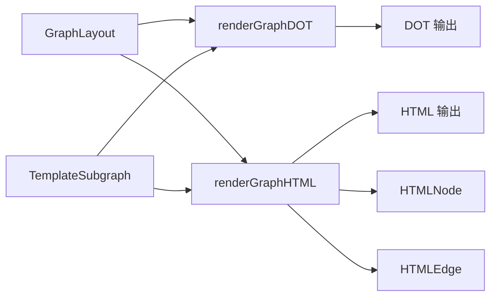

# graph_export_formats 模块技术深度解析

## 1. 模块概述

### 问题背景
在项目管理和任务跟踪系统中，可视化依赖关系图是理解工作流和瓶颈的关键。然而，不同的用户场景需要不同的可视化方式：
- 技术用户可能需要高质量的静态图表用于文档和报告
- 团队成员可能需要交互式可视化来探索复杂的依赖关系
- 简单的文本输出可能不够直观，而专门的图表工具又可能过于复杂

`graph_export_formats` 模块解决了这个问题，它提供了两种主要的导出格式：
1. **Graphviz DOT 格式**：用于生成专业的静态图表
2. **自包含 HTML 格式**：提供交互式的 D3.js 可视化

### 核心价值
这个模块的设计理念是"一次计算，多种输出"。它接收已经计算好的布局信息（`GraphLayout`）和子图结构（`TemplateSubgraph`），然后将这些数据转换为不同的可视化格式，而不需要重新计算图的结构或布局。

## 2. 架构设计

### 数据流程


### 核心组件关系
- **`renderGraphDOT`**：负责生成 Graphviz DOT 格式
- **`renderGraphHTML`**：负责生成交互式 HTML 可视化
- **`HTMLNode`** 和 **`HTMLEdge`**：HTML 可视化的数据结构
- **辅助函数**：包括节点属性计算、边样式、ID 转义等

## 3. 核心组件深度解析

### 3.1 renderGraphDOT 函数

#### 设计意图
这个函数生成 Graphviz DOT 格式，这是一种广泛使用的图形描述语言。它的设计目标是：
- 保持图的层次结构（通过子图簇实现）
- 提供清晰的视觉区分（不同状态有不同颜色）
- 生成可以直接通过管道传递给 Graphviz 工具的输出

#### 关键实现细节
```go
// 使用子图簇按层分组节点，实现层级对齐
for layerIdx, layer := range layout.Layers {
    fmt.Printf("  subgraph cluster_layer_%d {\n", layerIdx)
    // ...
}
```

这里使用了 Graphviz 的子图簇功能，将同一层的节点放在一起，确保它们在渲染时保持水平对齐（`rank=same`）。这种设计使得依赖关系图的层次结构非常清晰。

#### 边的处理
```go
// 只包含阻塞依赖和父子关系
if dep.Type != types.DepBlocks && dep.Type != types.DepParentChild {
    continue
}
```

这个设计决策很重要：不是所有类型的依赖都在图中显示，只显示最关键的两种——阻塞依赖和父子关系。这避免了图表过于复杂，同时保留了最有价值的信息。

### 3.2 renderGraphHTML 函数

#### 设计意图
这个函数生成一个自包含的 HTML 文件，包含交互式的 D3.js 力导向图。它的设计目标是：
- 提供一个不需要安装任何工具就能在浏览器中打开的可视化
- 支持交互式操作（拖拽、缩放、点击查看详情）
- 保持与 DOT 格式一致的视觉风格和信息层次

#### 自包含设计
函数中嵌入了完整的 HTML 模板（`htmlTemplate`），这是一个关键的设计决策。通过将所有必要的 CSS、JavaScript 和 D3.js 库引用都包含在一个文件中，用户可以：
- 直接保存输出为 `.html` 文件
- 双击打开在浏览器中查看
- 分享给团队成员而不需要额外的依赖

#### 数据转换
```go
nodes := buildHTMLGraphData(layout, subgraph)
edges := buildHTMLEdgeData(layout, subgraph)
```

这两个辅助函数将内部数据结构转换为适合 JSON 序列化的格式，然后嵌入到 HTML 模板中。这种设计使得前端 JavaScript 代码可以直接使用这些数据，而不需要额外的网络请求。

### 3.3 HTMLNode 和 HTMLEdge 结构体

#### 设计意图
这两个结构体是专门为 HTML 可视化设计的数据传输对象（DTO）。它们的设计目标是：
- 只包含前端可视化所需的字段
- 使用简单的原始类型以便于 JSON 序列化
- 保持字段名与前端 JavaScript 代码的期望一致

#### 字段设计
```go
type HTMLNode struct {
    ID       string `json:"id"`
    Title    string `json:"title"`
    Status   string `json:"status"`
    Priority int    `json:"priority"`
    Type     string `json:"type"`
    Layer    int    `json:"layer"`
    Assignee string `json:"assignee,omitempty"`
}
```

注意 `Assignee` 字段使用了 `omitempty` 标签——这是一个细节但很重要的设计，它可以减少生成的 JSON 大小，当没有指派人时不包含这个字段。

## 4. 依赖分析

### 输入依赖
- **`GraphLayout`**：来自 [graph_command_core](cmd-bd-graph.md) 模块，包含图的布局信息和节点数据
- **`TemplateSubgraph`**：来自 CLI Template Commands 模块，包含子图的依赖关系

### 输出依赖
- **标准输出**：函数直接将结果打印到标准输出，这使得它们可以与命令行管道配合使用
- **JSON 序列化**：使用标准库 `encoding/json` 将节点和边数据转换为 JSON

### 内部依赖
- **`types` 包**：使用了 `types.DependencyType`、`types.Status` 等核心类型
- **辅助函数**：`dotNodeAttrs`、`dotEdgeStyle`、`dotEscapeID`、`statusPlainIcon` 等

## 5. 设计决策与权衡

### 5.1 直接输出 vs 返回字符串
**决策**：函数直接将结果打印到标准输出，而不是返回字符串。

**权衡**：
- ✅ 优点：可以处理大型图而不会消耗过多内存，适合管道操作
- ❌ 缺点：不够灵活，调用者无法轻松地处理输出（例如保存到变量）

**设计理由**：考虑到这个模块主要用于 CLI 工具，直接输出到标准输出是最自然的设计。如果需要更多灵活性，可以在未来添加返回字符串的版本。

### 5.2 嵌入 HTML 模板 vs 外部文件
**决策**：将完整的 HTML 模板作为常量嵌入到代码中。

**权衡**：
- ✅ 优点：自包含，不需要额外的文件，部署简单
- ❌ 缺点：修改模板需要重新编译，代码文件较大

**设计理由**：对于 CLI 工具来说，自包含是一个重要的设计目标。用户不应该需要担心额外的模板文件位置。

### 5.3 力导向图 vs 分层布局
**决策**：HTML 可视化使用力导向图，但也保留了层信息作为力导向的一个约束。

**权衡**：
- ✅ 优点：力导向图可以很好地处理复杂的图结构，用户可以拖拽节点调整
- ❌ 缺点：可能不如严格的分层布局那么结构化

**设计理由**：通过在力导向模拟中添加层约束（`force("x", d3.forceX(d => 150 + d.layer * 220))`），既保留了分层的视觉结构，又提供了力导向图的灵活性。

### 5.4 只显示关键依赖
**决策**：在图中只显示 `DepBlocks` 和 `DepParentChild` 类型的依赖。

**权衡**：
- ✅ 优点：图表更清晰，重点突出
- ❌ 缺点：可能丢失一些信息

**设计理由**：信息可视化的一个重要原则是"少即是多"。通过只显示最关键的依赖关系，图表更容易理解，用户可以快速识别瓶颈和关键路径。

## 6. 使用示例

### 6.1 生成 DOT 格式并渲染为 SVG
```bash
# 生成 DOT 格式并通过管道传递给 Graphviz
bd graph --dot <issue-id> | dot -Tsvg > graph.svg

# 或者生成 PNG
bd graph --dot <issue-id> | dot -Tpng > graph.png
```

### 6.2 生成 HTML 可视化
```bash
# 生成 HTML 并保存到文件
bd graph --html <issue-id> > graph.html

# 在浏览器中打开
open graph.html  # macOS
start graph.html # Windows
xdg-open graph.html # Linux
```

## 7. 边缘情况与注意事项

### 7.1 空图处理
当 `layout.Nodes` 为空时，函数会输出一个空的图结构，而不是错误。这是一个安全的设计，确保了在各种情况下都有合理的输出。

### 7.2 ID 转义
`dotEscapeID` 函数专门处理了可能破坏 DOT 格式的字符（反斜杠和双引号）。这是一个常见的陷阱，如果没有正确处理，包含特殊字符的 ID 会导致生成的 DOT 文件无效。

### 7.3 节点存在性检查
在添加边之前，代码会检查两个端点是否都存在于子图中：
```go
if layout.Nodes[dep.IssueID] == nil || layout.Nodes[dep.DependsOnID] == nil {
    continue
}
```
这避免了生成引用不存在节点的边，这是另一个常见的图表生成错误来源。

### 7.4 颜色对比度
在 `dotNodeAttrs` 函数中，不仅设置了填充颜色，还设置了相应的字体颜色，以确保在各种背景下文本都可读。这是一个细节但重要的用户体验考虑。

## 8. 扩展与维护建议

### 8.1 添加新的导出格式
如果需要添加新的导出格式（例如 Mermaid、PlantUML 等），可以遵循现有的模式：
1. 创建一个新的渲染函数，接收 `*GraphLayout` 和 `*TemplateSubgraph`
2. 使用类似的辅助函数来处理节点和边的属性
3. 确保正确处理特殊字符和边缘情况

### 8.2 模板化 DOT 生成
目前 DOT 生成是硬编码的，如果需要更多的可定制性，可以考虑将 DOT 生成也模板化，类似于 HTML 的方式。

### 8.3 性能考虑
对于非常大的图（数千个节点），HTML 可视化可能会变慢。可以考虑：
- 添加节点数量限制
- 实现虚拟滚动或按需渲染
- 提供简化模式，只显示关键节点

## 9. 总结

`graph_export_formats` 模块是一个专注于单一职责的模块——将图数据转换为可视化格式。它的设计体现了几个重要的原则：

1. **关注点分离**：不负责计算图的布局，只负责渲染
2. **用户至上**：提供多种格式满足不同用户的需求
3. **健壮性**：仔细处理边缘情况和错误条件
4. **自包含**：HTML 格式包含所有必要的依赖

这个模块虽然代码量不大，但它是连接后端图计算和前端可视化的桥梁，为用户提供了直观理解复杂依赖关系的能力。
