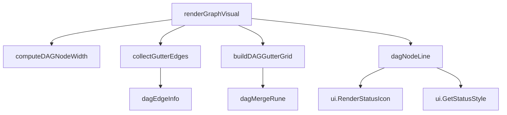

# graph_visual_terminal_dag 模块技术深度解析

## 问题空间与设计动机

在终端环境中可视化有向无环图(DAG)是一个经典挑战。当你需要展示任务依赖关系、工作流或问题阻塞关系时，简单的文本列表无法直观地表达复杂的依赖网络。`graph_visual_terminal_dag` 模块正是为了解决这个问题而设计的——它在纯文本终端中渲染出专业级的 DAG 可视化，使用 Unicode 边框字符创建清晰的节点和边。

这个模块解决的核心问题包括：
- **空间约束**：终端宽度有限，需要合理布局节点和边
- **边路由**：如何优雅地绘制跨多层的依赖关系，避免视觉混乱
- **信息密度**：在有限空间内展示节点状态、标题、ID 和优先级
- **视觉清晰**：使用颜色和边框创建层次分明的可视化效果

## 核心心智模型

可以将这个模块想象成一个**城市交通规划系统**：
- **层(Layer)** 是城市中的纵向大道，从左到右排列
- **节点(Node)** 是大道旁的建筑物，有固定的宽度和高度
- **边(Edge)** 是连接建筑物的道路，需要在"排水沟"(Gutter)区域中路由
- **排水沟(Gutter)** 是大道之间的区域，专门用于道路布线
- **通道(Channel)** 是排水沟中的专用车道，避免道路交叉

数据在这个系统中流动的方式是：从左到右，通过层之间的排水沟，将依赖关系从源节点传递到目标节点。

## 架构概览



这个模块的架构围绕一个中心函数 `renderGraphVisual` 组织，它协调多个专门的辅助函数来完成可视化任务。数据流从输入的 `GraphLayout` 和 `TemplateSubgraph` 开始，经过宽度计算、边收集、排水沟网格构建，最终逐行渲染到终端。

## 核心组件深度解析

### dagEdgeInfo 结构体

```go
type dagEdgeInfo struct {
    sourceRow int
    targetRow int
}
```

这是一个简单但关键的数据结构，它表示一条从源行到目标行的有向边。它的设计体现了**关注点分离**原则：只关注边在垂直方向上的路由，而不关心具体的层信息。这种简化使得边路由逻辑更加清晰，特别是在处理跨多层的边时。

### renderGraphVisual 函数

这是模块的主入口点，它 orchestrates（协调）整个可视化过程。这个函数的设计体现了**分步渲染**的理念：

1. **预处理阶段**：计算节点宽度、收集边信息
2. **布局阶段**：构建排水沟网格
3. **渲染阶段**：逐行输出到终端

关键设计决策：
- 使用固定的节点高度（4行）和行间距（1行），确保视觉一致性
- 预计算排水沟网格，避免实时渲染时的性能问题
- 分层渲染：先渲染层标题，再逐行渲染节点和边

### computeDAGNodeWidth 函数

这个函数计算所有节点的一致宽度，体现了**视觉一致性**的设计原则。它考虑了两个关键因素：
- 标题长度（截断到22字符）
- ID + 优先级的长度

设计亮点：
- 确保最小宽度为18字符，避免节点过小
- 为边框和内边距预留空间，计算准确

### collectGutterEdges 函数

这是边路由逻辑的核心，它将依赖关系组织到各个排水沟中。关键设计洞察：

**跨层边的处理**：当一条边跨越多个层时，它会在每个中间排水沟中创建"直通"条目。这种设计使得边路由变得简单，每个排水沟只需要处理相邻两层之间的连接。

**去重机制**：使用 `edgeKey` 结构体和 `seen` 映射确保每个排水沟中的边唯一，避免重复绘制。

### dagNodeLine 函数

这个函数渲染节点的单个行，体现了**组件化渲染**的思想。节点被分成4行：
1. 顶部边框
2. 状态图标 + 标题
3. ID + 优先级
4. 底部边框

设计亮点：
- 使用 `ui.GetStatusStyle` 为不同状态的节点应用颜色
- 标题截断处理，确保不会溢出节点边界
- 静音(muted)样式显示ID和优先级，减少视觉干扰

### buildDAGGutterGrid 函数

这是边可视化的核心，它预计算排水沟中每一行的显示内容。关键设计决策：

**通道分配**：为需要垂直路由的边分配专门的通道，避免边之间的交叉。通道位置均匀分布，确保视觉平衡。

**边绘制逻辑**：
- 同行边：直接绘制水平箭头
- 跨行边：使用水平线段、垂直线段和拐角连接

### dagMergeRune 函数

这个小函数解决了一个看似简单但实际复杂的问题：如何在同一个单元格中合并两个边框字符。它的设计体现了**视觉优先级**的原则：
- 箭头总是获胜
- 交叉点变成十字
- T型连接根据方向合并

## 数据流动分析

让我们追踪一条依赖关系从输入到可视化的完整路径：

1. **输入**：`TemplateSubgraph` 包含 `Dependency` 对象，标记为 `DepBlocks` 类型
2. **collectGutterEdges**：识别源节点和目标节点，确定它们的层和位置
3. **排水沟路由**：对于跨层边，在每个中间排水沟中创建直通条目
4. **buildDAGGutterGrid**：为每条边分配通道，计算具体的绘制路径
5. **dagMergeRune**：处理边的交叉和合并
6. **renderGraphVisual**：逐行渲染排水沟内容，与节点内容交替显示

## 设计权衡与决策

### 固定节点高度 vs 自适应高度

**决策**：使用固定的4行节点高度
- **优点**：简化布局计算，确保视觉一致性
- **缺点**：无法展示更长的标题或更多信息
- **理由**：在终端环境中，一致性比信息密度更重要

### 预计算排水沟网格 vs 实时渲染

**决策**：预计算整个排水沟网格
- **优点**：渲染过程流畅，可以处理边的交叉和合并
- **缺点**：内存使用增加，特别是对于大型图
- **理由**：终端渲染需要逐行输出，预计算是必要的

### 分层布局 vs 自由布局

**决策**：使用严格的分层布局
- **优点**：依赖方向清晰（从左到右），易于理解
- **缺点**：可能不是最节省空间的布局
- **理由**：对于依赖图，清晰度比空间效率更重要

## 使用指南与示例

这个模块主要通过 `renderGraphVisual` 函数使用，它接受两个关键参数：

```go
// layout 包含节点的分层布局信息
type GraphLayout struct {
    Nodes   map[string]*GraphNode
    Layers  [][]string
    RootID  string
}

// subgraph 包含要可视化的依赖关系
type TemplateSubgraph struct {
    Dependencies []Dependency
}
```

### 关键配置点

- **节点宽度**：通过 `computeDAGNodeWidth` 自动计算，最小18字符
- **排水沟宽度**：固定为6字符，在 `renderGraphVisual` 中定义
- **节点高度**：固定为4行，在 `renderGraphVisual` 中定义

## 边缘情况与注意事项

1. **空图处理**：当 `layout.Nodes` 为空时，会显示"Empty graph"消息
2. **无效依赖**：源节点或目标节点不存在时，会跳过该依赖
3. **反向依赖**：目标节点层小于等于源节点层时，会跳过该依赖
4. **边界检查**：在 `buildDAGGutterGrid` 中对 `sourceY` 和 `targetY` 进行边界检查
5. **字符合并**：`dagMergeRune` 处理了大多数常见的边框字符合并情况，但复杂的交叉可能仍有视觉问题

## 与其他模块的关系

- **依赖**：使用 `internal/types` 中的 `Dependency` 和 `Status` 类型
- **依赖**：使用 `internal/ui` 中的渲染函数（`RenderStatusIcon`、`GetStatusStyle` 等）
- **被调用**：可能被 `cmd/bd/graph` 或 `cmd/bd/graph_export` 模块调用
- **相关**：与 `cmd/bd/graph` 模块共享 `GraphLayout` 和 `GraphNode` 类型

## 总结

`graph_visual_terminal_dag` 模块是一个精心设计的终端 DAG 可视化引擎，它通过分层布局、排水沟路由和智能字符合并等技术，在有限的终端空间中创造出清晰、专业的依赖图可视化。它的设计体现了在终端环境中平衡信息密度、视觉清晰度和实现复杂度的智慧。
