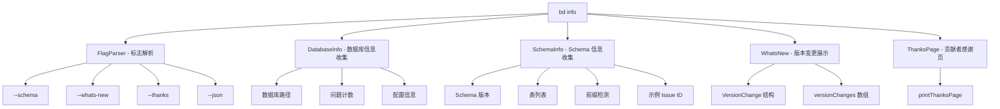

# info_diagnostics 模块技术深度解析

## 1. 模块概述

`info_diagnostics` 模块是 Beads 系统中的诊断和信息展示中心，主要通过 `bd info` 命令为用户和 AI 代理提供数据库状态、版本变更和系统配置的综合视图。这个模块解决了一个关键问题：当多个开发者或 AI 代理在复杂的多仓库、多数据库环境中工作时，如何快速确认当前操作的数据库位置、状态和版本信息。

想象一下，你在一个包含多个子仓库和工作树的复杂项目中工作，每个都可能有自己的 Beads 数据库。`info_diagnostics` 就像一个"仪表盘"，让你一眼就能看清：你在哪个数据库、有多少问题、schema 版本是什么、以及最近版本有什么变化。

## 2. 核心架构



### 数据流程

当用户执行 `bd info` 命令时：

1. **标志解析阶段**：解析命令行标志（`--schema`、`--whats-new`、`--thanks`、`--json`）
2. **信息收集阶段**：
   - 解析数据库绝对路径
   - 通过 `store.SearchIssues()` 统计问题数量
   - 通过 `store.GetAllConfig()` 获取配置信息
   - 如果指定 `--schema`，进一步收集：
     - Schema 版本（`store.GetMetadata("bd_version")`）
     - 检测问题前缀（`extractPrefix()`）
     - 示例 Issue ID
3. **输出阶段**：根据标志决定输出格式（JSON 或人类可读）

## 3. 核心组件详解

### 3.1 VersionChange 结构体

```go
type VersionChange struct {
    Version string   `json:"version"`
    Date    string   `json:"date"`
    Changes []string `json:"changes"`
}
```

**设计意图**：这个结构体是为 AI 代理设计的变更日志格式。它不是普通的发布说明，而是结构化的、机器可读的版本变更记录。每个条目都包含：
- `Version`：语义化版本号
- `Date`：发布日期（ISO 8601 格式）
- `Changes`：变更列表，每个条目都是完整的句子，描述对代理有意义的变更

**为什么这样设计**：AI 代理需要知道"什么变了"来调整行为，而不是"新功能介绍"。所以变更条目都采用动作导向的描述，比如 "NEW: ..."、"FIX: ..."、"REMOVED: ..." 格式。

### 3.2 extractPrefix 函数

```go
func extractPrefix(issueID string) string
```

**功能**：从 Issue ID 中提取前缀，例如：
- "bd-123" → "bd"
- "beads-vscode-1" → "beads-vscode"
- "proj-subproj-456.1" → "proj-subproj"

**设计决策**：这个函数采用了"最后一个连字符前的部分"策略，而不是简单的"第一个连字符"。为什么？因为项目前缀可能包含连字符（如 "beads-vscode"），但序号部分总是数字。

**算法逻辑**：
1. 首先尝试最后一个连字符
2. 检查后缀是否为数字（支持带点的版本号）
3. 如果不是数字，回退到第一个连字符

### 3.3 versionChanges 数组

这个数组是模块的核心数据，包含最近版本的变更记录。它的设计有几个关键点：

- **按版本倒序**：最新版本在前
- **变更分类**：使用 NEW/FIX/REMOVED/CHANGE/SECURITY/PERF/DOCS 等前缀
- **AI 友好**：每个变更都是完整的句子，包含足够的上下文

## 4. 依赖关系

### 输入依赖：
- `internal.types.types.IssueFilter`：用于过滤问题以统计数量
- `store`：全局存储实例，提供数据库访问
- `rootCtx`：根上下文，用于数据库操作
- `Version`：从 version.go 导入的当前版本号

### 输出依赖：
- `outputJSON()`：JSON 输出函数
- `printThanksPage()`：贡献者感谢页函数
- `CheckGitHooks()`：Git 钩子状态检查
- `FormatHookWarnings()`：钩子警告格式化

## 5. 设计决策与权衡

### 5.1 多模式输出设计

**决策**：支持人类可读和 JSON 两种输出格式。

**为什么**：
- 人类需要友好的格式，有颜色、标题、列表
- AI 代理需要结构化的 JSON 格式，便于解析

**权衡**：
- 优点：单一命令满足两种需求
- 缺点：需要维护两套输出逻辑

### 5.2 惰性信息收集

**决策**：只在请求时收集信息（如 `--schema` 才收集 schema 信息）。

**为什么**：
- 性能优化：避免不必要的数据库查询
- 保持输出简洁：只显示用户需要的信息

### 5.3 版本变更数据硬编码

**决策**：将版本变更数据硬编码在源代码中，而不是从外部文件加载。

**为什么**：
- 简单性：避免文件 I/O 和路径解析
- 可靠性：不会因为文件缺失而失败
- 一致性：版本变更与代码一起发布

**权衡**：
- 优点：部署简单，无外部依赖
- 缺点：需要重新编译才能更新变更日志

### 5.4 前缀检测策略

**决策**：使用"最后一个连字符"策略，而不是配置驱动的前缀。

**为什么**：
- 自动发现：不需要配置就能知道前缀
- 支持多前缀：数据库可以有多种前缀的问题
- 鲁棒性：即使配置丢失也能工作

**权衡**：
- 优点：自动化程度高
- 缺点：对非标准 ID 格式可能误判

## 6. 使用指南

### 基本用法

```bash
# 显示基本信息
bd info

# 显示包含 schema 信息
bd info --schema

# 显示版本变更
bd info --whats-new

# JSON 输出
bd info --json
bd info --schema --json
bd info --whats-new --json
```

### 输出结构

#### 人类可读输出包含：
- 数据库路径
- 模式（direct）
- 问题计数
- Schema 信息（如果指定 --schema）
- Git 钩子状态警告

#### JSON 输出结构：
```json
{
  "database_path": "/path/to/database",
  "mode": "direct",
  "issue_count": 42,
  "config": { ... },
  "schema": {
    "tables": ["issues", "dependencies", "labels", "config", "metadata"],
    "schema_version": "0.56.0",
    "config": { "issue_prefix": "bd" },
    "sample_issue_ids": ["bd-1", "bd-2", "bd-3"],
    "detected_prefix": "bd"
  }
}
```

## 7. 边缘情况与注意事项

### 7.1 数据库不可用

当 `store` 为 nil 时，模块会优雅地降级，只显示基本信息（数据库路径），不会崩溃。

### 7.2 前缀提取失败

`extractPrefix` 会返回空字符串，而不是 panic。调用者应该处理空前缀的情况。

### 7.3 版本变更展示

`showWhatsNew` 假设 `Version` 与 `versionChanges` 中的版本匹配，如果不匹配，不会标记为 "← current"。

### 7.4 性能考虑

- 问题计数使用 `SearchIssues` 而不是专门的计数 API，这在大数据库上可能较慢
- Schema 信息收集会执行多个数据库查询，只在明确请求时才执行

## 8. 扩展点

### 添加新版本变更：
```go
var versionChanges = []VersionChange{
    {
        Version: "x.y.z",
        Date:    "2026-xx-xx",
        Changes: []string{
            "NEW: 新功能描述",
            "FIX: 修复描述",
        },
    },
    // ... 现有条目
}
```

### 修改前缀检测逻辑：
修改 `extractPrefix` 函数来支持新的 ID 格式。

## 9. 相关模块

- [CLI Doctor Commands](cmd-bd-doctor.md)：更深入的诊断和修复
- [CLI Where Command](cmd-bd-where.md)：数据库位置发现
- [Storage Interfaces](internal-storage-storage.md)：存储接口定义
