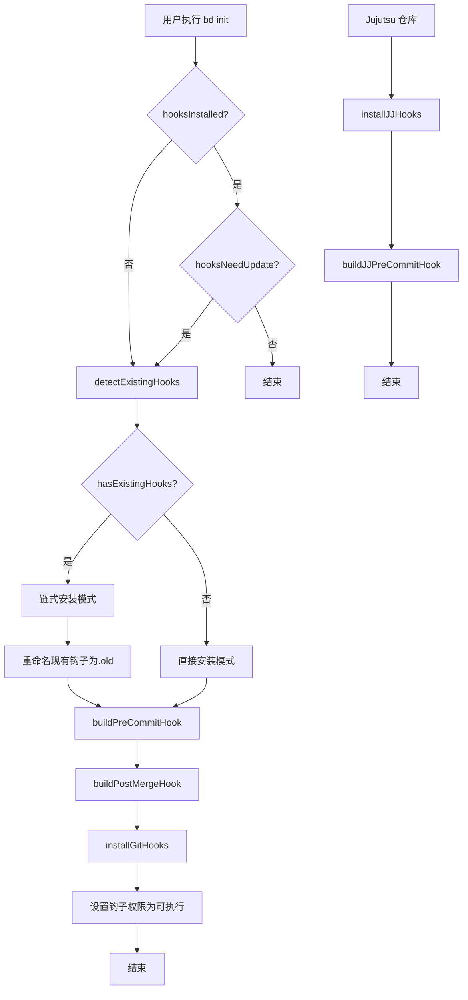

# Git Hook 引导与检测模块深度解析

## 概述

`init_hook_bootstrap_and_detection` 模块负责 beads 工具的 Git 钩子安装、检测和管理。它解决了一个常见的开发者工具集成难题：如何在不破坏现有 Git 钩子配置的情况下，无缝地将 beads 的功能集成到 Git 工作流中。

这个模块是 beads 与 Git 集成的关键组件，它确保了 beads 能够在正确的时机（如提交前、合并后）自动运行，同时尊重用户可能已经存在的钩子配置。

## 问题空间

在深入了解实现细节之前，让我们先理解这个模块试图解决的问题：

1. **钩子共存问题**：许多开发者已经在使用其他 Git 钩子管理工具（如 pre-commit、husky、lefthook 等），beads 需要能够与这些工具和平共存。

2. **钩子检测难题**：如何可靠地检测已安装的钩子，区分它们是 beads 自己的钩子，还是其他工具的钩子，或是用户自定义的钩子？

3. **版本管理挑战**：当 beads 更新时，如何确保已安装的钩子也能得到更新，同时不丢失用户的自定义配置？

4. **跨平台兼容性**：Git 钩子在不同操作系统上可能有不同的行为（特别是行尾符问题），需要确保跨平台的一致性。

5. **多种版本控制系统支持**：除了标准 Git，还需要支持 Jujutsu（jj）等与 Git 兼容的版本控制系统。

## 核心抽象与心智模型

理解这个模块的关键是掌握以下几个核心抽象：

### 1. 钩子信息（hookInfo）

`hookInfo` 结构体是模块的核心数据结构，它封装了关于单个 Git 钩子的所有重要信息：

```go
type hookInfo struct {
    name                 string // 钩子名称，如 "pre-commit"
    path                 string // 钩子文件路径
    exists               bool   // 钩子是否存在
    isBdHook             bool   // 是否是 beads 钩子
    isPreCommitFramework bool   // 是否是 pre-commit 或 prek 框架钩子
    content              string // 钩子文件内容
}
```

这个结构体就像一个钩子的"身份证"，包含了我们了解和处理这个钩子所需的所有信息。

### 2. 钩子检测与安装流程

模块的工作流程可以抽象为以下几个步骤：

1. **检测阶段**：扫描 Git 钩子目录，收集现有钩子的信息
2. **决策阶段**：根据检测结果决定是直接安装、链式安装还是跳过
3. **安装阶段**：根据决策结果执行相应的安装操作
4. **验证阶段**：确保安装的钩子正确且可执行

### 3. 链式安装模式

这是模块的一个关键设计洞察：当检测到现有钩子时，不是覆盖它们，而是采用"链式"模式。这种模式将现有钩子重命名为 `.old` 后缀，然后安装新的 beads 钩子，新钩子会先调用原有的钩子，再执行 beads 自己的逻辑。

## 架构与数据流程

让我们通过一个 Mermaid 图表来理解模块的整体架构和数据流程：



### 关键组件详解

#### 1. 钩子检测（detectExistingHooks）

`detectExistingHooks` 函数是模块的"侦察兵"，它扫描 Git 钩子目录，收集关于 pre-commit、post-merge 和 pre-push 钩子的信息。

**设计要点**：
- 只检测我们关心的钩子类型，避免不必要的扫描
- 使用正则表达式 `preCommitFrameworkPattern` 来识别 pre-commit 或 prek 框架的钩子
- 只有在非 beads 钩子的情况下才会检测是否为 pre-commit 框架钩子，避免误判

#### 2. 钩子安装（installGitHooks）

`installGitHooks` 函数是模块的"工程师"，它负责实际的钩子安装工作。

**设计要点**：
- 首先确保钩子目录存在，使用 `os.MkdirAll` 来处理可能不存在的目录
- 检测现有钩子并决定是否采用链式安装模式
- 链式安装模式下，会将现有钩子重命名为 `.old` 后缀
- 构建钩子内容时会根据是否链式安装选择不同的模板
- 重要的是，会将行尾符统一转换为 LF，避免 Windows 上的 `/usr/bin/env: 'sh\r': No such file or directory` 错误
- 设置正确的可执行权限（0700）

#### 3. 钩子内容构建（buildPreCommitHook, buildPostMergeHook）

这些函数负责生成实际的钩子脚本内容。

**设计要点**：
- 支持两种模式：普通模式和链式模式
- 链式模式下，会先调用原有的钩子（已重命名为 `.old`），然后再执行 beads 逻辑
- 所有钩子都包含版本信息注释（`# bd-hooks-version: x.y.z`），便于后续的版本检测和更新
- pre-commit 钩子的实际逻辑委托给 `bd hooks run pre-commit` 命令，这样可以避免锁死问题并利用 Go 代码处理 Dolt 导出
- post-merge 钩子在 Dolt 后端下实际上是一个 no-op，因为 Dolt 会内部处理同步

#### 4. Jujutsu 支持（installJJHooks, buildJJPreCommitHook）

模块还提供了对 Jujutsu（jj）版本控制系统的支持。

**设计要点**：
- Jujutsu 的模型更简单：工作副本始终是一个提交，因此不需要暂存区
- pre-commit 钩子逻辑相应简化，不需要 git add 操作
- 仍然需要处理工作副本，因为共存的 jj+git 仓库可以使用 git worktrees
- 对于纯 Jujutsu 仓库（不与 git 共存），由于 jj 还不支持钩子，需要用户设置别名

## 依赖分析

这个模块依赖于几个关键组件：

1. **internal/git**：提供获取 Git 钩子目录等功能
2. **internal/ui**：提供用户界面渲染功能，如显示警告、成功信息等
3. **cmd/bd/doctor/fix/hooks**：提供与外部钩子管理器检测相关的模式和逻辑

模块被以下组件调用：
- **init 命令**：在初始化 beads 仓库时安装钩子
- **doctor 命令**：在检查和修复 beads 安装时可能会更新钩子

## 设计权衡与决策

在这个模块的设计中，有几个重要的权衡和决策：

### 1. 链式安装 vs 覆盖安装

**决策**：默认采用链式安装模式，只有在没有现有钩子时才直接安装。

**理由**：
- 尊重用户的现有配置是首要原则
- 覆盖现有钩子可能会导致用户丢失重要的工作流集成
- 链式模式虽然稍微复杂一些，但提供了更好的用户体验

**权衡**：
- 优点：保护用户现有配置，提高工具的接受度
- 缺点：增加了实现复杂度，可能导致钩子链过长影响性能

### 2. 行尾符统一处理

**决策**：在写入钩子文件前，显式将所有 CRLF 替换为 LF。

**理由**：
- Windows 系统上的 Git 钩子如果使用 CRLF 行尾符，会导致 `/usr/bin/env: 'sh\r': No such file or directory` 错误
- 即使在 Windows 上，Git for Windows 也能正确处理 LF 行尾符的脚本

**权衡**：
- 优点：确保跨平台兼容性
- 缺点：需要额外的处理步骤，可能会略微影响性能

### 3. 钩子逻辑委托

**决策**：pre-commit 钩子的实际逻辑不直接写在脚本中，而是委托给 `bd hooks run pre-commit` 命令。

**理由**：
- 避免锁死问题：如果钩子脚本直接尝试操作 Dolt 数据库，可能会与其他进程产生锁冲突
- 利用 Go 代码的优势：Go 代码可以更好地处理错误、并发和复杂逻辑
- 便于更新：更新钩子逻辑不需要重新安装钩子，只需要更新 beads 二进制文件

**权衡**：
- 优点：更可靠、更灵活、更易维护
- 缺点：增加了一层间接性，可能略微影响性能

### 4. pre-commit 框架检测模式

**决策**：使用与 [doctor/fix/hooks](cmd-bd-doctor-fix-hooks.md) 中相同的检测模式，确保一致性。

**理由**：
- 避免在不同模块中使用不同的检测逻辑，导致不一致的结果
- 集中管理检测模式，便于维护和更新

**权衡**：
- 优点：一致性、可维护性
- 缺点：增加了模块间的耦合

## 使用与扩展

### 基本使用

对于大多数用户，他们不需要直接与这个模块交互。当他们执行 `bd init` 时，模块会自动检测并安装合适的钩子。

### 手动安装钩子

如果需要手动安装或更新钩子，可以使用：

```bash
bd hooks install
```

### 检测钩子状态

可以使用 doctor 命令来检查钩子的状态：

```bash
bd doctor
```

如果钩子需要修复，可以使用：

```bash
bd doctor --fix
```

## 边缘情况与注意事项

### 1. 工作副本支持

模块正确处理 Git 工作副本的情况，通过 `git rev-parse --git-common-dir` 获取共享的 Git 目录，确保钩子安装在正确的位置。

### 2. 自定义钩子路径

模块考虑了 `core.hooksPath` 配置的情况，会读取这个配置并使用自定义的钩子路径。

### 3. 权限问题

安装钩子时，模块会确保设置正确的可执行权限（0700），但如果用户的 umask 设置非常严格，可能需要手动调整权限。

### 4. 钩子链过长

如果用户有多个工具都尝试安装钩子，可能会导致钩子链过长。在这种情况下，建议使用一个统一的钩子管理器（如 lefthook），并将 beads 集成到该管理器中，而不是使用链式安装。

### 5. Jujutsu 纯仓库

对于纯 Jujutsu 仓库（不与 Git 共存），由于 jj 还不支持钩子，用户需要手动设置别名。模块提供了 `printJJAliasInstructions` 函数来指导用户完成这个设置。

## 总结

`init_hook_bootstrap_and_detection` 模块是 beads 与 Git 集成的关键组件，它通过智能检测、链式安装和版本管理，解决了工具钩子共存的难题。它的设计体现了对用户现有配置的尊重，对跨平台兼容性的考虑，以及对不同版本控制系统的支持。

通过这个模块，beads 能够无缝地集成到开发者的现有工作流中，而不需要用户改变他们已经习惯的工具和流程。
