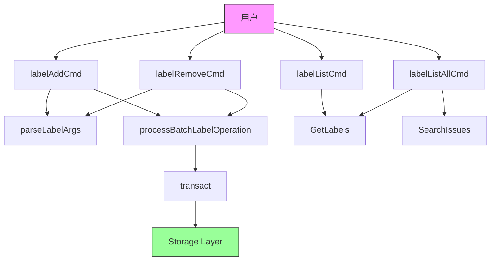

# Label Management Module 技术深度解析

## 为什么需要这个模块？

在 issue 管理系统中，标签（labels）是组织和分类问题的核心工具。`label_management` 模块提供了一套完整的命令行工具，用于在多个问题上批量添加、移除和查询标签，同时确保操作的原子性和一致性。

### 问题空间

如果你尝试直接操作存储层来管理标签，会遇到以下问题：
1. **部分成功风险**：批量操作时，如果中途失败，可能导致只有部分问题被修改
2. **ID 解析繁琐**：用户可能只记得 issue ID 的一部分，需要完整的解析机制
3. **命名空间冲突**：某些标签前缀（如 `provides:`）有特殊语义，需要保护
4. **重复代码**：添加和移除标签的逻辑非常相似，需要抽象

这个模块就是为了解决这些问题而设计的。

## 架构概览

## 核心组件深度解析

### 1. `processBatchLabelOperation` - 批量操作的原子性守护者

**设计意图**：这个函数是整个模块的核心，它将多个标签操作包装在单个事务中，确保要么全部成功，要么全部回滚。

**内部工作原理**：
1. 创建提交消息，记录操作类型、标签名和影响的 issue 数量
2. 使用 `transact` 函数开启事务
3. 在事务中循环处理每个 issue，调用传入的 `txFunc`
4. 如果任何操作失败，事务自动回滚，错误向上传播
5. 成功后根据 `jsonOut` 参数选择输出格式

**为什么这样设计？**：
- 原子性是关键：批量操作不能部分成功
- 函数式参数：通过 `txFunc` 抽象了具体的操作（添加/移除），避免代码重复
- 输出格式统一：JSON 和人类可读格式在一个地方处理

### 2. `parseLabelArgs` - 参数解析的约定

**设计意图**：建立一个清晰的命令行参数约定，最后一个参数始终是标签名，前面的都是 issue ID。

**为什么这样设计？**：
- 简化用户心智模型：不需要记忆复杂的标志位顺序
- 支持可变数量的 issue ID：用户可以一次操作多个问题

### 3. `labelAddCmd` - 添加标签的命令处理器

**设计意图**：处理 `label add` 命令，包含完整的验证和安全检查。

**关键特性**：
- **只读模式检查**：确保在只读模式下不会修改数据
- **标签验证**：拒绝空标签
- **部分 ID 解析**：支持用户输入不完整的 issue ID
- **命名空间保护**：阻止用户手动添加 `provides:` 前缀的标签（这些只能通过 `bd ship` 命令添加）

### 4. `labelRemoveCmd` - 移除标签的命令处理器

**设计意图**：处理 `label remove` 命令，与 `labelAddCmd` 结构对称。

**注意**：代码标记了 `nolint:dupl`，这是一个有意识的设计决策——虽然两个命令结构相似，但它们是不同的操作，保持独立更清晰。

### 5. `labelListCmd` - 列出单个 issue 的标签

**设计意图**：查询并显示单个 issue 的所有标签。

**关键特性**：
- 支持部分 ID 解析
- JSON 输出时总是返回数组（即使为空），确保 API 一致性
- 空标签情况的友好提示

### 6. `labelListAllCmd` - 列出数据库中的所有标签

**设计意图**：提供仓库中标签使用情况的全局视图，包括每个标签的使用次数。

**实现细节**：
1. 使用空查询和空过滤器搜索所有问题
2. 遍历每个问题，获取其标签并统计
3. 按字母顺序排序标签
4. 输出时对齐计数，提高可读性

## 数据流向分析

让我们追踪一个典型的批量添加标签操作的数据流：

1. **用户输入**：`bd label add issue1 issue2 feature`
2. **参数解析**：`parseLabelArgs` 提取 `issueIDs = ["issue1", "issue2"]`, `label = "feature"`
3. **ID 解析**：`utils.ResolvePartialID` 将部分 ID 转换为完整 ID
4. **验证**：检查标签不为空，不以 `provides:` 开头
5. **事务处理**：`processBatchLabelOperation` 包装在事务中
6. **存储操作**：调用 `tx.AddLabel` 对每个 issue 执行添加操作
7. **提交**：事务成功提交，生成提交消息
8. **输出**：根据 `jsonOutput` 标志选择输出格式

## 设计决策与权衡

### 1. 批量操作的原子性 vs 性能

**选择**：强制使用单个事务包装所有批量操作

**权衡**：
- ✅ 优点：保证一致性，避免部分成功
- ⚠️ 缺点：大量 issue 操作时可能持有事务时间较长

**为什么这样选择**：在 issue 管理系统中，数据一致性比批量操作的性能更重要。

### 2. 命名空间保护的硬编码 vs 配置

**选择**：在代码中硬编码 `provides:` 前缀的保护

**权衡**：
- ✅ 优点：简单直接，不会被意外绕过
- ⚠️ 缺点：不够灵活，如果未来需要保护其他命名空间需要修改代码

**为什么这样选择**：`provides:` 标签是系统核心功能的一部分，需要确保其完整性。

### 3. `labelAddCmd` 和 `labelRemoveCmd` 的重复代码

**选择**：保持两个命令独立，尽管结构相似

**权衡**：
- ✅ 优点：代码更清晰，每个命令的意图明确
- ⚠️ 缺点：存在一定的代码重复

**为什么这样选择**：两个命令虽然结构相似，但语义不同，保持独立更符合单一职责原则。

## 新贡献者注意事项

### 1. 隐式契约

- **参数顺序**：命令行参数的最后一个始终是标签，前面的都是 issue ID
- **事务提交消息**：格式为 `bd: label {operation} '{label}' on {count} issue(s)`
- **JSON 输出**：对于列表操作，总是返回数组（即使为空）

### 2. 边缘情况

- **空标签**：被明确拒绝
- **标签不存在于 issue 上**：移除操作不会报错（幂等性）
- **部分 ID 解析失败**：会跳过该 ID 并继续处理其他 ID
- **只读模式**：所有修改操作都会被阻止

### 3. 扩展点

如果你想扩展这个模块，可以考虑：
- 添加标签重命名功能
- 支持标签描述
- 添加标签组或分类功能
- 实现基于标签的自动操作规则

## 依赖关系

这个模块依赖以下核心组件：

- [Storage Interfaces](storage_interfaces-storage_contracts.md) - 提供事务和标签操作的底层存储
- [Core Domain Types](issue_domain_model.md) - 定义 Issue 和相关类型
- [UI Utilities](internal-ui-pager.md) - 提供格式化输出功能
- [Utils](internal-utils.md) - 提供部分 ID 解析功能

## 总结

`label_management` 模块是一个精心设计的命令行工具集，它通过事务保证原子性，通过函数式参数减少重复代码，通过验证确保数据完整性。它的设计体现了"简单的事情保持简单，复杂的事情变得可能"的原则。

虽然代码量不大，但其中包含的设计决策（原子性、命名空间保护、幂等性等）都反映了对数据一致性和用户体验的深思熟虑。