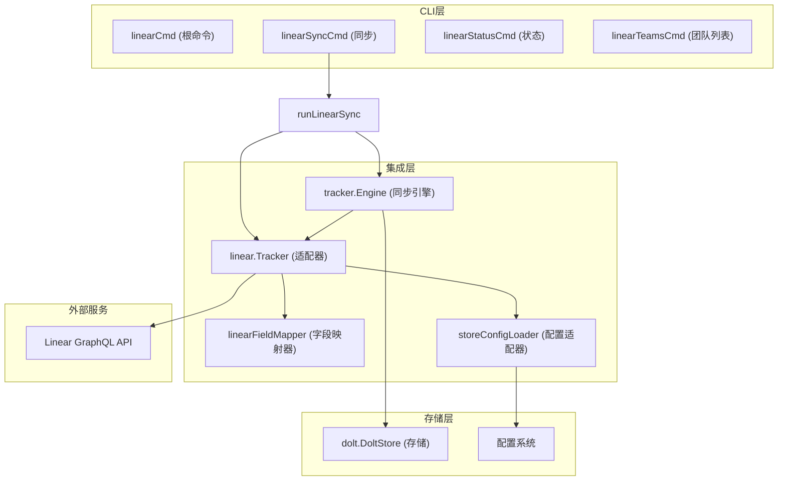

# Linear 集成模块 (linear_integration)

## 1. 模块概述

`linear_integration` 模块为 beads 提供了与 Linear 项目管理工具的双向同步功能，是 beads 生态系统中与外部问题跟踪系统集成的关键组件。该模块允许团队在保持 beads 强大的本地问题管理能力的同时，与 Linear 的协作工作流无缝连接。

### 核心问题解决
现代软件开发团队通常使用多个工具来管理工作：本地开发人员可能偏好使用 Git 工作流和本地工具链，而项目经理和设计团队可能更喜欢在 Linear 等 SaaS 平台上进行协作。这种工具分割导致了信息孤岛，需要手动复制粘贴、容易出错，并且难以保持一致性。

`linear_integration` 模块通过以下方式解决这个问题：
- 提供双向同步机制，保持本地 issues 和 Linear 问题的数据一致性
- 支持灵活的字段映射和状态转换
- 处理冲突解决和历史追踪
- 通过配置而非编码提供高度可定制性

### 为什么不简单使用 API 直接同步？
简单的 API 包装可以处理基本的 CRUD 操作，但无法解决现实世界同步中的复杂问题：
- **数据模型不匹配**：Linear 的优先级、状态和标签系统与 beads 不完全对应
- **ID 管理策略**：两个系统有不同的 ID 生成机制，需要避免冲突
- **状态同步挑战**：如何处理并发修改、部分更新和冲突解决
- **性能考虑**：批量操作、状态缓存和增量同步

## 2. 架构与数据流程

### 核心架构图



### 数据流程详解

#### 同步流程（Pull）
1. **初始化阶段**：`linear.Tracker.Init()` 从存储中加载配置，创建 Linear API 客户端
2. **获取阶段**：调用 `Tracker.FetchIssues()` 从 Linear GraphQL API 获取问题数据
3. **转换阶段**：
   - 使用 `FieldMapper.IssueToBeads()` 将 Linear 数据模型转换为 beads 数据模型
   - 应用 `PullHooks.GenerateID()` 为导入的 issues 生成 beads 兼容的 ID
   - 使用 `PullHooks.TransformIssue()` 进行最终的数据标准化
4. **存储阶段**：`Engine` 将转换后的 issues 持久化到本地存储

#### 同步流程（Push）
1. **准备阶段**：构建 `PushHooks` 钩子，其中包括 `BuildStateCache()` 预缓存 Linear 工作流状态
2. **过滤阶段**：
   - 应用类型过滤器（`TypeFilter`/`ExcludeTypes`）
   - 排除临时问题（`ExcludeEphemeral`）
   - 通过 `PushHooks.ShouldPush()` 应用前缀过滤等自定义逻辑
3. **比较阶段**：使用 `PushHooks.ContentEqual()` 比较本地内容与远程内容，避免不必要的更新
4. **同步阶段**：
   - 使用 `PushHooks.FormatDescription()` 格式化描述
   - 通过 `PushHooks.ResolveState()` 解析正确的 Linear 状态 ID
   - 调用 `Tracker.CreateIssue()` 或 `Tracker.UpdateIssue()` 执行实际同步

## 3. 核心组件详解

### 3.1 CLI 命令层

#### `linearCmd` - 根命令结构
`linearCmd` 是 Linear 集成的命令入口点，它组织了所有 Linear 相关的子命令并提供统一的帮助文档。该命令属于 "advanced" 命令组，表明这是一个面向高级用户的功能。

**设计意图**：通过使用 Cobra 命令框架，提供清晰的 CLI 体验，包括详细的帮助文本、配置示例和使用场景。这降低了新用户的上手门槛，同时提供了足够的灵活性给高级用户。

#### `linearSyncCmd` - 同步命令
`linearSyncCmd` 是整个模块中最重要的命令，它处理 beads 和 Linear 之间的实际数据同步。

**主要参数设计**：
- `--pull` / `--push`：控制同步方向，允许单向或双向同步
- `--dry-run`：预览同步操作而不实际修改数据，这对于测试配置和避免意外更改至关重要
- `--prefer-local` / `--prefer-linear`：冲突解决策略，覆盖默认的"时间戳优先"策略
- `--type` / `--exclude-type`：精细控制同步哪些类型的 issues
- `--include-ephemeral`：是否包含临时 issues（如 wisps）

#### `storeConfigLoader` - 配置适配器
这是一个轻量级适配器，将 beads 的存储接口转换为 Linear 映射配置所需的 `ConfigLoader` 接口。

```go
type storeConfigLoader struct {
    ctx context.Context
}

func (l *storeConfigLoader) GetAllConfig() (map[string]string, error) {
    return store.GetAllConfig(l.ctx)
}
```

**设计意图**：通过适配器模式解耦 Linear 配置加载逻辑与特定的存储实现，使配置系统更加灵活和可测试。

### 3.2 同步引擎钩子机制

#### `buildLinearPullHooks()` - 拉取钩子构建器
该函数创建专门为 Linear 集成定制的 `PullHooks`，主要处理 ID 生成策略。

**核心逻辑**：
- 当 `id_mode` 设置为 "hash" 时（默认行为），预加载现有 ID 以避免冲突
- 使用 `linear.GenerateIssueIDs()` 生成符合 beads 格式的哈希 ID
- 通过闭包维护 `usedIDs` 映射，确保导入过程中不会生成重复 ID

**设计意图**：ID 生成是一个需要上下文感知的操作，钩子机制允许在不修改核心同步引擎的情况下，为每个跟踪器实现特定的 ID 策略。

#### `buildLinearPushHooks()` - 推送钩子构建器
该函数创建推送操作所需的钩子，是 Linear 集成中最复杂的部分之一。

**核心钩子**：
1. **`FormatDescription`**：使用 `linear.BuildLinearDescription()` 将 beads issue 的结构化字段合并为 Linear 兼容的描述格式
   
2. **`ContentEqual`**：实现智能内容比较，避免不必要的 API 调用：
   - 使用 `linear.NormalizeIssueForLinearHash()` 规范化本地 issue
   - 通过 `FieldMapper.IssueToBeads()` 转换远程 issue
   - 比较两者的内容哈希，而非原始字段

3. **`BuildStateCache` / `ResolveState`**：状态缓存机制：
   - 预加载 Linear 的工作流状态，避免每次同步都查询 API
   - 通过缓存提高性能，并确保状态映射的一致性

4. **`ShouldPush`**：实现前缀过滤逻辑：
   - 检查 `linear.push_prefix` 配置
   - 只推送 ID 匹配指定前缀的 issues
   - 支持逗号分隔的多个前缀

### 3.3 配置与验证

#### `validateLinearConfig()` - 配置验证
该函数确保 Linear 集成的必要配置已正确设置，包括：
- API 密钥的存在性检查
- Team ID 的格式验证（使用 UUID 正则表达式）
- 数据库可用性检查

**设计意图**：早期验证可以提供清晰的错误消息，避免在同步过程中出现难以理解的失败。这体现了"快速失败"的设计原则。

#### `getLinearConfig()` - 配置获取
该函数实现了配置值的优先级查找：
1. 首先尝试从活动存储中读取
2. 如果没有活动存储但有数据库路径，临时打开数据库读取
3. 最后回退到环境变量

**设计意图**：提供灵活的配置方式，适应不同的使用场景（如直接 CLI 使用 vs 脚本化使用），同时保持一致的行为。

## 4. 设计决策与权衡

### 4.1 双向同步 vs 单向同步
**决策**：实现完全双向同步，支持 pull-only、push-only 和混合模式。

**权衡**：
- ✅ **优点**：最大灵活性，适应不同团队的工作流
- ❌ **缺点**：复杂性显著增加，需要处理冲突解决、部分更新等问题

**为什么这个选择是正确的**：对于 beads 这样的工具，不同团队有不同的使用模式。有些团队将 beads 作为主要工具，有些将 Linear 作为主要工具，还有些希望两者无缝切换。双向同步满足了所有这些场景。

### 4.2 钩子模式 vs 继承
**决策**：使用钩子（hooks）模式而非继承来扩展同步引擎行为。

**权衡**：
- ✅ **优点**：
  - 更好的组合性，可以独立配置和使用各个钩子
  - 避免了继承层次结构可能导致的复杂性
  - 更容易测试，钩子可以独立于整个引擎进行测试
- ❌ **缺点**：
  - 代码可能看起来更分散，逻辑不那么集中
  - 需要仔细设计钩子接口，确保它们足够灵活但不过于复杂

**设计洞察力**：同步引擎是一个相对稳定的核心，但不同跟踪器的特殊需求变化很大。钩子模式允许核心保持稳定，同时通过组合方式支持各种定制行为。

### 4.3 状态缓存策略
**决策**：在推送操作开始时预加载并缓存 Linear 工作流状态。

**权衡**：
- ✅ **优点**：
  - 显著减少 API 调用次数（从每次 issue 更新一次到每次同步一次）
  - 提高同步速度，特别是对于大量 issues
  - 确保同一同步操作中的状态映射一致性
- ❌ **缺点**：
  - 如果 Linear 工作流在同步过程中发生变化，可能会使用过时的状态信息
  - 增加了内存使用，特别是对于有大量自定义状态的团队

**为什么这个选择是正确的**：在大多数场景下，同步操作是相对短暂的，工作流状态不会频繁变化。性能优势明显超过了潜在的一致性风险。

### 4.4 ID 生成策略：哈希 vs 直接映射
**决策**：默认使用哈希 ID 生成，同时支持直接映射模式。

**权衡**：
- **哈希模式（默认）**：
  - ✅ 保持 beads ID 的简洁性和一致性
  - ✅ 避免暴露 Linear 的内部 UUID
  - ❌ 需要处理哈希冲突的可能性
  - ❌ 需要额外的查询来检查现有 ID

- **直接映射模式**：
  - ✅ 简单直接，无需冲突处理
  - ❌ ID 变得冗长且不美观（Linear UUID 很长）
  - ❌ 与 beads 的 ID 风格不一致

**设计洞察力**：通过支持两种模式并将哈希作为默认，满足了大多数用户对美观 ID 的需求，同时为有特殊需求的用户提供了直接映射选项。

## 5. 使用指南与示例

### 5.1 基本配置

首先需要设置必要的配置：

```bash
# 设置 API 密钥
bd config set linear.api_key "lin_api_xxxxxxxxxxxxx"

# 设置团队 ID（可以通过 bd linear teams 查找）
bd config set linear.team_id "12345678-1234-1234-1234-123456789abc"

# 可选：只同步特定项目
bd config set linear.project_id "abcdef12-3456-7890-abcd-ef1234567890"
```

### 5.2 字段映射自定义

Linear 集成提供了丰富的映射配置选项：

```bash
# 优先级映射：Linear (0-4) 到 Beads (0-4)
bd config set linear.priority_map.0 4    # 无优先级 -> 待办
bd config set linear.priority_map.1 0    # 紧急 -> 严重
bd config set linear.priority_map.2 1    # 高 -> 高
bd config set linear.priority_map.3 2    # 中 -> 中
bd config set linear.priority_map.4 3    # 低 -> 低

# 状态映射
bd config set linear.state_map.backlog open
bd config set linear.state_map.unstarted open
bd config set linear.state_map.started in_progress
bd config set linear.state_map.completed closed
bd config set linear.state_map.canceled closed
bd config set linear.state_map.my_custom_state in_progress  # 自定义状态

# 标签到问题类型的映射
bd config set linear.label_type_map.bug bug
bd config set linear.label_type_map.feature feature
bd config set linear.label_type_map.epic epic

# 关系类型映射
bd config set linear.relation_map.blocks blocks
bd config set linear.relation_map.blockedBy blocks
bd config set linear.relation_map.duplicate duplicates
bd config set linear.relation_map.related related
```

### 5.3 同步工作流示例

#### 场景 1：首次导入 Linear 问题
```bash
# 从 Linear 拉取所有问题，进行干运行预览
bd linear sync --pull --dry-run

# 确认无误后执行实际导入
bd linear sync --pull
```

#### 场景 2：选择性推送本地更改
```bash
# 只推送任务和功能类型的问题，不包含 wisps
bd linear sync --push --type=task,feature --exclude-type=wisp

# 只创建新问题，不更新现有问题
bd linear sync --push --create-only
```

#### 场景 3：双向同步与冲突处理
```bash
# 双向同步，冲突时优先使用本地版本
bd linear sync --prefer-local

# 双向同步，先干运行查看结果
bd linear sync --dry-run
```

### 5.4 高级配置：ID 生成策略

```bash
# 使用哈希 ID（默认）
bd config set linear.id_mode "hash"
bd config set linear.hash_length "6"  # 哈希长度 3-8

# 或使用直接映射模式
bd config set linear.id_mode "db"
```

## 6. 常见问题与注意事项

### 6.1 隐含的契约与假设

1. **外部引用格式**：Linear 集成期望 `external_ref` 字段遵循特定格式（通常是 `linear://<team-key>/<issue-id>`）。手动修改此字段可能导致同步问题。

2. **状态映射完整性**：如果 beads 中的状态在 Linear 中没有对应的映射，推送操作可能会失败。确保所有常用状态都有映射。

3. **前缀过滤行为**：`linear.push_prefix` 配置是包含性的，而不是排他性的。如果设置了前缀，只有匹配的 issues 会被推送。

### 6.2 性能考虑

1. **大量 issues 的同步**：首次同步大量 issues 时，可能需要较长时间。考虑先使用 `--dry-run` 预览，然后分批次同步。

2. **API 速率限制**：Linear API 有速率限制。如果遇到速率限制错误，可以考虑分阶段同步或联系 Linear 支持提高限制。

3. **状态缓存**：状态缓存已经优化了推送性能，但如果团队有极大量的自定义状态，可能会注意到缓存构建的初始延迟。

### 6.3 故障排除

1. **配置验证失败**：如果 `validateLinearConfig()` 报告无效的 team ID，确保使用的是 UUID 格式，而不是团队的短名称（如 "ENG"）。

2. **同步冲突**：如果经常遇到冲突，考虑：
   - 更频繁地同步以减少并发修改的可能性
   - 明确使用 `--prefer-local` 或 `--prefer-linear` 设置一致的冲突解决策略
   
3. **ID 冲突**：虽然罕见，但哈希 ID 可能会发生冲突。如果发生这种情况：
   - 尝试增加 `linear.hash_length` 的值
   - 或者切换到 `id_mode: "db"` 模式

## 7. 相关模块

- [Tracker Integration Framework](internal-tracker.md) - 通用的跟踪器集成框架，Linear 集成是其具体实现
- [Dolt Storage Backend](internal-storage-dolt.md) - 本地存储实现，同步的 issues 存储在这里
- [Core Domain Types](internal-types.md) - 定义了 Issue、Status 等核心数据类型

## 总结

`linear_integration` 模块是一个精心设计的组件，它通过钩子模式、灵活的配置和智能的同步策略，解决了本地开发工具与 SaaS 项目管理平台之间的协作挑战。该模块的设计体现了几个关键原则：组合优于继承、配置优于编码、以及提供合理的默认值同时保持高度可定制性。
