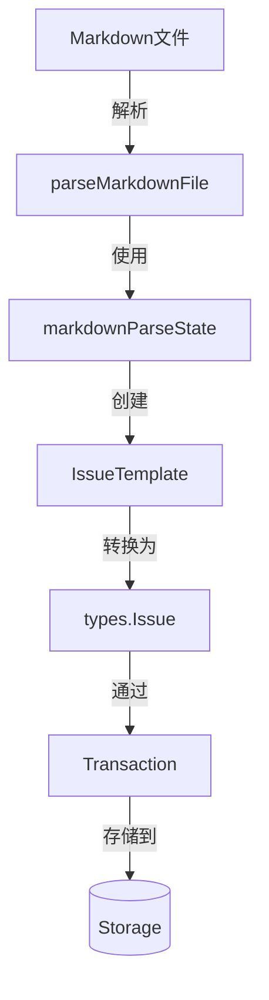

# Markdown Parsing Components 模块技术深度解析

## 1. 问题与解决方案

### 问题场景
在项目管理和开发工作流中，批量创建问题是一个常见需求。然而，通过用户界面逐个创建问题效率低下，而直接使用API又需要编写额外的脚本。团队需要一种简单、结构化的方式来批量定义和创建问题，同时保持问题之间的关联关系。

### 为什么简单的解决方案不行
一个简单的CSV或JSON文件可能看起来是个合理的选择，但它们存在以下问题：
- CSV不适合处理多行文本（如详细描述、设计说明等）
- JSON需要严格的语法，对非技术用户不够友好
- 两者都缺乏自然的层次结构来表示问题的各个部分

### 核心洞察
Markdown天生具有层次结构（通过标题层级）、支持多行文本、且被广泛熟悉。使用Markdown作为批量问题创建的输入格式，可以提供直观、易读易写的体验。

## 2. 架构与核心抽象

### 核心组件关系图


### 核心抽象

#### markdownParseState：有状态的解析器
这是一个有限状态机，负责在解析Markdown时跟踪当前上下文：
- 当前正在处理的问题
- 当前正在处理的章节
- 已收集的章节内容
- 已完成的问题列表

#### IssueTemplate：中间表示
在解析和最终创建之间的桥梁，包含所有可能的问题字段，但不受存储层约束。

## 3. 数据流程详解

### 完整工作流程
1. **文件验证**：使用`validateMarkdownPath`确保输入文件安全且类型正确
2. **逐行解析**：使用`bufio.Scanner`读取文件，通过正则表达式识别标题
3. **状态管理**：`markdownParseState`维护解析上下文
4. **章节处理**：`processIssueSection`根据章节名称更新模板字段
5. **事务创建**：在单个事务中创建所有问题、标签和依赖关系

### 关键流程解析

#### H2标题处理（新问题）
```go
func (s *markdownParseState) handleH2Header(matches []string) {
    // 先完成当前章节
    s.finalizeSection()
    // 保存当前问题
    if s.currentIssue != nil {
        s.issues = append(s.issues, s.currentIssue)
    }
    // 创建新问题
    s.currentIssue = &IssueTemplate{...}
}
```

#### H3标题处理（新章节）
```go
func (s *markdownParseState) handleH3Header(matches []string) {
    s.finalizeSection() // 完成上一章节
    s.currentSection = strings.TrimSpace(matches[1]) // 开始新章节
}
```

#### 内容行处理
根据当前状态智能路由内容：
- 如果在章节内：追加到章节内容
- 如果在问题标题后但无章节：追加到描述

## 4. 核心组件深入解析

### IssueTemplate结构体
```go
type IssueTemplate struct {
    Title              string
    Description        string
    Design             string
    AcceptanceCriteria string
    Priority           int
    IssueType          types.IssueType
    Assignee           string
    Labels             []string
    Dependencies       []string
}
```
**设计意图**：提供一个简单、扁平的数据结构来收集Markdown中的所有信息，作为解析和存储之间的中介。

### markdownParseState结构体
这是整个模块的核心，使用状态机模式来处理Markdown的层次结构。

**核心方法**：
- `finalizeSection()`：完成当前章节的处理
- `handleH2Header()`：处理新问题开始
- `handleH3Header()`：处理新章节开始
- `handleContentLine()`：处理普通内容行
- `finalize()`：完成整个解析过程

## 5. 设计决策与权衡

### 1. 状态机 vs 事件驱动解析
**选择**：使用显式状态机（`markdownParseState`）
**理由**：
- Markdown结构相对简单，状态机足够处理
- 代码更直观，易于调试
- 状态集中管理，减少竞态条件

**权衡**：
- 灵活性降低，难以处理复杂的Markdown特性
- 状态转换逻辑硬编码在方法中

### 2. 单事务 vs 多事务
**选择**：在单个事务中创建所有问题
**理由**：
- 原子性：要么全部成功，要么全部失败
- 一致性：依赖关系可以正确解析
- 性能：减少事务开销

**权衡**：
- 对于大量问题，事务可能过大
- 如果一个问题失败，所有问题都不会创建

### 3. 默认值 vs 验证错误
**选择**：为优先级和类型提供默认值
**理由**：
- 提高用户体验，减少必填字段
- 常见情况（任务、中等优先级）自动处理

**权衡**：
- 用户可能意外使用默认值
- 需要明确的文档说明默认行为

## 6. 依赖分析

### 输入依赖
- **文件系统**：读取Markdown文件
- **正则表达式**：识别标题结构

### 核心依赖
- `internal.types.types`：问题和依赖类型定义
- `internal.storage.storage`：存储接口和事务
- `internal.validation`：优先级和类型验证
- `github.com/spf13/cobra`：命令行框架

### 被依赖
这个模块被CLI命令调用，主要是`createIssuesFromMarkdown`函数作为入口点。

## 7. 使用指南与示例

### Markdown格式规范
```markdown
## 问题标题
这里的内容会成为问题描述，直到第一个###标题

### Priority
2

### Type
feature

### Description
详细的问题描述，支持多行文本

### Design
设计说明

### Acceptance Criteria
- 标准1
- 标准2

### Assignee
username

### Labels
label1, label2, label3

### Dependencies
bd-10, bd-20, blocks:bd-30
```

### 依赖格式
- 简单依赖：`bd-10`（默认类型为blocks）
- 类型化依赖：`blocks:bd-10`或`depends-on:bd-20`

## 8. 边缘情况与注意事项

### 安全考虑
- 使用`validateMarkdownPath`防止目录遍历
- 限制文件类型为.md或.markdown
- 增加扫描器缓冲区大小以处理大文件

### 常见陷阱
1. **空文件**：会导致解析错误，提示未找到问题
2. **缺少H2标题**：即使有内容也不会被识别为问题
3. **章节顺序**：内容必须在对应的H3标题之后
4. **依赖引用**：依赖的问题必须已经存在或在同一文件中创建

### 错误处理策略
- 文件验证失败：立即返回错误
- 解析过程错误：返回有意义的错误信息
- 无效类型：使用默认值并发出警告
- 存储错误：事务回滚，所有更改无效

## 9. 扩展点

### 自定义章节支持
可以通过扩展`processIssueSection`函数的switch语句来添加新的章节类型。

### 更复杂的Markdown
虽然当前实现专注于简单的标题结构，但可以扩展以支持：
- 表格（用于批量问题）
- 列表项（每个列表项一个问题）
- 嵌套结构（子问题）

### 不同的输入格式
当前的解析器与Markdown格式紧密耦合，但可以抽象出一个通用的解析接口，支持多种输入格式。

## 总结

`markdown_parsing_components`模块提供了一种优雅的方式来批量创建问题，通过利用Markdown的自然层次结构和状态机解析模式，实现了直观、高效的问题定义过程。其设计注重用户体验和数据一致性，同时通过事务机制确保操作的原子性。
