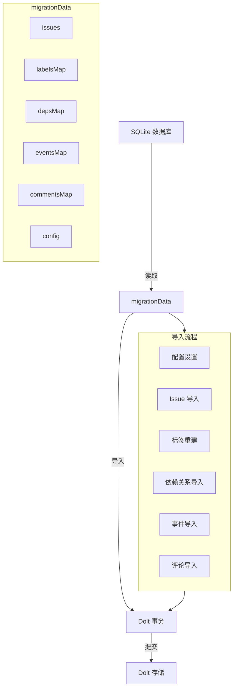

# data_import 模块技术深度解析

## 1. 模块概述

### 问题域

想象一下这样的场景：你的团队已经使用 Beads 管理任务和 issue 一段时间了，现在需要从旧的 SQLite 数据库迁移到新的 Dolt 存储后端。你希望这个迁移过程是**幂等的**（可以安全地多次运行）、**原子的**（要么全部成功要么全部失败），并且**保留所有历史数据**（包括 issue、标签、依赖关系、事件和评论）。

这就是 `data_import` 模块要解决的问题。它负责将数据从旧版 SQLite 数据库导入到新的 Dolt 存储中，处理数据格式转换、关系重建和错误恢复。

### 核心价值

这个模块是数据迁移的"桥梁建设者"，它：
- 提供从 SQLite 到 Dolt 的完整数据迁移路径
- 保证迁移过程的原子性和幂等性
- 处理各种边缘情况（如缺失字段、格式不兼容等）
- 提供详细的进度反馈和错误报告

## 2. 架构设计

### 核心数据流



### 核心组件角色

1. **migrationData**: 数据迁移的"集装箱"，统一存储从源数据库提取的所有数据
2. **findSQLiteDB**: 数据库发现器，智能定位 SQLite 数据库文件
3. **importToDolt**: 迁移引擎，核心导入逻辑的 orchestrator
4. **辅助函数集**: 数据格式化、空值处理、进度报告等基础设施

## 3. 核心组件深度解析

### 3.1 migrationData 结构体

```go
type migrationData struct {
    issues      []*types.Issue
    labelsMap   map[string][]string
    depsMap     map[string][]*types.Dependency
    eventsMap   map[string][]*types.Event
    commentsMap map[string][]*types.Comment
    config      map[string]string
    prefix      string
    issueCount  int
}
```

**设计意图**：
- 这是一个**数据传输对象（DTO）**，用于在迁移的不同阶段之间传递数据
- 使用 map 结构按 issue ID 索引相关数据，支持 O(1) 时间复杂度的查找
- 将所有相关数据聚合在一起，确保迁移的一致性

**为什么这样设计？**
- 对比逐个读取并导入的方式，这种"先提取后导入"的模式可以：
  - 减少数据库锁定时间
  - 便于在导入前进行数据验证和转换
  - 支持更灵活的错误处理和回滚策略

### 3.2 findSQLiteDB 函数

**功能**：智能定位 SQLite 数据库文件

**设计亮点**：
1. **优先级搜索**：先检查常见名称（`beads.db`、`issues.db`），再扫描目录
2. **排除备份**：跳过包含 "backup" 的文件，避免导入旧数据
3. **防御性编程**：即使目录读取失败也会返回空字符串，不中断整个流程

**为什么这样设计？**
- 用户可能将数据库文件命名为不同的名称，这个函数提供了灵活性
- 自动发现机制减少了用户配置的负担

### 3.3 importToDolt 函数

这是模块的核心，让我们深入分析其设计：

#### 3.3.1 整体流程

```
1. 设置配置 → 2. 开始事务 → 3. 导入 Issues → 4. 重建关系 → 5. 提交事务
```

#### 3.3.2 关键设计决策

**1. 单事务导入**
```go
tx, err := store.UnderlyingDB().BeginTx(ctx, nil)
// ... 所有导入操作 ...
if err := tx.Commit(); err != nil {
    return imported, skipped, fmt.Errorf("failed to commit: %w", err)
}
```

**设计意图**：
- **原子性保证**：要么全部导入成功，要么全部回滚，避免部分导入的不一致状态
- **性能优化**：批量操作在单个事务中执行，减少事务开销

**权衡**：
- 优点：数据一致性强，错误恢复简单
- 缺点：大事务可能占用较多数据库资源，长时间锁定表

**2. 幂等性设计**

```go
// 先删除再插入，确保幂等性
if _, err := tx.ExecContext(ctx, `DELETE FROM labels WHERE issue_id = ?`, issue.ID); err != nil {
    // ...
}
// 再插入新标签
for _, label := range issue.Labels {
    if _, err := tx.ExecContext(ctx, `
        INSERT INTO labels (issue_id, label)
        VALUES (?, ?)
        ON DUPLICATE KEY UPDATE label = VALUES(label)
    `, issue.ID, label); err != nil {
        // ...
    }
}
```

**设计意图**：
- 允许迁移命令安全地多次运行，不会产生重复数据
- 使用"删除后插入"模式，而不是仅仅"插入或更新"，确保完全按照源数据重建

**为什么这样设计？**
- 迁移过程可能因为各种原因中断（网络问题、数据库故障等）
- 用户可能需要多次运行迁移来修复问题或验证结果

**3. 内容哈希自动计算**

```go
if issue.ContentHash == "" {
    issue.ContentHash = issue.ComputeContentHash()
}
```

**设计意图**：
- 兼容旧版本数据，这些数据可能没有预计算的内容哈希
- 确保数据完整性，即使源数据缺失哈希也能正常导入

**4. 元数据规范化**

```go
metadataStr := "{}"
if len(issue.Metadata) > 0 {
    metadataStr = string(issue.Metadata)
}
```

**设计意图**：
- 处理 `nil` 或空元数据的情况，避免 SQL 插入错误
- 统一空值表示，简化下游查询逻辑

#### 3.3.3 关系重建策略

导入 issue 后，模块会按顺序重建各种关系：

1. **标签**：先删除旧标签，再插入新标签
2. **依赖关系**：先清空目标 issue 的所有依赖，再重新导入
3. **事件**：同样采用"删除后插入"策略
4. **评论**：从两个来源导入（events 表和独立的 comments 表）

**设计意图**：
- 确保迁移后的数据与源数据完全一致
- 处理可能存在的"遗留数据"，避免新旧数据混合

### 3.4 辅助函数

#### 3.4.1 空值处理函数

```go
func nullableString(s string) interface{} {
    if s == "" {
        return nil
    }
    return s
}
```

**设计意图**：
- 处理 Go 类型系统与 SQL NULL 之间的映射
- 空字符串在 Go 中不等于 nil，但在数据库中可能需要表示为 NULL

#### 3.4.2 时间解析函数

```go
func parseNullTime(s string) *time.Time {
    if s == "" {
        return nil
    }
    for _, layout := range []string{time.RFC3339Nano, time.RFC3339, "2006-01-02T15:04:05.999999999Z07:00", "2006-01-02 15:04:05"} {
        if t, err := time.Parse(layout, s); err == nil {
            return &t
        }
    }
    return nil
}
```

**设计意图**：
- 兼容多种时间格式，处理不同版本数据库可能产生的格式差异
- 尝试多种格式，提高解析成功率

#### 3.4.3 JSON 规范化函数

```go
func normalizeDependencyMetadata(raw string) string {
    trimmed := strings.TrimSpace(raw)
    if trimmed == "" {
        return "{}"
    }
    if json.Valid([]byte(trimmed)) {
        return trimmed
    }
    encoded, err := json.Marshal(trimmed)
    if err != nil {
        return "{}"
    }
    return string(encoded)
}
```

**设计意图**：
- 确保依赖元数据始终是有效的 JSON
- 处理非 JSON 格式的旧数据，将其包装为 JSON 字符串
- 提供安全的降级策略，即使解析失败也返回有效的空 JSON 对象

## 4. 依赖分析

### 4.1 入站依赖

这个模块主要被 CLI 命令层调用，特别是 `migrate_import` 命令。它是数据迁移功能的核心实现。

### 4.2 出站依赖

- **internal/storage/dolt**: Dolt 存储后端，提供数据库访问接口
- **internal/types**: 核心领域类型（Issue、Dependency、Event 等）
- **internal/ui**: UI 工具，用于格式化输出
- **标准库**: context、encoding/json、fmt、os、path/filepath、strings、time

### 4.3 数据契约

**输入契约**：
- SQLite 数据库文件，包含特定 schema 的表和数据
- `migrationData` 结构体，包含从源数据库提取的所有数据

**输出契约**：
- 导入成功：返回导入的 issue 数量、跳过的数量和 nil 错误
- 导入失败：返回已导入的数量、跳过的数量和详细的错误信息

## 5. 设计决策与权衡

### 5.1 单事务 vs 多事务

**选择**：单事务导入所有数据

**理由**：
- 数据一致性最重要，要么全部成功要么全部失败
- 迁移操作通常不会频繁执行，性能不是首要考虑
- 简化错误处理逻辑，回滚只需一个操作

**权衡**：
- 大事务可能占用较多数据库资源
- 长时间运行的事务可能锁定表，影响其他操作

### 5.2 先删除后插入 vs 插入或更新

**选择**：先删除后插入

**理由**：
- 确保完全按照源数据重建，避免遗留数据
- 更直观的幂等性保证
- 简化逻辑，不需要比较新旧数据

**权衡**：
- 可能比"插入或更新"稍慢，因为需要执行两次操作
- 对于大型数据库，删除操作可能产生较多的事务日志

### 5.3 批量提取 vs 流式导入

**选择**：先将所有数据提取到内存，再批量导入

**理由**：
- 减少源数据库的锁定时间
- 便于在导入前进行数据验证和转换
- 更灵活的错误处理策略

**权衡**：
- 需要足够的内存来存储所有数据
- 对于超大型数据库可能不适用

### 5.4 错误处理：终止 vs 继续

**选择**：对于严重错误（如事务失败）终止，对于次要错误（如单个标签插入失败）继续并警告

**理由**：
- 平衡了数据完整性和迁移成功率
- 次要错误不应该阻止整个迁移过程
- 用户可以根据警告信息手动修复问题

**权衡**：
- 需要用户关注警告信息，否则可能遗漏问题
- 部分导入的数据可能不完整

## 6. 使用指南

### 6.1 基本使用流程

1. **准备源数据库**：确保 SQLite 数据库文件位于 beads 目录中
2. **执行迁移命令**：运行 `bd migrate import` 命令
3. **验证结果**：检查导入的 issue 数量和警告信息

### 6.2 常见模式

#### 模式 1：安全重试迁移

如果迁移过程中断，可以安全地重新运行命令：

```bash
bd migrate import
```

由于幂等性设计，多次运行不会产生重复数据。

#### 模式 2：验证迁移结果

迁移完成后，使用以下命令验证数据：

```bash
bd status
bd count
```

### 6.3 配置选项

当前模块没有提供专门的配置选项，但会尊重整体 CLI 的配置（如 `--json` 标志）。

## 7. 边缘情况与陷阱

### 7.1 已知边缘情况

1. **重复 issue ID**：会被跳过并计数到 `skipped`
2. **缺失内容哈希**：会自动计算
3. **无效 JSON 元数据**：会被规范化为有效 JSON
4. **多种时间格式**：会尝试多种格式解析
5. **空值处理**：会正确映射到 SQL NULL

### 7.2 常见陷阱

#### 陷阱 1：数据库权限问题

**症状**：迁移失败，错误信息包含 "permission denied"

**解决方案**：确保有足够的权限读取源数据库和写入目标数据库

#### 陷阱 2：磁盘空间不足

**症状**：事务提交失败，错误信息包含 "no space left on device"

**解决方案**：确保有足够的磁盘空间，特别是对于大型数据库

#### 陷阱 3：长时间运行的事务

**症状**：其他数据库操作被阻塞

**解决方案**：在低峰期执行迁移，或者考虑分批导入（虽然当前实现不支持）

### 7.3 操作注意事项

1. **备份源数据**：在执行迁移前，先备份源数据库
2. **测试迁移**：在测试环境先验证迁移过程
3. **监控进度**：关注迁移进度输出，特别是警告信息
4. **验证结果**：迁移完成后，验证数据的完整性和正确性

## 8. 总结

`data_import` 模块是一个专注于数据迁移的专业组件，它通过精心设计的架构和策略，解决了从 SQLite 到 Dolt 的数据迁移问题。它的核心价值在于：

1. **原子性**：单事务设计确保数据一致性
2. **幂等性**：可以安全地多次运行
3. **容错性**：处理各种边缘情况和格式差异
4. **完整性**：保留所有历史数据和关系

作为新团队成员，理解这个模块的关键是把握它的"桥梁"角色——它不仅仅是复制数据，更是在两种存储系统之间建立安全、可靠的数据通道。

## 9. 参考资料

- [Dolt Storage Backend](internal-storage-dolt.md) - 了解 Dolt 存储的详细实现
- [Core Domain Types](internal-types.md) - 查看 Issue、Dependency 等核心类型的定义
- [CLI Migration Commands](cmd-bd-migrate_import.md) - 了解迁移命令的其他相关功能
