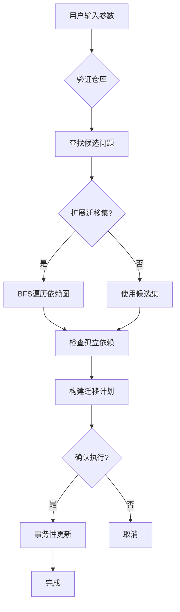

# inter_repo_migration 模块技术深度解析

## 1. 模块概述与问题背景

### 问题空间

在现代软件开发中，跨多个仓库管理问题（issues）是常见的挑战。随着项目发展，我们经常需要：
- 将贡献者规划问题从下游仓库移动到上游仓库
- 在多阶段仓库之间重组问题
- 从多个仓库合并问题

直接修改问题的 `source_repo` 字段看似简单，但这会带来两个关键问题：
1. **依赖关系的完整性**：问题之间存在依赖关系（upstream/downstream），简单移动问题会破坏依赖图的完整性
2. **引用的一致性**：外部对移动问题的引用可能会变成孤立引用（orphaned references）

### 设计洞察

这个模块的核心设计思路是：**将问题迁移视为图操作而非简单的数据修改**。它将问题和依赖关系看作一个有向图，迁移操作是这个图的子图移动，同时保留图的边（依赖关系）完整性。

## 2. 核心心智模型

### 类比：图的子图迁移

想象问题及其依赖关系构成一张有向图：
- 节点 = 问题
- 边 = 依赖关系（A → B 表示 A 依赖 B）

迁移操作就像是：
1. 在图中选择一个初始节点集（通过过滤器）
2. 根据需要扩展这个集合（包含依赖关系的闭包）
3. 将这个子图从一个"容器"（源仓库）移动到另一个"容器"（目标仓库）
4. 保持子图内部的连接，以及子图与外部图的连接

### 关键抽象

- **候选集（Candidates）**：初始匹配过滤器的问题集合
- **迁移集（Migration Set）**：最终要迁移的问题集合（可能包含依赖关系）
- **跨仓库边（Cross-repo Edges）**：连接迁移集和非迁移集的依赖关系
- **孤立引用（Orphans）**：引用了不存在问题的依赖关系

## 3. 架构与数据流程

### 迁移流程架构图



### 核心执行流程

让我们详细追踪 `executeMigrateIssues` 函数的执行路径：

1. **仓库验证阶段** (`validateRepos`)
   - 验证源仓库是否存在问题
   - 检查目标仓库是否存在（不存在时会给出提示）
   - 严格模式下会对空仓库报错

2. **候选问题查找阶段** (`findCandidateIssues`)
   - 根据输入参数构建 `IssueFilter`
   - 支持按状态、优先级、类型、标签、ID 等过滤
   - 标签使用 AND 语义（所有标签都必须存在）

3. **迁移集扩展阶段** (`expandMigrationSet`)
   - 使用 BFS 遍历依赖图
   - 支持四种包含模式：
     - `none`：只迁移候选问题
     - `upstream`：迁移候选问题及其依赖的问题
     - `downstream`：迁移候选问题及依赖它们的问题
     - `closure`：迁移候选问题的完整依赖闭包
   - 可选择是否只包含源仓库内的依赖

4. **孤立依赖检查阶段** (`checkOrphanedDependencies`)
   - 扫描所有依赖记录
   - 识别引用了不存在问题的依赖
   - 严格模式下会因孤立依赖而失败

5. **计划构建与展示阶段** (`buildMigrationPlan`, `displayMigrationPlan`)
   - 计算迁移统计信息
   - 生成人类可读的计划或 JSON 输出
   - 显示跨仓库边、孤立依赖等信息

6. **迁移执行阶段** (`executeMigration`)
   - 使用事务确保原子性
   - 批量更新问题的 `source_repo` 字段
   - 提交时记录有意义的提交信息

## 4. 核心组件深度解析

### migrateIssuesParams 结构体

这是迁移操作的参数容器，封装了所有用户可配置的选项：

```go
type migrateIssuesParams struct {
    from           string   // 源仓库路径
    to             string   // 目标仓库路径
    status         string   // 状态过滤器
    priority       int      // 优先级过滤器
    issueType      string   // 问题类型过滤器
    labels         []string // 标签过滤器（AND 语义）
    ids            []string // 明确指定的问题 ID
    include        string   // 依赖包含模式
    withinFromOnly bool     // 是否只包含源仓库内的依赖
    dryRun         bool     // 试运行模式
    strict         bool     // 严格模式
    yes            bool     // 跳过确认
}
```

**设计意图**：这个结构体将命令行参数与核心逻辑解耦，使 `executeMigrateIssues` 函数更容易测试，同时保持参数的类型安全。

### migrationPlan 结构体

这是迁移计划的数据模型，包含所有用于展示和决策的信息：

```go
type migrationPlan struct {
    TotalSelected     int      // 初始选择的问题数
    AddedByDependency int      // 因依赖关系添加的问题数
    IncomingEdges     int      // 指向迁移集的跨仓库边数
    OutgoingEdges     int      // 从迁移集指出的跨仓库边数
    Orphans           int      // 孤立依赖数
    OrphanSamples     []string // 孤立依赖样本（最多 10 个）
    IssueIDs          []string // 要迁移的问题 ID 列表
    From              string   // 源仓库
    To                string   // 目标仓库
}
```

**设计意图**：这个结构体同时服务于两个目的：
1. 为人类用户提供迁移影响的清晰视图
2. 为机器输出（JSON）提供结构化数据

### expandMigrationSet 函数

这是模块中最复杂的函数之一，实现了依赖图的 BFS 遍历：

```go
func expandMigrationSet(ctx context.Context, s *dolt.DoltStore, candidates []string, p migrateIssuesParams) ([]string, dependencyStats, error)
```

**核心机制**：
1. 使用 `map[string]bool` 跟踪已访问的节点，避免重复处理
2. 使用队列实现 BFS，确保按层级遍历依赖图
3. 根据 `include` 参数选择遍历方向（上游、下游或两者）
4. 可选地只包含源仓库内的依赖

**性能考虑**：
- 使用 BFS 而非 DFS 可以更早发现循环依赖
- 使用 map 进行存在性检查是 O(1) 操作
- 批量查询依赖记录减少了数据库往返次数

### countCrossRepoEdges 函数

这个函数计算迁移集与外部图之间的连接：

```go
func countCrossRepoEdges(ctx context.Context, s *dolt.DoltStore, migrationSet []string) (dependencyStats, error)
```

**计算逻辑**：
- **出边（Outgoing Edges）**：迁移集中的问题依赖非迁移集中的问题
- **入边（Incoming Edges）**：非迁移集中的问题依赖迁移集中的问题

**设计权衡**：
- 为了计算入边，需要获取所有依赖记录（`GetAllDependencyRecords`），这在大型仓库中可能会有性能影响
- 但这是获取完整入边信息的唯一可靠方法，因为依赖关系是单向存储的

## 5. 依赖关系分析

### 入站依赖

这个模块被 CLI 命令框架调用，主要入口点是 `migrateIssuesCmd` 的 `Run` 函数。

### 出站依赖

此模块依赖以下核心组件：

1. **Dolt Storage Backend** - `dolt.DoltStore`
   - 用于查询问题和依赖关系
   - 用于事务性更新问题
   - 关键方法：`SearchIssues`, `GetDependencyRecords`, `GetDependents`, `UpdateIssue`

2. **Core Domain Types** - `types.IssueFilter`, `types.Status`, `types.IssueType`
   - 用于构建查询过滤器
   - 用于类型安全的状态和类型检查

3. **Storage Interfaces** - `storage.Transaction`
   - 用于原子性地执行迁移

### 数据契约

- **输入**：仓库路径、过滤器参数、包含模式、标志
- **输出**：迁移计划（JSON 或人类可读格式）、更新后的问题
- **副作用**：修改问题的 `source_repo` 字段，创建 Dolt 提交

## 6. 设计决策与权衡

### 1. 图遍历与直接修改

**决策**：将迁移建模为图操作，而非简单的字段更新

**原因**：
- 保留依赖关系的完整性是关键需求
- 用户通常希望迁移相关的问题组，而不仅仅是单个问题
- 图模型使依赖闭包的计算变得直观

**权衡**：
- 增加了实现复杂度
- 但提供了更强大的功能和更好的用户体验

### 2. BFS 与 DFS 遍历

**决策**：使用 BFS 进行依赖图遍历

**原因**：
- BFS 按层级遍历，可以更早发现循环依赖
- 对于依赖闭包计算，BFS 更符合"找到所有相关问题"的直觉
- BFS 的迭代实现更不容易出现栈溢出

**权衡**：
- BFS 需要更多内存来存储队列
- 但对于问题依赖图的规模来说，这通常不是问题

### 3. 事务性更新

**决策**：使用单个事务执行所有迁移更新

**原因**：
- 确保迁移的原子性：要么全部成功，要么全部失败
- 避免部分迁移导致的不一致状态
- 提供有意义的提交信息，便于回滚

**权衡**：
- 大型迁移可能会长时间持有事务锁
- 但这是保证数据一致性的必要代价

### 4. 严格模式与警告模式

**决策**：提供两种模式：严格模式（失败）和警告模式（继续）

**原因**：
- 不同场景下用户的风险容忍度不同
- 严格模式适合自动化流程，警告模式适合人工操作

**权衡**：
- 增加了用户需要理解的选项
- 但提供了更好的灵活性

## 7. 使用指南与最佳实践

### 基本用法

```bash
# 预览迁移
bd migrate issues --from ~/repo1 --to ~/repo2 --dry-run

# 迁移所有开放的 P1 缺陷
bd migrate issues --from ~/repo1 --to ~/repo2 --priority 1 --type bug --status open

# 迁移特定问题及其依赖闭包
bd migrate issues --from . --to ~/archive --id bd-abc --include closure
```

### 高级模式

#### 依赖包含策略

- **`none`**：只迁移明确选择的问题（默认）
- **`upstream`**：迁移选择的问题及其依赖的问题
- **`downstream`**：迁移选择的问题及依赖它们的问题
- **`closure`**：迁移完整的依赖闭包

#### 安全迁移工作流

1. 始终先用 `--dry-run` 预览计划
2. 检查跨仓库边和孤立依赖
3. 对于大型迁移，考虑分批进行
4. 使用 `--strict` 在自动化流程中确保安全

### 常见模式

#### 归档旧问题

```bash
bd migrate issues --from . --to ~/archive --status closed --dry-run
```

#### 将规划问题移到上游

```bash
bd migrate issues --from ~/planning --to ~/upstream --label planning --include upstream
```

#### 合并功能分支的问题

```bash
bd migrate issues --from ~/feature-x --to . --include closure --within-from-only=false
```

## 8. 边缘情况与陷阱

### 循环依赖

**问题**：问题 A 依赖 B，B 依赖 C，C 又依赖 A

**处理**：BFS 遍历使用 visited 映射，会自动处理循环依赖，不会导致无限循环

**注意**：循环依赖不会阻止迁移，但可能会导致迁移集比预期的大

### 跨仓库依赖

**问题**：迁移集中的问题依赖其他仓库的问题

**处理**：模块会计算并显示跨仓库边，这些依赖关系会被保留

**注意**：如果使用 `--within-from-only=false`，可能会将其他仓库的问题也加入迁移集

### 孤立依赖

**问题**：依赖记录引用了不存在的问题

**处理**：模块会检测并警告孤立依赖，严格模式下会失败

**注意**：孤立依赖通常是先前操作的遗留问题，应该在迁移前清理

### 大型迁移

**问题**：迁移数千个问题可能会很慢

**缓解**：
- 使用 `--dry-run` 先了解规模
- 考虑分批迁移（例如按状态或优先级）
- 避免在高峰期执行大型迁移

### 仓库路径表示

**问题**：相对路径和绝对路径的混用可能导致意外结果

**注意**：
- 始终使用一致的路径表示
- 建议使用绝对路径，尤其是在脚本中
- 模块会按字符串比较仓库路径，因此 `./repo` 和 `/full/path/to/repo` 会被视为不同的仓库

## 9. 扩展点与定制

虽然这个模块目前没有明确的扩展点，但以下部分是未来扩展的自然候选：

### 自定义过滤器

目前过滤器是硬编码的，可以考虑支持：
- 自定义过滤表达式
- 基于公式引擎的过滤
- 插件化的过滤器

### 依赖策略

目前只有四种包含模式，可以考虑支持：
- 自定义依赖遍历策略
- 基于深度或其他条件的限制
- 选择性的依赖包含

### 迁移后钩子

可以添加对迁移后操作的支持：
- 自动更新问题中的引用
- 触发通知或 webhook
- 运行自定义验证

## 10. 总结

inter_repo_migration 模块是一个精心设计的组件，它将看似简单的问题迁移操作转化为一个健壮的图操作流程。它的核心价值在于：

1. **完整性**：通过图模型确保依赖关系的完整性
2. **灵活性**：提供多种包含模式和过滤器
3. **安全性**：通过试运行、严格模式和事务性更新确保安全
4. **透明性**：通过详细的迁移计划让用户了解影响

这个模块展示了如何将复杂的域逻辑封装在简洁的 CLI 界面背后，同时保持内部实现的清晰和可维护性。
