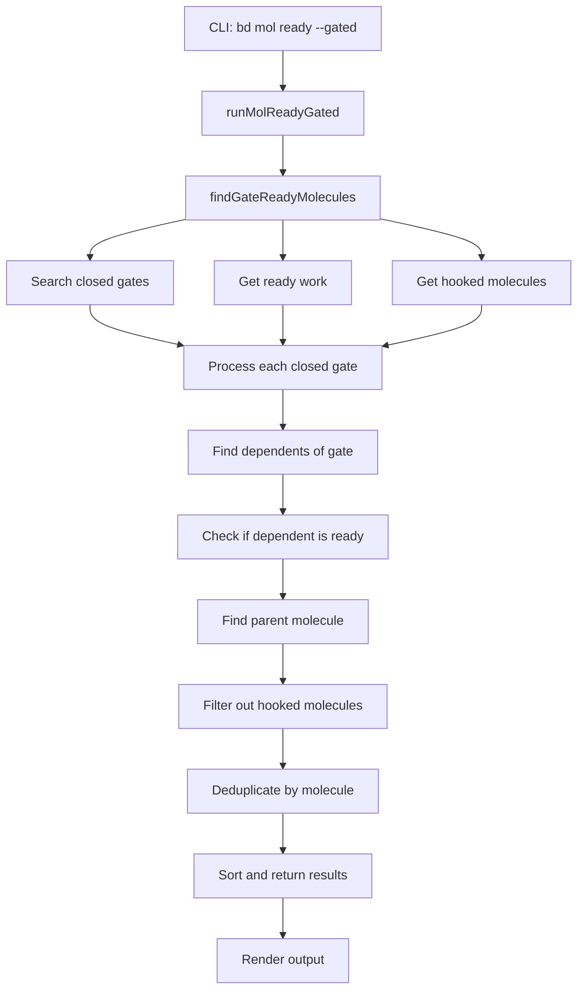

# Gate Discovery 模块技术深度解析

## 1. 问题空间与模块定位

### 1.1 问题背景

在工作流执行过程中，molecule（分子）会遇到需要等待特定条件满足才能继续的 gate（门控）步骤。传统的解决方案是使用显式的等待器跟踪（waiter tracking）机制，这要求系统维护每个等待 gate 的工作流状态，增加了系统的复杂性和状态管理开销。

当 gate 关闭时，系统需要知道哪些工作流被阻塞，哪些现在可以继续执行。这种发现机制如果设计不当，会导致：
- 状态泄漏：等待器跟踪信息未被正确清理
- 延迟：gate 关闭后工作流无法及时恢复
- 复杂性：需要维护额外的状态管理基础设施

### 1.2 模块使命

`gate_discovery` 模块采用**发现式恢复（discovery-based resume）**模式，通过查询而非跟踪来识别准备好恢复的工作流。它的核心价值在于：

- 无需显式跟踪等待状态
- 通过查询当前状态重新发现可恢复的工作流
- 将状态管理复杂性从内存转移到数据库查询
- 支持自动化调度（如 Deacon patrol）

## 2. 核心心智模型

### 2.1 门控工作流的概念模型

想象一个工厂流水线，产品在传送带上移动，直到遇到一个门（gate）。这个门只有在特定条件满足时才会打开，让产品继续前进。

在这个模型中：
- **molecule** = 在流水线上移动的产品
- **gate** = 阻止产品前进的门
- **ready step** = 门打开后准备继续的下一个工序
- **发现机制** = 巡查员（Deacon）定期检查哪些门已经打开，哪些产品可以继续

### 2.2 关键抽象

#### GatedMolecule
```go
type GatedMolecule struct {
    MoleculeID    string       // 可恢复的分子 ID
    MoleculeTitle string       // 分子标题（用于显示）
    ClosedGate    *types.Issue // 已关闭的门控 issue
    ReadyStep     *types.Issue // 现在可以执行的步骤
}
```

这个结构体捕获了一个完整的"门控解除"场景：一个门已经关闭，一个步骤现在可以继续，它们都属于同一个分子。

#### GatedReadyOutput
```go
type GatedReadyOutput struct {
    Molecules []*GatedMolecule // 所有准备好的分子
    Count     int               // 数量（方便客户端使用）
}
```

用于 JSON 输出的包装结构，支持自动化集成。

## 3. 架构与数据流

### 3.1 整体架构



### 3.2 核心算法流程

`findGateReadyMolecules` 函数实现了发现机制的核心逻辑，分为 5 个关键步骤：

#### 步骤 1：发现已关闭的门
```go
gateType := types.IssueType("gate")
closedStatus := types.StatusClosed
gateFilter := types.IssueFilter{
    IssueType: &gateType,
    Status:    &closedStatus,
    Limit:     100,
}
closedGates, err := s.SearchIssues(ctx, "", gateFilter)
```

查询所有类型为 "gate" 且状态为 "Closed" 的 issue。

#### 步骤 2：获取就绪工作
```go
readyIssues, err := s.GetReadyWork(ctx, types.WorkFilter{
    Limit: 500, 
    IncludeMolSteps: true  // 关键：包含分子内部步骤
})
```

获取所有当前可执行的工作，特别注意 `IncludeMolSteps: true`，因为我们需要检查被门控阻塞的分子内部步骤是否已就绪。

#### 步骤 3：获取已挂起的分子
```go
hookedStatus := types.StatusHooked
hookedFilter := types.IssueFilter{
    Status: &hookedStatus,
    Limit:  100,
}
```

获取所有已被 agent 挂起（hooked）的分子，避免重复调度。

#### 步骤 4：关联门控与就绪步骤
对于每个已关闭的门：
1. 找到依赖于这个门的所有 issue（即被这个门阻塞的步骤）
2. 检查这些步骤是否现在已就绪
3. 找到这些步骤所属的分子
4. 过滤掉已被挂起的分子
5. 按分子 ID 去重（一个分子可能有多个门控同时关闭）

#### 步骤 5：排序与返回
```go
sort.Slice(molecules, func(i, j int) bool {
    return molecules[i].MoleculeID < molecules[j].MoleculeID
})
```

按分子 ID 排序，确保输出的稳定性。

## 4. 依赖分析

### 4.1 输入依赖

`gate_discovery` 模块直接依赖以下核心组件：

- **DoltStore**: 用于执行所有查询操作
  - `SearchIssues`: 查找已关闭的门控和已挂起的分子
  - `GetReadyWork`: 获取当前可执行的工作
  - `GetDependents`: 查找依赖于特定门控的步骤
  - `GetIssue`: 获取分子详情

- **types**: 核心领域类型
  - `Issue`: 表示 issue、gate、step、molecule
  - `IssueFilter`: 用于查询过滤
  - `WorkFilter`: 用于就绪工作查询

- **ui**: UI 渲染工具
  - `RenderAccent`, `RenderWarn`, `RenderID`: 用于格式化输出

### 4.2 输出契约

模块产生两种输出格式：

1. **人类可读输出**: 控制台格式化输出，包含分子 ID、标题、关闭的门控和就绪步骤
2. **JSON 输出**: 结构化数据，便于自动化集成，通过 `GatedReadyOutput` 定义

### 4.3 调用者

主要调用者：
- **Deacon patrol**: 自动化调度系统，定期运行此命令发现可恢复的工作流
- **人工操作员**: 通过 CLI 手动检查和调度

## 5. 设计决策与权衡

### 5.1 发现式 vs 跟踪式恢复

**选择**: 发现式恢复

**原因**:
- 状态最终存在于数据库中，无需在内存中重复维护
- 避免了状态泄漏问题（忘记清理等待器）
- 系统重启后无需重建等待状态
- 简化了并发和分布式场景下的状态管理

**权衡**:
- 查询开销 vs 跟踪开销：每次发现都需要查询数据库，但避免了维护跟踪状态的复杂性
- 延迟 vs 简单性：发现是周期性的，可能有轻微延迟，但大大简化了系统设计

### 5.2 按分子去重

**选择**: 一个分子即使有多个门控关闭，也只返回一次

**实现**:
```go
moleculeMap := make(map[string]*GatedMolecule)
// ...
if _, exists := moleculeMap[moleculeID]; !exists {
    moleculeMap[moleculeID] = &GatedMolecule{...}
}
```

**原因**:
- 调度单位是分子，不是单个步骤
- 避免对同一分子的重复调度
- 简化调用者的逻辑

**权衡**:
- 只记录第一个发现的门控-步骤对，可能丢失其他同时关闭的门控信息
- 但在实际场景中，一个分子通常只有一个主要的门控点

### 5.3 宽松的错误处理

**选择**: 在获取已挂起分子时，错误是非致命的

**实现**:
```go
hookedIssues, err := s.SearchIssues(ctx, "", hookedFilter)
if err != nil {
    // Non-fatal: just continue without filtering
    hookedIssues = nil
}
```

**原因**:
- 即使无法过滤已挂起分子，发现功能仍然有用
- 重复调度的风险低于完全无法发现的风险
- 体现了"尽力而为"的设计哲学

**权衡**:
- 可能导致重复发现已挂起的分子
- 但调用者（如 Deacon patrol）应该有自己的去重逻辑

### 5.4 限制查询数量

**选择**: 对所有查询都设置了合理的限制（100 或 500）

**原因**:
- 防止单个查询返回过多数据，影响性能
- 假设在正常操作中，同时准备好的分子数量不会很大
- 可以通过多次运行来处理积压

**权衡**:
- 在极端情况下可能遗漏一些准备好的分子
- 但通过分页或多次运行可以缓解

## 6. 使用指南

### 6.1 基本用法

```bash
# 查找所有准备好的分子
bd mol ready --gated

# JSON 输出（用于自动化）
bd mol ready --gated --json
```

### 6.2 与 Deacon patrol 集成

```bash
# Deacon patrol 的典型使用模式
while true; do
    # 发现准备好的分子
    READY=$(bd mol ready --gated --json | jq -r '.molecules[].molecule_id')
    
    # 调度每个分子
    for mol in $READY; do
        gt sling deacon-agent --mol $mol
    done
    
    sleep 60  # 每分钟检查一次
done
```

### 6.3 输出解读

人类可读输出示例：
```
✨ Molecules ready for gate-resume dispatch (2):

1. mol-abc123: Implement user authentication
   Gate closed: gate-789 (pr_merged)
   Ready step: step-456 - Deploy to staging

2. mol-def456: Migrate database schema
   Gate closed: gate-012 (tests_passed)
   Ready step: step-345 - Apply migration
```

## 7. 边缘情况与注意事项

### 7.1 已知限制

1. **查询限制**: 如果准备好的分子数量超过限制（100），可能不会全部返回
2. **延迟**: 发现是周期性的，不是实时的，门控关闭后可能有轻微延迟
3. **门控类型假设**: 假设所有类型为 "gate" 的 issue 都是门控
4. **父子关系**: 依赖 `findParentMolecule` 正确识别分子关系

### 7.2 隐性契约

1. **门控的表示**: 门控必须是类型为 "gate" 的 issue
2. **依赖关系**: 被门控阻塞的步骤必须通过 `depends_on` 关系指向门控
3. **就绪判断**: 依赖 `GetReadyWork` 正确判断步骤是否就绪
4. **分子识别**: 依赖 `findParentMolecule` 函数（在其他地方定义）来识别分子

### 7.3 操作建议

1. **监控**: 监控发现的分子数量，如果持续为 0 或突然激增，可能表示问题
2. **日志**: 在调度前记录发现的分子，便于调试
3. **去重**: 即使模块已经去重，调用者也应该有自己的去重逻辑
4. **错误处理**: 准备好处理重复调度的情况（幂等性）

## 8. 未来扩展方向

### 8.1 可能的改进

1. **分页支持**: 对于大型系统，添加分页支持以处理更多准备好的分子
2. **更精细的过滤**: 允许按分子类型、标签等进行过滤
3. **优先级排序**: 不仅按 ID 排序，还考虑优先级、创建时间等
4. **统计信息**: 提供更多关于为什么分子准备好的上下文信息

### 8.2 与其他模块的集成

- **Formula Engine**: 可以考虑公式定义的门控条件
- **Molecules**: 更深入地集成分子生命周期管理
- **Hooks**: 当门控关闭时触发钩子，而不是轮询

## 9. 总结

`gate_discovery` 模块体现了一个优雅的设计思想：**通过查询重新发现状态，而不是维护状态**。这种方法简化了系统设计，避免了状态管理的复杂性，同时提供了足够的功能来支持工作流的自动恢复。

关键要点：
- 使用发现式恢复替代跟踪式恢复
- 通过数据库查询关联已关闭的门控和就绪的步骤
- 按分子去重，确保调度单位正确
- 宽松的错误处理，提高系统韧性
- 支持人类和机器两种消费模式

这个模块是整个系统中"简单而强大"的设计典范——它解决了一个实际问题，同时保持了代码的清晰性和可维护性。
