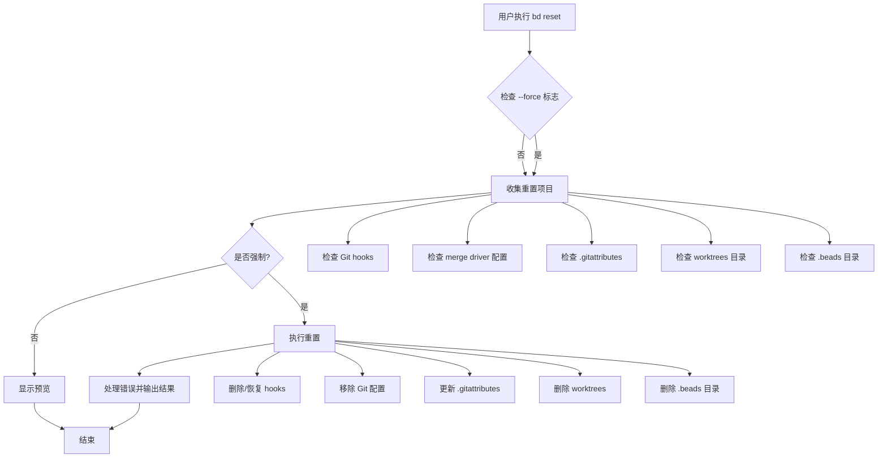

# repository_reset 模块技术深度文档

## 1. 问题空间与存在意义

想象一下，你在一台共享开发机器上使用 beads 工具，或者你想彻底清理一个仓库以重新开始。你需要删除所有 beads 相关的数据和配置，但手动清理很容易遗漏某些文件，而且可能会不小心破坏原有的 Git 配置。

`repository_reset` 模块就是为了解决这个问题而设计的。它提供了一个安全、完整、可逆（在可能的情况下）的方式来移除 beads 在仓库中留下的所有痕迹。

### 为什么手动清理不够？

1. **分散的文件位置**：beads 数据不仅在 `.beads` 目录中，还包括 Git hooks、配置项、`.gitattributes` 条目等
2. **Git 工作树共享**：某些数据（如 hooks）存储在 Git 的 common dir 中，跨所有工作树共享
3. **备份恢复**：beads 安装 hooks 时会备份原有 hooks，重置时需要恢复这些备份
4. **安全性**：这是破坏性操作，需要明确的确认机制

## 2. 核心概念与心智模型

### 心智模型：仓库清理师

把这个模块想象成一位专业的仓库清理师，它会：
1. **先勘察现场**（`collectResetItems`）：找出所有需要清理的东西
2. **展示清理计划**（`showResetPreview`）：给你看一份详细清单，告诉你要移除什么
3. **获得授权**（`--force` 标志）：只有你明确同意后才会动手
4. **专业清理**（`performReset`）：按计划执行，同时尽可能恢复原有状态

### 核心抽象：`resetItem`

```go
type resetItem struct {
    Type        string `json:"type"`
    Path        string `json:"path"`
    Description string `json:"description"`
}
```

这个结构是整个模块的核心抽象，它统一表示所有需要被重置的项目，无论是文件、目录还是 Git 配置项。

## 3. 架构与数据流

### 架构图



### 数据流详解

1. **入口阶段**：`runReset` 函数作为入口点
   - 首先检查只读模式
   - 获取 Git common dir（重要：hooks 和 worktrees 存储在这里）
   - 检查 `.beads` 目录是否存在

2. **收集阶段**：`collectResetItems` 函数
   - 扫描 Git hooks 目录，识别 beads 安装的 hooks
   - 检查 Git 配置中的 merge driver
   - 检查 `.gitattributes` 中的 beads 条目
   - 检查 beads-worktrees 目录
   - 最后添加 `.beads` 目录本身

3. **预览阶段**：`showResetPreview` 函数
   - 以友好的 UI 格式或 JSON 格式展示将被删除的项目
   - 强调操作的不可逆性
   - 提供下一步操作的明确指示

4. **执行阶段**：`performReset` 函数
   - 按类型处理每个 resetItem
   - 对于 hooks：删除后尝试恢复备份
   - 对于配置：使用 git config 命令移除
   - 对于 gitattributes：智能清理相关行
   - 对于目录：使用 os.RemoveAll 删除
   - 收集并报告所有错误

## 4. 核心组件深度解析

### 4.1 `collectResetItems` - 智能收集器

**设计意图**：
这个函数不仅仅是列出文件，它还需要智能判断哪些是 beads 相关的。例如，不是所有的 Git hooks 都是 beads 安装的，需要通过检查文件内容来确认。

**关键实现细节**：
- 使用 `git.GetGitCommonDir()` 而不是假设 `.git/hooks`，这确保了在 Git 工作树环境中的正确性
- 通过 `isBdHook()` 函数检查 hook 文件内容，而不是仅依赖文件名
- 收集顺序很重要：先检查依赖项，最后才是 `.beads` 目录本身

### 4.2 `isBdHook` - 安全识别器

**设计意图**：
防止误删除用户自己的 Git hooks。beads 安装 hooks 时会在文件中添加版本标记，这个函数通过读取文件前几行来识别。

**权衡考虑**：
- 只读取前 10 行：平衡了准确性和性能
- 检查两种标记：`bd-hooks-version:` 和 `"beads"`，兼容不同版本的安装方式

### 4.3 `removeGitattributesEntry` - 精细编辑器

**设计意图**：
不仅仅是删除一行，而是要智能清理整个 beads 相关的配置块，包括注释和尾随空行。

**实现亮点**：
- 跳过包含 `merge=beads` 的行
- 跳过 beads 相关的注释行
- 智能跳过删除条目后的空行
- 如果文件变空，就完全删除它
- 确保最终文件有正确的换行符

**代码示例**：
```go
// 关键逻辑：跳过 beads 相关行和后续空行
if strings.Contains(line, "merge=beads") {
    skipNextEmpty = true
    continue
}
if skipNextEmpty && strings.TrimSpace(line) == "" {
    continue
}
```

### 4.4 `performReset` - 谨慎执行者

**设计意图**：
执行实际的重置操作，但要尽可能安全和友好。

**关键特性**：
1. **备份恢复**：删除 hook 后，自动恢复 `.backup` 文件
2. **错误容忍**：单个项目失败不会中止整个过程
3. **进度反馈**：实时显示每个操作的结果
4. **配置操作**：使用 `git config` 命令而不是直接编辑文件

## 5. 依赖分析

### 5.1 依赖的模块

- **internal/git**：用于获取 Git common dir，这是正确处理 Git 工作树的关键
- **internal/ui**：用于格式化输出，提供一致的用户体验
- **github.com/spf13/cobra**：命令行框架

### 5.2 被依赖情况

这个模块是一个终端模块，它被 `adminCmd` 包含（在 admin.go 中），但没有其他模块依赖它。

### 5.3 数据契约

- 输入：Git 仓库环境，可选的 `--force` 标志
- 输出：
  - 非 JSON 模式：人类可读的进度和结果
  - JSON 模式：结构化的结果数据，包括 `reset`、`success`、`errors` 等字段

## 6. 设计决策与权衡

### 6.1 默认干运行模式

**决策**：默认情况下只显示预览，不实际执行操作，需要 `--force` 标志才会真正重置。

**原因**：这是一个破坏性操作，安全第一。用户应该先看到将要发生什么，然后再确认。

**权衡**：稍微增加了使用步骤，但大大提高了安全性。

### 6.2 尽可能恢复原有状态

**决策**：删除 beads hooks 时，自动恢复 `.backup` 文件。

**原因**：尊重用户原有的配置，beads 应该是"可撤销"的。

**权衡**：增加了代码复杂度，但提供了更好的用户体验。

### 6.3 使用 Git 命令操作配置

**决策**：使用 `git config` 命令而不是直接编辑 Git 配置文件。

**原因**：Git 配置可能在多个位置（本地、全局、系统），使用 Git 命令确保正确处理。

**权衡**：依赖外部命令，但更可靠。

### 6.4 智能清理 .gitattributes

**决策**：不只是删除一行，而是清理整个相关块，包括注释和空行。

**原因**：保持仓库的整洁，不留下"垃圾"配置。

**权衡**：代码更复杂，但结果更优雅。

## 7. 使用指南与常见模式

### 7.1 基本用法

```bash
# 查看将要重置的内容（推荐先执行）
bd reset

# 实际执行重置
bd reset --force
```

### 7.2 在脚本中使用

```bash
# 检查是否需要重置
if bd reset --json | grep -q '"reset": true'; then
    echo "Beads is initialized, resetting..."
    bd reset --force --json
fi
```

### 7.3 JSON 输出示例

干运行模式：
```json
{
  "dry_run": true,
  "items": [
    {
      "type": "hook",
      "path": "/path/to/.git/hooks/pre-commit",
      "description": "Remove git hook: pre-commit"
    },
    {
      "type": "directory",
      "path": ".beads",
      "description": "Remove .beads directory (database, JSONL, config)"
    }
  ]
}
```

执行结果：
```json
{
  "reset": true,
  "success": true
}
```

## 8. 边缘情况与陷阱

### 8.1 Git 工作树环境

**陷阱**：在 Git 工作树中，hooks 和 beads-worktrees 存储在 common dir 中，而不是当前工作树的 `.git` 目录。

**解决方案**：使用 `git.GetGitCommonDir()` 而不是硬编码 `.git` 路径。

### 8.2 多个 hooks 备份

**陷阱**：如果 beads 被多次安装/卸载，可能会有多个备份文件。

**当前行为**：只恢复最新的 `.backup` 文件，不会处理更旧的备份。

**建议**：如果需要更早的备份，用户需要手动恢复。

### 8.3 部分重置失败

**陷阱**：某个项目删除失败（例如权限问题），但其他项目成功删除。

**当前行为**：继续执行其他删除操作，最后报告所有错误。

**建议**：如果看到错误，检查权限后再次运行 `bd reset --force`。

### 8.4 自定义的 beads hooks

**陷阱**：如果用户修改了 beads 安装的 hooks，重置会删除这些修改。

**当前行为**：只要文件中包含 beads 标记，就会被识别并删除。

**建议**：如果要保留自定义修改，先备份 hook 文件。

## 9. 扩展与维护建议

### 9.1 可能的扩展点

1. **选择性重置**：添加标志允许只重置特定类型的项目（例如 `--only-hooks`）
2. **备份功能**：在重置前创建整个 beads 配置的备份
3. **重置确认**：在强制模式下也添加交互式确认（除非使用 `--yes` 标志）

### 9.2 维护注意事项

1. **更新 hook 检测**：如果 beads hooks 的版本标记格式改变，需要更新 `isBdHook()` 函数
2. **新的配置位置**：如果 beads 开始在新位置存储数据，需要在 `collectResetItems()` 中添加检查
3. **Git 兼容性**：Git 配置和文件格式可能变化，需要定期测试兼容性

## 10. 总结

`repository_reset` 模块是一个专注于做好一件事的模块：安全、完整地移除 beads 从仓库中留下的所有痕迹。它的设计体现了几个重要原则：

- **安全第一**：默认干运行，需要明确确认
- **尊重原有状态**：尽可能恢复用户的原有配置
- **智能清理**：不留下"垃圾"配置
- **用户友好**：提供清晰的反馈和指示

这个模块虽然不涉及复杂的业务逻辑，但它展示了如何设计一个既强大又安全的工具功能。
