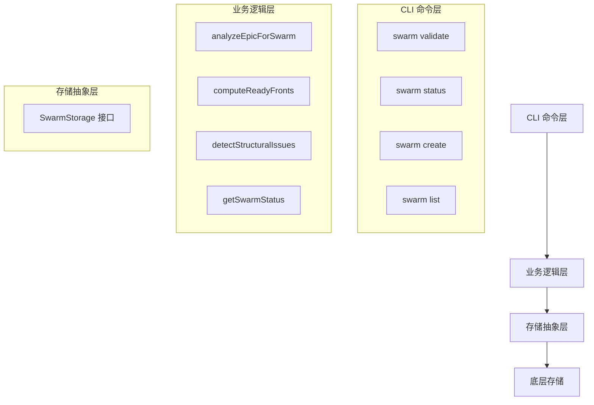

# CLI Swarm Commands 模块技术深度解析

## 1. 模块概览

CLI Swarm Commands 模块是一个专门用于管理和协调史诗（Epic）级别的并行工作的命令行工具集。它提供了一种结构化的方式来分析、验证和执行大规模的协作工作，通过将工作分解为多个可并行的"波次"（waves）来优化团队协作效率。

### 核心问题解决
在传统的项目管理中，大型史诗的工作协调往往面临以下挑战：
- 难以直观地看到哪些工作可以并行进行
- 缺少对依赖关系的自动分析和验证
- 无法准确估计并行工作的最大潜力
- 缺乏对工作进度的实时可视化

Swarm 模块通过引入"蜂群"（Swarm）概念，将史诗的工作组织成有向无环图（DAG），并计算出可以并行执行的"就绪前沿"（Ready Fronts），从而解决了这些问题。

## 2. 核心架构与数据模型

### 架构设计
Swarm 模块采用了清晰的分层架构：



### 核心数据结构

#### SwarmAnalysis
`SwarmAnalysis` 是整个模块的核心数据结构，它包含了对史诗结构的完整分析结果：

```go
type SwarmAnalysis struct {
    EpicID            string                // 史诗 ID
    EpicTitle         string                // 史诗标题
    TotalIssues       int                   // 总问题数
    ClosedIssues      int                   // 已关闭问题数
    ReadyFronts       []ReadyFront          // 就绪前沿（波次）
    MaxParallelism    int                   // 最大并行度
    EstimatedSessions int                   // 估计的工作会话数
    Warnings          []string              // 警告信息
    Errors            []string              // 错误信息
    Swarmable         bool                  // 是否可以进行蜂群管理
    Issues            map[string]*IssueNode // 详细问题图（仅在 --verbose 时包含）
}
```

#### ReadyFront
`ReadyFront` 表示一组可以并行工作的问题：

```go
type ReadyFront struct {
    Wave   int      // 波次编号
    Issues []string // 问题 ID 列表
    Titles []string // 问题标题列表（仅用于人类可读输出）
}
```

#### IssueNode
`IssueNode` 表示依赖图中的一个问题节点：

```go
type IssueNode struct {
    ID           string   // 问题 ID
    Title        string   // 问题标题
    Status       string   // 问题状态
    Priority     int      // 优先级
    DependsOn    []string // 此问题依赖的问题
    DependedOnBy []string // 依赖此问题的问题
    Wave         int      // 所属的就绪前沿波次（-1 表示被循环阻塞）
}
```

#### SwarmStatus
`SwarmStatus` 包含蜂群的当前状态：

```go
type SwarmStatus struct {
    EpicID       string        // 史诗 ID
    EpicTitle    string        // 史诗标题
    TotalIssues  int           // 总问题数
    Completed    []StatusIssue // 已完成的问题
    Active       []StatusIssue // 进行中的问题
    Ready        []StatusIssue // 就绪的问题
    Blocked      []StatusIssue // 被阻塞的问题
    Progress     float64       // 进度百分比
    ActiveCount  int           // 进行中的问题数
    ReadyCount   int           // 就绪的问题数
    BlockedCount int           // 被阻塞的问题数
}
```

## 3. 核心工作流程

### 3.1 史诗分析流程

史诗分析是 Swarm 模块的核心功能，它通过 `analyzeEpicForSwarm` 函数实现，主要步骤如下：

1. **获取史诗的子问题**：通过 `getEpicChildren` 函数获取史诗的所有子问题
2. **构建问题图**：为每个子问题创建 `IssueNode`，并建立依赖关系
3. **检测结构问题**：通过 `detectStructuralIssues` 函数检测常见的依赖图问题
4. **计算就绪前沿**：通过 `computeReadyFronts` 函数计算可以并行工作的波次
5. **确定可蜂群性**：根据是否存在错误来确定史诗是否可以进行蜂群管理

### 3.2 就绪前沿计算算法

就绪前沿的计算使用了 Kahn 拓扑排序算法，并进行了层次跟踪：

```go
func computeReadyFronts(analysis *SwarmAnalysis) {
    // 初始化入度
    inDegree := make(map[string]int)
    for id, node := range analysis.Issues {
        inDegree[id] = len(node.DependsOn)
    }

    // 从没有依赖的节点开始（波次 0）
    var currentWave []string
    for id, degree := range inDegree {
        if degree == 0 {
            currentWave = append(currentWave, id)
            analysis.Issues[id].Wave = 0
        }
    }

    wave := 0
    for len(currentWave) > 0 {
        // 处理当前波次
        // ...
        
        // 找到下一个波次
        var nextWave []string
        for _, id := range currentWave {
            // 减少依赖此问题的节点的入度
            // ...
        }
        
        currentWave = nextWave
        wave++
    }
}
```

这个算法的核心思想是：
1. 从没有依赖的问题开始（波次 0）
2. 当一个波次的所有问题完成后，减少依赖这些问题的节点的入度
3. 入度变为 0 的节点进入下一个波次
4. 重复直到所有节点都被处理

### 3.3 结构问题检测

`detectStructuralIssues` 函数检测以下常见问题：

1. **根节点**：没有依赖的问题（多个根节点是正常的）
2. **叶节点**：没有被其他问题依赖的问题（多个叶节点可能表示缺少依赖或只是多个终点）
3. **依赖倒置**：通过启发式方法检测可能的依赖方向错误
4. **断开连接的子图**：从根节点无法到达的问题
5. **循环依赖**：通过简单的 DFS 检测循环

## 4. 关键命令详解

### 4.1 swarm validate

`swarm validate` 命令用于验证史诗的结构是否适合进行蜂群管理。它会：

1. 解析并验证输入的史诗 ID
2. 检查问题是否是史诗或分子
3. 分析史诗结构
4. 输出分析结果（JSON 或人类可读格式）

### 4.2 swarm status

`swarm status` 命令用于显示蜂群的当前状态。它接受：
- 史诗 ID（显示该史诗的子问题状态）
- 蜂群分子 ID（跟随链接找到史诗）

它会将问题按状态分组：
- 已完成：已关闭的问题
- 进行中：当前正在进行的问题（有负责人）
- 就绪：所有依赖都已满足的开放问题
- 被阻塞：等待依赖的开放问题

### 4.3 swarm create

`swarm create` 命令用于从史诗创建蜂群分子。它会：

1. 解析输入 ID
2. 如果输入不是史诗，自动将其包装为史诗
3. 检查是否已存在蜂群分子
4. 验证史诗结构
5. 创建蜂群分子并链接到史诗

### 4.4 swarm list

`swarm list` 命令用于列出所有蜂群分子及其状态。它会：

1. 查询所有蜂群分子
2. 为每个蜂群分子获取链接的史诗
3. 计算每个蜂群的状态
4. 输出结果（JSON 或人类可读格式）

## 5. 设计决策与权衡

### 5.1 存储抽象层

Swarm 模块定义了 `SwarmStorage` 接口，而不是直接依赖具体的存储实现：

```go
type SwarmStorage interface {
    GetIssue(context.Context, string) (*types.Issue, error)
    GetDependents(context.Context, string) ([]*types.Issue, error)
    GetDependencyRecords(context.Context, string) ([]*types.Dependency, error)
}
```

**设计理由**：
- 提高了模块的可测试性
- 降低了与具体存储实现的耦合
- 使得在不同存储后端之间切换变得容易

### 5.2 依赖类型过滤

在构建依赖图时，Swarm 模块只考虑会影响就绪工作的依赖类型：

```go
// 只跟踪阻塞性依赖
if !dep.Type.AffectsReadyWork() {
    continue
}
```

**设计理由**：
- 避免了非阻塞性依赖对就绪前沿计算的干扰
- 确保了只有真正会阻塞工作的依赖才会被考虑

### 5.3 外部依赖处理

对于史诗外部的依赖，Swarm 模块会发出警告，但不会阻止蜂群的创建：

```go
if !childIDSet[dep.DependsOnID] && dep.DependsOnID != epic.ID {
    // 检查是否是外部引用
    if strings.HasPrefix(dep.DependsOnID, "external:") {
        analysis.Warnings = append(analysis.Warnings,
            fmt.Sprintf("%s has external dependency: %s", issue.ID, dep.DependsOnID))
    } else {
        analysis.Warnings = append(analysis.Warnings,
            fmt.Sprintf("%s depends on %s (outside epic)", issue.ID, dep.DependsOnID))
    }
}
```

**设计理由**：
- 提供了有用的警告信息，让用户知道存在外部依赖
- 但不会因为外部依赖而完全阻止蜂群的创建，给予用户灵活性

### 5.4 状态计算的实时性

Swarm 状态是实时计算的，而不是存储的：

```go
// 状态是从 beads 计算的，而不是单独存储的
// 如果 beads 改变，状态也会改变
```

**设计理由**：
- 确保了状态始终是最新的
- 避免了状态与实际数据不一致的问题
- 减少了存储冗余

## 6. 使用指南与最佳实践

### 6.1 准备史诗进行蜂群管理

1. **确保依赖关系正确**：
   - 依赖应该是基于需求的，而不是基于时间的
   - 避免循环依赖
   - 确保所有必要的依赖都已添加

2. **组织问题结构**：
   - 将相关问题组织成史诗
   - 使用父-子依赖关系将问题链接到史诗
   - 确保问题之间的依赖关系准确反映了工作流程

3. **验证史诗结构**：
   ```bash
   bd swarm validate gt-epic-123 --verbose
   ```

### 6.2 监控蜂群进度

1. **查看蜂群状态**：
   ```bash
   bd swarm status gt-epic-123
   ```

2. **列出所有蜂群**：
   ```bash
   bd swarm list
   ```

### 6.3 常见问题与解决方案

1. **循环依赖**：
   - 错误信息：`Dependency cycle detected involving: [...]`
   - 解决方案：检查并修复循环依赖

2. **断开连接的子图**：
   - 警告信息：`Disconnected issues (not reachable from roots): [...]`
   - 解决方案：确保所有问题都通过依赖关系连接到根节点

3. **可能的依赖倒置**：
   - 警告信息：`X has no dependents - should other issues depend on it?`
   - 解决方案：检查依赖方向是否正确

## 7. 扩展与集成

### 7.1 与其他模块的关系

Swarm 模块与以下模块有紧密的依赖关系：

- **Core Domain Types**：提供了问题、依赖等核心类型
- **Storage Interfaces**：提供了存储抽象
- **CLI Command Context**：提供了命令行上下文
- **Molecules**：蜂群分子是一种特殊类型的分子

### 7.2 扩展点

Swarm 模块的主要扩展点是 `SwarmStorage` 接口，您可以：

1. 实现自定义的存储后端
2. 创建装饰器来添加缓存、日志等功能
3. 实现模拟存储用于测试

## 8. 总结

CLI Swarm Commands 模块是一个强大的工具，用于管理和协调史诗级别的并行工作。它通过将工作组织成有向无环图，并计算出可以并行执行的波次，帮助团队优化协作效率。

该模块的设计注重：
- 清晰的分层架构
- 存储抽象
- 实时状态计算
- 有用的警告和错误信息

通过遵循最佳实践并了解常见问题的解决方案，您可以有效地使用 Swarm 模块来管理您的大型项目。
