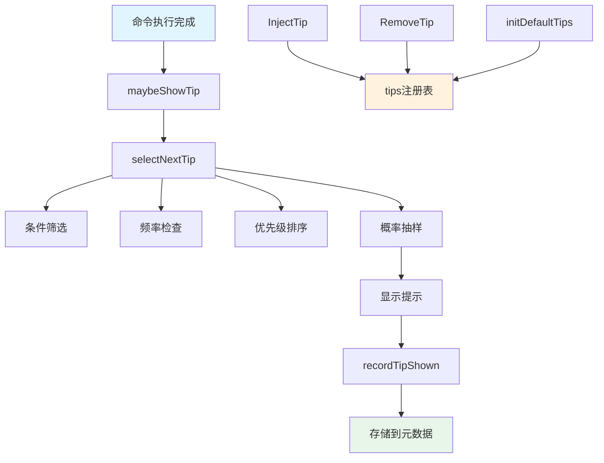

# Tip System 模块技术深度解析

## 1. 问题领域与模块定位

### 1.1 问题背景
在命令行工具的使用过程中，用户经常会遇到以下场景：
- 不知道某些高级功能的存在
- 在特定环境下（如 Claude Code）需要额外配置
- 需要即时提醒重要的系统状态（如同步冲突）

传统的帮助文档（`--help`）虽然详细，但用户只有在主动寻求帮助时才会查看，无法提供**上下文感知**的、**及时的**指导。

### 1.2 模块定位
`tip_system` 是一个**轻量级、可扩展的上下文提示系统**，它会在命令成功执行后，根据当前环境和状态，智能地显示相关的提示信息。

## 2. 核心抽象与心智模型

### 2.1 Tip 结构体：提示的原子单位
```go
type Tip struct {
    ID          string        // 唯一标识符
    Condition   func() bool   // 触发条件
    Message     string        // 提示内容
    Frequency   time.Duration // 最小显示间隔
    Priority    int           // 优先级（越高越优先）
    Probability float64       // 显示概率（0.0-1.0）
}
```

### 2.2 心智模型：提示选择流水线
将提示选择过程想象成一个**筛选流水线**：

```
所有提示 → 条件筛选 → 频率检查 → 优先级排序 → 概率抽样 → 最终显示
```

每个阶段都有明确的职责：
1. **条件筛选**：只显示与当前上下文相关的提示
2. **频率检查**：避免过度骚扰用户
3. **优先级排序**：确保重要提示优先展示
4. **概率抽样**：在多个高优先级提示中分散展示机会

## 3. 架构与数据流

### 3.1 核心组件交互



### 3.2 数据流向
1. **初始化阶段**：`init()` → `initDefaultTips()` → 填充 `tips` 注册表
2. **运行阶段**：命令完成 → `maybeShowTip()` → `selectNextTip()` → 显示 → `recordTipShown()`
3. **动态管理**：`InjectTip()`/`RemoveTip()` → 修改 `tips` 注册表

## 4. 核心组件深度解析

### 4.1 Tip 结构体
**设计意图**：将提示的所有属性封装在一个结构体中，实现声明式配置。

**关键属性的设计考虑**：
- `ID`：用于频率跟踪，必须唯一
- `Condition`：使用函数而非布尔值，实现动态上下文感知
- `Priority`：采用整数而非枚举，提供灵活的优先级粒度
- `Probability`：允许在"总是显示"和"从不显示"之间有中间地带

### 4.2 selectNextTip 函数
**核心算法**：
```go
// 1. 筛选符合条件和频率的提示
for _, tip := range tips {
    if !tip.Condition() { continue }
    if now.Sub(lastShown) < tip.Frequency { continue }
    eligibleTips = append(eligibleTips, tip)
}

// 2. 按优先级降序排序
slices.SortFunc(eligibleTips, func(a, b Tip) int {
    return cmp.Compare(b.Priority, a.Priority)
})

// 3. 按优先级顺序进行概率抽样
for _, tip := range eligibleTips {
    if tipRand.Float64() < tip.Probability {
        return &tip
    }
}
```

**设计亮点**：
- **优先级排序 + 顺序抽样**：确保高优先级提示有更高的整体展示机会，同时通过概率避免总是显示同一个提示
- **频率检查**：使用存储的元数据记录上次显示时间，实现跨会话的频率控制

### 4.3 元数据存储机制
**实现方式**：
```go
// 读取
key := fmt.Sprintf("tip_%s_last_shown", tipID)
value, err := store.GetMetadata(context.Background(), key)

// 写入
value := time.Now().Format(time.RFC3339)
store.SetMetadata(context.Background(), key, value)
```

**与 Dolt 自动提交的集成**：
```go
if mode == doltAutoCommitOn {
    commandDidWriteTipMetadata = true
    commandTipIDsShown[tipID] = struct{}{}
    return  // 延迟写入
}
```

**设计意图**：将提示元数据与主命令提交分离，避免提示显示污染命令历史。

### 4.4 动态提示管理
**InjectTip 函数**：
```go
func InjectTip(id, message string, priority int, frequency time.Duration, probability float64, condition func() bool)
```

**设计亮点**：
- **幂等更新**：如果 ID 已存在，则更新而非重复添加
- **线程安全**：使用 `tipsMutex` 保护注册表访问
- **完整参数**：支持配置提示的所有属性

## 5. 设计决策与权衡

### 5.1 条件函数 vs 配置式条件
**选择**：使用 `func() bool` 作为条件
- ✅ 优点：灵活性极高，可以实现任意复杂的条件逻辑
- ❌ 缺点：无法序列化，难以在配置文件中定义

**权衡理由**：对于命令行工具，内置的条件已经足够，且需要与环境检测等代码紧密集成，因此选择灵活性。

### 5.2 概率抽样的位置
**选择**：在优先级排序后进行顺序概率抽样
- ✅ 优点：高优先级提示优先获得展示机会，同时避免总是显示同一个提示
- ❌ 缺点：如果多个高优先级提示概率都很高，低优先级提示可能永远无法显示

**权衡理由**：重要提示应该优先展示，这是更符合用户预期的行为。

### 5.3 频率控制的粒度
**选择**：每个提示独立的频率控制
- ✅ 优点：可以为不同提示设置不同的展示频率
- ❌ 缺点：没有全局频率控制，可能在某些情况下显示多个提示

**权衡理由**：当前实现通过 `selectNextTip` 只返回一个提示，间接实现了全局频率控制。

### 5.4 元数据存储的错误处理
**选择**：静默失败
```go
// Non-critical metadata, ok to fail silently.
if err := store.SetMetadata(...); err == nil {
    // 只在成功时记录
}
```

**权衡理由**：提示系统是非核心功能，不应该因为元数据存储失败而影响主命令的执行。

## 6. 依赖关系分析

### 6.1 输入依赖
- **`dolt.DoltStore`**：用于存储提示显示时间的元数据
  - 依赖接口：`GetMetadata()`、`SetMetadata()`
  - 耦合度：中等，仅使用元数据存储功能

- **环境变量**：
  - `BEADS_TIP_SEED`：用于测试的随机数种子
  - `CLAUDE_CODE`、`ANTHROPIC_CLI`：用于 Claude 环境检测
  - `jsonOutput`、`quietFlag`：用于控制是否显示提示

### 6.2 被调用关系
- **主命令流程**：在命令成功执行后调用 `maybeShowTip()`
- **动态管理**：其他模块可以通过 `InjectTip()` 和 `RemoveTip()` 管理提示

## 7. 使用指南与最佳实践

### 7.1 添加新提示
```go
// 在 initDefaultTips() 中添加
InjectTip(
    "my_new_tip",                    // ID
    "Try using bd foo for this task", // 消息
    50,                               // 优先级
    7*24*time.Hour,                   // 频率（每周一次）
    0.3,                              // 概率（30%）
    func() bool {                     // 条件
        // 检测是否应该显示这个提示
        return someCondition()
    },
)
```

### 7.2 优先级建议
- **200+**：紧急状态提示（如同步冲突）
- **100-199**：重要配置提示（如 Claude 集成）
- **50-99**：功能建议
- **0-49**：一般性提示

### 7.3 概率建议
- **1.0**：总是显示（仅用于紧急情况）
- **0.6-0.9**：高频率显示
- **0.3-0.5**：中等频率
- **0.1-0.2**：低频率
- **<0.1**：偶尔显示

## 8. 边缘情况与注意事项

### 8.1 已知边缘情况
1. **空提示注册表**：`selectNextTip()` 会安全返回 `nil`
2. **存储失败**：元数据读写失败会静默处理，不影响主流程
3. **并发修改**：使用 `tipsMutex` 保护注册表，线程安全
4. **多个提示符合条件**：通过优先级和概率机制选择一个

### 8.2 隐含契约
- **Tip.ID 唯一性**：调用者有责任确保 ID 唯一
- **Condition 函数无副作用**：条件函数不应该修改状态
- **频率控制的准确性**：依赖系统时钟，时钟回拨可能导致频率控制失效

### 8.3 测试技巧
```go
// 设置固定种子以实现可预测的测试
os.Setenv("BEADS_TIP_SEED", "12345")

// 注入测试用的提示
InjectTip("test_tip", "Test message", 100, 0, 1.0, func() bool { return true })
```

## 9. 扩展点与未来改进方向

### 9.1 当前扩展点
1. **动态提示注入**：通过 `InjectTip()` 可以在运行时添加提示
2. **自定义条件**：可以通过 `Condition` 函数实现任意复杂的条件
3. **提示移除**：通过 `RemoveTip()` 可以移除不再需要的提示

### 9.2 潜在改进方向
1. **配置文件支持**：允许在配置文件中定义提示
2. **提示分组**：支持按类别启用/禁用提示
3. **用户反馈机制**：允许用户标记提示为"不感兴趣"
4. **提示历史**：记录所有显示过的提示，用于分析

## 10. 总结

`tip_system` 模块是一个精心设计的上下文提示系统，它通过**条件筛选、频率控制、优先级排序、概率抽样**的流水线，实现了智能、非侵入式的用户指导。

其核心设计理念是：
- **非侵入性**：不影响主命令执行，静默处理失败
- **灵活性**：支持动态添加、移除提示，条件函数高度可定制
- **用户友好**：通过频率和概率控制，避免过度骚扰

这个模块虽然代码量不大，但体现了良好的软件工程实践：线程安全、错误处理完善、关注点分离清晰。
