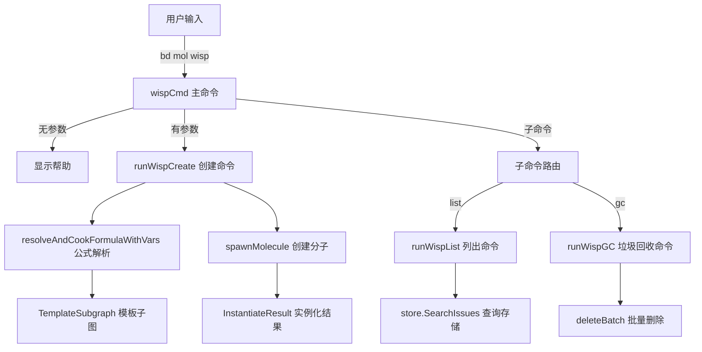

# CLI Wisp Commands 模块深度解析

## 1. 模块概述与问题空间

### 1.1 为什么需要这个模块？

在 Beads 项目的工作流管理中，存在两种截然不同的工作类型：一种是需要长期保留、具有审计价值的持续性工作（如功能开发），另一种是临时的、一次性的操作任务（如巡逻检查、健康诊断、发布流程）。对于后者，传统的持久化工作项管理会带来两个问题：

1. **仓库污染**：大量临时工作项会被同步到 Git，污染版本历史，增加仓库负担
2. **清理成本**：临时工作完成后需要手动清理，增加用户负担

**Wisp**（幽灵/薄雾）模块正是为了解决这个问题而设计的——它提供了一种"即抛型"工作项机制，允许用户创建和管理不会被 Git 同步的临时工作流，同时提供自动垃圾回收机制来处理这些临时工作项。

### 1.2 核心概念

Wisp 是一种特殊的 Issue，具有两个关键特征：
- **Ephemeral=true**：标记为临时工作，不会被 Git 同步
- **ID 前缀**：使用 `wisp-` 前缀（通过 `types.IDPrefixWisp` 定义），便于视觉识别

### 1.3 与 Pour 的区别

| 特性 | Wisp (幽灵) | Pour (液体) |
|------|------------|------------|
| 同步性 | 不同步到 Git | 同步到 Git |
| 生命周期 | 临时，自动清理 | 持久，需要审计 |
| 适用场景 | 巡逻、健康检查、发布流程 | 功能开发、多会话工作 |
| 结束方式 | burn（删除）或 squash（提升为持久） | squash（压缩） |

---

## 2. 架构与数据流程

### 2.1 架构概览

Wisp 命令模块是 CLI 层的一部分，它直接与存储层交互，绕过了守护进程（daemon）以确保临时操作的快速性和隔离性。



### 2.2 核心数据流

#### 创建 Wisp 流程
1. **输入处理**：解析命令行参数和变量
2. **公式解析**：尝试将输入作为公式解析（优先路径）
3. **回退机制**：如果公式解析失败，尝试从数据库加载传统 proto
4. **变量验证**：检查必填变量是否提供
5. **分子创建**：调用 `spawnMolecule` 创建临时分子，设置 `Ephemeral=true`
6. **结果输出**：显示创建的 Wisp 信息和后续操作建议

#### 垃圾回收流程
1. **查询筛选**：查找所有 `Ephemeral=true` 的 Issue
2. **过滤判断**：
   - 排除基础设施类型（agent, rig, role, message）
   - 根据年龄阈值判断是否为"旧"Wisp
   - 可选：包含或排除已关闭的 Wisp
3. **批量删除**：使用 `deleteBatch` 进行级联删除
4. **结果报告**：显示清理的 Wisp 数量和详情

---

## 3. 核心组件深度解析

### 3.1 命令结构

#### wispCmd - 主命令
这是 Wisp 功能的入口点，设计上采用了灵活的调用方式：
- 直接带参数调用：创建新的 Wisp
- 带子命令调用：执行管理操作（list, gc）
- 无参数调用：显示帮助信息

这种设计体现了**命令的多态性**——同一个命令根在不同参数下表现出不同行为，既保持了命令的简洁性，又提供了完整的功能覆盖。

#### runWispCreate - 创建逻辑
这是 Wisp 创建的核心函数，包含几个关键设计点：

**1. 双路径解析策略**
```go
// 先尝试公式解析
sg, err := resolveAndCookFormulaWithVars(args[0], nil, vars)
if err == nil {
    subgraph = sg
    protoID = sg.Root.ID
}

// 公式解析失败则回退到传统 proto
if subgraph == nil {
    // ... 传统 proto 加载逻辑
}
```

**设计意图**：这是一个**渐进式兼容性策略**。新的公式系统是推荐路径，但为了保持向后兼容性，保留了传统 proto 加载路径。这种设计允许系统平滑迁移，不会破坏现有用户的工作流。

**2. 直接存储访问**
```go
// Wisp create requires direct store access (daemon auto-bypassed for wisp ops)
if store == nil {
    FatalErrorWithHint("no database connection", "run 'bd init' or 'bd import' to initialize the database")
}
```

**设计意图**：Wisp 操作绕过守护进程，直接与存储层交互。这是因为：
- Wisp 是临时操作，不需要守护进程的协调功能
- 直接访问提供更低的延迟和更高的可靠性
- 避免守护进程可能带来的额外复杂性

**3. 变量验证系统**
```go
// 应用变量默认值
vars = applyVariableDefaults(vars, subgraph)

// 检查必填变量
requiredVars := extractRequiredVariables(subgraph)
var missingVars []string
for _, v := range requiredVars {
    if _, ok := vars[v]; !ok {
        missingVars = append(missingVars, v)
    }
}
```

这个系统确保了 Wisp 创建时的完整性和正确性，防止因缺少关键变量而创建不完整的工作流。

#### runWispList - 列表命令
这个命令负责展示当前所有的 Wisp，具有以下特点：

**1. 旧 Wisp 检测**
```go
// 检查是否为旧 Wisp（超过24小时未更新）
if now.Sub(issue.UpdatedAt) > OldThreshold {
    item.Old = true
    oldCount++
}
```

**2. 排序策略**
```go
// 按更新时间降序排序（最新的在前）
slices.SortFunc(items, func(a, b WispListItem) int {
    return b.UpdatedAt.Compare(a.UpdatedAt)
})
```

**设计意图**：将最新的 Wisp 放在前面，符合用户的使用习惯——通常更关心最近创建或更新的临时工作。

#### runWispGC - 垃圾回收命令
这是 Wisp 生命周期管理的关键组件，负责清理不再需要的临时工作项。

**1. 多模式清理**
- **默认模式**：清理未更新超过指定时间（默认1小时）且未关闭的 Wisp
- **--all 模式**：同时清理超过时间阈值的已关闭 Wisp
- **--closed 模式**：专门清理所有已关闭的 Wisp（忽略时间阈值）

**2. 安全保护机制**
```go
// 永远不 GC 基础设施 beads
if dolt.IsInfraType(issue.IssueType) {
    continue
}

// 跳过已固定的问题
if issue.Pinned {
    pinnedCount++
    continue
}
```

**设计意图**：这是一个**防御性设计**，防止误删重要的系统组件或用户明确标记为保留的项目。基础设施类型（如 agent、rig）虽然可能被标记为 Ephemeral，但它们对系统运行至关重要，因此受到保护。

**3. 安全默认值**
```go
// --closed 模式默认是预览模式，需要 --force 才会实际删除
if !force && !dryRun {
    // 只显示预览信息
    return
}
```

**设计意图**：采用"安全优先"的设计哲学——破坏性操作默认是预览模式，用户必须明确使用 `--force` 才会实际执行。这大大降低了误操作的风险。

### 3.2 数据结构

#### WispListItem
```go
type WispListItem struct {
    ID        string    `json:"id"`
    Title     string    `json:"title"`
    Status    string    `json:"status"`
    Priority  int       `json:"priority"`
    CreatedAt time.Time `json:"created_at"`
    UpdatedAt time.Time `json:"updated_at"`
    Old       bool      `json:"old,omitempty"` // 24+小时未更新
}
```

这个结构体专门为列表展示设计，包含了用户最关心的信息字段。`Old` 字段使用了 `omitempty` 标签，这意味着在 JSON 输出中如果为 false 就会被省略，使输出更简洁。

#### WispListResult 和 WispGCResult
这两个结构体是为 JSON 输出设计的，体现了**命令输出的双重标准**：
- 人类可读的格式化输出（默认）
- 机器可读的 JSON 输出（`--json` 标志）

这种设计使 CLI 工具既适合人类直接使用，也适合脚本和自动化系统调用。

---

## 4. 依赖关系分析

### 4.1 依赖的核心模块

| 模块 | 用途 | 耦合点 |
|------|------|--------|
| `internal/storage` | 数据存储 | `store.SearchIssues`, `store.GetIssue` |
| `internal/types` | 核心类型 | `types.Issue`, `types.IssueFilter`, `types.IDPrefixWisp` |
| `internal/ui` | 用户界面 | `ui.RenderStatus`, `ui.RenderPass`, `ui.RenderWarn` |
| `internal/storage/dolt` | Dolt 存储实现 | `dolt.IsInfraType` |

### 4.2 被调用的关键函数

| 函数 | 调用方 | 作用 |
|------|--------|------|
| `resolveAndCookFormulaWithVars` | `runWispCreate` | 解析和烹饪公式（新路径） |
| `loadTemplateSubgraph` | `runWispCreate` | 从数据库加载模板子图（旧路径） |
| `spawnMolecule` | `runWispCreate` | 创建分子实例 |
| `deleteBatch` | `runWispGC`, `runWispPurgeClosed` | 批量删除问题 |

### 4.3 隐式契约

1. **存储层契约**：Wisp 命令假设存储层支持 `Ephemeral` 字段的过滤，并且能够处理批量删除操作。
2. **ID 格式契约**：Wisp 使用 `types.IDPrefixWisp` 前缀，但代码中并没有强制验证这一点，而是依赖 `spawnMolecule` 来设置。
3. **标签契约**：传统 proto 必须具有 `MoleculeLabel` 标签才能被识别。

---

## 5. 设计决策与权衡

### 5.1 直接存储访问 vs 守护进程路由

**决策**：Wisp 操作直接与存储层交互，绕过守护进程。

**原因**：
- Wisp 是临时操作，不需要守护进程的协调或同步功能
- 直接访问提供更低的延迟和更高的可靠性
- 避免了守护进程可能带来的额外复杂性和潜在故障点

**权衡**：
- ✅ 优点：更快、更可靠、更简单
- ❌ 缺点：失去了守护进程可能提供的集中式日志、审计和协调功能

### 5.2 双路径解析策略

**决策**：优先尝试公式解析，失败则回退到传统 proto 加载。

**原因**：
- 平滑迁移：允许用户逐步采用新的公式系统
- 向后兼容：不破坏现有的工作流程
- 渐进式改进：新功能可以在公式系统中开发，而旧系统继续工作

**权衡**：
- ✅ 优点：兼容性好，迁移平滑
- ❌ 缺点：代码复杂度增加，有两条路径需要维护和测试

### 5.3 安全默认值

**决策**：破坏性操作（如 GC）默认是预览模式，需要 `--force` 才会实际执行。

**原因**：
- 防止误操作：用户可能会不小心运行 GC 命令
- 建立信任：用户知道默认情况下不会造成数据丢失
- 符合 CLI 最佳实践：许多现代 CLI 工具都采用这种模式

**权衡**：
- ✅ 优点：更安全，用户体验更好
- ❌ 缺点：对于知道自己在做什么的用户，多了一个需要输入的参数

### 5.4 时间驱动的垃圾回收

**决策**：使用时间（最后更新时间）作为判断 Wisp 是否应该被清理的主要标准。

**替代方案**：
- 图压力驱动（类似 `bd mol stale`）：基于依赖关系判断是否阻塞其他工作
- 用户明确标记：需要用户手动标记为可删除

**原因**：
- 简单可靠：时间是一个客观、易于理解的标准
- 适合临时工作：临时工作通常有明确的时间特性
- 无需额外元数据：不需要维护复杂的状态或依赖关系

**权衡**：
- ✅ 优点：简单、可靠、易于理解
- ❌ 缺点：可能会误删仍在使用但长时间未更新的 Wisp（因此提供了 `--age` 参数来调整阈值）

---

## 6. 使用指南与常见模式

### 6.1 基本使用

#### 创建 Wisp
```bash
# 从公式创建
bd mol wisp mol-patrol

# 带变量创建
bd mol wisp beads-release --var version=1.0

# 预览创建
bd mol wisp mol-health-check --dry-run
```

#### 管理 Wisp
```bash
# 列出所有 Wisp
bd mol wisp list

# 包括已关闭的 Wisp
bd mol wisp list --all

# JSON 输出
bd mol wisp list --json
```

#### 清理 Wisp
```bash
# 预览清理（默认）
bd mol wisp gc

# 实际清理
bd mol wisp gc --dry-run=false

# 自定义年龄阈值
bd mol wisp gc --age 24h

# 清理所有已关闭的 Wisp
bd mol wisp gc --closed --force
```

### 6.2 Wisp 生命周期

```
创建 → 执行 → [选择结束方式]
                ↓
           ┌────┴────┐
           ↓         ↓
        squash      burn
           ↓         ↓
      提升为持久    彻底删除
      （保留摘要）  （不保留）
```

### 6.3 最佳实践

1. **选择合适的工具**：
   - 临时工作、巡逻、发布流程 → 使用 Wisp
   - 功能开发、需要审计的工作 → 使用 Pour

2. **合理设置 GC 策略**：
   - 短期任务（小时级）→ 使用默认 1 小时阈值
   - 中期任务（天级）→ 使用 `--age 24h`
   - 定期清理已关闭的 Wisp → 使用 `--closed --force`

3. **必要时保留**：
   - 如果一个临时工作突然变得有价值，使用 `bd mol squash` 将其提升为持久工作
   - 对于重要的临时工作，可以使用 `--dry-run` 预览 GC 效果

---

## 7. 边缘情况与陷阱

### 7.1 常见陷阱

1. **忘记 Wisp 不会被同步**
   - **陷阱**：创建了重要的 Wisp 后换了机器，发现工作不见了
   - **避免**：重要工作使用 Pour，或者完成后用 squash 提升

2. **GC 阈值设置不当**
   - **陷阱**：设置了过长的 GC 阈值，导致 Wisp 堆积；或设置过短，误删仍在使用的工作
   - **避免**：从默认值开始，根据实际使用情况调整；总是先用 `--dry-run` 预览

3. **混淆 Wisp 和 Pour**
   - **陷阱**：在应该用 Pour 的地方用了 Wisp，导致工作丢失
   - **避免**：记住两者的区别，公式指定 `phase:"vapor"` 时会有提示

### 7.2 隐式约束

1. **基础设施保护**：即使标记为 Ephemeral，基础设施类型（agent、rig、role、message）也不会被 GC
2. **固定问题保护**：`Pinned=true` 的问题不会被 `--closed` 模式清理
3. **ID 前缀约定**：Wisp 应该使用 `wisp-` 前缀，但这是由 `spawnMolecule` 保证的，不是强制验证的

### 7.3 错误处理

Wisp 命令的错误处理遵循以下模式：
- 对于用户错误（如无效变量格式），使用 `FatalError` 直接退出
- 对于环境问题（如无数据库连接），使用 `FatalErrorWithHint` 提供解决建议
- 对于可选操作（如显示帮助），错误被忽略（`_ = cmd.Help()`）

---

## 8. 总结

CLI Wisp Commands 模块提供了一个优雅的解决方案，用于管理临时工作流。它的核心价值在于：

1. **清晰的抽象**：通过 Wisp 这一概念，明确区分了临时工作和持久工作
2. **完整的生命周期**：从创建、管理到清理，提供了全流程的工具
3. **安全的设计**：默认预览模式、基础设施保护、固定问题保护等多重安全机制
4. **灵活的策略**：多种 GC 模式和可配置的阈值，适应不同的使用场景

这个模块体现了 Beads 项目的设计哲学：通过化学灵感的抽象（固体→液体→气体），将复杂的工作流管理变得直观且易于理解，同时保持了强大的功能和灵活性。

---

## 相关模块

- [CLI Molecule Commands](cmd-bd-mol.md) - 分子命令的父模块
- [CLI Formula Commands](cmd-bd-formula.md) - 公式相关命令
- [Storage Interfaces](internal-storage.md) - 存储接口定义
- [Core Domain Types](internal-types.md) - 核心领域类型
