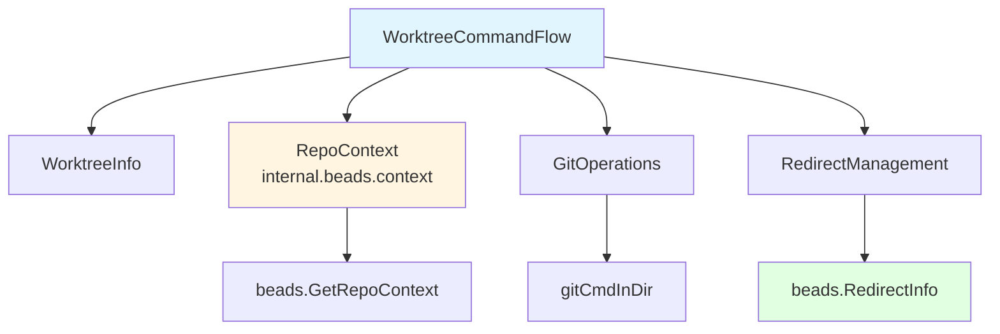

# worktree_command_flow 模块技术深度解析

## 1. 模块概览

`worktree_command_flow` 模块解决了多开发工作流共享同一个 Beads 数据库的核心问题。当开发者需要并行处理多个功能分支或让多个 AI 代理同时工作时，Git 的 worktree 机制允许创建多个共享同一仓库的工作目录，但每个工作目录通常会有自己的 `.beads` 数据库，导致状态不一致。此模块通过自动配置重定向机制，确保所有 worktree 共享同一个主 Beads 数据库，实现跨工作流的统一问题状态管理。

## 2. 架构设计

### 2.1 核心组件关系图



### 2.2 数据流描述

1. **创建流程**：当执行 `bd worktree create` 时，模块首先获取仓库上下文（`beads.GetRepoContext()`）以验证 Beads 初始化状态，然后创建 Git worktree，接着在新 worktree 的 `.beads` 目录中创建指向主 Beads 目录的重定向文件。
2. **查询流程**：使用 `git worktree list --porcelain` 获取所有 worktree 信息，然后解析并补充 Beads 配置状态（通过检查 `.beads/redirect` 文件）。
3. **删除流程**：执行安全检查（未提交更改、未推送提交），然后删除 worktree 并清理 `.gitignore` 中的相关条目。

## 3. 核心组件深度解析

### 3.1 WorktreeInfo 结构体

```go
type WorktreeInfo struct {
    Name       string `json:"name"`
    Path       string `json:"path"`
    Branch     string `json:"branch"`
    IsMain     bool   `json:"is_main"`
    BeadsState string `json:"beads_state"` // "redirect", "shared", "none"
    RedirectTo string `json:"redirect_to,omitempty"`
}
```

**设计意图**：这个结构体不仅存储 Git worktree 的基本信息，还通过 `BeadsState` 字段扩展了 Beads 配置状态，形成了完整的工作流上下文视图。`BeadsState` 有三个可能值：

- `"redirect"`：当前 worktree 使用重定向配置，指向主 Beads 目录
- `"shared"`：这是主仓库，拥有共享的 Beads 数据库
- `"none"`：没有 Beads 配置

### 3.2 关键函数解析

#### runWorktreeCreate

这个函数实现了 worktree 创建的核心逻辑。其设计考虑了以下关键点：

1. **路径处理**：使用 `utils.CanonicalizeIfRelative()` 确保主 Beads 目录是绝对路径，解决了 GH#1098 中报告的相对路径问题。
2. **分支创建策略**：先尝试使用 `-b` 创建新分支，如果分支已存在则回退到使用现有分支。
3. **重定向路径计算**：相对路径从 worktree 根目录（而不是 `.beads` 目录）计算，因为 `FollowRedirect` 是相对于 `.beads` 的父目录解析路径的。
4. **清理机制**：定义了 `cleanupWorktree()` 闭包，在后续步骤失败时自动清理已创建的 worktree。

#### parseWorktreeList

这个函数解析 `git worktree list --porcelain` 的输出。一个巧妙的设计是它能正确处理裸仓库（bare repository）的情况，并将第一个非裸 worktree 标记为主仓库。

#### getBeadsState

这个函数通过检查文件系统状态来确定 Beads 配置状态。它首先检查重定向文件，然后检查 `.beads` 目录是否存在，最后比较路径以确定是否是主共享目录。

## 4. 依赖分析

### 4.1 依赖模块

| 模块 | 用途 | 关键接口 |
|------|------|----------|
| [internal.beads.context](internal-beads-context.md) | 获取仓库上下文 | `beads.GetRepoContext()` |
| [internal.beads.beads](internal-beads-beads.md) | 重定向管理 | `beads.RedirectInfo`, `beads.RedirectFileName` |
| [internal.git](internal-git.md) | Git 操作 | `git.GetRepoRoot()`, `git.IsWorktree()` |
| [internal.ui](internal-ui.md) | 用户界面 | `ui.RenderPass()` |

### 4.2 被依赖情况

这个模块是 CLI 层的命令实现，主要被主 CLI 框架调用，不被其他核心模块依赖。

## 5. 设计决策与权衡

### 5.1 重定向文件位置与路径计算

**决策**：重定向文件存储在 `.beads/redirect`，且相对路径从 worktree 根目录计算。

**原因**：这种设计与 `beads.FollowRedirect()` 的行为保持一致，该函数相对于 `.beads` 的父目录解析路径。如果从 `.beads` 目录计算相对路径，会导致重定向解析错误。

### 5.2 Git 命令的安全执行

**决策**：所有 Git 命令通过 `gitCmdInDir()` 执行，该函数设置 `GIT_HOOKS_PATH=` 和 `GIT_TEMPLATE_DIR=` 环境变量。

**权衡**：这是一种深度防御策略（SEC-001, SEC-002），禁用了 Git 钩子和模板，防止恶意代码执行。虽然这限制了某些高级 Git 功能，但在 CLI 命令执行环境中是必要的安全措施。

### 5.3 容错设计

**决策**：多个操作（如更新 `.gitignore`）采用非致命错误处理，失败时只发出警告而不中断整个流程。

**权衡**：这种设计提高了命令的健壮性，确保即使次要操作失败，主要功能仍能完成。但这也意味着用户需要注意警告信息，因为某些辅助配置可能没有正确设置。

## 6. 使用指南与示例

### 6.1 基本使用

```bash
# 创建名为 "feature-auth" 的 worktree
bd worktree create feature-auth

# 创建并指定分支名
bd worktree create bugfix --branch fix-1

# 列出所有 worktree
bd worktree list

# 删除 worktree（带安全检查）
bd worktree remove feature-auth

# 查看当前 worktree 信息
bd worktree info
```

### 6.2 扩展点

此模块设计为相对独立的 CLI 命令实现，主要扩展点在于：

- 新的 worktree 子命令可以通过在 `init()` 函数中添加到 `worktreeCmd` 来实现
- `WorktreeInfo` 结构体可以根据需要扩展新字段，只要保持 JSON 兼容性

## 7. 注意事项与常见问题

### 7.1 边缘情况

1. **相对路径问题**：确保不要手动修改 `.beads/redirect` 文件中的路径，错误的相对路径会导致 Beads 无法找到数据库。
2. **裸仓库处理**：当在裸仓库中使用时，第一个非裸 worktree 会被标记为主仓库。
3. **Git stash**：安全检查不包括 Git stash，因为 stash 是全局存储在主仓库中的，按 worktree 检查会产生误导性结果。

### 7.2 故障排查

- **重定向不生效**：检查 `.beads/redirect` 文件的权限和内容，确保路径正确。
- **删除失败**：如果删除 worktree 失败，可以使用 `--force` 标志跳过安全检查。
- **状态显示 "none"**：这意味着该 worktree 没有 Beads 配置，可能是手动创建的 worktree 而没有使用 `bd worktree create`。

## 8. 总结

`worktree_command_flow` 模块通过巧妙的重定向机制，解决了多工作流开发中 Beads 数据库同步的核心问题。它的设计体现了对路径处理的细致考虑、安全执行的重视，以及容错性的权衡。对于需要并行开发或多代理协作的团队来说，这个模块提供了无缝的体验，让所有工作流共享一致的问题状态。